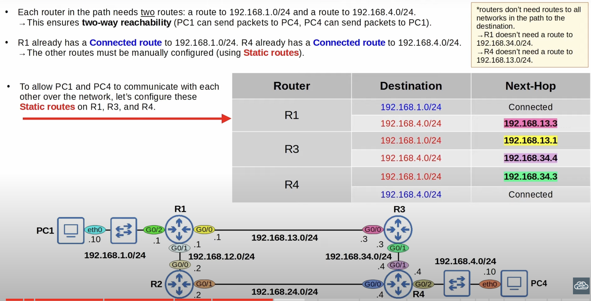
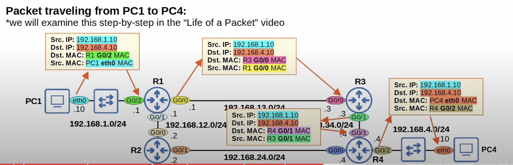
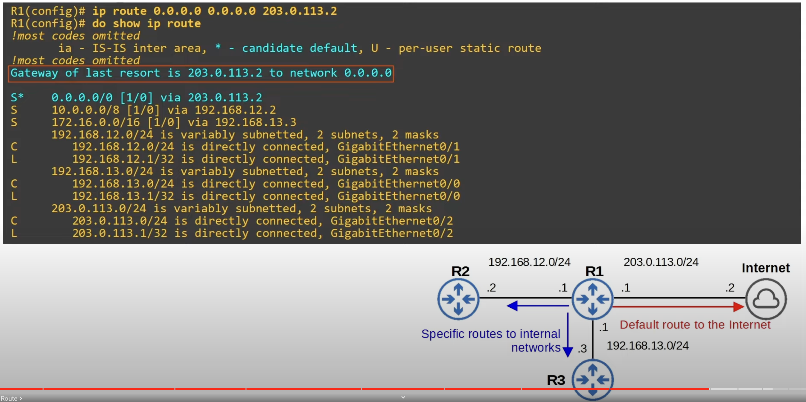

Static routes enable routers to send packages to remote destinations that aren't directly connected to the router itself.
## Default Gateway
* End hosts can send packets directly to destinations in their connected network.
* To send packets to destinations outside of their local network, they must send the packets to their **default gateway/route**.
## Static Route Configuration

#### Static Route Configuration Options
Use whatever static configuration method is preferred.
1. Configure the IP address of the next-hop router.
	* `R1(config)#ip route ip-addres netmask next-hop`
2. Configure exit interface that the router should send packets out of to get to the next destination.
	* `R2(config)#ip route ip-address netmast exit-interface`
	* Static routes in which you specify only the exit-interface appear as "directly connected" in the routing table even though they are not. They rely on a feature called **Proxy ARP** to function.
	* This is generally not a problem, but  you should stick to `next-hop` or `exit-interface next-hop`.
3. Configure both, exit interface and next-hop IP address.
	1. `R2(config)#ip route ip-address netmask exit-interface next-hop`
## Communication Across Router Hops

## Router Default Route
* A **default route** is a route to 0.0.0.0/0 because it matches every route in the case no other more specific route is found.
* If the router doesn't have any more specific routes that match a packet's destination IP address, the router will forward the packet using the **default route**.
* The default route is often used to direct traffic to the internet.
	* More specific routes are used for destinations in the internal corporate network (R1, R2, R3).
	* Traffic to destinations outside of the internal network is sent to the internet.
	* The default route is the least specific route possible, because it includes all IP addresses. Any packet that does not match any more specific address will be sent here.

* `Gateway of last resort` is the router's default route.
* `R1(config)#ip route 0.0.0.0 0.0.0.0 203.0.113.2` is used to configure the default route for R1 (ip address, netmask, next-hop).
* **\***:   Indicate candidate default route for the router. Its possible for routers to have multiple candidates for the default address.