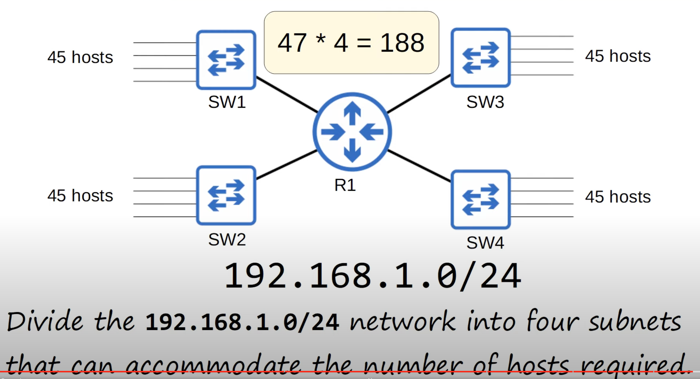
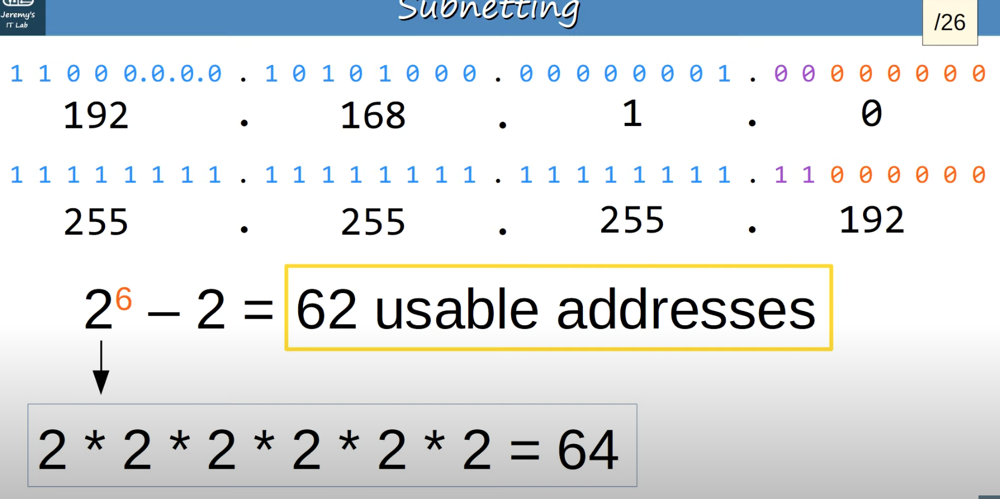
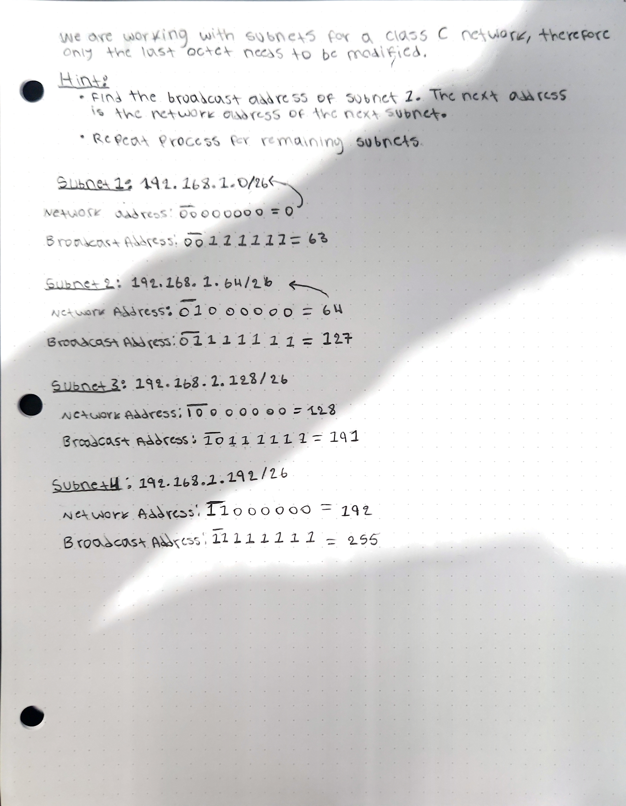

## IPv4 Address Assignment
* The IANA (Internet Assigned Numbers Authority) assigns IPv4 addresses/networks to companies based on their size.
* For example, a very large company might receive a **class A** or **class B** network, while a small company might receive a **class C** network.
* However, this led to many wasted IP addresses.
#### IP Address Waste

* The network connecting the San Francisco and New York offices of a corporation is a `point-to-point network`. Its only purpose is to connect the two corporation offices.
* Even when the network (class C) with the least number of addresses for hosts is picket, 252 addresses are unused.

#### IP Address Waste
* Company X needs IP addressing for 5000 end hosts.
* A **class C** network does not provide enough addresses, so a **class B** network must be assigned.
* This will result in about 60000 addresses being wasted.


## CIDR (Classless Inter-Domain Routing)
* When the internet was first created, the creators did not predict that the internet would become as large as it is today.
* This resulted in wasted address space like the examples above. Now a days IP address exhaustion has become a problem because there is not enough addresses.
* The IETF (Internet Engineering Task Force) introduces CIDR in 1993 to replace the 'classful' addressing system. This remedies the issue of wasted addresses.
* CIDR removed the requirements of prefix length set by the different network classes.
	* Class A = /8
	* Class B = /16
	* Class C = /24
* This allowed larger networks to be split into smaller networks, allowing greater efficiency.
	* These smaller networks are called `subnetworks` or `subnets`. 

#### Subnets/Hosts (Class C)
How many usable addresses are there in each network?
* 203.0.113.0/25
	* 7 host bits = 128 total addresses.
	* (2^7) - 2 = 126 usable addresses.
	* 2 subnets possible.
	* Subnet mask = 255.255.255.128
* 203.0.113.0/26
	* 6 host bits = 64 total addresses.
	* (2^6) - 2 = 62 usable addresses.
	* 4 subnets possible
	* Subnet mask = 255.255.255.192
* 203.0.113.0/27
	* 5 host bits = 32 total addresses.
	* (2^5) - 2 = 30 usable addresses.
	* 8 subnets possible.
	* Subnet mask = 255.255.255.224
* 203.0.113.0/28
	* 4 host bits = 14 total addresses.
	* (2^4) - 2 = 14 usable addresses..
	* 16 subnets possible.
	* Subnet mask = 255.255.255.240
* 203.0.113.0/29
	* 3 host bits = 8 total addresses.
	* (2^3)  - 2 = 6 usable addresses.
	* 32 subnets possible.
	* Subnet mask = 255.255.255.248
* 203.0.113.0/30
	* 2 host bits = 4 total addresses.
	* (2^2) - 2 = 2 usable addresses.
	* 64 subnets possible.
	* Subnet mask = 255.255.255.252
* 203.0.113.0/31
	* 1 host bit = 2 total addresses.
	* (2^1) - 2 = 0 usable addresses.
	* 128 subnets possible.
	* Subnet mask = 255.255.255.254
	* For a point-to-point connection like the one shown above it is possible to use  a /31 mask and is recommended.
		* Normally it would not be possible because there would leave no addresses for the network and broadcast addresses.
		* However, for a dedicated point-to-point connection, there is really no need for the network and broadcast addresses.
		* Routers will give the following warning when using /31 mask: `Warning: use /31 mask on non point-to-point interfaces cautiously`.
* 203.0.113.0/32
	* 0 host bit = 0 total addresses.
	* (2^0) - 2 = -1 usable addresses.
	* 256 subnets possible.
	* Subnet mask = 255.255.255.255
	* Will probably never use a /32 mask to configure an actual interface. However, there are some uses for a /32 mask.
	* a /32 mask can be used when you want to create a static route not a network, but just to one specific host.

This is called subnetting because we are only using a subset of the total available addresses in the address class that we are working on. In this case we are creating subnets for a class C network.
* For example, in the /30 mask we have 4 total addresses (203.0.113.0 - 203.0.113.3). The remaining addresses in the 203.0.113.0/24 address block (203.0.113.4 - 203.0.113.255) are available to be used in other subnets.


$$
Number\ of\ Subnets:\ 2^x, x = number\ of\ borrowed\ bits
$$

#### Subnetting Example

* Each subnet will need a total of 47 addresses (45 hosts + network address + broadcast address). Totaling 188 total required networks, which is satisfied by a class C network (class C = 256 networks).
* 4 subnets are needed, therefore 2 borrowed host bits will be enough to create the required subnets. Resulting in a /26 mask.


* The /26 mask satisfies our requirement of 47 Networks with a total of 64 addresses.
* Unfortunately we can't always make subnets have exactly the number of addresses we need.
* That is fine because its good because it provides room for growth in the future.

#### Subnetting Example Solution



#### Subnetting Trick
```
192.168.1.0/26

For class C subnets, only the bits of the last octet are changed.
192 . 168 . 1 . 0

Subnet: 192.168.1.0/26
0    0  |  0    0    0    0    0    0
Network |  Host Portion
Portion |

Subnet: 192.168.1.64/26
0    1  |  0    0    0    0    0    0
Network |  Host Portion
Portion |

Subnet: 192.168.1.128/26
1    0  |  0    0    0    0    0    0
Network |  Host Portion
Portion |

Subnet: 192.168.1.192/26
1    1  |  0    0    0    0    0    0
Network |  Host Portion
Portion |
```

* An easy way to calculate the subnets is to keep on adding the value given by the last bit of the network portion.
* Above, the last network portion bit gives a value of 64. Therefore, the next subnets are obtaining by adding 64 continuously.

#### Subnetting Example
Divide ` 192.168.255.0/24` network into five subnets of equal size. Identify the five subnets.
* How many host bits need to be borrowed by the network to allow for 5 subnets ?
	* 2^3 = 8 subnets.
	* 3 borrowed bits allow us to create 8 subnets which satisfies our requirement of 5 subnets. 
	* You can't always exactly match the number of subnets or hosts you need.

```
192.168.255.0/27
Subnet: 192.168.1.0/26
0    0    0  |  0    0    0    0    0
Network      |  Host Portion
Portion      |


192.168.255.32/27
Subnet: 192.168.1.0/26
0    0    1  |  0    0    0    0    0
Network      |  Host Portion
Portion      |

192.168.255.64/27
Subnet: 192.168.1.0/26
0    1    0  |  0    0    0    0    0
Network      |  Host Portion
Portion      |

192.168.255.96/27
Subnet: 192.168.1.0/26
0    1    1  |  0    0    0    0    0
Network      |  Host Portion
Portion      |

192.168.255.128/27
Subnet: 192.168.1.0/26
1    0    0  |  0    0    0    0    0
Network      |  Host Portion
Portion      |

Unused Remaining Subnets
1. 192.168.255.160/27
2. 1. 192.168.255.192/27
3. 1. 192.168.255.224/27
```

#### Identify The Subnet
What subnet does host `192.168.5.57/27` belong to?

```
Binary representation of 57
0    0    1  |  1    1    0    0    1
Network      |  Host Portion
Portion      |

Change all host bits to 0 to get the network address (subnet)
0    0    1  |  0    0    0    0    0
Network      |  Host Portion
Portion  

Host 192.168.5.57/27 belongs to subnet 192.168.5.32/27
```

#### Identify The Subnet
What subnet does host `192.168.29.219/29` belong to ?
```
Binary representation of 219
1    1    0     1    1  |  0    1    1
Network                 |  Host Portion
Portion                 |

Change all host bits to 0 to get the network address (subnet)
1    1    0     1    1  |  0    0    0
Network                 |  Host Portion
Portion                 |

Host 192.168.29.219/29 belongs to subnet 192.168.29.216/29
```


## Subnetting Class B Networks
The process of subnetting Class A, Class B, and Class C networks is exactly the same.

#### Example
You have been given the `127.16.0.0/16 network`. You are asked to create 80 subnets for your company's various LANs. What prefix length should you use ?
```
1 0 1 0 1 1 0 0 . 0 0 0 1 0 0 0 0 . | 0 0 0 0 0 0 0 | 0 . 0 0 0 0 0 0 0 0
                                    |  Borrowed Bits|
	    172             16                    0                 0

Subnet Mask
1 1 1 1 1 1 1 1 . 1 1 1 1 1 1 1 1 . | 1 1 1 1 1 1 1 | 0 . 0 0 0 0 0 0 0 0
		255     .        255      .         254         .        0 
```
* The prefix length that should be used is `/23` because 7 borrowed bits gives us a total of 128 subnets, which satisfies our requirement of 80 subnets.
* The subnet mast is `255.255.254.0`

The following shows some of the subnets that can be created. It is done using the trick where you keep on adding the value of the last host bit borrowed for the address. In this case its value is 2.
```
Subnet 1: 127.16.0.0/27
1 0 1 0 1 1 0 0 . 0 0 0 1 0 0 0 0 . | 0 0 0 0 0 0 0 | 0 . 0 0 0 0 0 0 0 0
		172     .         16      .           0          .        0

Subnet 2: 127.16.2.0/27
1 0 1 0 1 1 0 0 . 0 0 0 1 0 0 0 0 . | 0 0 0 0 0 0 1 | 0 . 0 0 0 0 0 0 0 0
		172     .         16      .           2          .        0

Subnet 2: 127.16.4.0/27
1 0 1 0 1 1 0 0 . 0 0 0 1 0 0 0 0 . | 0 0 0 0 0 1 0 | 0 . 0 0 0 0 0 0 0 0
		172     .         16      .           4          .        0

Subnet 2: 127.16.6.0/27
1 0 1 0 1 1 0 0 . 0 0 0 1 0 0 0 0 . | 0 0 0 0 0 1 1 | 0 . 0 0 0 0 0 0 0 0
		172     .         16      .           2          .        0

Subnet 2: 127.16.8.0/27
1 0 1 0 1 1 0 0 . 0 0 0 1 0 0 0 0 . | 0 0 0 0 1 0 0 | 0 . 0 0 0 0 0 0 0 0
		172     .         16      .           2          .        0

									.
									.
									.
									.
```

#### Example
You have been given the `172.22.0.0/16` network. You are required to divide the network into 500 separate subnets. What prefix length should you use?

* The number of borrowed host bits needed satisfy the requirement of 500 subnets is 9.
	* 2^9 = 512 total subnets possible, which satisfies the requirement of 500.
* The prefix length needed is `/25`.
* The subnet would be `255.255.255.128`.

#### Example
You have been given the `172.18.0.0/16` network. Your company requires 250 subnets with 250 hosts in each. What prefix length should you use ?

* The number of borrowed host bits needed to satisfy the requirement of 250 subnets is 8.
	* 2^8 = 256 total subnets possible, which satisfies the requirement of 250.
* The prefix length needed is `/24`.
* The subnet would be 255.255.255.0
* Each subnet has a total of 256 addresses, which can contain 254 hosts per subnet, satisfying the 250 hosts requirement.

#### Example
What subnet does host `172.25.217.192/21` belong to ?

```
We are working with a Class B address so we only need to care about the the last 2 octets depending on how many hosts bits are borrowed. In this case 5 host bits were borrowed.
* Really just by getting the sum of the borrowed host bits, we can get the subnet to which a given host belongs to.

Borrowed Bits
| 1 1 0 1 1 | 0 0 1 . 1 1 0 0 0 0 0 0
|           |
           172             192

Change all host bits to 0.
| 1 1 0 1 1 | 0 0 0 . 0 0 0 0 0 0 0 0
|           |
           216              0
The subnet is 172.25.216.0/21
```
