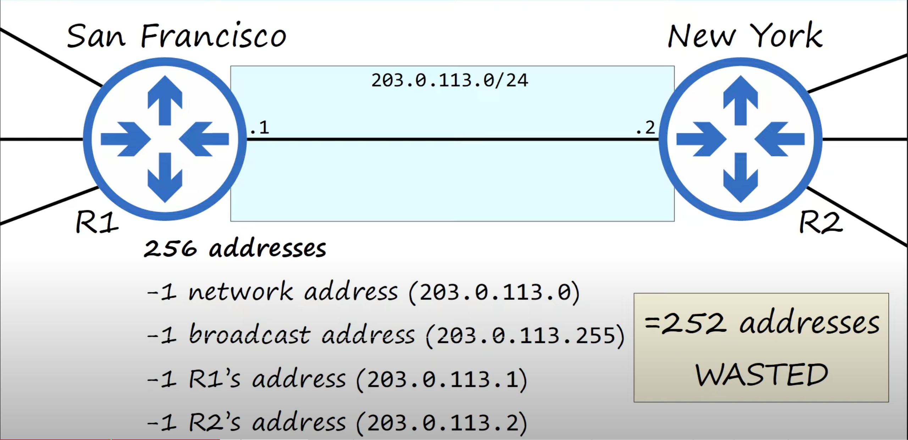
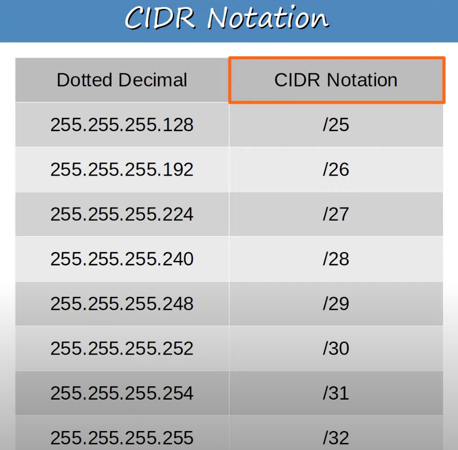
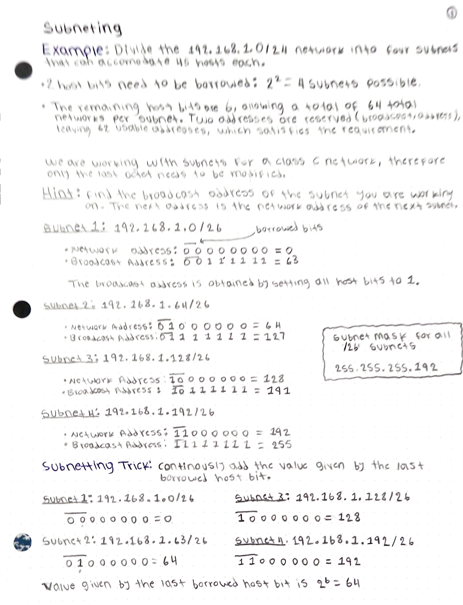
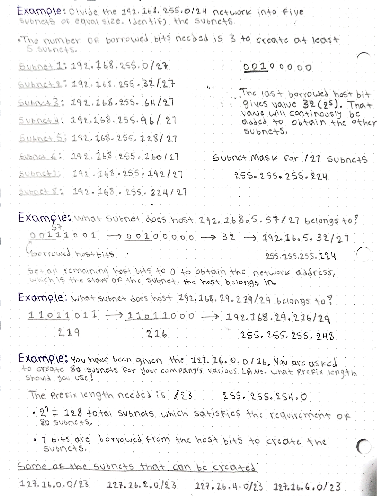
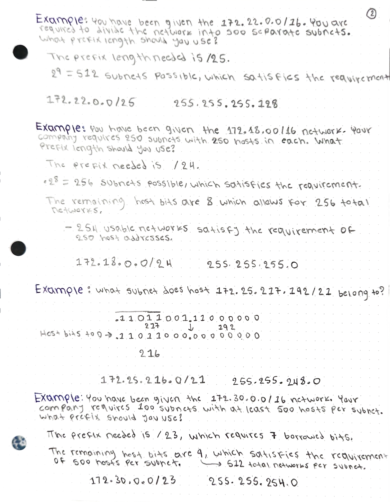
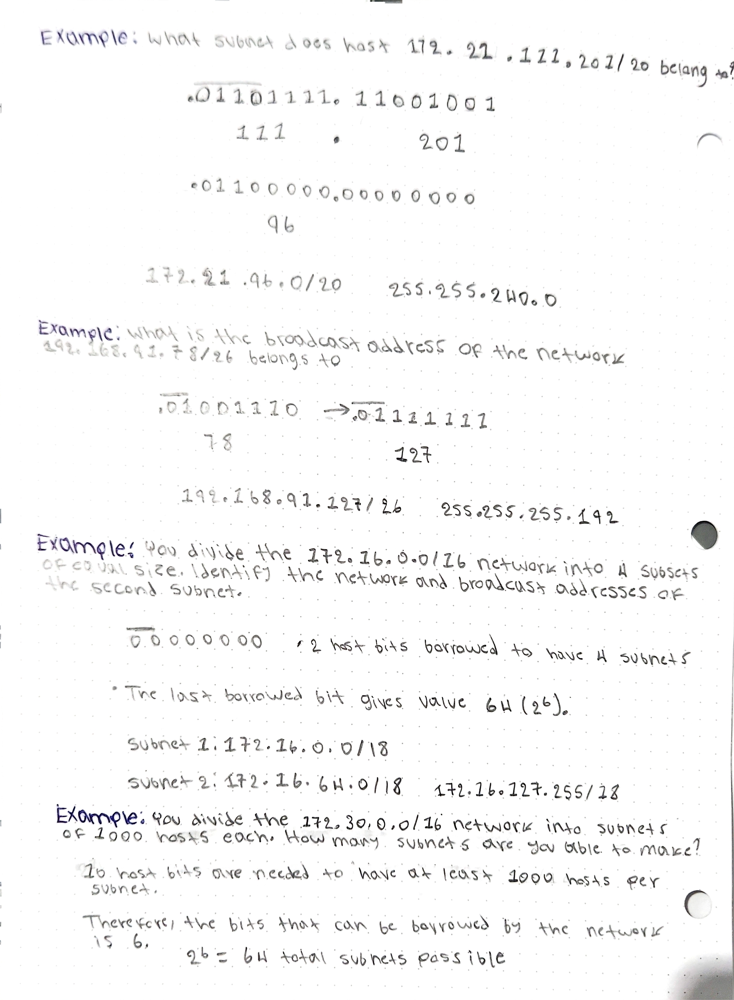
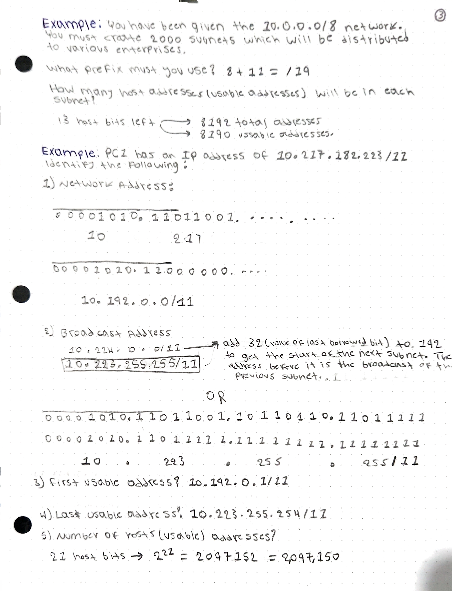
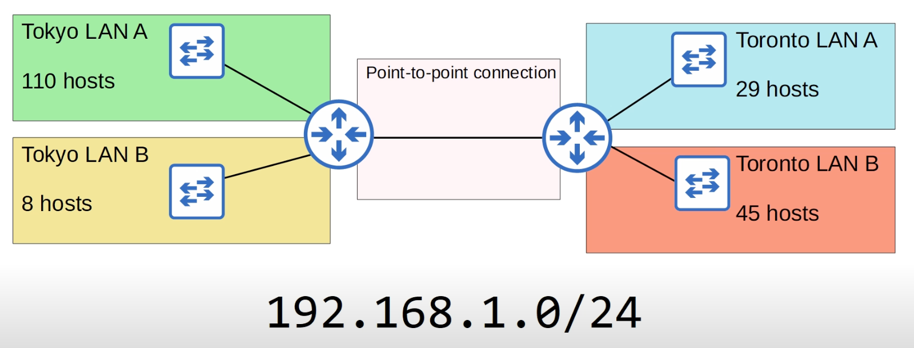

## IPv4 Address Assignment
* The IANA (Internet Assigned Numbers Authority) assigns IPv4 addresses/networks to companies based on their size.
* For example, a very large company might receive a **class A** or **class B** network, while a small company might receive a **class C** network.
* However, this led to many wasted IP addresses.
#### IP Address Waste

* The network connecting the San Francisco and New York offices of a corporation is a `point-to-point network`. Its only purpose is to connect the two corporation offices.
* Even when the network (class C) with the least number of addresses for hosts is picket, 252 addresses are unused.

#### IP Address Waste
* Company X needs IP addressing for 5000 end hosts.
* A **class C** network does not provide enough addresses, so a **class B** network must be assigned.
* This will result in about 60,000 addresses being wasted.

## CIDR (Classless Inter-Domain Routing)
* When the internet was first created, the creators did not predict that the internet would become as large as it is today.
* This resulted in wasted address space like the examples above. Now a days IP address exhaustion has become a problem because there is not enough addresses.
* The IETF (Internet Engineering Task Force) introduced CIDR in 1993 to replace the 'classful' addressing system. This remedies the issue of wasted addresses.
* CIDR removed the requirements of prefix length set by the different network classes.
	* Class A = /8
	* Class B = /16
	* Class C = /24
* This allowed larger networks to be split into smaller networks, allowing greater efficiency.
	* These smaller networks are called `subnetworks` or `subnets`. 
* Unfortunately we can't always make subnets have exactly the number of addresses we need. That is fine because it provides room for growth in the future.

==**The process of subnetting Class A, Class B, and Class C networks is EXACTLY THE SAME.**==
$$
Number\ of\ Subnets\ Possible:\ 2^x, x = number\ of\ borrowed\ host\ bits
$$

#### Subnets/Hosts (Class C)
How many usable addresses are there in each network?
* 203.0.113.0/25
	* 7 host bits = 128 total addresses.
	* (2^7) - 2 = 126 usable addresses.
	* 1 borrowed host bit makes 2 subnets possible.
	* Subnet mask = 255.255.255.128
* 203.0.113.0/26
	* 6 host bits = 64 total addresses.
	* (2^6) - 2 = 62 usable addresses.
	* 2 borrowed host bit makes 4 subnets possible
	* Subnet mask = 255.255.255.192
* 203.0.113.0/27
	* 5 host bits = 32 total addresses.
	* (2^5) - 2 = 30 usable addresses.
	* 3 borrowed host bit makes 8 subnets possible.
	* Subnet mask = 255.255.255.224
* 203.0.113.0/28
	* 4 host bits = 14 total addresses.
	* (2^4) - 2 = 14 usable addresses..
	* 4 borrowed host bit makes 16 subnets possible.
	* Subnet mask = 255.255.255.240
* 203.0.113.0/29
	* 3 host bits = 8 total addresses.
	* (2^3)  - 2 = 6 usable addresses.
	* 5 borrowed host bit makes 32 subnets possible.
	* Subnet mask = 255.255.255.248
* 203.0.113.0/30
	* 2 host bits = 4 total addresses.
	* (2^2) - 2 = 2 usable addresses.
	* 6 borrowed host bit makes 64 subnets possible.
	* Subnet mask = 255.255.255.252
* 203.0.113.0/31
	* 1 host bit = 2 total addresses.
	* (2^1) - 2 = 0 usable addresses.
	* 7 borrowed host bit makes 128 subnets possible.
	* Subnet mask = 255.255.255.254
	* For a point-to-point connection like the one shown above it is possible to use  a /31 mask and it is recommended. However, don't use it for the CCNA like that.
		* Normally it would not be possible because there would leave no addresses for the network and broadcast addresses.
		* However, for a dedicated point-to-point connection, there is really no need for the network and broadcast addresses.
		* Routers will give the following warning when using /31 mask: `Warning: use /31 mask on non point-to-point interfaces cautiously`.
* 203.0.113.0/32
	* 0 host bit = 0 total addresses.
	* (2^0) - 2 = -1 usable addresses.
	* 8 borrowed host bit makes 256 subnets possible.
	* Subnet mask = 255.255.255.255
	* Will probably never use a /32 mask to configure an actual interface. However, there are some uses for a /32 mask.
	* a /32 mask can be used when you want to create a static route not a network, but just to one specific host.

This is called subnetting because we are only using a subset of the total available addresses in the address class that we are working on. In this case we are creating subnets for a class C network.


#### Subnetting Examples (Classes A,B, and C)
==**The process of subnetting Class A, Class B, and Class C networks is EXACTLY THE SAME.**==






## Variable-Length Subnet Masks
* Until now, we have practices subnetting using **FLSM** (Fixed-Length Subnet Masks). 
* This means that all of the subnets use the same prefix length (ie. subnetting a class C network into 4 subnets using /26).
* **VLSM** (Variable-Length Subnet Masks) is the process of creating subnets of different sizes, to make your use of network addresses more efficient.
* VLSM is more complicated than FLSM, but it's easy if you follow the steps correctly.


* We need to create 5 subnets, which means we need to borrow 3 host bits.
* The remaining host bits are 5, which allow for a maximum of 30 usable addresses (32 total).
* Using FLSM, we can only give each subnet a total of 30 usable addresses, which is not enough to meet the required number of host for some of the subnets.
* VLSM allows us to assign variable length prefixes for the different subnets needed. 
	* The total number of usable addresses needed across all 5 subnets is 194. The class C network can host a total of 254 usable addresses, which is more than the addresses needed.
	* Setting different prefix lengths allows us to create subnets tailored to the needs of each subnet. Allowing for better distribution of the addresses among the subnets depending on the requirements of each subnet.

#### VLSM Assignment Steps
1. Assign the largest subnet at the start of the address space.
2. Assign the second-largest subnet after it.
3. Repeat the process until all subnets have been assigned.

#### Tokyo LAN A
* Network Address: 192.168.1.0/25
```
* Network Address: 192.168.1.0/25 because the available host are 7, which gives a total of 128 networks. Satisfying the requirement of 100 hosts.
```
* Broadcast Address:192.168.1.127/25
```
METHOD 1:
.0 0 0 0 0 0 0 0
The prefix length is /25, therefore only the 1st bit of the last octet is borrowed. Using the trick we can get the next subnet by adding the value of the last borrowed bit. Then we just subtract 1 to get the broadcast address of this subnet.

Value of last borrowed bit = 2^7 = 128
Therefore 0 + 128 = 128 (next subnet) - 1 = 127 broadcast address

METHOD 2: turn all host bits to 1. Remember, the first bit was borrowed by the network.
.0 1 1 1 1 1 1 1 = 127
```
* First usable address: 192.168.1.1/25
* Last usable address:192.168.1.126/25
* Total number of usable host addresses: 2^7 = 128 total addresses - (broadcast + network) = 126 usable addresses.

#### Toronto LAN B
* Network Address: 192.168.1.128/26
	* Add one to the broadcast address of the previous subnet.
* Broadcast Address: 192.168.1.191/26
```
METHOD 1:
The first 2 bits are borrowed
1 0 0 0 0 0 0 0 = 128
Turn all host bits to 1 to get the broadcast network
1 0 1 1 1 1 1 1 = 191
192.168.1.191/26

METHOD 2:
The first 2 bits are borrowed
1 0 0 0 0 0 0 0
The value of the last bit borrowed is 64. Therefore, the network address of the next subnet can be obtained by adding that value. Then, we subtract 1 to get the broadcast network of the current subnet.
128 + 64 = 192 (network address of next subnet)
192 - 1 = 191
192.168.1.191/26
```
* First usable address: 192.168.1.129/26
* Last usable address: 192.168.1.190/26
* Total number of usable hosts: 2^6 = 64 total addresses - 2 = 62 usable addresses.

#### Toronto LAN A
* Network address: 192.168.1.192/27
	* Add one to the broadcast address of the previous subnet.
* Broadcast Address: 192.168.1.223/27
```
METHOD 1:
The first 3 bits are borrowed
1 1 0 0 0 0 0 0 = 192
Turn all host bits to 1 to get the broadcast network
1 1 0 1 1 1 1 1 = 223
192.168.1.223/27

METHOD 2: 
The first 3 bits are borrowed.
The value of the last borrowed bit is 32. The network address of the next subnet can be obtained by adding 32. Then, 1 is subtracted to obtain the broadcast network of the current subnet.
192 + 32 = 224 (network address of next subnet)
124 - 1 = 223
192.168.1.223/27

```
* The first usable address: 192.168.1.193/27
* The last usable address: 192.168.1.222/27
* Total number of usable hosts: 2^5 = 32 total addresses - 2 = 30 usable addresses.

#### Tokyo LAN B
* Network address: 192.168.1.224/28
* Broadcast Address: 192.168.1.239/28
```
The first 4 bits are borrowed
1 1 1 0 0 0 0 0 = 224
Turn all host bits to 1 to get the broadcast address
1 1 1 0 1 1 1 1 = 239
192.168.1.239/28
```
* First usable address: 192.168.1.225/28
* Last usable address: 192.168.1.238/28
* Total number of usable hosts: 2^4 = 16 total addresses - 2 = 14 usable addresses.

#### Point-to-point Connection 
==Even though it is possible to use a /31 prefix length for a point-to-point connection. For the CCNA I should avoid using it.==
* Network address: 192.168.1.240/30
* Broadcast address: 192.168.1.243/30
```
The first 6 bits are borrowed
1 1 1 1 0 0 0 0 = 240
turn all host bits to 1 to get the broadcast address
1 1 1 1 0 0 1 1 = 243
192.168.1.243/30
```
* First usable address: 192.168.1.241/30
* Last usable address: 192.168.1.242/30
* Total number of usable hosts addresses: 2^2 = 4 total addresses - 2 = 2 usable addresses.


## Broadcast Addresses and Subnetting
Lets assume that we are woking with a network address `192.168.5.0/24` and that we have created the following subnets:
* Subnet 1: `192.168.5.0/25`
* Subnet 2: `192.168.5.128/26`

**Broadcast to Network Address (192.168.5.255)**:
* Broadcast messages to the network address `192.168.5.255` from inside a subnet, will only travel to the hosts inside the originating subnet.
* Broadcast messages do not go pat the router.
**Message to Subnet Broadcast Address**:
* Subnet 1 can reach all hosts in the same subnet by targeting the subnet's broadcast address.
* Subnet 1 can reach all hosts in subnet 2 by targeting subnet 2 broadcast address. Upon arriving to the subnet, the message will be distributed to all hosts. 