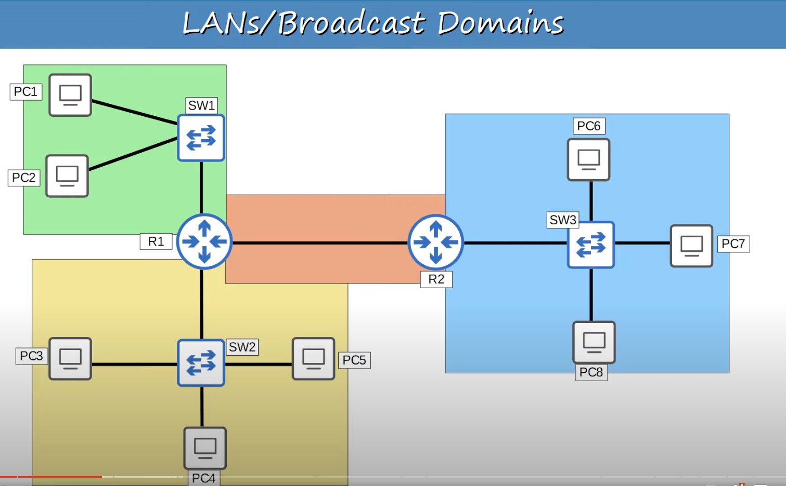

## What is a LAN ?
* A LAN is a single **broadcast domain**, including all devices in that broadcast domain.
* A **broadcast domain** is  the group of devices which will receive a broadcast frame (destination MAC FFF.FFFF.FFFF) sent by any one of the members.
The picture below contains 4 broadcast domain, therefore there are 4 separate LANs

## VLAN
A VLAN is a way to logically split up a layer 2 broadcast domain to make multiple separate broadcast domains.
#### Why are VLANs Needed ?
The example below shows a single LAN with different departments where a computer in the engineering department sends a broadcast message intended for another PC's in the same department. However, since there is no clear division between the different departments in the LAN, all PC's in all departments will receive the broadcast message.

* **Performance Issues**: Lots of unnecessary broadcast traffic can reduce network performance. 
	* Above, a broadcast message was intended for the Engineering department, but was propagated to all hosts in all departments.
	* Minimize unnecessary traffic in the network.
* **Security Reasons**: Even within the same office, you want to limit who has access to what.
	* Configuring security policies on a router/firewall does not have any effect on hosts communicating in the same LAN.
	* PCs in the same LAN can reach each other directly, without passing through the router.
#### Layer 3 Segmentation
The 3 departments have been separated into 3 different subnets to provide Layer 3 separation.

* Although the three departments have been separated into three subnets (Layer 3), they are still in the same broadcast domain (Layer 2).
* The switch has no notion of Layer 3 IP addresses, it only looks at the layer 2 address. It will see that the destination MAC address is the broadcast address and consequently forward the frame to all connected hosts.
* One solution would be to use a different Switch device for each of the subnets.
	* This might not be practical because most likely not all Switch interfaces will be used per subnet. Resulting in high cost and wasted Switch interfaces.

#### Layer 2 Segmentation
The switch interfaces are configures to be in a specific VLAN to provide Layer 2 separation.

* The end hosts belong to the VLAN configured on the Switch interface that they are connected to.
* A switch will not forward traffic between VLANs, including **broadcast/unknown unicast*** traffic.
* The switch does not perform **inter-VALN Routing**. It must send the traffic through the router to change VLAN.
* **NOTE**: Same subnet communication between two hosts is not possible if they are connected to interfaces that are configured with different VLANs.

#### VLAN Configuration
 

##### Display VLANs
```
Switch#show vlan brief

VLAN Name           Status         Ports

1    default        active         Fa0/1, Fa0/2, Fa0/3, Fa0/4
		
								   Fa0/5, Fa0/6, Fa0/7, Fa0/8
			
			                       Fa0/9, Fa0/10, Fa0/11, Fa0/12
			
								   Fa0/13, Fa0/14, Fa0/15, Fa0/16
			
								   Fa0/17, Fa0/18, Fa0/19, Fa0/20
			
								   Fa0/21, Fa0/22, Fa0/23, Fa0/24
			
								   Gig0/1, Gig0/2

1002  fddi-default   active

1003 token-ring-default active

1004 fddinet-default active

1005 trnet-default active
```
* All Switch interfaces are in VLAN 1 by default.
* VLANS 1002, 1003, 1004, 1004, 1005 are for old technologies that are not needed for the CCNA.
* VLANs 1, 1002 - 1005 exist by default and **cannot be deleted**.

##### Set VLANs
```
SW1(config)#interface range g1/0 - 3
SW1(config-if-range)switchport mode access
// creates VLAN if it doesn't aready exists
SW1(config-if-range)switchport access vlan 10
Access VLAN does not exist. Creating Vlan 10

// Manual explicit creation of a VLAN
SW1(config)#vlan 10
SW1(config-vlan)#name ENGINEERING // change default VLAN name.
```
* Use `switchport mode access` to set the interface as an access port.
	* A switch port connected to an end host should enter access mode by default. However, it's better to explicitly configure the setting and not rely on auto negotiation.
* An **access port** is a  switch port  which belongs to a single VLAN, and usually connects to end hosts like PCs.
	* Its called an access port because it gives the end hosts access to the network.
* There is another  type of switch port called **trunk port** that can carry multiple VLANs.
## Trunk Ports
* There is a link between SW1 and SW2 in VLAN10 to allow for communication between all hosts in VLAN10. Furthermore, the link is needed for hosts in VLAN10 connected to SW1 to be able to reach the router and travel to the other VLANs.
* VLAN30 is connected to SW1, therefore there must be a link for that VLAN between SW1 and SW2 to be able to reach the router and travel to the other VLANs.
* There is not a link between SW1 and SW2 for VLAN20 because there is no hosts in that VLAN connected to to SW1. Hosts in VLAN20 can contact hosts in the other VLANs by simply going through SW2 to R1 for inter-VLAN communication.


* In a small network with few VLANs, it is possible to use a separate interface for each VLAN when connecting switches to switches, and switches to routers.
* However, when the number of VLANs increases, this is not viable. It will result in wasted interfaces, and often routers won't have enough interfaces for each VLAN.
* You can use **trunk ports** to carry traffic from multiple VLANs over a single interface.  

Using Trunk ports, the number of connections between Switch to Switch and Switch to Router decreased from 3 to 1 physical connection.

* Switches will `tag` all frames that they send over a trunk link.
* Switches will look at the tag of all frames received over a trunk link to determine the VLAN that it belongs to.
* Other common names for access ports and trunk ports:
	* Trunk ports: **tagged ports**
	* Access ports: **untagged ports**

#### VLAN Tagging
* There are two main trunking protocols: 
	* **ISL (Inter-Switch Link)**.
	* **IEEE 802.1Q** usually called "dot1q".
* ISL is an old Cisco proprietary protocol created before the industry standard IEEE 802.1Q.
* IEEE 802.1Q is an industry standard protocol created by the IEEE (Institute of Electrical and Electronics Engineers).
* You will probably NEVER user ISL in the real world. Even modern Cisco equipment doesn't support it. For the CCNA, you only need to learn 802.1Q.

##### 802.1Q Position In the Ethernet Frame Header

| Preamble | SFD | Destination | Source | 802.1Q | Type |
| -------- | --- | ----------- | ------ | ------ | ---- |
* The 802.1Q tag is inserted between the Source and Type/Length fields of the Ethernet frame header.
* **It wont be included in the frame header when frames are sent in the native VLAN.**
* The tag is 4 bytes (32 bits) in length.
* The tag consists of two main fields:
	* **Tag Protocol Identifier (TPID)**
	* **Tag Control Information (TCI)** which consists of three sub-fields.


* ***TPID (Tag Protocol Identifier)**:
	* 16 bits (2 bytes) in length.
	* Identifies the protocol used to create the frame VLAN tag.
	* Always set to a value of 0x8100 that indicates that the frame is 802.1Q tagged.
* **PCP (Priority Code Point)**:
	* 3 bits in length.
	* Used for **Quality of Service (QoS)**, which prioritizes important traffic in congested networks.
* **DEI(Drop Eligible Indicator)**: 
	* 1 bit in length.
	* Used to indicate frames that can be dropped if the network is congested.
* **VID(VLAN ID)**:
	* 12 bits in length.
	* Identifies the VLAN the frame belongs to.
	* 12 bits in length = 4096 total VLANs (2^12), range 0 - 4095.
		* VLANS 0 and 4095 are reserved and can't be used.
		* Therefore, the actual range of VLANs is 1 - 4094.
	* Cisco's proprietary ISL also has a VLAN range of 1 - 4094.
#### VLAN ranges
* The range of VLANs (1 - 4094) is divided into two sections:
	* Normal VLANs: 1 - 1005.
	* Extended VLANs: 1006 - 4094.
* Some older devices cannot use the extended VLAN range, however it's safe to expect that modern switches will support the extended VLAN range.

#### Native VLAN
* 802.1Q has a feature called the **native VLAN**. (ISL does not have this feature).
* The native VLAN is VLAN 1 by default on all trunk ports, however this can be manually configure on each trunk port. The change has to be made in all trunk port interfaces.
* The switch does not add an 802.1Q tag to frames in the native VLAN of a trunk port.
* When a switch receives an untagged frame on a trunk port, it assumes the frame belongs to the native VLAN.
* **It's very important that the native VLAN matches between switches**.
	* Switches will still forward traffic if there is a native VLAN mismatch, but problems may occur.

##### Native VLAN Good Example
The native VLAN has been configured to be VLAN 10 on the trunk link between SW1 and SW2.


#### Native VLAN Bad Example
The native VLAN configuration between SW1 and SW2 do not match.


#### Trunk Configuration

##### Set Switch Interfaces as Trunk
```
SW1(config)#interface g0/0
SW1(config-if)#switchport mode trunk
Command rejected: An interface whose trunk encapsulation is "Auto" can not be configured to "trunk" mode.
SW1(config-if)#switchport trunk encapsulation ?
  dot1q     Interface uses only 802.1q trunking encapsulation when trunking.
  isl       Interface used only ISL trunking encapsulation when trunking.
  negotiate Device will negotiate trunking encapuslation with peer on   
			  interface.

SW1(config-if)#switchport trunk encapsulation dot1q
SW1(config-if)#switchport mode trunk

```
* Many modern switches do not support Cisco's ISL at all. They only support 802.1Q (dot1q).
* However, switches that do support both (like the one in the example above) have a trunk encapsulation of `Auto`by default.
* To manually configure the interface as a trunk port, you must first set the encapsulation to 802.1Q or ISL. This is not necessary on switches that only support 802.1Q.
* After you set the encapsulation type, you can then configure the interface as a trunk.

##### View Trunk Interfaces
```
SW1# show interface trunk
Port   Mode  Encapsulation  Status     Native vlan
Gi0/0  on    802.1q         trunking   1

Port   Vlans allowed on trunk 
Gi0/0  1 - 4094

Port   Vlans allowed and active in managemetn domain
Gi0/0  1, 10, 30

Port   Vlans in spanning tree forwarding state and not pruned
Gi0/0  1, 10, 30
```
*  `Mode on` means that the interface was manually configured as a trunk.
* `Vlans allowed on trunk `
	* By default all VLANs are allowed on the trunk. However, for security reason we should limit which VLANs can be forwarded on the trunk.
	* This will also avoid unnecessary network traffic, maintaining performance.
* `Vlans allowed and active in management domain`
	* Includes the default VLAN 1 and other VLANs configured on the switch.
	* Note that the default VLANS 1002 - 1005 are not shown. These VLANs are not really used in modern networks.
* `Vlans in spanning tree forwarding state and not pruned`
	* Will cover this field later

##### `show vlan brief` vs `show interface trunk`
* The `show vlan brief` command shows the access ports assigned to each VLAN, not the trunk ports that allow each VLAN.
* Use the `show interface trunk` command instead to confirm trunk ports.

##### Configure Allowed VLANs on a Trunk
```
SW1(configure)# interface g0/0
SW1(config-if)#switchport trunk allowed vlan ?
WORD   VLAN ID's of the allowed VLANs when this port is in trunking mode
add    add VLANs to the current list
all    All VLANs
except all VLANs except the following
none   no VLANs
remove  remove VLANs from the current list

SW1(config-if)#switchport trunk allowed vlan
```
* `WORD`: Allows you to simply configure the list of VLANs allowed
	* `switchport trunk allowed vlan 10,30`
	* Will replace the allowed VLANs with the ones specified in the command.
* `add`: Allows you to add allowed VLANs to the currently existing list.
	* `switchport trunk allowed vlan add 20`
	* Will add the specified VLANs to the list of allowed VLANs.
* `remove`: Allows you to remove VLAN from the list of allowed VLANs in the trunk port.
	* `switchport trunk allowed vlan remove 20`

##### Configured Allowed VLANs on the Trunk Port

* Only VLANs 10 and 30 need to be allowed on the trunk port connection between SW1 and SW2.
* There is not reason for frames in VLAN 20 to go to SW1 directly, therefore VLAN 20 should not be allowed on the trunk port connection.

##### Native VLAN Configuration
* For security purposes, it is best to change the native VLAN to an unused VLAN.
	* Its about limiting unnecessary traffic in the network and controlling what traffic is allowed.
* Make sure the native VLAN matches between switches.
`SW1(config-if)#switchport trunk native vlan 1001`

## Router on a Stick (ROAS)

* ROAS is used to route between multiple VLANs using a single interface on the router and switch.
* The switch interface is configured as a regular trunk.
* The router interface is configured with **subinterfaces**. Each subinterface is assigned a VLAN tag and IP address.
* The router will behave as if frames arriving with a certain VLAN tag have arrived on the subinterface configured with that VLAN tag.
* The router will tag frames sent out of each interface with the VLAN tag configured on the subinterface.
#### Configure Router on a Stick (ROAS)
```
R1(config)#interface g0/0
R1(config-if)interface g0/0.10
R1(config-subif)#encapsulation dot1q 10
R1(config-subif)#ip address 192.168.1.62 255.255.255.192

R1(config-if)interface g0/0.20
R1(config-subif)#encapsulation dot1q 20
R1(config-subif)#ip address 192.168.1.126 255.255.255.192

R1(config-if)interface g0/0.30
R1(config-subif)#encapsulation dot1q 30
R1(config-subif)#ip address 192.168.1.190 255.255.255.192
```

* The sub-interface number does not have to match the VLAN number.  However, it is highly recommended that they do match, to make it easier to understand.

## Native VLAN on a Router (ROAS)
* Traffic in the native VLAN is more efficient because frames are not tagged, making them smaller. As a result, more frames can be sent per second.
	* The 802.1Q header field is not included for frames in the native VLAN.

#### Native VLAN Configuration on a Router
There are 2 methods of configuring the native VLAN on a router:
* **Method 1:** Use the command `encapsulation dot1q vlan-id native ` on the router.
* **Method 2:** Configure the IP address for the native VLAN on the router's physical interface (the `encapsulation dot1q vlan-id` command is not necessary)
	* This method does not use a subinterface at all.

```
METHOD 1:
R1(config)#interface g0/0.10
R1(config-subif)#encapsulation dot1q 10 native
R1(config-subif)#

METHOD 2:
R1(config)#interface g0/0
R1(config-if)#ip address 192.168.1.62 255.255.255.192
```
