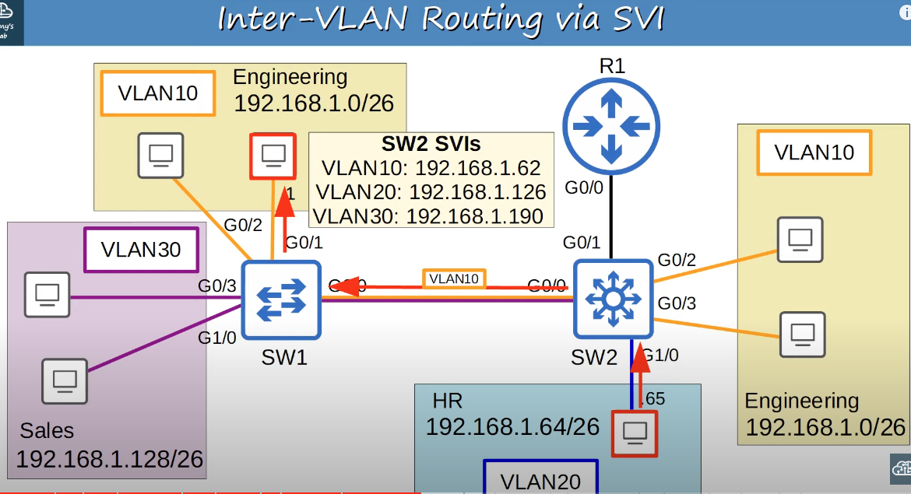

#### Inter-VLAN Routing Methods
* Dedicated interface for each VLAn between router and switch.
	* This works, but if you have many VLANs you probably won't have enough interfaces on the router for all VLANs.
* Router on a stick(ROAS), which uses a single trunk connection to carry traffic for all VLANs between the switch and router.
	* It's efficient in terms of interfaces because only 1 is used.
	* However, in a busy network all of the traffic going to the router and back to the switch in a single interface can cause network congestion.
	* Therefore, in large networks, a multilayer switch is the preferred method of inter-VLAN routing.
* Multilayer Switch 

## Layer 3 (Multilayer) Switches
* A multilayer switch is capable of both switching and routing.
* It is Layer 3 aware.
* You can assign IP addresses to its interfaces, like a router.
* You can create virtual interfaces for each VLAN, and assign IP addresses to those interfaces.
* You can configure routes on it, just like a router.
* It can be used for inter-VLAN routing.

#### Multilayer Switch Inter-VLAN Routing via SVI
* SVIs (Switch Virtual Interfaces) are the virtual interfaces you can assign IP addresses to in a multilayer switch.
* Configure each PC to use the SVI (NOT the router) as their gateway address.
* To send traffic to different subnets/VLANs, the PCs will send traffic to the switch, and the switch will route the traffic.

Process of inter-VLAN communication when a layer 2 switch is used.

* SW2 is a layer 2 switch that must send traffic to R1 for inter-VLAN routing.

Process of inter-VLAN communication when a multilayer switch is used.

* It is assumed that SW2 already has the mac address from the destination PC in its mac address table. Otherwise, the switch would have flooded VLAN 10 to find it.
* Since SW2 is layer 3 aware, it does not have to go to R1.

#### Communication Outside the LAN
* SW2 is the default gateway, therefore hosts that need to communicate outside of their VLAN will need to communicate with it.
* In addition to configuring switch virtual interfaces (SVIs) on multilayer switches, its physical interfaces can be configured to operate like router interfaces.

