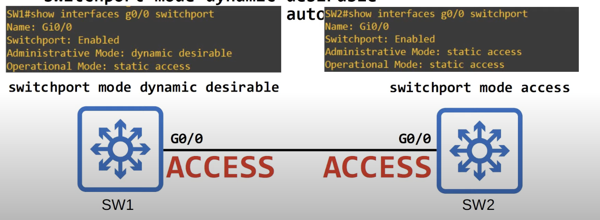
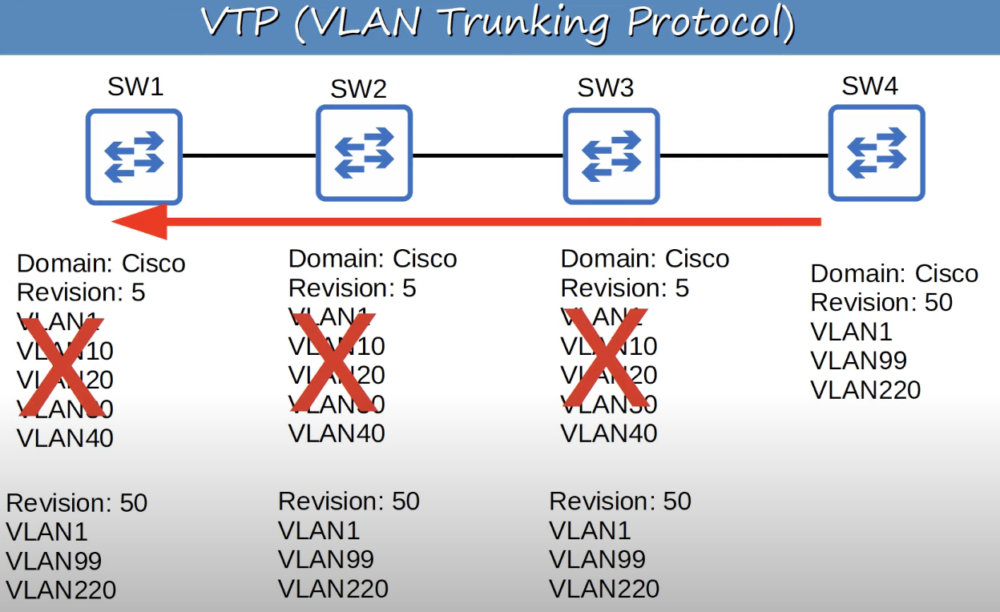

## Dynamic Trunking Protocol (DTP)
* DTP is a Cisco proprietary protocol that allows Cisco switches to dynamically determine their interface status (**access** or **trunk**) without manual configuration.
* DTP is enabled by default on all Cisco switch interfaces
* For security purposes, manual configuration is recommended. DTP should be disabled on all switchports.
	* `switchport mode access` to configure access ports.
	* `switchport mode trunk` to configure trunk ports.

```
Switch(config-if)#switchport mode ?
access Set trunking mode to ACCESS unconditionally

dynamic Set trunking mode to dynamically negotiate access or trunk mode

trunk Set trunking mode to TRUNK unconditionally

Switch(config-if)#switchport mode dynamic ?
auto      Set trunking mode dynamic negotiation parameter to AUTO
desirable Set trunking mode dynamic negotiation parameter to DESIRABLE
```
* The `dynamic` option is for Dynamic Trunking Protocol (DTP).
* A switchport in `dynamic desirable` mode will actively try to form a trunk with other Cisco switches. It will form a trunk if connected to another switchport in the following modes:
	* `switchport mode trunk`
	* `switchport mode dynamic desirable`
	* `switchport mode dynamic auto`
* A switchport in `dynamic auto` mode will not actively try to form a trunk with other Cisco switches. However it will form a trunk if the switch connected to it is actively trying to form a trunk connection. It will form a trunk if connected to another switchport in the following modes:
	* `switchport mode trunk`
	* `switchport mode dynamic desirable`
* DTP will not form a trunk with a router, PC, etc. The switchport will be in access mode.
* Manually configuring one interface to `access` and the other to `trunk` will force the interfaces to use those settings. However, the misconfiguration will result in errors.
* On older witches, `switchport mode dynamic desirable` is the default administrative mode. On newer switches, `switchport mode dynamic auto` is the default administrative mode.
* You can stop a switch interface from sending DTP negotiation frames with `switchport nonegotiate`
	* Configuring a switch interface with `switchport mode access` also disables DTP negotiation and stops it from sending DTP frames.
	* Configuring an interface as trunk will not stop it from sending DTP frames unless `switchport nonegotiate` is used.



* `Switchport`: indicates whether the interface is operating at a layer 2 level.
* `Administrative Mode:` indicates the switchport mode that is configured on the interface.
* `Operational Mode:` indicates the actual mode that is being used by the interface.

#### Trunk Encapsulation Negotiation
* Switches that support both **802.1Q** and **ISL** trunk encapsulations can use DTP to negotiate the encapsulation they will use.
* This negotiation is enabled by default, as the default trunk encapsulation mode is: `switchport trunk encapsulation negotiate`
	* If you want to manually configure a trunk interface on a switch that supports both 802.1Q and ISL, you must first set a specific encapsulation mode. It cannot stay in negotiate mode.
* ISL is favored over 802.1Q, therefore ISL will be selected if both switches support it.
* DTP frames are sent in VLAN1 when using ISL and in the native VLAN when using 802.1Q (the default native VLAN is VLAN 1 BTW).

## VLAN Trunking Protocol (VTP)
* It's a Cisco proprietary protocol that allows you to configure VLANs on a central VTP server switch, and other switches (VTP clients) will synchronize their VLAN database to the server.
* It is designed for large networks with many VLANs, so that you don't have to configure each VLAN on every switch.
* It is rarely used, and it is recommended that you do not use it.
* There are three VTP versions: 1, 2, and 3. Most modern Cisco switches support all three, but older switches might only support 1 and 2.
	* VTP v1/v2 do not support the extended VLAN range (1006 - 4094). Only VTP V3 supports them.

#### VTP Modes
* There are three VTP modes: **server**, **client**, and **transparent**.
* **VTP Servers**:
	* Cisco switches operate in VTP server mode by default.
	* Can add/modify/delete VLANs.
	* Store the VLAN database in nonvolatile RAM (NVRAM).
	* Will increase the **revision number** every time a VLAN is added/modified/deleted.
	* Will advertise the latest version of the VLAN database on trunk interfaces, and the VTP clients will synchronize their VLAN database to it.
		* If a switch with no VTP domain (domain NULL) receives a VTP advertisement with a VTP domain name, it will automatically join that VTP domain.
	* **VTP servers also function as VTP clients. Therefore, a VTP server will synchronize to another VTP server with a higher revision number.**
* **VTP Clients**:
	* Cannot add/modify/delete VLANs.
	* Do not store the VLAN database in NVRAM (in VTP v3, they do).
	* Will synchronize their VLAN database to the server with the highest revision number in their VTP domain.
	* Will advertise their VLAN database, and forward VTP advertisements to other clients over their trunk ports.
* **VTP Transparent**:
	* Switches in VTP transparent mode do not participate in the VTP domain (do not sync its VLAN database).
	* Maintains its own VLAN database in NVRAM. It can add/modify/delete VLANs, but they won't be advertised to other switches.
	* Will only forward VTP advertisements that are in the same domain as it.
#### VTP Configuration

**VTP Mode Configuration**
```
// show vtp status
SW(config)#show vtp status
// client mode
SW(config)#vtp mode client

// server mode
SW(config)#vtp mode server

// transparent mode
SW(config)#vtp mode transparent

// change VTP domain
vtp domain <domain-name>

```

**Change VTP Version**
```
SW1(config)#vtp version 2
```
* Changing the version will increase the revision number.
* Other clients and servers will sync and start operating in version 2 as well.
* VTP v2 is not much different that VTP v1. The major difference is that VTP v2 introduces support for Token Ring VLANs. If you use Token Ring VLANs, you must enable VTP v2. Otherwise, there is no reason to use VTP v2.
	* Token Ring is an old technology, so there is really no reason to use version 2.
* Version 3 has quite some differences and new features, but it is outside the scope of the CCNA.
##### Danger of VTP
* If you connect an old switch with a higher revision number to your network (and the VTP domain name matches), all switches in the domain will sync their VLAN database to that switch.
	 * This could cause all hosts on your network to instantly lose connectivity because the switches could sync to a totally different VTP database, causing the VLANS you were using to disappear. 
	 * This is one of there reasons why VTP is not used in modern networks.
 * When connecting an old switch to the network, its revision number should be reset to 0 to avoid issues.
	 * Change VTP domain to an unused domain to reset revision number to 0.
	 * Change VTP mode to transparent to reset revision number to 0.

The image below showcases one of the possible dangers of using VTP.

* SW4 is an old switch that is integrated into the network with a higher revision number.
* Its VTP domain matches the one used by the other switches, therefore all the other switches will synchronize to it.
* As a result, hosts in VLANs 10, 20, 30, and 40 will loose connectivity.

