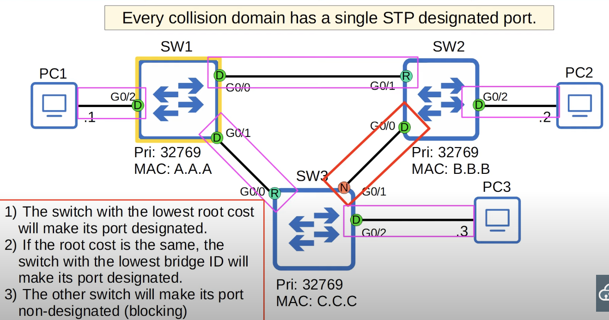
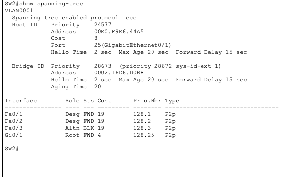

## Network Redundancy
* Redundancy is an essential part of network design.
* Modern networks are expected to run 24/7 365 days a year. Even a short downtime can be disastrous for a business.
* If one network component fails, you must ensure that other components will take over with little to no downtime.
* As much as possible, you must implement redundancy at every possible point in the network.
#### Network Without Redundancy

* If a failure occurs at the 'x' and the connection is lost, all hosts in the LAN lose connectivity to the internet.
#### Network With Redundancy

* Hosts in this network can take multiple paths to reach other hosts in the  LAN and to get to the internet (outside the LAN).
* The availability of multiple pathways creates network redundancy for when connections fail. 
* The redundancy added can lead to loops in the LAN, creating unnecessary traffic that affects the network performance.
## Broadcast Storms
The image below shows what would happen when PC1 tried to communicate with PC2 and PC1 didn't know the destination's MAC address.

* The Ethernet header doesn't have a TTL field. Broadcast frames will loop around switches in the network indefinitely. If enough of these looped broadcasts accumulate in the network, the network will be too congested for legitimate traffic to use the network. This is called a **broadcast storm**.
* Spanning Tree Protocol (STP) is a Layer 2 protocol that is used to prevent infinite loops in a LAN, just like Time to Live (TTL) is used to prevent loops at Layer 3.
* Network congestion isn't the only problem. Each time a frame arrives on a switchport, the switch uses the source MAC address field to learn the MAC address and update its MAC address table.When frames with the same source MAC address repeatedly arrive on different interfaces, the switch is continuously updating the interface in its MAC address table. This is known as **MAC Address Flapping**.
## Spanning Tree Protocol (STP)
* This section will cover **Classic Spanning Tree protocol** which is defined in IEEE 802.1D.
* Switches from all vendors run STP by default because it is very important to prevent Layer 2 loops.
* STP prevents Layer 2 loops by placing redundant ports in a blocking state, essentially disabling the interface. These interfaces act as backups that can enter a forwarding state if an active (currently forwarding) interface fails.
* By selecting which ports are **forwarding** and which ports are **blocking**, STP creates a single path to/from each point in the network. This prevents Layer 2 loops.
## Spanning Tree Protocol Steps
### Step 1: 
* One switch is selected as the root bridge.
* Root Bridge Selection:
	1. Lowest bridge ID
#### STP Bridge Protocol Data Unit (BPDU)
* STP-enabled switches can send/receive Hello BPDUs out of all eligible interfaces. The ability of a switch's interfaces to send/receive BPDUs is determined by its state (disabled, blocking, listening, learning, forwarding). The default timer for sending BPDUs is 2 seconds.
* If a switch receives a Hello BPDU on an interface, it knows that the interface is connected to another switch (routers, PCs, etc. do not use STP, so they do not send Hello BPDUs).

##### Old Bridge ID Format

* The Bridge Priority is compared first. If they tie, the MAC address is then compared to break the tie.`
* The default bridge priority is 32768 on all switches, so by default the MAC address is used as the tie-breaker (lowest MAC address value becomes the root bridge).
##### New Bridge ID Format

* VLAN ID is included in Bridge priority because Cisco switches use a version of STP called **PVST** (Per-VLAN Spanning Tree). PVST runs a separate STP instance in each VLAN. Therefore, in each VLAN different interfaces can be forwarding/blocking and the root bridge can be different per VLAN.

* The default bridge priority used to be 32768 because it is a 16 bit field and the most significant bit is set to 1 by default.
* With the addition of the Extended System ID (VLAN ID), which sets the default VLAN to 1, the default bridge priority became 32769.
	* In the default VLAN of 1, the default bridge priority is 32769 (32768 + 1).
* The **bridge priority** + **extended system ID** is a single field in the Bridge ID. However, the extended system ID is set and cannot be changed because it is determined by the VLAN ID. Therefore, it is only possible to change the total Bridge Priority (Bridge Priority + Extended System ID) in units of 4096 - the value of the least significant bit of the Bridge Priority section.
#### Root Bridge
* The switch with the lowest **Bridge ID** is elected as the **root bridge**. 
* The root bridge has a **designated port** in each collision domain it is connected to.
* When a switch is powered on, it assumes it is the root bridge. It will only give up its position if it receives a superior BPDU (lower Bridge ID).
* Once the topology has converged and all switches agree on the root bridge, only the root bridge sends BPDUs. Other switches in the network will forward these BPDUs, but will not generate their own original BPDUs.
* All other switches in the topology must have a path to reach the root bridge.

* **The Bridge Priority is compared first. If they tie, the MAC address is then compared to break the tie.**
* SW1 is selected as the root bridge since all switches have the same bridge priority and it has the lowest MAC address.

### Step 2
* Each remaining switch will select one of its interfaces to be its **root port** (forwarding state). Ports across from the root port are always designated ports because the root port is the switch's path to the root bridge and other switches must not block it.
* Root Port Selection:
	1. Lowest Root cost
		* **Root cost** is the total cost of the outgoing interfaces along the path to the root bridge. The cost of the receiving interface is not counted.
	1. Lowest neighbor bridge ID.
		*  When a switch has multiple interfaces with the same root cost, the interface connected to the neighbor switch with the lowest Bridge ID will be selected as the root port.
	1. Lowest neighbor port ID.
		* What if two switches have two connections between them and the root cost and Bridge ID are the same ? The interface connected to the interface on the neighbor switch with the lowest **STP Port ID** will become the root port. The neighbor switch's port ID is used to break the tie, no the local switch's ID.
#### Switch Interfaces STP Cost

#### Root Bridge & Root Port Selection

* SW 2:
	* Designated as the root bridge because it has the lowest Bridge ID.
	* All its interfaces are set to designated (forwarding).
* W 1: 
	* Interface G0/0 is the root port because its root cost for the outgoing interface to get to SW2 is 4.
	* Interface G0/1 is a designated port because it is connected to SW3's root port.
* SW 4:
	* Interface G0/1 is the root port because its root cost for the outgoing interface to get to SW2 is 4.
* SW 3:
	* There is a tie on both interfaces for the outgoing cost to get to the root bridge.
	* SW1 interface G0/0 is the root port because it is connected to the switch with the lowest Bridge ID (SW1).

#### STP Port ID

* The 'port number' is used as the tiebreaker if there is a tie in port priority.
* Usually you just need to look at the port number. For example, G0/0 is lower than G1/0, etc...

Below shows example where there is a tie for both root cost and Bridge ID. Therefore, the STP port ID of SW1 is used to break the tie as explained above.

* SW3 interface G0/2 is picked as the root port because it is connected to the lowest STP Port ID neighbor interface.
### Step 3:
* Each remaining collision domain will select one interface to be a **designated port** (forwarding state). The other port in the collision domain will be **non-designated** (blocking)
* Designated Port Selection:
	1. Interface on switch with lowest root cost.
	2. Interface on switch with lowest bridge ID


* The connection between SW2 through interface G0/0 and SW3 through interface G0/1 is redundant. Therefore it must be blocked.
* However, the interfaces at both ends cannot be blocked because every collision domain must have a single STP designated port. The rules for which port is blocked are shown in the picture above.
	* When switches are used, each link is a separate collision domain. They are shown in the picture with the colored rectangles.
## Commands
### Display spanning Tree Information
`SW1(confgi)#show-spanning-tree`

* "Spanning tree enabled protocol ieee": means that Cisco's version of classic STP is being used (PVST).
* All the way at the bottom in the interfaces, the Cost field refers to the outgoing interface cost and not the total root cost.
* The command will list separate sections, each listing STP information for a specific VLAN because Cisco uses PVST (per-VLAN Spanning Tree).
	* `SW1(confgi)#show spanning-tree vlan #` can be used to show STP information for that specific VLAN.
* For each STP VLAN section, it will display the Bridge ID, and Root ID information.
	* Root ID: 
		* Displays information about the root bridge such as its priority, and MAC address.
		* It will also display through which interface the root bridge is reached and the cost to get to it.
		* When viewing information on the actual root bridge, it will just say that it is the root bridge and will not display port and cost fields.
	* Bridge ID:
		* Displays information about the switch in which the information is being shown such as its Priority and MAC address.

`SW1(confgi)#show-spanning-tree detail`
* show similar information to `show spanning-tree`, but with more detail.

`SW1(confgi)#show-spanning-tree summary`
* Lists each VLAN, and shows how many interfaces are in each STP state.
	* Blocking
	* Listenning
	* Learning
	* Forwarding
	* STP Active: By default, every interface that is connected to another device and enabled will have STP running.
## STP States

* Root/Designated ports remain stable in a **forwarding** state.
* Non-designated ports remain stable in a **Blocking** state.
* **Listening** and **Learning** are transitional states which are passed through when an interface is activated, or when a Blocking port must transition to a Forwarding state due to a change in the network topology.
* There is also a **Disabled** state which is for interfaces that are administratively disabled (shutdown).
### Blocking State
* Non-designated ports are in a **blocking** state.
* Interfaces in a Blocking state are effectively disabled to prevent loops.
* Interfaces in a Blocking state do not send/receive regular network traffic.
* Interfaces in a Blocking state receive STP BPDUs.
* Interfaces in a Blocking state do not forward STP BPDUs.
* Interfaces in a Blocking state do not learn MAC addresses.
### Listening State
* After the Blocking state, interfaces with the Designated or Root role enter **Listening** state.
* Only Designated or Root ports enter the Listening state (Non-designated ports are always Blocking).
* The listening state is 15 seconds long by default. This is determined by the **Forward delay** timer.
* An interface in the Listening state ONLY forwards/receives STP BPDUs. It does NOT send/receive regular traffic.
* An interface in the Listening state does not learn MAC addresses from regular traffic that arrives on the interface.
### Learning State
* After Listening state, a Designated or Root port role will enter the **Learning** state.
* The Learning state is 15 seconds long by default. This is determined by the **Forward delay** timer (the same time is used for both the Listening and Learning state).
* An interface in the Learning state only sends/receives STP BPDUs. It does not send/receive regular traffic.
* An interface in the Learning state *learns* MAC addresses from regular traffic that arrives on the interface.
### Forwarding State
* Root and Designated ports are in a **Forwarding** state.
* A port in the Forwarding state operates normal.
* A port in the Forwarding state sends/receives BPDUs.
* A port in the Forwarding state sends/receives normal traffic.
* A port in the Forwarding state learns MAC addresses.
## STP Timers

* The STP timers on the root bridge determine the STP timers for the entire network even if they are configured differently.
### Hello Timer
* Non Root Bridge switches in the network do not originate their own BPDUs, but they will forward BPDUs they receive.
* **Switches will only forward BPDUs on their Designated ports.** Therefore, Non-Designated and Root Ports will be the ones receiving the BPDUs.

###  Max Age Timer
In the image below, SW1's G0/0 interface goes down, therefore it cannot keep on sending BPDUs to SW2's G0/1 interface. As a result, SW2's G0/1 interface will eventually reach its Max Age Timer, triggering a change in the STP topology.

* If another BPDU is receive before the max age timer counts down to 0, the timer will reset to 20 seconds and no change will occur.
* If another BPDU is not received, the max age timer counts down to 0 and the switch will reevaluate its STP choices, including root bridge, local root, designated, and non-designated ports.
* If a non-designated port is selected to become a designated or root port, it will transition from the blocking state to the listening state (15 seconds), learning state (15 seconds), and then finally the forwarding state. Therefore, it can take a total of 50 seconds for a blocking interface to transition to forwarding.
	* A forwarding interface can move directly into a blocking state. There is no worry about creating a loop by blocking an interface.
## STP BPDU

* In the Ethernet header we have the destination MAC address for which Cisco's PVST+ uses the destination MAC address of `01:00:0c:cc:cc:cd` for the default VLAN 1. 
	* For example, for VLAN 10, THE PVST+ destination MAC address would be `01:00:0c:cc:cc:cd + 000A(VLAN 10) = 01:00:0c:cc:cc:d7`. This ensures that BPDUs are delivered only to the devices participating in the same VLAN's STP instance, allowing each VLAN to maintain its own independent spanning tree topology within the network
	* The PVST+ destination MAC address is a multicast address that STP processes subscribes to in each VLAN. As shown above, the PVST+ destination MAC address that STP processes subscribe to depends on the VLAN where it is running.
* PVST: Only ISL trunk encapsulation.
* PVST+: Supports 802.1Q. When the term PVST is used, it refers to PVST+ because ISL is pretty much never used anymore.
* Regular IEEE STP (not Cisco's PVST+) uses a destination MAC address of `01:80:c2:00:00:00`.
* **Protocol Identifier** is always 0x0000 for spanning Tree Protocol.
* **Protocol Version Identifier** is set to 0 for the Classic Spanning Tree.
* **BPDU Type** is 0x00 for a configuration BPDU.
* BPDU flags are used to signal topology changes to other switches.
* **Root Bridge Identifier** includes the information from the Root Bridge in the network.
* **Root Path Cost** gives the total cost to get to the root bridge.
* **Bridge Identifier** includes the STP information about the switch that sent the BPDU.
* **Port Identifier** is the interface which sent the BPDU. Above, its value is 0x8002
	* 80 in hexadecimal is equivalent to 128, which is the default port priority.
	* 02 is the number of the port itself.
* **Message Age** starts at 0 at the root bridge and is increased by 1 each time it is forwarded by another switch. It is subtracted from the max age when a switch receives a BPDU. For example, if the BPDU is passed through 5 switches, when it reaches the 6th switch, it will immediately reduce its max age timer to 15. Meaning each time it receives a BPDU its max age will reset to 15 instead of 20, even though the max age timer is 20.
## STP Optional Features (STP Toolkit)
* STP runs by default so you don't actually have to configure it. However, if you leave it with the default settings, there is no guarantee that traffic will be following optimal path.
* It's a good idea to explicitly configure which switch should be the root for each VLAN and also set different roots for different VLANs so each VLAN uses different links, balancing the load of the network traffic.
### Portfast
* It solves one problem of Spanning Tree.
* Portfast can be enabled on interfaces which are connected to end hosts. These interfaces are Designated ports.
* When they are first turned on or first connected to the PCs, they must go through the Listening and Learning stages before they can start forwarding traffic. This takes a total of 30 seconds (15 seconds each stage as discussed previously).
	* When you first connect an end host to a switch interface, its light will be orange because it is not in the forwarding sate yet. Its interface light will turn green after 30 seconds once it is done going through the Listening and Learning stages.
	* Spanning Tree goes through this process before putting a port in the forwarding state because Layer 2 loops are so dangerous for a network. The switch wants to be absolutely sure no loop will be formed before forwarding out of any given interface.
* However, only interfaces connected to another switch can form a Layer 2 loop. There is no risk of forming a loop with an end host. Therefore, there is no need to wait 30 seconds on interfaces connected to end hosts. 
* **Portfast** allows a port to move immediately to the Forwarding state, bypassing Listening and Learning. If used, it must be enabled only on ports connected to end hosts. If enabled on a port connected to another switch, it could cause a Layer 2 loop.
* **There is a risk that cabling reassignment could lead to Layer 2 loops with Portfast enabled. For example, the reassignment of a switch interface where Portfast is enabled from an end host to another switch, resulting in loops.**
	* **BPDU Guard** can be enabled to protect agains such loops.
#### Portfast Configuration
```
SW1(config)#inteface g0/2
SW1(config-if)#spanning-tree portfast
%Warning: portfast should only be enabled on ports connected to a single
host. Connecting hubs, concentrators, switches, bridges, etc... to this
interface when portfast is enabled, can cause temporary bridging loops.
Use with CAUTION

%Portfast has been configured on FastEthernet0/1 but will only
have effect when the interface is in a non-trunking mode.
SW1(config-if)#
```
* `SW1(config)#spanning-tree portfast default`: enable portfast by default on all access ports (non trunk ports) from Global Configuration Mode.
### BPDU Guard
* If an interface with BPDU Guard enabled receives a BPDU from another switch, the interface will be shut down to prevent a loop from forming.
#### BPDU Guard Configuration
```
SW1(config)#inteface g0/2
SW1(config-if)#spanning-tree bpduguard enabled
```
* `SW1(config)#spanning-tree portfast bpduguard default`: enable BPDU Guard by default on all Portfast-enabled interfaces from Global Configuration Mode.

* Enable Interface disabled by BPDU Guard. 
* The issue must be fixed before enabling the interface, otherwise it will be disabled again.
```
SW1(config-if)#shutdown
SW1(config-if)#no shutdown
```
### Root Guard (Optional for the CCNA)
* If you enable **root guard** on an interface, even if it receives a superior BPDU (lower Bridge ID), the switch will not accept the new switch as the root bridge. The interface will be disabled.
	* This helps maintain the Spanning Tree topology if someone plugs another switch into the network either with bad intent, or perhaps without knowing the impact of their action.
### Loop Guard (Optional for the CCNA)
* If you enable **loop guard** on an interface, even if the interface stops receiving BPDUs, it will not start forwarding. The interface will be disabled.
	* This prevents loops that can happen if an interface fails only in one direction, causing what is called a 'unidirectional link' that can't receive data, but is still able to forward it, or the opposite.
## STP Configuration
* STP is configured y default, but it is better to do manual configuration to ensure best performance.
### Configure the Spanning Tree Mode
```
Switch(config)#spanning-tree mode ?
pvst       Per-Vlan spanning tree mode
rapid-pvst Per-Vlan rapid spanning tree mode
```
* `pvst`is the classic Spanning Tree, but with Cisco's per-VLAN addition. Previous STP notes have been on this Spanning Tree mode.
* `rapid-pvst` is an improved version. Modern Cisco switches run rapid-PVST by default, and usually there is no reason to change it.
### Root Bridge Configuration
* A specific switch can be configured to be the root bridge by manipulating the bridge priority of the switch.
* It's is possible to configure something called a secondary root bridge, which will be next in line to become the root bridge if the current root bridge fails.
```
SW3(config)#spanning-tree vlan 1 root primary
```
* The above command sets the STP priority to 24576. If another switch already has a priority lower than 24576, it sets this switch's priority to 4096 less than the other switch's priority.
```
SW3(config)#spanning-tree vlan 1 root secondary
```
* The above command sets the STP priority to 28672.

### STP Load-Balancing
* If you have multiple VLANs in your network, blocking the same interface in each VLAN is a waste of interface bandwidth. That connection will do nothing, just waiting for another connection to fail so it can start forwarding.
* However, if you configure a different root bridge for different VLANs, different VLANs will disable different interfaces.
* This leads to different connections being used in different VLANs. As a result, the load is balanced across different interfaces.

### Port Cost/Priority
```
SW2(config-if)#spanning-tree vlan 1 ?
cost          Change an interface's spanning tree port path cost
port-priority Change an interface's spanning tree port priority
```
* Both command above are configured on a per-VLAN basis.
* `cost` refers to the root cost.
	* It's used to determine the root port on switches and to determine designated and non-designated ports.
* `port-priority` is the first half of the port ID, which is the final tiebreaker in determining the root port. **PRACTICE THIS IN PACKET TRACER TO REALLY UNDERSTAND IT**
* These values can be modified to change the result of the root port or designated port selection process.