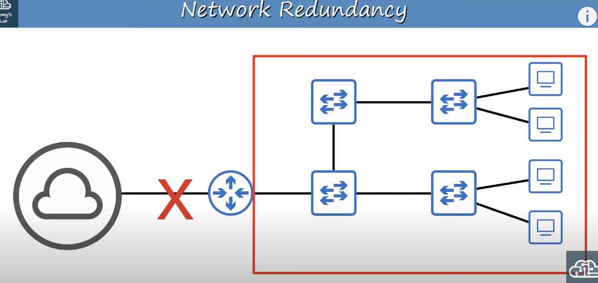
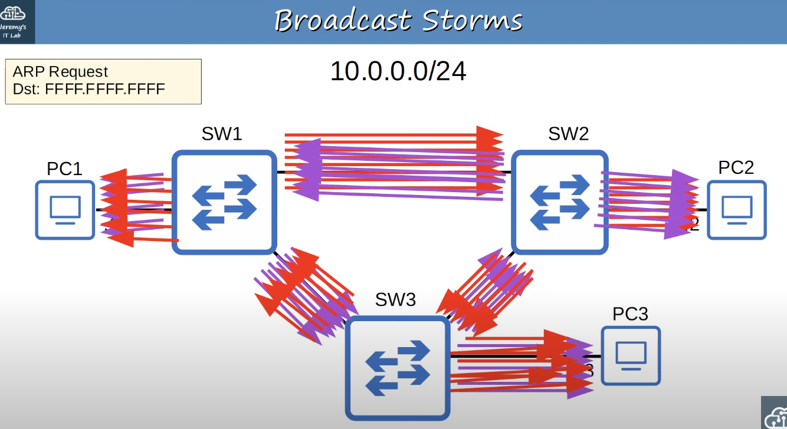
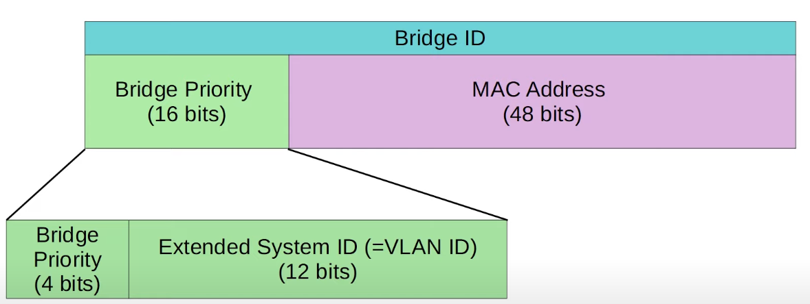

## Network Redundancy
* Redundancy is an essential part of network design.
* Modern networks are expected to run 24/7 365 days a year. Even a short downtime can be disastrous for a business.
* If one network component fails, you must ensure that other components will take over with little to no downtime.
* As much as possible, you must implement redundancy at every possible point in the network.

#### Network Without Redundancy

* If a failure occurs at the 'x' and the connection is lost, all hosts in the LAN lose connectivity to the internet.

#### Network With Redundancy

* Hosts in this network can take multiple paths to reach other hosts in the  LAN and to get to the internet (outside the LAN).
* The availability of multiple pathways creates network redundancy for when connections fail.

## Broadcast Storms
The image below shows what would happen when PC1 tried to communicate with PC2 and PC1 didn't know the destination's MAC address.

* The Ethernet header doesn't have a TTL field. Broadcast frames will loop around switches in the network indefinitely. If enough of these looped broadcasts accumulate in the network, the network will be too congested for legitimate traffic to use the network. This is called a **broadcast storm**.
* Spanning Tree Protocol (STP) is a Layer 2 protocol that is used to prevent infinite loops in a LAN, just like Time to Live (TTL) is used to prevent loops at Layer 3.
* Network congestion isn't the only problem. Each time a frame arrives on a switchport, the switch uses the source MAC address field to learn the MAC address and update its MAC address table.When frames with the same source MAC address repeatedly arrive on different interfaces, the switch is continuously updating the interface in its MAC address table. This is known as **MAC Address Flapping**.
## Spanning Tree Protocol (STP)
* This section will cover **Classic Spanning Tree protocol** which is defined in IEEE 803.1D.
* Switches from all vendors run STP by default because it is very important to prevent Layer 2 loops.
* STP prevents Layer 2 loops by placing redundant ports in a blocking state, essentially disabling the interface. These interfaces act as backups that can enter a forwarding state if an active (currently forwarding) interface fails.
* Interfaces in a forwarding state behave normally. They send and receive all normal traffic.
* Interfaces in a blocking state only send or receive STP messages (called BPDUs = Bridge Protocol Date Units).
	* STP still uses the term 'bridge'. However, when we use the term 'bridge', we really mean 'switch'. Bridges are not in use in modern networks.

#### How Does STP Works
* By selecting which ports are **forwarding** and which ports are **blocking**, STP creates a single path to/from each point in the network. This prevents Layer 2 loops.
* There is a set process that STP uses to determine which ports should be forwarding and which should be blocking.
* STP-enabled switches send/receive Hello BPDUs out of all interfaces. The default timer is 2 seconds (the switch will send a Hello BPDU out of every interface once every 2 seconds.)
* If a switch receives a Hello BPDU on an interface, it knows that the interface is connected to another switch (routers, PCs, etc. do not use STP, so they do not send Hello BPDUs).

* Switches use one field in the STP BPDU, the **Bridge ID** field, to elect a **root bridge** for the network.
* The switch with the lowest **Bridge ID** becomes the **root bridge**.
* All ports on the **root bridge** are put in a forwarding state, and other switches in the topology must have a path to reach the root bridge.

* SW1 is selected as the root bridge since all switches have the same bridge priority and it has the lowest MAC address.
##### Old Bridge ID Format

* The Bridge Priority is compared first. If they tie, the MAC address is then compared.`
* The default bridge priority is 32768 on all switches, so by default the MAC address is used as the tie-breaker (lowest MAC address value becomes the root bridge).
##### New Bridge ID Format

* Cisco switches use a version of STP called **PVST** (Per-VLAN Spanning Tree). PVST runs a separate STP instance in each VLAN. Therefore, in each VLAN different interfaces can be forwarding/blocking.

