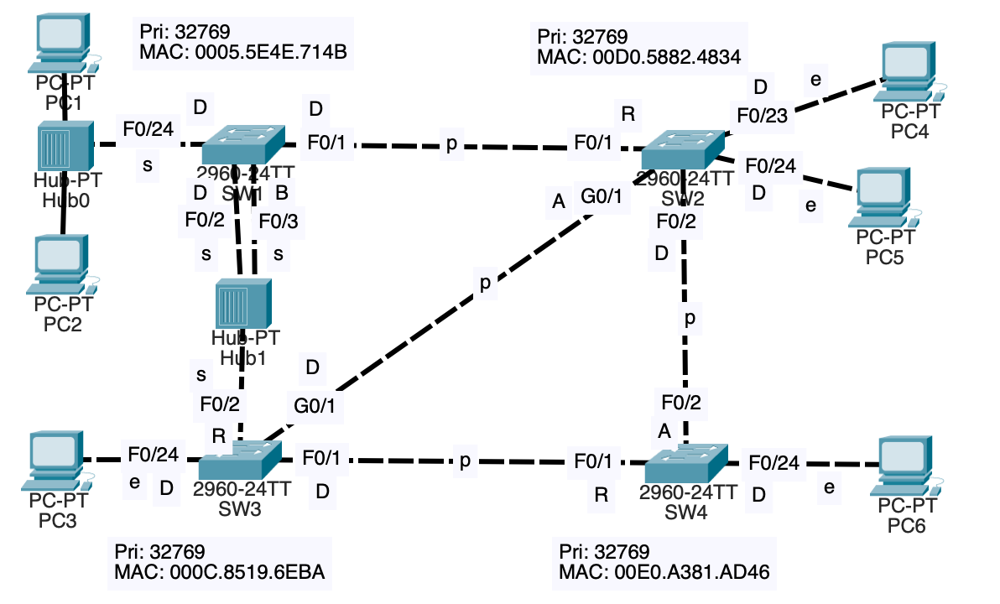

* Classic Spanning Tree can be quite slow, taking up to 50 seconds for the network to converge after a change in the topology.
* RSTP improves the time, only taking a few seconds to respond to changes in the network.
* RSTP is the default on most devices now because it is faster than classic STP.
* The CCNA exam topics only mention RSTP.
## Comparison of STP Versions (Standard vs Cisco)

* MSTP (802.1s) is superior to Cisco's Rapid PVST.
	* MSTP is much easier to configure and manage.
		* PVST+/RPVST+ require you to configure primary and secondary root bridges in each VLAN.
		* MSTP (802.1s) lets you group multiple VLANS into different STP instances. As a result, you only need to configure the primary and secondary root bridges for the STP instances being used.
	* Cisco advices to simply run the industry standard MSTP (802.1s) if there is the need for it because Cisco does not have a proprietary version of it.
	* For large networks, it's best to use MSTP. However, for small to medium networks without a huge number of VLANs, Cisco's RSTP+ is what you'll probably run on your switches.
## Rapid PVST+
RSTP is not a timer-based spanning tree algorithm like 802.1D. Therefore, RSTP offers an improvement over the 30 seconds or more that 802.1D takes to move a link to forwarding. The heart of the protocol is a new bridge-bridge handshake mechanism, which allows ports to move directly to forwarding.
### Compatibility
* Rapid STP is compatible with Classic STP. The interface(s) on the Rapid STP-enabled switch connected to the Classic STP-enabled switch will operate in Classic STP mode (timers, blocking -> listening -> learning -> forwarding process, etc...).
### Optional STP Features Implemented Into RSTP/Rapid PVST+
* These optional features are not in the exam topics, but it's good to be aware of them.
* These features are Optional in classic STP. They must be configured to operate on the switch (not necessary for the CCNA).
* These features are built into RSTP and operate by default, therefore they do not have to be configured.
* The purpose of these features is to help blocking/discarding ports move rapidly to forwarding.
#### PortFast
Allows a port to move immediately to the Forwarding state, bypassing Listening and Learning. It must be used only on ports connected to end hosts and not switches, which will cause Layer 2 loops.
#### UplinkFast
* It is a Cisco-proprietary optional STP feature that speeds up a switch's recovery from a direct link failure on its uplink (path) to the Root Bridge.
	* The uplink to the Root Bridge on a switch is the link connected to its Root port.
	* A **direct link failure** is a failure on one of the switch's directly connected links.
* UplinkFast essentially allows a switch to transition a Non-Designated port to be a Root port in the Forwarding state after a direct link failure affects the current Root port.
* It should only be enabled on the required switches
	* It is meant for switches that have at least one Non-Designated port.
	* `SW(config)# spanning-tree uplinkfast`
	* Enabling UplinkFast sets the Bridge priority to 49152 + *extended system ID* to ensure the switch does not become the root bridge, which would defeat the purpose of UplinkFast.
#### BackboneFast
* It is a cisco-proprietary optional STP feature that speeds up a switch's recovery from an indirect failure
	* An **Indirect link failure** is a failure on a link that isn't directly connected to the switch. Therefore, a switch can't detect the failure.
* It allows a switch to skip the Max-Age timer and immediately put a Non-Designated port into the Listening state (Designated role) after receiving an inferior BPDU from a neighbor. The port will transition through the states until it reaches the forwarding state.
* It should be enabled on all switches in the LAN or it will not work.
	* `SW(config)# spanning-tree backbonefast` 
	

* A failure on the SW1-SW2 link is an indirect link failure from SW3's perspective.
* Lets assume SW2's root port is cut off, so it stops receiving BPDUs from the root bridge (SW1). It will then assume it is the root bridge, so it will send it's own BPDUs to SW3.
* SW3 is now receiving BPDUs from both SW1 and SW2, but SW2's  BPDU are inferior - they have a higher bridge ID. Without the BackboneFast functionality, SW3 would just ignore these BPDUs from SW2 until its non-designated port, in classic STP, finally changes to a forwarding state and forwards the superior BPDUs from SW1 to SW2. SW2 then accepts SW1 as the Root bridge again.

* When SW3 receives SW2's BPDU messages from SW2 claiming to be the root bridge, it will send  a **RLQ Request** to the switch it thinks it is the Root Bridge to verify it is still the Root Bridge. 
* SW1 confirms that it is still the Root Bridge by sending an **RLQ Response** to SW3.
* SW3 confirms that SW1 is still the Root Bridge so it expires its Max-Age timer on the interface connected to SW2 to transition to a Designated port and send SW2 the superior BPDU from SW1.
* SW2 accepts SW1 as the Root Bridge and STP finally converges again.
* `SW3# show spanning-tree backbonefast`
### STP and RSTP Similarities
* RSTP serves the same purpose as STP, blocking specific ports to prevent Layer 2 loops.
* RSTP elects a root bridge with the same rules as STP.
* RSTP elects root ports with the same rules as STP.
* RSTP elects designated ports with the same rules as STP.
### STP and RSTP Differences
#### BPDUs
* In classic STP, only the root bridge creates BPDUs and the other switches just forward the BPDUs they receive. However, in Raping STP, all switches create and send their own BPDUs from their designated ports.
* In classic STP, a switch interface waits 10 Hello intervals (20 seconds) before making changes to the STP topology. In rapid STP, a switch considers a neighbor lost if it misses 3 BPDUs (6 seconds). It will then flush (clear) all MAC addresses learned on that interface.
#### RSTP Interfaces Speed Outgoing Cost

#### RSTP Port States

* The listening state is gone.
* The Blocking and disabled states have become the Discarding state.
	* If a port is administratively disabled (`shutdown` command) = discarding state.
	* If a port is enabled but blocking traffic to prevent Layer 2 loops = discarding state.
#### RSTP Port Roles
* The **root port** role selection remains in RSTP.
	* The root bridge is the only switch that doesn't have a root port.
* The **designated role** selection remains unchanged in RSTP.
	* Only one per segment (collision domain).
* Redundant link role changes in RSTP:
	* An **Alternate port** role is a discarding port that is decided with the same logic as non-designated (blocking state) ports in classic STP.
		* ==Function as a backup to the root port. If the root port fails, the switch can immediately move its best alternate port to forwarding==.
	* A **Backup port** role is a discarding port that receives a superior BPDU from *another interface on the same switch*.
		* ==Function as a backup for a designated port==. 
		* The switch chooses the interface with the lowest port ID to be its designated port, and the other will be the backup port.
		* This only happens when two interfaces are connected to the same collision domain (via a hub). Hubs are not used in modern networks, so you will probably not encounter an RSTP backup port.
#### RSTP vs RSTP BPDU

* Protocol Version Identifier:
	* Classic STP has a version of 0.
	* RSTP has a version of 2.
* BPDU Type: 0x02 for RSTP and 0x00 for classic STP.
* BPDU Flags:
	* Classic STP uses only 2 of the eight bits - the first and last one.
	* RSTP uses all 8 bits and they are used in the negotiation process that allows RSTP to converge much faster than Classic STP.
### RSTP Example 1
Identify the root bridge and the RSTP port role of each switch interface in the following network.

### RSTP Link Types

#### Edge Link Type
* Edge ports are connected to end hosts.
* There is no risk of creating loops when connected to end hosts, therefore they can move straight to the forwarding state without the negotiation process.
* They function like a Classic STP port with PortFast enabled. The PortFast functionality is built into RSTP by default.
* You configure an edge port by enabling PortFast on the interface.
	* `SW1(config-if)#spanning-tree portfast`
#### Point-to-Point Link Type
* Point-to-point ports connect directly to another switch. 
* They function in full-duplex.
* A connection from a switch interface to an end host can also be considered point-to-point if the end host is using full-duplex.
* It's not necessary to configure the interface as point-to-point (it should be detected).
	* Manual configuration: `SW1(config-if)#spanning-tree link-type point-to-point`
#### Shared Link Type
* Shared ports connect to another switch (or switches) via a hub.
* A shared port could also connect to a hub that forwards frames to end hosts. In this case, the switch port/interface can be considered both, a shared port and an edge port if PortFast is enabled.
* They function in half-duplex.
* It's not necessary to configure the interfaces as shared (it should be detected).
	* Manual configuration: `SW1(config-if)#spanning-tree link-type shared`
### RSTP Example 2

### RSTP Example 3

* **Root Bridge**: SW1
	* The root bridge has two interfaces connected to the same collision domain (F0/2,F0/3). However, only one designated port can exist per collision domain. Therefore, interface F0/2 is chosen as the Designated port and F0/3 as the Backup port.
* Edge ports (edge link type) connected to end hosts as shown above, will also be p2p ports if they are using full-duplex. 
	* p2p means full duplex is enabled.
	* Edge means PortFast is enabled.
	* On a real switch, the link type wold be shown as both edge and p2p in the switch's console.
* SW1's F0/24 interface is connected to a Hub, but there are PCs connected to the hub. Therefore, it is an edge port. The hub basically doesn't exist in terms of Spanning Tree. It's different than if it were connected to a switch here.
	* F0/24 is both, an edge port with PortFast enabled and a shared port.
### RSTP Example 4

