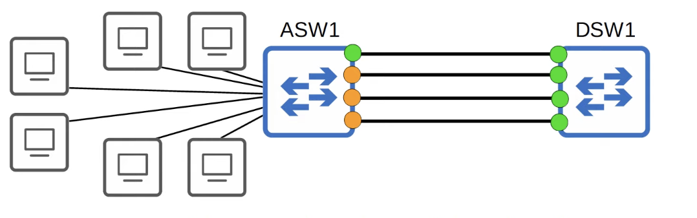
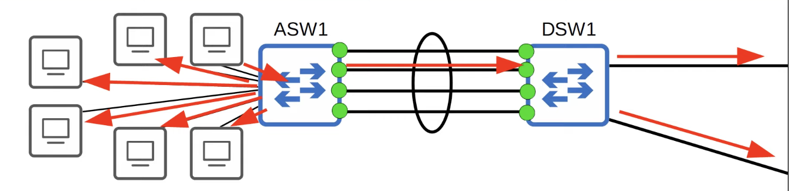
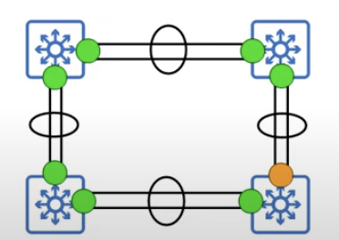
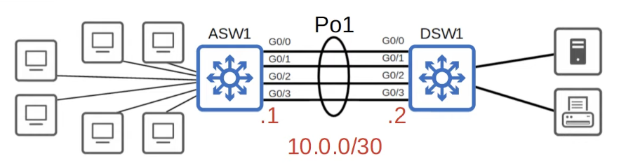

## Why is EtherChannel Needed?
* **Access Layer Switch**: A switch that end hots connect to.
* **Distribution Layer Switch**: A switch that access layer switches connect to.
* **Oversubscription**: The bandwidth of the interfaces connected to end hosts is greater than the bandwidth of the connection to the distribution switch(es). Some oversubscription is acceptable, but too much will cause congestion.


Let's say there are many end hosts connected to an access switch(ASW1) and they are all trying to access the internet to do their work. The network administrator notices that the connection to the distribution switch(DSW1) is congested, so he decides to add another link to increase the bandwidth and be able to support all the end hosts. The total bandwidth of the connections to the end hosts is still greater than the bandwidth of the connection to DSW1, but that's okay because not all hosts in the network are always in a constant state of sending and receiving internet traffic. However, despite the addition of multiple links between ASW1 and DSW1, the connection between the two switches is just as congested as it was with a single link.
* If you connect two switches together with multiple links, all except one will be disabled by Spanning Tree to prevent Layer 2 loops that can lead to broadcast storms.
* Other links will be unused unless the active link fails. In that case, on of the inactive links will start forwarding.
## EtherChannel
* **EtherChannel** allows you to group multiple physical interfaces into a group which operates as a single logical interface.
* STP will treat this group as a single interface, therefore none of theme will be disabled.
* Traffic in the EtherChannel will be load balanced among the physical interfaces in the group. As a result, the bandwidth of all the interfaces in the EtherChannel can be taken advantage. It's as if the interfaces in the EtherChannel are combine to form a faster virtual interface.

As shown above, when a PC sends a broadcast frame, ASW1 will send it out all interfaces except the one where it came in. However, the 4 links between ASW1 and DSW1 form a single virtual interface, therefore 1 instead of 4 frames are sent to DSW1. DSW1 also sees all four interfaces as a single virtual interface through which it received the broadcast frame, therefore it cannot send the frame back to ASW1. It can only send it out its interfaces on the right.
## EtherChannel Load-Balancing
* EtherChannel perform load balancing by using different physical interfaces in the EtherChannel for different flows.
* A flow is a communication between two nodes in the network.
* Frames in the same flow will be forwarded using the same physical interface. If frames in the same flow were forwarded using different physical interfaces, some frames may arrive at the destination out of order, which can cause problems.
	* Some applications can deal with frames arriving out of order, but some can't.
* It is possible to change the inputs used in the interface selection calculation.
* Inputs that can be used include:
	* Source MAC: All frames with the same source MAC address will always use the same interface in the EtherChannel.
	* Destination MAC: All frames with the same destination MAC address will always use the same interface in the EtherChannel.
	* Source & Destination MAC
	* Source IP
	* Destination IP
	* Source and Destination IP
* The load balance options available depend on the switch model being used.
### Show EtherChannel Load-Balancing Configuration
```
Switch#show etherchanne l load-balance
EtherChannel Load-Balancing Configuration:
src-mac

EtherChannel Load-Balancing Addresses Used Per-Protocol:
Non-IP: Source MAC address
IPv4: Source MAC address
IPv6: Source MAC address
```
### Configure EtherChannel Load Balance Options
```
Switch(config)#port-channel load-balance ?
dst-ip Dst IP Addr
dst-mac Dst Mac Addr
src-dst-ip Src XOR Dst IP Addr
src-dst-mac Src XOR Dst Mac Addr
src-ip Src IP Addr
src-mac Src Mac Addr
```
## EtherChannel Configuration Methods
* There are 3 methods of EtherChannel configuration on Cisco Switches.
	* PAgP (Port Aggregation Protocol)
		* Cisco proprietary protocol
		* Dynamically negotiates the creation/maintenance of the EtherChannel (like DTP does for trunks).
	* LACP (Link Aggregation Control Protocol)
		* Industry standard protocol (IEEE 802.3ad)
		* Dynamically negotiates the creation/maintenance of the EtherChannel (like DTP does for trunks).
		* It can be used to form EtherChannels with switches from other vendors. Because of this, LACP is the preferred method of configuring EtherChannels.
	* Static EtherChannel
		* A protocol isn't used to determine if an EtherChannel should be formed.
		* Interfaces are statically configured to form an EtherChannel.
		* This is usually avoided because you want the switches to dynamically maintain the EtherChannel.
			* For example, you want the switch to remove an interface from the EtherChannel if there is a problem with it.
* Up to 8 interfaces can be formed into a single EtherChannel (LACP allows up to 16, but only 8 will be active. The other 8 will be on standby mode, waiting for an active interface to fail).
### PAgP Configuration
```
Switch(config-if-range)#channel-group 1 mode ?
active    Enable LACP unconditionally
auto      Enable PAgP only if a PAgP device is detected
desirable Enable PAgP unconditionally
on        Enable Etherchannel only
passive   Enable LACP only if a LACP device is detected

Switch(config-if-range)#channel-group 1 mode desirable
Creating a port-channel interface Port-channel 1

Switch#show ip interface brief
Interface       IP-Address OK? Method Status Protocol
Port-channel1   unassigned YES manual up     up
FastEthernet0/1 unassigned YES manual up     up
FastEthernet0/2 unassigned YES manual up     up
```
* *auto* and *desirable* are the options for creating a PAgP EtherChannel.
	* auto + auto = no EtherChannel
	* desirable + auto = EtherChannel
	* desirable + desirable = EtherChannel
* When both sides are configured as auto, the virtual interface will be created on each switch. However, it won't actually be functioning as an EtherChannel.
* The channel-group number has to match for all interfaces that form part of the same EtherChannel on the local switch. However, it doesn't have to match the channel-group number on the other switch (channel-group 1 on ASW1 can form an EtherChannel with channel-group 2 on DSW1).
* A single switch can have multiple EtherChannels, therefore the channel-group number is needed to identify them.
### LACP Configuration
```
Switch(config-if-range)#channel-group 1 mode ?
active    Enable LACP unconditionally
auto      Enable PAgP only if a PAgP device is detected
desirable Enable PAgP unconditionally
on        Enable Etherchannel only
passive   Enable LACP only if a LACP device is detected
```
* *active* and *passive* are the options for creating a LACP EtherChannel.
	* passive + passive = no EtherChannel
	* active + passive = EtherChannel
	* Active + active = EtherChannel
* When both sides are configured as passive, the virtual interface will be created on each switch. However, it won't actually be functioning as an EtherChannel.
### Static EtherChannel
```
Switch(config-if-range)#channel-group 1 mode ?
active    Enable LACP unconditionally
auto      Enable PAgP only if a PAgP device is detected
desirable Enable PAgP unconditionally
on        Enable Etherchannel only
passive   Enable LACP only if a LACP device is detected
```
* *on* mode only works with *on* mode (*on* + *desirable* or *on* + *active* will not work).
### Manually Configure the Negotiation Protocol
```
Switch(config-if-range)#channel-protocol ?
lacp Prepare interface for LACP protocol
pagp Prepare interface for PAgP protocol

Switch(config-if-range)#channel-protocol lacp

Switch(config-if-range)#channel-group 1 mode desirable
Command rejected (the interface Fa0/3 is ): is already part of a channel with a different type of protocol enabled
Command rejected (the interface Fa0/4 is ): is already part of a channel with a different type of protocol enabled
Command rejected (the interface Fa0/5 is ): is already part of a channel with a different type of protocol enabled

Switch(config-if-range)#channel-group 1 mode on
Command rejected (the interface Fa0/3 is ): is already part of a channel with a different type of protocol enabled
Command rejected (the interface Fa0/4 is ): is already part of a channel with a different type of protocol enabled
Command rejected (the interface Fa0/5 is ): is already part of a channel with a different type of protocol enabled

Switch(config-if-range)#channel-group 1 mode active
Switch(config-if-range)#
```
* The command manually configures the EtherChannel negotiation protocol that the member interfaces should use.
* This actually isn't a very useful command because you don't need to configure it.
	* If you configure `channel-group 1 mode desirable/auto` , the interface will automatically use PAgP. If you configure `channel-group 1 mode active/passive`, the interface will automatically use LACP.
### Port-Channel interface Configuration
After configuring the EtherChanel, in whatever mode, PAgP, LACP, or static, the port-channel virtual interface itself has to be configured.
```
Switch(config)#interface port-channel 1
\\ when ISL and dot1q are both supported by the switch
Switch(config-if)#switchport trunk encapsulation dot1q
Switch(config-if)#switchport mode trunk

Switch(config-if)#do show interfaces trunk
Port Mode Encapsulation Status   Native vlan
Po1  on   802.1q        trunking 1

Port Vlans allowed on trunk
Po1 1-1005

Port Vlans allowed and active in management domain
Po1 1

Port Vlans in spanning tree forwarding state and not pruned
Po1 1
```
* The individual physical interfaces aren't listed here, only the port-channel virtual interface. However, all changes made to the virtual port-channel interface will be propagated to all physical interfaces in it.
* The physical interfaces in the EtherChannel must have matching configurations.
	* Same duplex (full/half)
	* Same speed
	* Same switchport mode (access/trunk)
	* Same allowed VLANs/native VLAN (for trunk interfaces)
* If an interface's configurations do not match the others, it will be excluded from the EtherChannel.
### EtherChannel Verification
```
Switch#show etherchannel summary
Flags: D - down P - in port-channel
I - stand-alone s - suspended
H - Hot-standby (LACP only)
R - Layer3      S - Layer2
U - in use      f - failed to allocate aggregator
u - unsuitable for bundling
w - waiting to be aggregated
d - default port


Number of channel-groups in use: 1
Number of aggregators: 1

  

Group    Port-channel   Protocol  Ports
---------+-------------+---------+-------------------
1         Po1(SU)       PAgP      Fa0/1(P) Fa0/2(P)
```

```
Switch#show etherchannel port-channel
		Channel-group listing:
		----------------------
		
Group: 1
----------

		Port-channels in the group:
		---------------------------

Port-channel: Po1
------------

Age of the Port-channel = 00d:02h:33m:36s
Logical slot/port = 2/1 Number of ports = 2
GC = 0x00000000 HotStandBy port = null
Port state = Port-channel
Protocol = PAGP
Port Security = Disabled

Ports in the Port-channel:
Index Load    Port   EC state     No of bits
------+------+------+------------+-----------
0      00     Fa0/1  Desirable-Sl 0
0      00     Fa0/2  Desirable-Sl 0
Time since last port bundled: 00d:02h:33m:36s Fa0/2
```
* One important bit of information that you can't find in `show etherchannel summary`, but is displayed in `show etherchannel port-channel` is the channel-group mode.
	* In this case it is using *desirable*
* However, for EtherChannel, the most common command you're going to be using is definitely `show etherchannel summary`.
### EtherChannel Repercussions on STP
```
Switch#show spanning-tree
VLAN0001
Spanning tree enabled protocol ieee
Root ID Priority 32769
		Address 0001.977B.5044
		This bridge is the root
		Hello Time 2 sec Max Age 20 sec Forward Delay 15 sec

Bridge ID Priority 32769 (priority 32768 sys-id-ext 1)
		  Address 0001.977B.5044

		  Hello Time 2 sec Max Age 20 sec Forward Delay 15 sec
		  Aging Time 20

  
Interface        Role Sts Cost Prio.Nbr Type
---------------- ---- --- ---- -------- --------
Po1              Desg FWD 12   128.27    Shr
```
* When EtherChannel is configured, only the virtual port-channel interface is listed and not the physical interfaces.
* Spanning Tree is treating all physical interfaces in the port-channel (Po1) virtual interface as a single logical interface. As a result, none of these interfaces are blocked. They can all send and receive traffic without worrying about Layer 2 loops. 
## Layer 3 EtherChannel
Modern network designs often leans toward using Layer 3 connections between switches because that way Spanning Tree won't be an issue anywhere in the network.


Even if we are using EtherChannel, Layer 2 loops can still occur if multiple switches are connected together in a loop as shown in the above picture. Therefore Spanning Tree will block one of these *port-channel* interfaces.


However, if all of these connections between switches were made using routed ports instead of Layer 2 switchports, there would be no need to run Spanning Tree at all. Routed ports don't forward Layer 2 broadcasts, so no Layer 2 loops can be formed.
```
Switch(config)#interface range f0/1 -3
Switch(config-if-range)#no switchport
Switch(config-if-range)#channel-group 1 mode active
Creating a port-channel interface Port-channel 1

Switch(config-if-range)#interface p01
Switch(config-if)#ip address 10.0.0.1 255.255.255.252
Switch(config-if)#
```
## Commands
* Configure the EtherChannel load-balancing method on the switch
	* `SW(config)#port-channel load-balance <mode>`
* Display information about the load-balancing settings
	* `SW#show etherchannel load-balance`
* Configure an interface to be part of an EtherChannel
	* `SW(config-if)#channel-group <number> mode <desirable|auto|active|passive|on>`
* Display a summary of EtherChannels on the switch
	* `SW#show etherchannel summary`
* Display information about the virtual port-channel interfaces on the switch
	* `SW#show etherchannel port-channel`