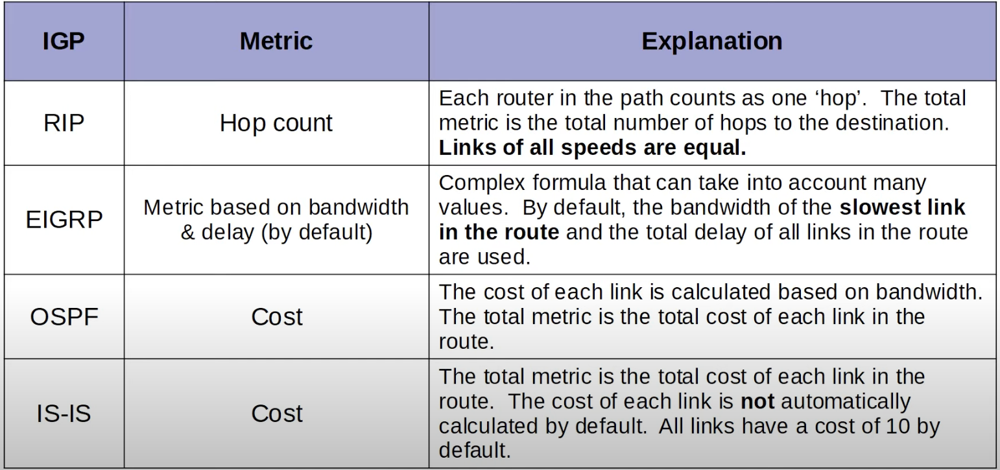

## Introduction to Dynamic Routing Protocols
* **Network Route**: A route to a network/subnet (mask length < /32).
* **Host Route**: A route to a specific host (/32 mask).
### Dynamic Routing
* Routers can use dynamic routing protocols to advertise information about the routes they know to other routers.
	* Static routes are useful, but they are not practical in large networks. You would have to configure thousands of different routes, which is not a good strategy.
* They form 'adjacencies' / 'neighbor relationships' / 'neighborships' with adjacent routers to exchange this information.
* If multiple routes to a destination are learned, the router determines which route is superior and adds it to the routing table. It uses the 'metric' of the route to decide which is superior (lower metric = superior).
## Types of Dynamic Routing Protocols
* Dynamic routing protocols can be divided into two main categories:
	* **IGP (Interior Gateway Protocol)**: Used to share routes within a single autonomous system (AS), which is a single organization (ie. a company).
	* **EGP (Exterior Gateway Protocol)**: Used to share routes between different autonomous systems.

* **EGP** is not needed for the CCNA. Just remember that it is used to share route information between autonomous systems and that **BGP** is the only **EGP** that is used in modern networks.
### Distance Vector Routing Protocols

* Distance vector protocols were invented before link state protocols.
* Early examples are **RIPv1** and Cisco's proprietary protocol **IGRP** (which was updated to **EIGRP**).
* Distance vector protocols operate by sending the following to their directly connected neighbors:
	* Their known destination networks.
	* Their metric to reach their known destination networks.
* This method of sharing route information is often called 'routing by rumor'. This is because the router doesn't know abut the networks beyond its neighbors. It only knows the information that its neighbors tell it.
* It's called 'distance vector' because the routers only learn the 'distance' (metric) and 'vector' (direction, the next-hop router) of each route.
### Link State Routing Protocols
* When using a **link state** routing protocol, every router creates a 'connectivity map' of the network.
* To allow this, each router advertises information about its interfaces (connected networks) to its neighbors. These advertisements are passed along to other routers, until all routers in the network develop the same map of the network.
* Each router independently uses this map to calculate the best routes to each destination.
* Link state protocols use more resources (CPU, Memory) on the router because more information is shared. However, link state protocols tend to be faster in reacting to changes in the network than distance vector protocols.
## Dynamic Routing Protocol Metrics
* A router's route table contains the best route to each destination network it knows about.
* If a router using a dynamic routing protocol learns two different routes to the same destination, how does it determine which is 'best' ? It uses the **metric** value of the routes to determine which is best. A lower metric = better.
* Each routing protocol uses a different metric to determine which route is the best.

* Above, R1 learns two paths to `192.168.4.0/24` - one through R2 and the other through R3. However, only the route via R2 is added to the routing table. This is because the FastEthernet connection through R3 has a higher metric cost than the other Gigabit  connections through R2.
### ECMP with Dynamic Routing Protocol

* The routes were dynamically learned using the OSPF protocol as indicated in the picture.
* **ECMP (Equal Cost Multi-Path)**: If a router learns two (or more) routes via the same routing protocol to the same destination (same network address, same subnet mask) with the same metric, all routes will be added to the routing table. Traffic will be load-balanced over all the routes that formed the tie.
	* The first value of the square bracket is the administrative distance([110/]).
	* The second value of the square brackets is the metric ([/3]).
### ECMP with Static Routes

* It's possible to have ECMP (Equal Cost Multi-Path) with static routes as well.
* As shown above, there is a tie in the metric number for the two configured routes to the same destination network. Therefore, the traffic will be load balanced between them.
	* Static routes don't really use the concept of metric so there will always be the same value, resulting in ties for multiple static routes to the same destination network.
### IGP (Interior Gateway Protocol) Metrics


The example below demonstrates the differences between the RIP and OSPF dynamic routing protocols.

* Using **RIP**, R1 will add both routes to its routing table - the route through R2 and the one through R3. This is because both routes take 2 hops to get to the destination network.
* Using **OSPF**, R1 will only add the route through R2 to its routing table because it has a lower total metric than the route through R3.
## Administrative Distance
* In most cases a company will only use a single IGP - usually OSPF or EIGRP.
* However, in some rare cases they might use two. For example, if two companies connect their networks to share information, two different routing protocols might be in use.
* Metric is used to compare routes learned via the same routing protocol. Different routing protocols use totally different metrics, so they cannot be compared.
* For example, an OSPF route to 192.168.4.0/24 might have a metric of 30, while an EIGRP route to the same destination might have a metric of 33280. Which route is better? Which route should the router put in the route table?
* The **administrative distance (AD)** is used to determine which routing protocol is preferred. A lower AD is preferred and indicates that the routing protocol is considered more trustworthy (more likely to select good routes).
	* The AD of a routing protocol and static route can be changed.
```
Router(config)#ip route 10.0.0.0 255.0.0.0 10.0.13.2 ?
<1-255> Distance metric for this route
```
* Above, the 'Distance metric for this route' refers to the administrative distance (AD) and not the metric.
### Administrative Distance (AD) Chart
The numbers below are the values used on Cisco devices. Other vendors might rank them differently.

| Route Source                                       | Default AD |
| -------------------------------------------------- | ---------- |
| Directly Connected interface                       | 0          |
| Static route                                       | 1          |
| External Border Gateway Protocol (eBGP)            | 20         |
| Internal EIGRP                                     | 90         |
| IGRP                                               | 100        |
| OSPF                                               | 110        |
| Intermediate System-to-Intermediate System (IS-IS) | 115        |
| Routing Information Protocol (RIP)                 | 120        |
| External EIGRP                                     | 170        |
| Internal BGP                                       | 200        |
| Unstable Route (Unknown)                           | 255        |
* **Unstable route**: If the administrative distance is 255, the router does not believe the source of that route and does not install the route in the routing table.
### Floating Static Routes
* By changing the AD of a static route, you can make it less preferred than routes learned by a dynamic routing protocol to the same destination (make sure the static route's AD is higher than the routing protocol's AD).
* The route will be inactive (not in the routing table) unless the route learned by the dynamic routing protocol is removed(for example, the remote router stops advertising it for some reason, or an interface failure causes an adjacency with a neighbor to be lost).