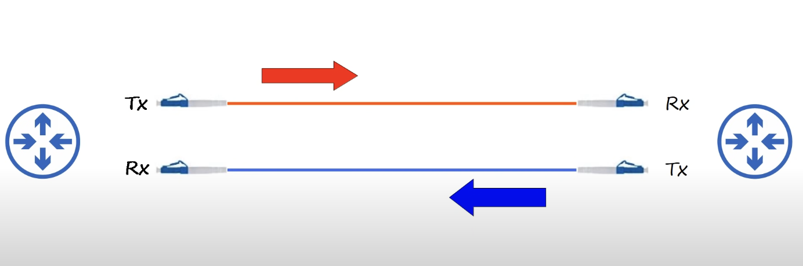

## RJ-45 (RJ = Registered Jack)
The RJ-45 connector is used at the end of a copper ethernet cable.

## Network Speed
Speed is measured in bits per second (Kbps, Mbps, Gbps, etc), not bytes per second. Data reaches destination device one bit at a time.
* 1 kilobit (Kb) = 1 thousand bits
* 1 megabit (Mb) = 1 million bits
* 1 gigabit (Gb) = 1 billion bits
* 1 terabit (Tb) = 1 trillion bits

## Ethernet
Ethernet is a collection of network protocols/standards. Network protocols specify a common language for multiple devices to communicate with each other.

#### Ethernet Standards
* Ethernet standards are defined in the IEEE 802.3 standard in 1983.
* IEEE = Institute of Electrical and Electronics Engineers.

* BASE = baseband signaling
* T = twisted pair

## UTP Cables
UTP stands for unshielded twisted pair. This type of cable is vulnerable to electromagnetic interference (EMI) because it has no shielding.  The twist actually helps protect agains EMI.
* **Speeds of 100 Mbps or less only require 2 pairs (4 wires)**.
* **Speeds Greater than 100 Mbps require 4 pairs (8 wires)**.

#### Full Duplex Connection
Full-Duplex allows devices to send and receive data at the same time without problems like collisions. This is due to the fact that they use separate cables to transmit and receive data.

#### Straight-through Connection
Straight-through cable connect to the same pins on both ends of the connection between two devices. This type of cable is used for communication between two devices that transmit and receive data on different pins.

#### Crossover Cable Connection 
Crossover cable is used for communication between two devices that send and receive data on the same pins.

#### UTP Cable Transmit-Receive Relation

#### UTP Four Wire Pairs
**Speeds greater than 100BASE-T require all 8 wires be used**. Higher speeds are supported due to the fact that each pair is bidirectional rather than each pair sending data in a single direction.

## Auto MDI-X
Most modern networking devices have evolved beyond having to worry about straight-through and crossover cables. Auto MDI-X allows networking devices to automatically pick which pins will be used for transmitting and receiving data based on the pins being used by the neighbor connected device.

## Fiber-Optic Connections

#### Structure of Fiber Cable

#### Multimode Fiber
* Core diameter is wider than single-mode fiber.
* Allows multiple angles (modes) of light waves to enter the fiberglass core.
* Allows longer cables than UTP, but shorter cables than single-mode fiber.
* Cheaper than single-mode fiber (due to cheaper LED-based SFP transmitters).
#### Single-mode
* Core diameter is narrower than multimode fiber.
* Light enters at a single (mode) from a laser-based transmitter.
* Allows longer cables than both UTP and multimode fiber.
* More expensive than multimode fiber (due to more expensive laser-based SFP transmitters).

#### Transmit and Receive Data
Fiber-optic cables send light over glass fibers rather than electrical signals over copper wires. One cable is two wires, each with its own connector. One is used for sending data and the other is used for receiving data.

#### SFP (Small Form-Factor Pluggable)
Connector at the end of a fiber-optic cable that is plugged into networking device.

#### Fiber-Optic Cable Standards

## UTP VS Fiber-Optic Cabling
