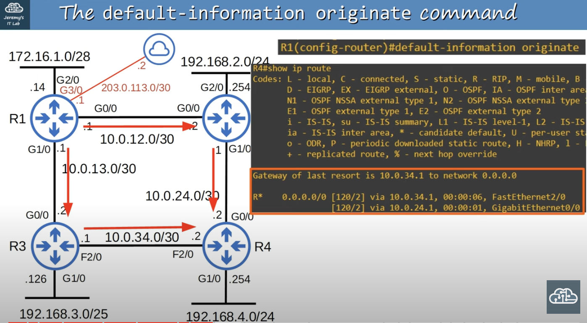

## Routing Information Protocol (RIP)
* It's an industry standard protocol.
* Distance vector IGP (uses routing-by-rumor logic to learn/share routes).
* Uses hop count as its metric. One router = one hop (bandwidth is irrelevant).
* The maximum hop count is 15 (anything more than that is considered unreachable).
* RIP is almost never used in real networks, but it can possibly be used in small networks and lab environments.
* There is 3 versions:
	* **RIPv1** and **RIPv2** is used for IPv4.
	* **RIPng** (RIP Next Generation) used for IPv6 (Not needed for CCNA).
* Uses two message types:
	* **Request**: To ask RIP-enabled neighbor routers to send their routing table.
	* **Response**: To send the local router's routing table to neighboring routers.
* By default, RIP-enabled routers will share their routing table every 30 seconds.
	* This can cause problems in networks with lots of routers, as these regular updates can clog up the network.
### RIPv1
* Only advertises classful addresses (Class A, Class B, Class C). However, classful addresses are no longer used in modern networks. Don't use this version if you are going to use RIP.
* Doesn't support VLSM and CIDR.
* Doesn't include subnet mast information in advertisements (Response messages).
	* 10.1.1.0/24 will become 10.0.0.0 (Class A address, so assumed to be /8).
	* 172.16.192.0/18 will become 172.16.0.0 (Class B address, so assumed to be /16).
	* 192.168.1.4/30 will become 192.168.1.0 (Class C address, so assumed to be /24).
* Messages are broadcast to 255.255.255.255
### RIPv2
* Supports VLSM and CIDIR.
* Use this version if you are going to use RIP.
* Includes subnet mast information in advertisements (Response messages).
* Messages are **multicast** to 224.0.0.9.
	* **Broadcast**: Messages are delivered to all devices on the local network.
	* **Multicast**: Messages are delivered only to devices that have joined that specific multicast group.
### RIP Configuration
* RIP configuration is not on the CCNA. It is really simple to do and will serve as a good introduction to dynamic routing.
```
R1(config)#router rip
R1(config-router)#version 2
R1(config-router)#no auto-summary
R1(config-router)#network 10.0.0.0
R1(config-router)#network 172.16.0.0
```
* `R1(config-router)#no auto-summary` disables auto-summary, which is on by default. Auto-summary automatically converts the networks the router advertises to classful networks.
	* For example, the 172.16.1.0/28 network attached to R1 is a class B network. Therefore, it would be advertised as 172.16.0.0/16.
#### Network Command
* The `network` command tells the router which interfaces to activate RIP on, and then the router will advertise the network prefix of those interfaces with its RIP neighbors.
* The RIP `network` command is classful. It will automatically convert to classful networks.
	* For example, the command, `network 10.0.12.0` will be converted to `network 10.0.0.0` (a class A network). This is because the provided IP falls in the class A IP range. Because of this behavior, there is no need to enter a network mask.
* The `network` command tells the router to:
	* look for interfaces with an IP address that is in the specified range and activate RIP on them.
		* Routers send RIP advertisements out of their RIP enabled interfaces.
		* An interface enabled as RIP that is not connected to a RIP neighbor should be configured as **passive** to prevent unnecessary traffic.
	* Form adjacencies with connected RIP neighbors.
	* Advertise the network prefix of RIP enabled interfaces (NOT the prefix in the network command.) with its RIP neighbors.
* The OSPF and EIGRP `network` command operate in the same way.

`R1(config-router)#network 10.0.0.0`


`R1(config-router)#network 172.16.0.0`
* Because the `network` command is classful, 172.16.0.0 is assumed to be 172.16.0.0/16.
* R1 will look for any interfaces with an IP address that matches 172.16.0.0/16.
* 172.16.1.14 matches, therefore R1 will activate RIP on G2/0.
* There are no RIP neighbors connected to G2/0, therefore no new adjacencies are formed.
* R1 advertises 172.16.1.0/28 (NOT 172.16.0.0/16) to its RIP neighbors (R2, R3 in this case).
* Although there are no RIP neighbors connected to G2/0, R1 will continuously send RIP advertisements out of G2/0. This is unnecessary traffic, so G2/0 should be configured as a **passive interface**.
	* `R1(config-router)#passive-interface g2/0`
* EIGRP and OSPF both have the same passive interface functionality, using the same command.
#### Advertise a default Route into RIP
* R1 has been configured with a default gateway/route (203.0.113.0/30). RIP is then used to tell R2, R3, and R4 (in this case) about the default route so that they can reach the internet.
	* R1 will advertise the route to R2 and R3. They will then advertise it to R4.

R4 after receiving default route from both, R3 and R2.

* R4 has two ways to get to the default route. Through F2/0 and G0/0. Only one of them is listed as the gateway of last resort. However, because both routes have the same hop-count, R4 will load-balance traffic over the two routes.
	* RIP uses hop count as its metric and they both make 2 hops. There is a tie between the two routes, therefore the traffic will be load balanced
#### Show IP Protocols
`R1#show ip protocols`
* This command can be used for RIP, EIGRP, and OSPF to check various statistics.
	* Routing protocol being used.
	* Version of the routing protocol being used.
	* status on whether `sumarization` is being used.
	* **Maximum path**: Refers to ECMP (Equal Cost Multi-path) load balancing. By default, RIP will insert up to 4 paths to the same destination into the routing table if they have the same metric.
		* It can be changed: `R1(config-router)#maximum-paths <1-32>`.
		* It's the same command for EIGRP and OSPF.
	* **Routing for networks**: Shows the networks entered using the `network` command.
	* **Passive Interface(s)**: Lists interfaces set as passive.
	* **Routing Information Sources**: Displays the router's RIP neighbors.
	* **Distance**: The administrative distance of RIP.
		* AD can be changed with: `R1(config-router)#distance <1-255>`.
## Enhanced Interior Gateway Routing Protocol (EIGRP)
* It is an improved version of the older IGRP, Interior Gateway Routing Protocol.
* Was Cisco proprietary, but Cisco has now published it openly so other vendors can implement it on their equipment.
* Considered an 'advanced' / 'hybrid' distance vector routing protocol.
* Much faster than RIP in reacting to changes in the network.
* Does not have the 15 'hop-count' limit of RIP.
* Sends messages using multicast addresses 224.0.0.10.
* It  Is the only IGP that can perform **unequal**-cost  load-balancing (by default it perform ECMP (Equal Cost Multi-path) load-balancing over 4 paths like RIP).
* EIGRP is a great protocol, but because its use is mostly limited to Cisco devices, it's not used nearly as much as OSPF is.
### Wildcard Masks
* A wildcard mask is basically an 'inverted' subnet mask.
* All 1s in the subnet mask are 0 in the equivalent wildcard mask. All 0s in the subnet mask are 1s in the equivalent wildcard mask.
	* /28 subnet mask -> 255.255.255.240
	* /28 wildcard mask -> 0.0.0.15
* A shortcut is to subtract each octet of the subnet mask from 255.


#### Example
R1's G1/0 interface has an IP address of 172.20.20.17 and its G2/0 interface has an IP address of 172.26.20.12. Which of the following `network` commands will activate EIGRP on both interfaces.
* a) `R1(config-router)#network 128.0.0.0 127.255.255.255`
* b) `R1(config-router)#network 172.16.0.0 0.0.255.255`
* c) `R1(config-router)#network 172.20.0.0 0.0.127.255`
* d) `R1(config-router)#network 172.20.0.0 0.3.255.255`

### Unequal Cost Load Balancing
### EIGRP Configuration

```
R1(config)#router eigrp <AS number>
R1(config-router)#no auto-summary
R1(config-router)#passive-interface g2/0
R1(config-router)#network 10.0.0.0
R1(config-router)#network 172.16.1.0 0.0.0.15
```
* The AS (autonomous system) number must match between routers. Otherwise, they will not form an adjacency and share route information.
* The `network` command will assume a classful address if the mask is not specified.
	* The network 172.16.1.0 0.0.0.15 activates EIGRP on the G2/0 interface.
	* /28 prefix gives a subnet mask of 255.255.255.240. However, EIGRP uses a 'wildcard mask' .
	* It's possible to use a variety of wildcard mask lengths to activate EIGRP on interfaces. 
		* For example, a /32 wildcard mask specifies the exact IP address on the interface (0.0.0.0) .
	* However, usually the same prefix length as the interface itself is used like in this previous example (/28).
#### Show IP Protocols

* EIGRP uses interface bandwidth and delay by default as its metric. Those are the K1 and K3 values that are set to 1 in the Metric weight.
* **Router-ID**: In EIGRP and OSPF, the router has a unique router ID which identifies it within the AS (autonomous system).
* The Router ID is not an IP. It's just a 32-bit number formatted like a dotter-decimal IP address. It can be changed to any 32-bit number.
	* `R1(config-router)#eigrp router-id <number>`
* Router ID order of priority:
	* Manual configuration
	* Highest IP address on a loopback interface.
	* If there are no loopback interfaces configured, the highest IP address on any of the router's physical interfaces will become the Router-ID.
* **Maximum Path**: default maximum paths for ECMP load balancing.
* **Routing for Networks**: networks entered using the `network` command.
* **Distance**:EIGRP has two separate AD values. One for internal routes and the other for external routes.
	* Internal routes are normal EIGRP routes.
	* External routes are routes from outside EIGRP which are inserted into EIGRP. This is beyond the CCNA.