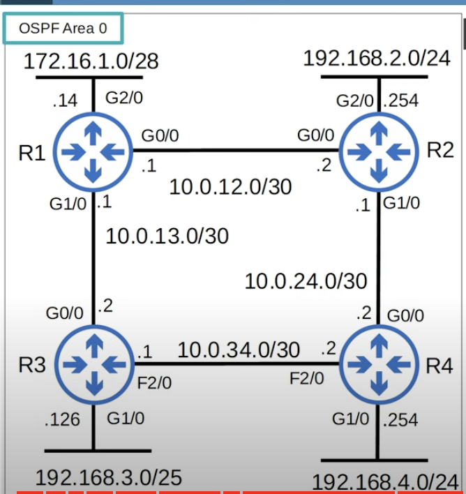

## Link State Routing Protocols
* When using a **link state** routing protocol, every router creates a 'connectivity map' of the network.
* To allow this, each router advertises information about its interfaces (connected networks) to its neighbors. These advertisements are passed along to other routers, until all routers in the network develop the same map of the network.
* Each router independently uses this map to calculate the best routes to each destination.
* Link state protocols use more resources (CPU, Memory) on the router because more information is shared. However, link state protocols tend to be faster in reacting to changes in the network than distance vector protocols.
## OSPF Introduction
* Stands for **Open Shortest Path First**.
* Uses the **Shortest Path First** algorithm of Dutch computer scientist Edsger Dijkstra.
	* The **Dijkstra's algorithm**.
* There are 3 versions (OSPFv2 used here and on the CCNA):
	* OSPFv1 (1989): Old and not in use anymore.
	* OSPFv2 (1998): Used for IPv4.
	* OSPFv3 (2008): Used for IPv6 (can also be used for IPv4, but v2 is more common for IPv4 networks).
* Routers use LSAs (Link State Advertisements) to exchange routing information within an OSPF network. 
	* Each LSA has an aging timer (30 min by default). The LSA will be flooded again after the timer expires.
* Routers store LSAs in LSDB (Link State Database).
* Routers will flood LSAs until all routers in the OSPF area develop the same map of the network (the same LSDB).
### LSA Flooding

* Each Router will have a complete map of the network (LSDB).
* RID in the LSA refers to the Router-ID.
### OSPF Main Steps
1. **Become neighbors** with other routers connected to the same segment.
2. **Exchange LSAs** with neighbor routers.
3. **Calculate the best routes** to each destination and insert them into the routing table.
## OSPF Areas

* OSPF uses **areas** to divide up the network.
* All interfaces on all routers are assigned to area 0 by default, also known as the backbone area.
* Small networks can be single-area without any negative effects on performance.
* In large networks, a single-area design can have negative effects:
	* The SPF(shortest path first) algorithm takes more time to calculate routes.
	* The SPF algorithm requires exponentially more processing power on the routers.
	* Larger LSDB take up more memory on the router.
	* Any small change in the network causes every router to flood LSAs and run the SPF algorithm again.
* By dividing a large OSPF network into several smaller areas, the negative effects mentioned above can be avoided.
* The exam topics only mention single area OSPF. Therefore, in-depth knowledge of OSPF areas is not needed.
### OSPF Area Terminology
* **Area**: set of routers and links that share the same LSDB.
* **Backbone area** (area 0): an area that all other areas must connect to.
* **Internal router**: router with all interfaces on the same area.
* **Area border router** (ABR): router with interfaces in multiple areas.
	* ABRs maintain a separate LSDB for each area they are connected to. It is recommended that you connect an ABR to a maximum of 2 areas. Connecting an ABR to 3+ areas can overburden the router.
* **Autonomous system boundary router**  (ASBR): an OSPF router that connects the OSPF network to an external network (like the internet).
	* Setting `default-information originate` on a router makes it a ASBR.
* **Backbone router**: router connected to the backbone area (area 0).
* **Intra-area route**: a route to a destination inside the same OSPF area.
	* For example, from a router in area 1 to a destination also in area 1.
* **Interarea route**: a route to a destination in a different OSPF area.
### OSPF Area Rules
* OSPF areas should be contiguous. They should not be split up.
* All OSPF areas must have at least one ABR connected to the backbone area.
* OSPF interfaces in the same subnet must be in the same area.
	* They won't become OSPF neighbors and won't exchange information about the networks they know about if they are not in the same area.
## OSPF Configuration

### Basic OSPF Configuration
It is assumed that R2, R3, and R4 have already been configured to reflect the diagram above.
```
R1(config)#router ospf ?
	<1-655335> Process ID
R1(config)#rounter ospf 1
R1(config-router)#network 10.0.12.0 0.0.0.3 area 0
R1(config-router)#network 10.0.13.0. 0.0.0.3 area 0
R1(config-router)#network 172.16.1.0 0.0.0.15 area 0
```
* A router can run multiple OSPF processes at once. The Process ID is used in the router to identify each of them.
	* The OSPF Process ID is locally significant. Routers with different process IDs can become OSPF neighbors.
	* This is different than EIGRP where routers must share the same AS number to become neighbors.
	* The Process ID is unrelated to the area number.
* OSPF uses wildcard masks, just like EIGRP.
* The `network` command tells OSPF to:
	* Look for any interfaces with an IP address contained in the range specified in the `network` command.
	* Activate OSPF on the interface in the specified **area**.
	* The router will then try to become OSPF neighbors with other OSPF-activated neighbor routers.
* For the CCNA, you only need to configure single-area OSPF (area 0). Usually you will use area 0.
* For single area OSPF it's possible to use any area number, but it's considered best practice to use area 0.
### Passive-Interface Command
`R1(config-router)#passive-interface g2/0`
* The command tells the router to stop sending OSPF 'hello' messages out of the interface. It stops the interface from trying to find OSPF neighbors.
	* Always use this command on interfaces which don't have any OSPF neighbors.
	* It's a waste to continuously send 'hello' messages out of an interface with no other routers connected to it.
* However, the router will continue to send LSAs informing its neighbors about the subnet configured on the interface.
### Advertise a Default Route into OSPF
An internet connection is added to R1 (203.0.113.0/30).
```
R1(config)#ip route 0.0.0.0 0.0.0.0 203.0.113.0/30
R1(config-router)#default-information originate
```
* It will cause the router to create a new LSA and flood it.

### Router-ID Configuration
```
R1(config-router)#router-id ?
	A.B.C.D OSPF router-id in IP address format
R1(config-router)#router-id 1.1.1.1
% OSPF: Reload or use "clear ip ospf process" command, for this to take effect.

R1#clear ip ospf process
Reset ALL OSPF processes? [no]: yes
```
* This basically resets OSPF on the router.
* This is a bad idea in a real network. The router will lose all of its OSPF routes for a short period of time and won't be able to forward traffic to those destinations.
### Change Maximum Paths
`R1(config-router)#maximum-paths ?`
### Change Administrative Distance
`R1(config-router)#distance <AD>`
### Show IP Protocols

* OSPF also uses a Router-ID that is determine in the same way as in EIGRP.
* Router-ID order of priority:
	1. Manual configuration.
	2. Highest IP address on a loopback interface.
	3. Highest IP address on a physical interface.
* An **autonomous system boundary router**  (ASBR) is an OSPF router that connects the OSPF network to an external network.
	* R1 is connected to the Internet. By using the **default-information originate** command, R1 becomes an ASBR.
* Number of areas in this router: indicates the areas that the router is in. In this case, only one because this is single-area OSPF.
	* It's not necessary to know about the different types of areas for the CCNA.
* Supports ECMP over a maximum of 4 paths by default.
* Routing for Networks: shows the network commands used on the router.
* Routing Information Sources: Current router's neighbors.
* Distance: OSPF's AD (Administrative Distance).