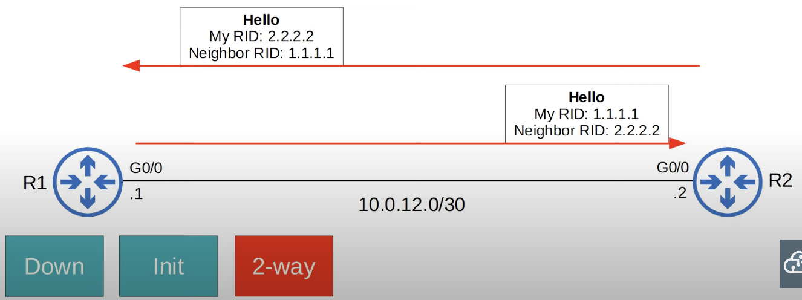

## OSPF Metric (Cost)
* OSPF's metric is called **cost**.
* It is automatically calculated based on the bandwidth (speed) of the interface.
* The formula to calculate OSPF cost is **reference bandwidth** / **interface bandwidth**.
* The default reference bandwidth is 100 mbps:
	* Reference: 100 mbps / Interface: 10 mbps = cost of 10.
	* Reference: 100 mbps / Interface 100 mbps = cost of 1.
	* Reference: 100 mbps / Interface 1000 mbps = cost of 1.
	* Reference: 100 mbps / Interface 10000 mbps = cost of 1.
* All values less than 1 will be converted to 1. Therefore, Fast Ethernet, Gigabit Ethernet, 10Gig Ethernet, etc. are equal and all have a cost of 1 by default.
* You can and should change the reference bandwidth:
	* `R1(config-router)#auto-cost reference-bandwidth <megabit-per-second>`
	* You should configure a reference bandwidth greater than the fastest link in your network(to allow for future upgrades).
	* You should configure the same reference bandwidth on all OSPF routers in the network to provide a consistent cost for each interface.
* A manually configured cost for an interface takes precedence over the auto-generated cost.
	* `R1(config-if)#ip ospf cost <cost>`
* It is recommended that you change the reference bandwidth or manually configure an interface's cost to change the OSPF cost of individual interfaces if you want.
* One more option to change the OSPF cost of an interface is to change the bandwidth of the interface with the `bandwidth` command. However, because the bandwidth value is used in other calculations, it is not recommended to change this value to alter the interface's OSPF cost.
	* `R1(config-if)#bandwidth <kilobits-per-second>`
	* Although the bandwidth matches the interface speed by default, changing the interface bandwidth doesn't actually change the speed at which the interface operates.
	* The bandwidth is just a value that is used to calculate OSPF cost, EIGRP metric, etc.
	* The command `speed` is used to change the speed at which the interface operates.
* Loopback interfaces have a cost of 1.
	* Once you are at the router, to get to one of its loopback addresses, you just add 1 to the cost.
* The OSPF cost to a destination is the total cost of the 'outgoing/exit' interfaces.

**Show OSPF Cost Associated With Interfaces**
`R1# show ip ospf interface brief`
## Becoming OSPF Neighbors
* Making sure that routers successfully become OSPF neighbors is the main task in configuring and troubleshooting OSPF.
* Once routers become neighbors, they automatically do the work of sharing network information, calculating routes, etc.
* When OSPF is activated on an interface, the router starts sending OSPF **hello** messages out of the interface at regular intervals (determined by the **hello timer**). These are used to introduce the router to potential OSPF neighbors.
	* By exchanging 'hello' messages, routers can check that they are compatible to become OSPF neighbors.
* The default hello timer is 10 seconds for an Ethernet connection.
* Hello messages are multicast to `224.0.0.5` (multicast address for all OSPF routers).
* OSPF messages are encapsulated in an IP header with a value of 89 in the protocol field.
### OSPF Message Types

### OSPF States

#### Down State
It's assumed that OSPF has just been activated on R1's G0/0 interface

* R1's G0/0 interface has just been activated as an OSPF interface, therefore it will send an OSPF *hello* message to `224.0.0.5` (multicast address for all OSPF routers).
* Two  pieces of information included in the *hello* message are:
	* The Router-ID of the router (R1) originating the *hello* message.
	* The neighbor's (R2) Router-ID, which will be set to 0.0.0.0 at this point because R1 doesn't know it yet.
* R1 doesn't know about any OSPF neighbors yet, so the current neighbor state is **down**.
#### Init

* When R2 receives the *hello* packet, it will add an entry for R1 to its OSPF neighbor table.
	* R1 still doesn't know about the neighbor (R2), so it will not have an entry for it in its OSPF neighbor table.
* In R2's neighbor table, the relationship with R1 is now in the **init** state.
	* In the **init** state, the *hello* packet was received, but the receiving router's own Router-ID is not in the *hello* packet, as shown in the picture above.
#### 2-way

* R2 will send a reply *hello* packet containing the RID of both routers.
* R1 will insert R2 into its OSPF neighbor table upon arrival of the reply.
* R1 will send another *hello* message, this time containing R2's RID.
* Now both routers should be in the **2-way** state.
	* The 2-way state is when a router has received a *hello* packet with its own RID in it.
	* If both routers reach the 2-way state, it means that all of the conditions have been met for them to become OSPF neighbors. They are now ready to share LSAs to build a common LSDB.
* In some network types, a **DR (Designated Router)** and **BDR (Backup Designated Router)** will be elected at this point.
	* OSPF Broadcast network Type
#### Exstart

* The two routers will now prepare to exchange information about their LSDB. However, before that, they must choose which one will start the exchange of DBD messages in the next state (Exchange).
	* The router with the higher RID will become the **master** and will initiate the exchange. The router with the lower RID will become the **slave**.
* To decide the **master** and **slave**, routers exchange DBD (Database Description) packets.
	* In this case R2 is the master because it has a higher RID (2.2.2.2) than R1 (1.1.1.1). Therefore, R2 will start the DBD exchange in the next state.
#### Exchange

* In the **exchange** state, the routers exchange DBDs which contain a list of the LSAs in their LSDB.
	* These DBDs do not include the actual LSAs, just basic information to inform each other of the LSAs they have.
* The routers compare the information in the DBD they received to the information in their own LSDB to determine which LSAs they must receive from their neighbor.
#### Loading
The image below, only shows the process R1 goes through to get LSAs it does not have. R2 will perform the same process. Both routers should have the same LSDB by the end of this state.

* In the **loading** state, routers send Link State Request (LSR) messages to request that their neighbors send them any LSAs they don't have.
* LSAs are sent in Link State Update (LSU) messages.
* Routers send LSAck messages to acknowledge that they received the LSAs.
#### Full

* In the **full** state, the routers have a full OSPF adjacency and identical LSDBs.
* They continue to send and listen for *hello* packets (every 10 seconds by default) to maintain the neighbor adjacency.
* Every time a *hello* packet is received, the 'Dead' timer (40 seconds by default) is reset.
	* If the 'Dead' time counts down to 0 and no *hello* message is received, the neighbor is removed.
* The routers will continue to share LSAs as the network changes to make sure each router has a complete and accurate map of the network (LSDB).
## OSPF Show Commands
```
R4#show ip ospf neighbor

Neighbor ID Pri State    Dead Time Address Interface
2.2.2.2     1   FULL/BDR 00:00:35  10.0.24.1 FastEthernet1/0
3.3.3.3     1   FULL/BDR 00:00:33  10.0.34.1 FastEthernet2/0
```

```
R4#show ip ospf interface f1/0

FastEthernet1/0 is up, line protocol is up
Internet address is 10.0.24.2/30, Area 0
Process ID 1, Router ID 4.4.4.4, Network Type BROADCAST, Cost: 1
Transmit Delay is 1 sec, State DR, Priority 1
Designated Router (ID) 4.4.4.4, Interface address 10.0.24.2
Backup Designated Router (ID) 2.2.2.2, Interface address 10.0.24.1
Timer intervals configured, Hello 10, Dead 40, Wait 40, Retransmit 5
Hello due in 00:00:06
Index 2/2, flood queue length 0
Next 0x0(0)/0x0(0)
Last flood scan length is 1, maximum is 1
Last flood scan time is 0 msec, maximum is 0 msec
Neighbor Count is 1, Adjacent neighbor count is 1
Adjacent with neighbor 2.2.2.2 (Backup Designated Router)
Suppress hello for 0 neighbor(s)
```
* You can see times such as Hello, Death, etc.
* You can see DR (designated router) and BDR (backup designated router).
## More OSPF Configuration
### Interface OSPF Activation Alternate Method
* Activate OSPF directly on an interface:
	* `R1(config-if)#ip ospf <process-id> area <are>`
* If you active OSPF directly on the interfaces, you'll see slightly different outputs from the `show ip protocols` command.
	* The 'Routing for Networks' section will be empty if the `network` command is not used to activate OSPF on interfaces.
	* The interfaces for which OSPF was activated explicitly will show up under the 'Routing on Interfaces Configured Explicitly (Area <area #>)' section.
### Passive Interface Alternate Method
* Configure all interfaces as OSPF passive interfaces:
	* `R1(config-router)#passive-interface default`
	* Depending on the number of passive interfaces that need to be configured, this method might be faster, or perhaps the normal method is faster.