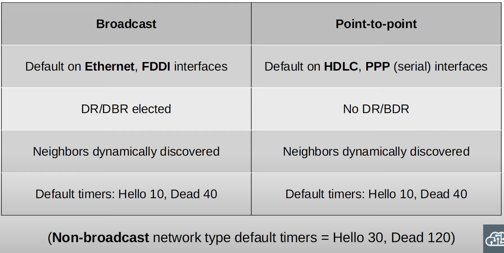
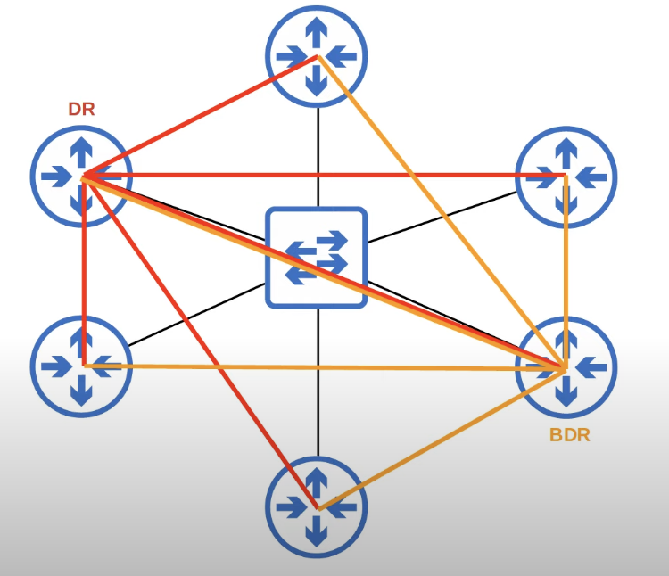
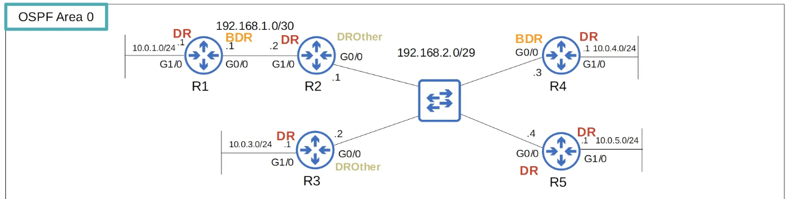
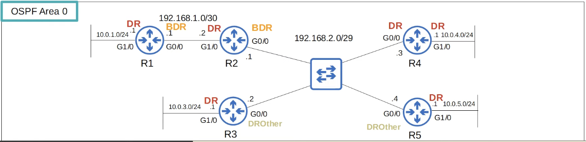
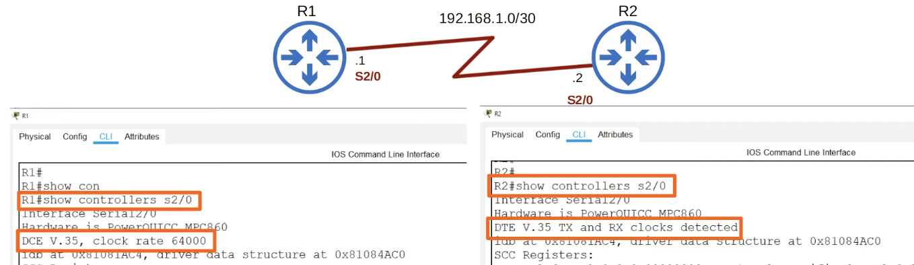
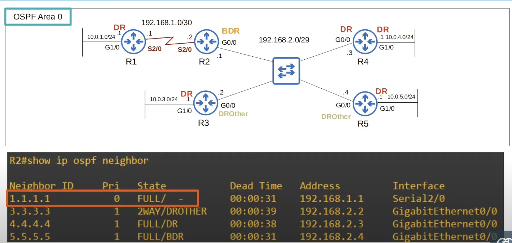
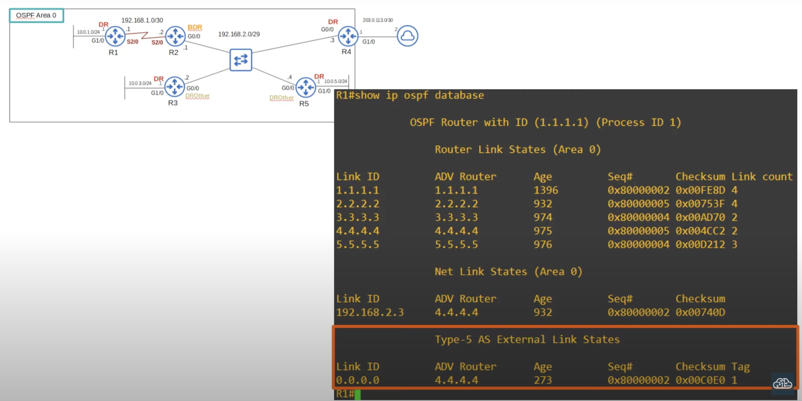

## Loopback Interfaces
* A loopback interface is a virtual interface in the router.
* It is always up/up (unless you manually shutdown).
* It is not dependent on a physical interface. 
* It provides a consistent IP address that can be used to reach/identify the router.
## OSPF Network Types

* The OSPF 'network type' refers to the type of connection between OSPF neighbors (Ethernet, etc...).
* There are three main OSPF network types:
	* **Broadcast**: enabled by default on **Ethernet** and **FDDI** (Fiber Distributed Data Interfaces) interfaces.
	* **Point-to-point**: enabled by default on **PPP** (Point-to-point Protocol) and **HDLC** (High-Level Data Link Control) interfaces.
	* **Non-broadcast**: enabled by default on **Frame Relay** and **x.25** interfaces.
### OSPF Broadcast Network Type
* Enabled on **Ethernet** and **FDDI** interfaces by default.
* Routers dynamically discover neighbors by sending/listening for OSPF *Hello* messages using multicast address `224.0.0.5`.
* A **DR** (designated router) and **BDR** (backup designated router) must be elected on each subnet (only DR if there are no OSPF neighbors, ie. R1's G1/0 interface).
	* The DR and BDR will form a FULL adjacency with ALL routers in the subnet.
	* When routers need to send messages to the DR and DBR, they use multicast address `224.0.0.6`. It is different than the 'all OSPF routers' multicast address of `224.0.0.5`.
* Routers which aren't the DR or BDR become a **DROther**.
	* DROthers will form a FULL adjacency only with the DR/BDR.
	* DROthers don't form full adjacencies with other DROthers. They remain in the 2-way state.
#### LSAs Sharing Between Routers
Image below shows the sharing of LSAs in a subnet between routers.

* In the broadcast network type, routers only form a full OSPF adjacency with the DR and BDR of the segment/subnet.
* Therefore, routers only exchange LSAs with the DR and BDR. DROthers will not exchange LSAs with each other.
	* All routers will still have the same LSDB, but this reduces the amount of LSAs flooding the network.
#### Broadcast DR/BDR Election
* The DR/BDR election order of priority:
	1. Router with the highest **OSPF interface priority**
		* The default OSPF interface priority is 1 on all interfaces. Therefore, the Router ID will be the deciding factor.
	2. Router with the highest OSPF Router ID
* First place becomes the DR for the subnet, second place becomes the BDR.

Following the election process, R5 becomes the DR and R4 the BDR for the subnet `192.168.2.0/29`

##### Set OSPF Interface Priority
* If you set the OSPF interface priority to 0, the router cannot be the DR/BDR for the subnet no matter what.
* The DR/BDR  election process is 'non-preemptive'. Once the DR/BDR are elected they will keep their role until OSPF is reset, the interface fails/is shutdown, etc.
	* It's a bad idea to reset OSPF in a live network.

R2's G0/0 interface priority is increased to make it the DR.
```
R2(config)#interface g0/0
R2(config-if)#ip ospf priority ?
	<0-255>
R2(config-if)#ip ospf priority 255
```

* R4 became the DR, not R2. R2 became the BDR.
	* When the DR goes down, the BDR becomes the new DR even if it doesn't have the highest OSPF interface priority / RID anymore. Then, an election is held for the next BDR.
	* When the BDR goes down, a new election is held among the DROther to pick a new BDR.
* DROthers (R3 and R5 in the subnet) will only move to the Full state with the DR and BDR. The neighbor state with other DROthers will be 2-way.
	* DROthers don't form full adjacencies with other DROthers. They remain in the 2-way state.
##### Reset OSPF Process
`R5#clear ip ospf process`
## Serial Interfaces
Serial connections is an old technology which isn't very common anymore. They still exists, but Ethernet is much more dominant.
Furthermore, they have been removed from the CCNA exam topics, except for the OSPF 'point-to-point' network type.

* One side of a serial connection functions as DCE (Data Communications Equipment). The other side functions as DTE (Data Terminal Equipment).
	* This is important because the DCE side needs to specify the clock rate (speed) of the connection.
* On Cisco routers, the default encapsulation on a serial interface is cHDLC (Cisco HDLC).
	* It displays as just HDLC in the CLI.
### Serial Connection Clock Rate
```
R1(config)#interface s2/0
R1(config-if)#clock rate <bits-per-second>
R1(config-if)#clock rate 64000
R1(config-if)#ip address 192.168.1.1 255.255.255.0
R1(config-if)#no shutdown
```
* Serial interfaces use the `clock rate` command to set the speed.
* **The speed is only set on the DCE side of the serial connection.**
### Serial Connection PPP Encapsulation
```
R1(config)#interface s2/0
R1(config-if)#encapsulation ppp
```
* If you change the encapsulation, it must match on both ends or the interface will go down.
### Show DCE / DTE Configuration

* As shown in the commands above, R1 is the DCE and R2 is the DTE.
### Serial Interfaces Summary
* The default encapsulation is HDLC.
* You can configure PPP encapsulation with this command:
	* `R1(config-if)#encapsulation ppp`
* One side is DCE, the other is DTE.
* Identify which side is DCE / DTE:
	* `R1#show controllers <interface-id>`
* You must configure the clock rate on the DCE side:
	* `R1(config-if)#clock rate <bits-per-second>`
### OSPF Point-to-Point Network Type
* Enabled on **serial** interfaces using the **PPP** or **HDLC** encapsulations by default.
	* PPP and HDLC are both Layer 2 encapsulations, similar to Ethernet, except they are used on serial connections.
* Routers dynamically discover neighbors by sending/listening for OSPF *Hello* messages using multicast address `224.0.0.5`.
* A DR and BDR are NOT selected, compared to an OSPF broadcast network type.
* These encapsulations are used for 'point-to-point' connections between two routers. There is no point in electing a DR and BDR.
* The two routers will form a FULL adjacency with each other. 
* Use the same default timers: Hello 10, Dead 40.



#### Configure the OSPF Network Type
Why would you change the OSPF network type? For example, if two routers are directly connected with an Ethernet link, there is no need for a DR/BDR. You can configure the point-to-point network type in this case. Although you don't have to.

* You can configure the OSPF network type on an interface with:
	* `R1(config-if)#ip ospf network <type>`
* NOTE: Not all network types work on all link types (for example, a serial link cannot use the broadcast network type).
	* Serial links don't support layer 2 broadcast frames, which are necessary for the broadcast network type.
## OSPF Neighbor/Adjacency Requirements
* Area number must match for two routers to become OSPF neighbors.
* The interfaces must be in the same subnet to become OSPF neighbors.
	* Interfaces in the same subnet must be in the same area.
* The OSPF process must not be shutdown.
	* It's possible to shutdown the OSPF process on the router. It disables OSPF operations, without removing the OSPF configurations.
	* `Router(config-router)#shutdown`
	* `Router(config-router)#no shutdown`
* OSPF Router IDs must be unique.
* Hello and Dead timers must match.
	* Restore default *Hello* timer: `R(config-if)#no ip ospf hello-interval`
	* Restore default *Dead* timer: `R(config-if)#no ip ospf dead-interval`
* Authentication settings must match.
	* It's possible to configure an OSPF password. Then the router will only become neighbors with routers that have a matching OSPF password.
	* `R(config-if)#ip ospf authentication-key <key>`
	* Enable authentication: `R(config-if)#ip ospf authentication`.
* IP MTU settings must match. The maximum size of an IP packet that will be sent out of the interface.
	* `R(config-if)#ip mtu <MTU bytes>`
	* Return default: `R(config-if)#no ip mtu`
	* The default MTU is 1500 bytes, but it can be configured.
	* If the MTU settings on the interfaces don't match, routers can become OSPF neighbors, but won't move to the full state. OSPF won't operate properly.
* The OSPF Network Type must match.
	* Even if this setting doesn't match, routers can become neighbors. However, OSPF won't operate properly and they won't learn OSPF routes.
## OSPF LSA Types
* The OSPF LSDB is made up of LSAs.
	* All routers in the same OSPF area share the same LSDB.
* There are 11 types of LSA, but there are only 3 you should be aware of for the CCNA:
	* Type 1 (Router LSA)
	* Type 2 (Network LSA)
	* Type 5 (AS External LSA)
### Type 1 (Router LSA)
* Every OSPF router generates this type of LSA.
* It identifies the router using its Router ID.
* It also lists networks attached to the router's OSPF-activated interfaces.
### Type 2 (Network LSA)
* Generated by the DR of each 'multi-access' network (ie. the **broadcast** network type).
	* An example of a multi-access network is an Ethernet network using the broadcast network type.
* Lists the routers which are attached to the multi-access network.
### Type 5 (AS-External LSA)
* Generated by the ASBRs to describe routes to destinations outside of the AS (OSPF domain).

#### Show LSDB
It won't matter on which router in the command is used on. All routers in the same are have the same LSDB.
* `R1#show ip ospf database`

* Each router has generated a Type 1 Router LSA identifying itself (RID).
* There is only one Type 2 Network LSA, generated by R4 (DR) for the 192.168.2.0/29 subnet.
	* Even though R1, R2, and R5 are DRs on their G1/0 interfaces, no other routers are connected to the interfaces. Therefore, no Type 2 Network LSA is generated.
* A Type 5 AS-External LSA is generated by R4 to share its default route to the internet with the other routers in the same area.
	* `R4(config-router)#default-information originate`