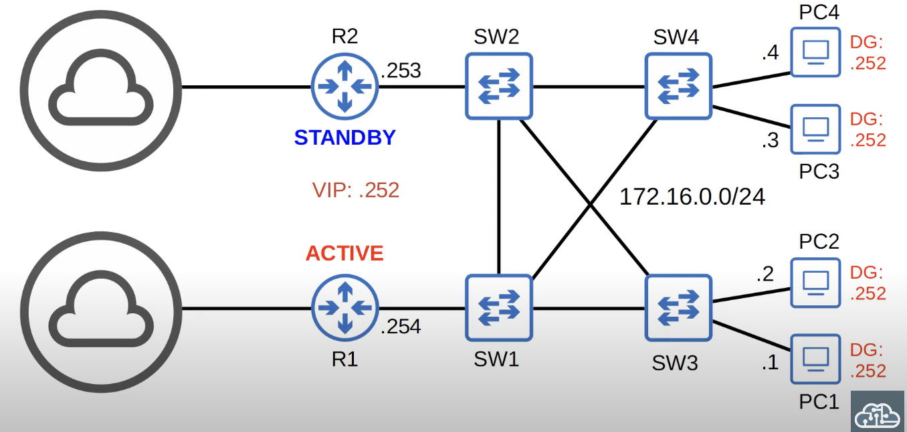
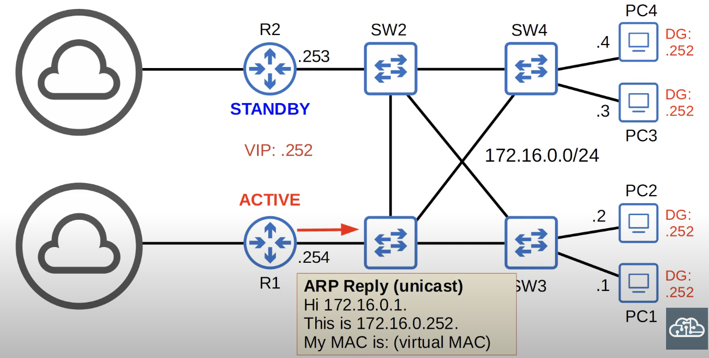
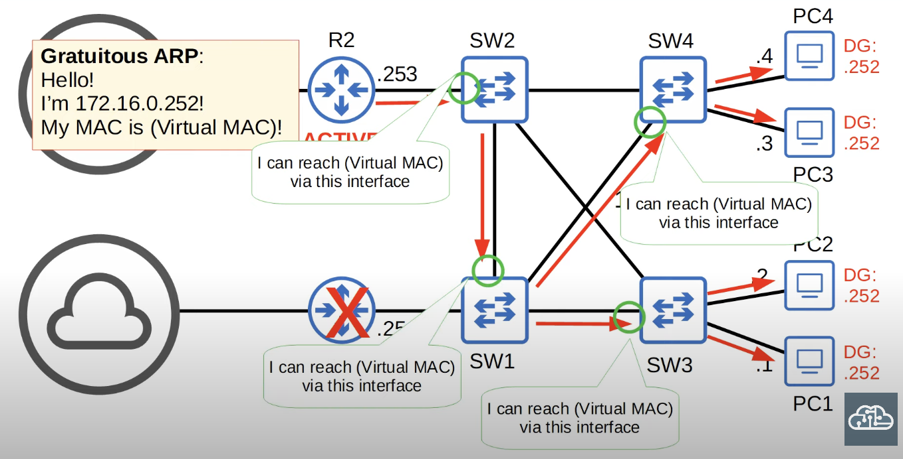

This isn't the name of a specific protocol. It's a type of protocol and there are three FHRPs to be aware of for the CCNA. In depth knowledge is not needed, but should be able to compare them.
## The Purpose of FHRPs
A first hop redundancy protocol (FHRP) is a computer networking protocol which is designed to protect the default gateway used on a subnetwork by allowing two or more routers to provide backup for that address; in the event of failure of an active router, the backup router will take over the address, usually within a few seconds.

The name 'first-hop' redundancy protocol is used because the default gateway is the 'first-hop' - the first router in the path to whatever destination the PC is sending traffic to.
## FHRP in Action

* The two routers share a VIP (virtual IP) and a virtual MAC address is generated for the virtual IP.
* R1 and R2 negotiate their roles with each other by sending multicast Hello messages to each other.
* In this case, R1 became the ACTIVE router and R2 the STANDBY router. R2 will start functioning and take the ACTIVE status only if R1 fails.
	* The actual terms (active, standby, etc.) vary depending on which FHRP is being used.

* If an end host needs to send traffic outside the network, it will need to contact the default gateway with the VIP of 12.16.0.252/24.
	* In the case that the end host does not know the MAC address of the the default gateway, it will use ARP to obtain it.
	* The STANDBY and ACTIVE routers share the same VIP, but only the ACTIVE one will reply  with a virtual MAC because traffic is supposed to flow through the ACTIVE router.
	* Each FHRP uses a different Virtual MAC address.

* In the event that R1 goes down, R2 will become the Active router after it notices that it hasn't received any *Hello* messages from R1 in a while.
* The end hosts don't have to change their ARP tables to reach the new Active router.
* R2 will make the switches update their MAC address tables by sending **gratuitous ARP** replies to them.
	* Gratuitous ARP replies are sent without being requested. Their destination MAC address is the broadcast MAC address (FFFF.FFFF.FFFF.FFFF) and their source in this case is the virtual MAC address shared by the routers.
	* When the switches receive the frames, they will update their MAC address table to associate the virtual MAC address with the new interface through which it can be reached.
	* As a result, frames destined for the default gateway, will no be forwarded to R2.

* In the event that R1 comes back online, it will become the standby router and not the active one.
* FHRPs are non-preemptive (process cannot be interrupted). The current active router will not automatically give up its role by default, even if the former active router returns.
* Settings can be changed to make R1 preempt (interrupt) R2 and and take back its active role automatically.
### FHRP Review
* A **virtual IP** is configured on the two routers and a **virtual MAC** is generated for the virtual IP (each FHRP uses a different format for the virtual MAC).
* 

## HSRP (Host Standby Router Protocol)
## VRRP (Virtual Router Redundancy Protocol)
## GLBP (Gateway Load Balancing Protocol)

## Basic HSRP Configuration