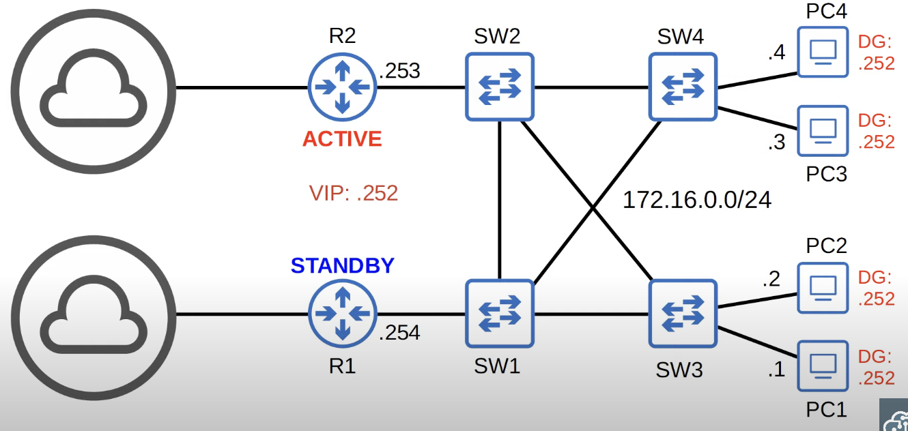
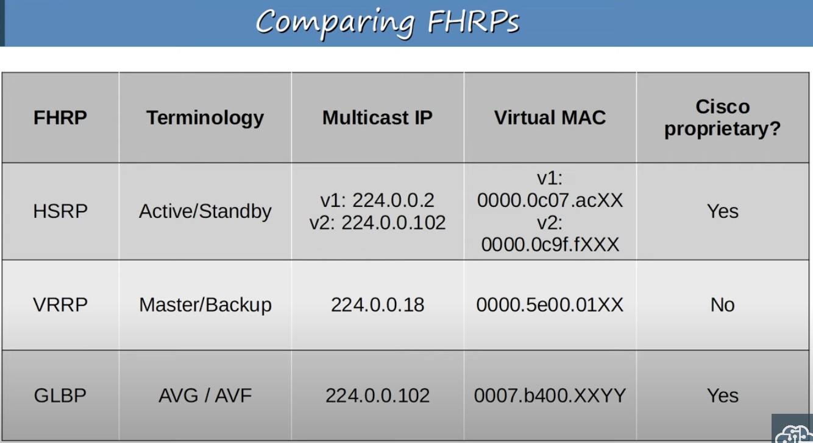
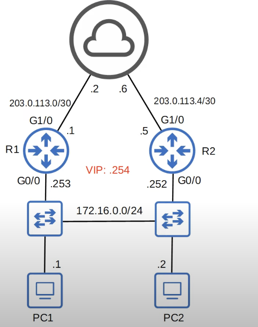

This isn't the name of a specific protocol. It's a type of protocol and there are three FHRPs to be aware of for the CCNA. In depth knowledge is not needed, but should be able to compare them.
## The Purpose of FHRPs
A first hop redundancy protocol (FHRP) is a computer networking protocol which is designed to protect the default gateway used on a subnetwork by allowing two or more routers to provide backup for that address; in the event of failure of an active router, the backup router will take over the address, usually within a few seconds.

The name 'first-hop' redundancy protocol is used because the default gateway is the 'first-hop' - the first router in the path to whatever destination the PC is sending traffic to.
## FHRP in Action

* The two routers share a VIP (virtual IP) and a virtual MAC address is generated for the virtual IP.
* R1 and R2 negotiate their roles with each other by sending multicast *Hello* messages to each other.
* In this case, R1 became the ACTIVE router and R2 the STANDBY router. R2 will start functioning and take the ACTIVE status only if R1 fails.
	* The actual terms (active, standby, etc.) vary depending on which FHRP is being used.


* If an end host needs to send traffic outside the network, it will need to contact the default gateway with the VIP of 12.16.0.252/24.
	* In the case that the end host does not know the MAC address of the the default gateway, it will use ARP to obtain it.
	* The STANDBY and ACTIVE routers share the same VIP, but only the ACTIVE one will reply  with a virtual MAC because traffic is supposed to flow through the ACTIVE router.
	* Each FHRP uses a different Virtual MAC address.
	

* In the event that R1 goes down, R2 will become the Active router after it notices that it hasn't received any *Hello* messages from R1 in a while.
* The end hosts don't have to change their ARP tables to reach the new Active router.
* R2 will make the switches update their MAC address tables by sending **gratuitous ARP** replies to them.
	* Gratuitous ARP replies are sent without being requested. Their destination MAC address is the broadcast MAC address (FFFF.FFFF.FFFF.FFFF) and their source in this case is the virtual MAC address shared by the routers.
	* When the switches receive the frames, they will update their MAC address table to associate the virtual MAC address with the new interface through which it can be reached.
	* As a result, frames destined for the default gateway, will no be forwarded to R2.


* In the event that R1 comes back online, it will become the standby router and not the active one.
* FHRPs are non-preemptive (process cannot be interrupted). The current active router will not automatically give up its role by default, even if the former active router returns.
* Settings can be changed to make R1 preempt (interrupt) R2 and and take back its active role automatically.
### FHRP Review
* A **virtual IP** is configured on the two routers and a **virtual MAC** is generated for the virtual IP (each FHRP uses a different format for the virtual MAC).
* An **active** router and a **standby** router are elected (different FHRPs use different terms).
* End hosts in the network are configured to use the virtual IP as their default gateway.
* The active router replied to ARP requests using the virtual MAC address, so traffic destined for other network will be sent to it.
* If the active router fails, the standby becomes the next active router. The new active router will send **gratuitous ARP** messages so that switches will update their MAC address tables. It now functions as the default gateway.
* If the old active router comes back online, it won't take back its role as the active router by default. It will become the standby router.
* You can configure preemption, so that the old active router does take back its old role.
## HSRP (Host Standby Router Protocol)
* Cisco Proprietary.
* An **active** and **standby** router are elected.
* There are two versions: **version 1** and **version 2**.
	* Version 2 adds IPv6 support and increases the number of groups that can be configured.
	* In situations with multiple subnets and VLANS, you'll need to configure a virtual IP address for each subnet because each subnet needs its own default gateway.
* Routers send *hello* messages through IPv4 multicast addresses:
	* v1: 224.0.0.2
	* v2: 224.0.0.102
* Virtual MAC addresses:
	* v1: 0000.0c07.acXX (XX = HSRP group number)
	* v2: 0000.0c9f.fXXX(XXX = HSRP group number)
* In a situation with multiple subnets/VLANs, you can configure a different active router in each subnet/VLAN to load balance.
	* Although it can't load balance within a single subnet, you can configure a different active router in each subnet so that traffic is load balanced between the routers.
## VRRP (Virtual Router Redundancy Protocol)
* Open standard that can run on any network device that supports it.
* It's similar in terms of functionality to HSRP.
* A **master** and **backup** router are elected.
* Multicast IPv4 address for router communication: 224.0.0.18.
* Virtual MAC address: 0000.5e00.01XX (XX = VRRP group number).
* In a situation with multiple subnets/VLANs, you can configure a different master router in each subnet/VLAN to load balance.
## GLBP (Gateway Load Balancing Protocol)
* Cico proprietary.
* It is a bit different than HSRP and VRRP.
* Load balances among multiple routers within a single subnet.
* An **AVG** (Active Virtual Gateway) is elected.
* Up to four **AVF**s (Active Virtual Forwarders) are assigned by the AVG (the AVG itself can be an AVF, too).
* Each AVF acts as the default gateway for a portion of the hosts in the subnet.
* Multicast IPv4 address: 224.0.0.102.
* Virtual MAC address: 0007.b400.XXYY (XX: GLBP group number, YY: AVF number).
## FHRPs Comparison 

## Basic HSRP Configuration

**Change HSRP Version**
`R1(config-if)#standby version 2`
* Version 1 is default, but can be changed using the command above.
* V1 has a range of 0 - 255 groups available.
* V2 has a range of 0 4095 groups available.
* HSRP versions 1 and 2 are not compatible. Routers in the same group must use the same version.

```
R1(config)#interface g0/0
R1(config-if)#standby ?
<0-4095> group number

R1(config-if)#standby 1 ?
ip       Enable HSRP and set the virtual IP address
ipv6     Enable HSRP IPv6
preempt  Overthrow lower priority Active routers
priority Priority level
timers   Hello and hold timers
track    Priority Tracking

```
* This is a simple network with a single VLAN. It is a good idea to match the HSRP group number to the VLAN number used for the subnet. A group number of 1 was chosen in this case.
	* The group number does have to match between the two routers.

**Configure virtual IP for the Default Gateway**
```
R1(config-if)#standby 1 ip 172.16.0.254
```

**Configure Priority**
```
R1(config-if)#standby 1 priority ?
	<0-255> Priority value

R1(config-if)#standby 1 priority 200
```
* Priority is used to determine which router will be the active router.
* Active router election order:
	* Router with highest priority (default 100) in the group.
	* Router with highest IP address.

**Configure Preemption**
```
R1(config-if)#standby 1 peempt
```
* Preempt causes the router to take the role of active router, even if another router already has the role. 
	* The preempting router must have a higher priority or IP address to take the active role.
	* It's only necessary to configure preemption on the router that you want to become the active router. It is not necessary on the standby router.

**Show HSRP Configuration**
`R1# show standby`
