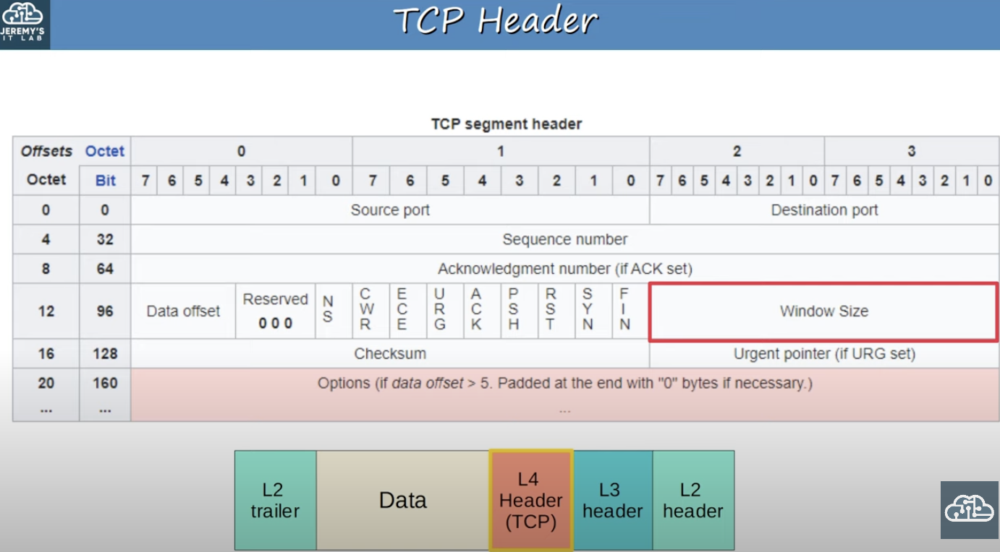
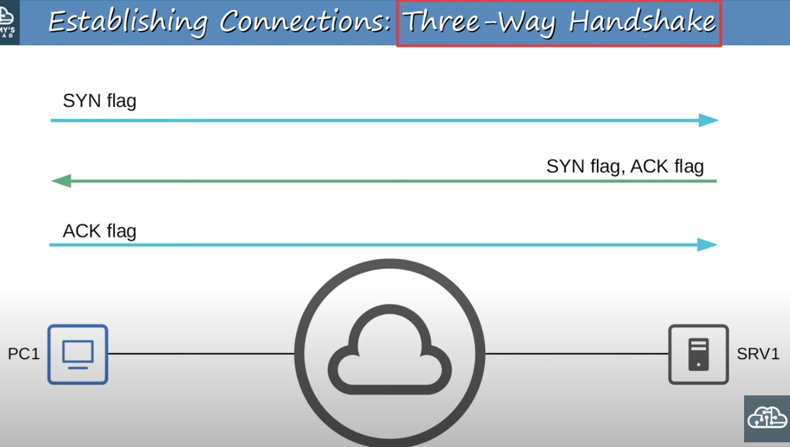
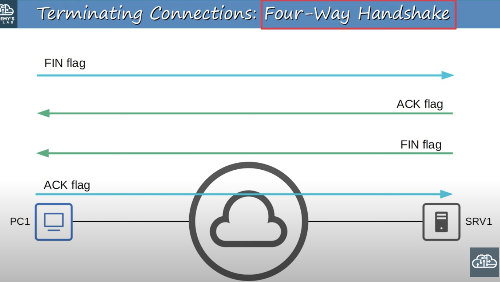
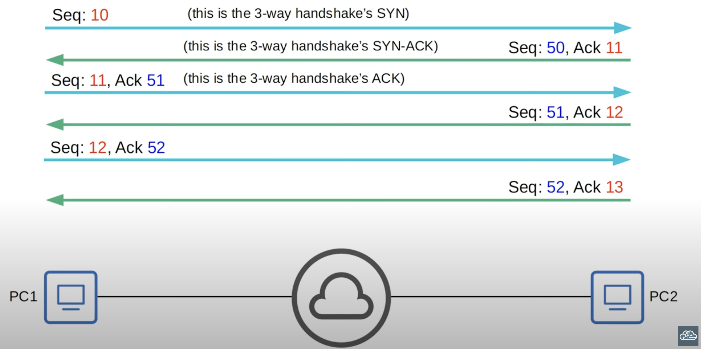
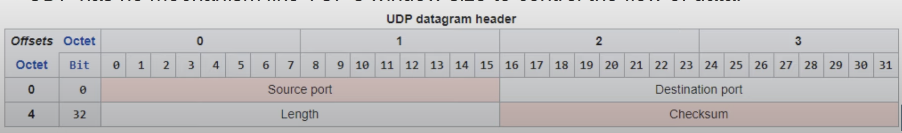
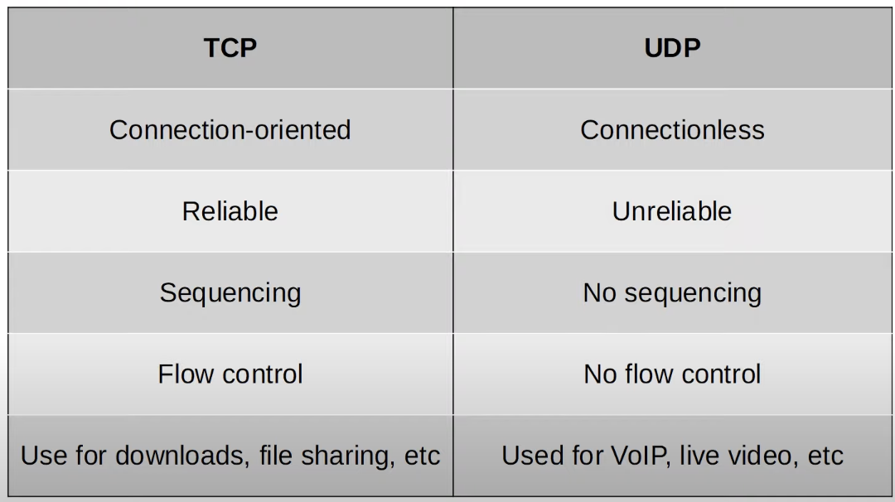
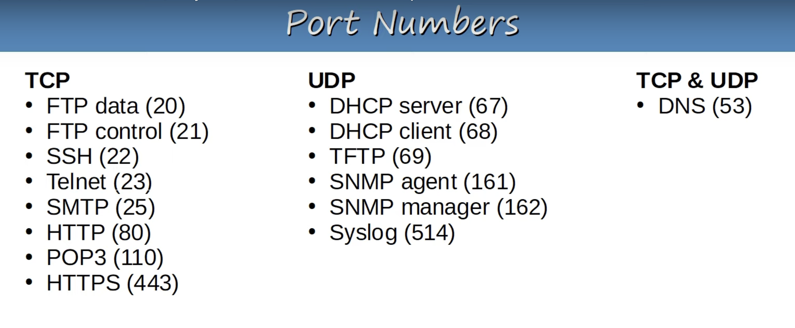

## Basics of Layer 4
* Provides transparent transfer of data between end hosts.
* Provides (or doesn't provide) various services to applications:
	* TCP Services:
		* Reliable data transfer.
		* Error recovery.
		* Data sequencing.
		* Flow control
* Provides Layer 4 addressing (port numbers).
	* Port numbers help identify the application Layer protocol being used.
	* Port numbers provides Session multiplexing.
* The following ranges have been designated by IANA (Internet Assigned Numbers Authority).
	* **Well-known** port numbers: 0 - 1023.
		* Used for major protocols like HTTP, FTP, etc and are very strictly regulated.
	* **Registered** port numbers: 1024 - 49151.
		* Registration is required to use these port numbers. Although it's not as strict as with the well know port range.
	* **Ephemeral/private/dynamic** port numbers: 49152 - 65535.
		* Hosts use this range when selecting the random source port.
### Session Multiplexing
An example of session multiplexing is a web browser. Each browser tab starts a new session with the external service/server. Different tabs originate their request with a random selected source port that is used by the service/server to know where to reply to. Thus, maintain separate independent sessions per tab.
## TCP (Transmission Control Protocol)
* TCP is connection-oriented.
	* Before actually sending data to the destination host, the two hosts communicate to establish a connection. Once the connection is established, the data exchange begins.
* TCP provides reliable communication.
	* The destination host must acknowledge that it received each TCP segment.
	* If a segment isn't acknowledged, it is sent again.
* TCP provides sequencing.
	* Sequence numbers in the TCP header allow destination hosts to put segments in the correct order even if they arrive out of order.
* TCP provides flow control.
	* The destination host can tell the source host to increase/decrease the rate that data is sent.

### TCP Header

* Source and destination ports.
	* Each field is 16 bits in length.
	* 16 bits = 65535 (2^16) available port numbers.
* Sequence number and Acknowledgement number.
	* Each field is 32 bits in length.
	* These fields provide sequencing and reliable communication.
* Important flag blits (ACK, SYN, FIN)
	* These three flags are used to establish and terminate connections.
* Window Size.
	* The window size is used for flow control.
### Establishing Connections: Three-Way handshake

### Terminating Connections: Four-Way handshake

### TCP: Sequencing / Acknowledgment

* Hosts set a random initial sequence number.
* **Forward acknowledgement** is used to indicate the sequence number of the next segment the host expects to receive.
### TCP Retransmission
* A host will resend a segment for which it hasn't received an ACK after a set period of time.
### TCP Flow Control: Window Size
* Acknowledging every single segment, no matter what size, is inefficient.
* The TCP header's **Window Size** field allows more data to be sent before an acknowledgment is required.
* A 'sliding window' can be used to dynamically adjust how large the window size is.
	* The window size is increased as much as possible until a segment is dropped, then the window size backs down to a more reasonable level, and slowly increases again.
### NOTE
In all of these examples, very simple sequence numbers were used. In real situations, the sequence numbers get much larger and do not increase by 1 with each message. For the CCNA, just understand the concepts and don't worry about the exact numbers.
## UDP (User Datagram Protocol)
* UDP is not connection-oriented.
	* The sending host does not establish a connection with the destination host before sending data. The data is simply sent.
* UDP does not provide reliable communication.
	* When UDP is used, acknowledgments are not sent for received segments. If a segment is lost, UDP has no mechanism to re-transmit it. Segments are sent 'best-effort'.
* UDP does not provide sequencing.
	* There is no sequence number field in the UDP header. If a segment arrives out of order, UDP has no mechanism to put them back in order.
* UDP does not provide flow control.
	* UDP has no mechanism like TCP's window size to control the flow of data.
### UDP Header

## Comparing TCP & UDP

* TCP provides more features than UDP, but at the cost of additional overhead.
* For applications that require reliable communications (for example downloading a file), TCP is preferred.
* For applications like real-time voice and video, UDP is preferred.
* There are some applications that use UDP, but provide reliability within the application itself.
* Some applications use both TCP & UDP, depending on the situation.
## Port Numbers

