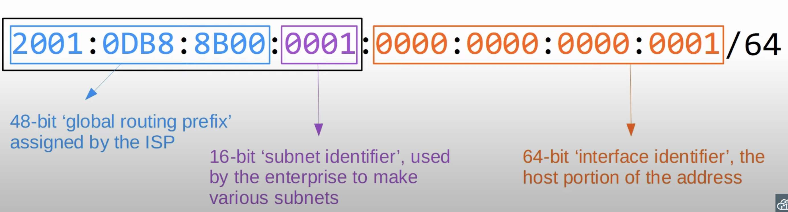

## Why IPv6?
* The main reason is that there simply aren't enough IPv4 addresses available.
* There are 4,294,967,296 (2^32) addresses available.
* When IPv4 was being designed, the creators had no idea the internet would be as large as it is today.
* VLSM, private IPv4 addresses, and NAT have been used to conserve the use of IPv4 address space.
	* These are short-term solutions.
	* The long-term solution is IPv6.
### IPv4 Address Distribution
* IPv4 address assignments are controlled by IANA (Internet Assigned Numbers Authority).
* IANA distributes IPv4 address space to various RIPs (Regional Internet Registries), which then assign them to companies that need them.
## Basics of IPv6
* An IPv6 address is 128 bits.
* Addresses are written in hexadecimal.
* An IPv6 address is written as 32 hexadecimal values, split into 8 groups of 4 values using colons.
	* 2001:8DB8:5917:EABD:6562:17EA:C92D:59BD
* IPv6 addresses use the slash ( / ) notation to indicate the prefix length, even when configuring the address in the Cisco IOS CLI.
	* No more dotted decimal subnet masks.
	* For example, a /64 indicates that the first half is the network portion and the second half is the host portion.
* There are methods to shorten IPv6 addresses to make them simpler.
### Shortening (Abbreviating) IPv6 Addresses
* Leading 0s can be removed
	* 2001:0DB8:000A:001B:20A1:0020:0080:34BD
		* 2001:DB8:A:1B:20A1:20:80:34BD
		* The 0s are still part of the address, but there's no need to write them.
* Consecutive quartets of all 0s can be replaced with a double colon (::).
* Consecutive quartets of 0s can only be abbreviated once in an IPv6 address.
	* 2001:0DB8:0000:0000:0000:0000:0080:34BD
		* 2001:DB8::80:34BD
		* Combined both abbreviation methods.
	* 2001:0000:0000:0000:20A1:0000:0000:34BD
		* 2001::20A1:0:0:34BD
#### IPv6 Addresses Shortening Examples

### Expanding Shortened IPv6 Addresses
* Put leading 0s where needed (all quartets should have 4 hexadecimal characters).
	* FE80::2:0:0:FBE8
		* FE80::0002:0000:0000:FBE8
* If double colon used, replace it with all-0 quartets. Make sure there are 8 quartets in total.
	* FE80::0002:0000:0000:FBE8
		* FE80:0000:0000:0000:0002:0000:0000:FBE8
#### IPv6 Addresses Expanding Examples

### IPv6 Global Unicast Addresses Breakdown
The global unicast addresses are the regular IPv6 addresses that hosts can use over the internet. They aren't private or multicast addresses.

* Typically, an enterprise requesting IPv6 addresses from their ISP will receive a /48 block.
* The convention is to use a /64 prefix length. That means an enterprise has 16 bits to use to make subnets. However, that doesn't mean you'll ever only see /64 prefix lengths.
* The network portion of the address is made up by the 'global routing prefix' and the 'subnet identifier'.
* The remaining 64 bits can be used for hosts.
## Finding The IPv6 Prefix
* Finding the prefix of an IPv6 address with a /64 prefix length is easy. Simply make the second half of the address all 0s.
### Example 1
Find the IPv6 prefix of address `2001:0DB8:8B00:0001:0000:0000:0000:0001/64`
* `2001:DB8:8B00:1::/64`
### Example 2
Find the IPv6 prefix of address
`300D:00F2:0B34:2100:0000:0000:1200:0001/56`
* `300D:F2:B34:2100::/56`
* Even if the prefix length isn't /64, if the prefix length is a multiple of 4, it's easy to find the prefix length. The reason is that each hexadecimal value is 4 bits.
### Example 3
Find the IPv6 prefix of address `2001:0DB8:8B00:0001:FB89:017B:0020:0011/93`
* The network portion endS at the hex value of B in the 6th group. Only the first bit forms part of the network portion and the other 3 are part of the host bits.
	* 0xB --> 0d11 --> 0b1011
	* Setting host bits to 0 gives: 0b1000 --> 0d8 --> 0x8
	* 2001:DB8:8B00:1:FB89:178::/93
	* The B is changed to 8.
### More Examples

## Configuring IPv6 Addresses

* The 2001:db8 range is reserved for examples and documentation. They should never be used in real networks.

```
R1(config)#ipv6 unicast-routing
R1(config)#interface g0/0
R1(config-if)#ipv6 address 2001:db8:0:0::1/64
R1(config-if)#no shutdown

R1(config)#interface g0/1
R1(config-if)#ipv6 address 2001:db8:0:1::1/64
R1(config-if)#no shutdown

R1(config)#interface g0/2
R1(config-if)#ipv6 address 2001:0db8:0000:0002:0000:0000:0000:0001/64
R1(config-if)#no shutdown
```
* `ipv6 unicast-routing` allows the router to perform IPv6 routing.
* When an IPv6 address is configured on a router interface, a separate IPv6 address is configured on the interface.
	* **Link-Local Addresses** are configured automatically on an interface when you configure an IPv6 address when IPv6 is enabled on the interface.
	* IPv4 also has link-local addresses, but they aren't automatically enabled.