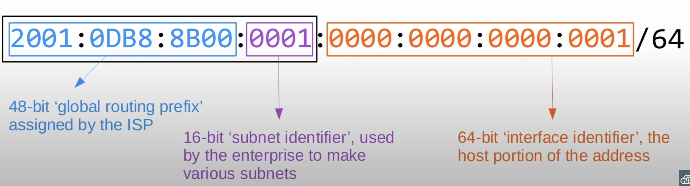
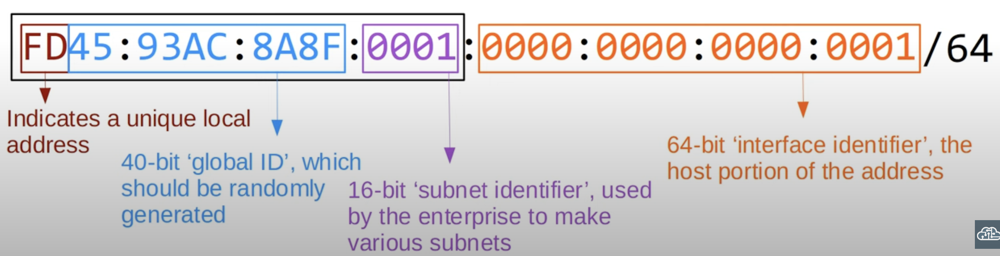
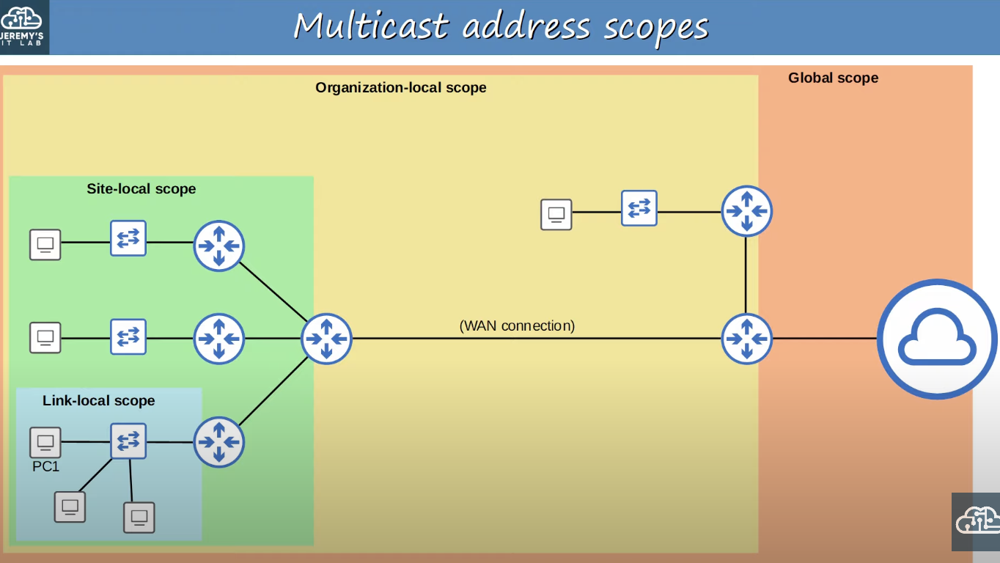
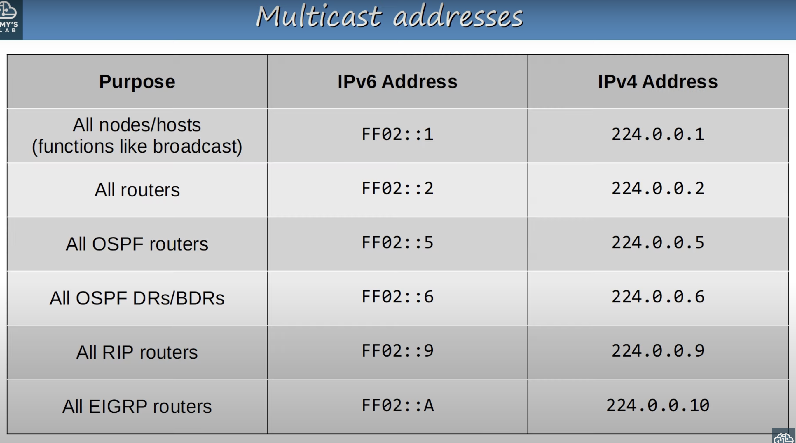

## IPv6 Address Types
### Global Unicast

* **Global unicast** IPv6 addresses are public addresses which can be used over the internet.
* Must register to use them. Because they are public addresses, it is expected that they are globally unique.
* Originally defined as the `2000::/3` block (`2000::` to `3FFF:FFFF:FFFF:FFFF:FFFF:FFFF:FFFF:FFFF`).
* Now defined as all addresses which aren't reserved for other purposes.
* Remember these three parts of an IPv6 Global Unicast Address:
	* Global routing prefix.
	* Subnet identifier.
	* Interface identifier.
### Unique Local

* **Unique local** IPv6 addresses are private addresses which *cannot be used over the internet.*
* You do not need to register to use them. They can be used freely within internal networks and don't need to be globally unique (you should try to make them unique though). 
* Can't be routed over the internet.
* Uses the address block `FC00::/7` (`FC00::` to `FDFF:FFFF:FFFF:FFFF:FFFF:FFFF:FFFF:FFFF`)
* However, a later update requires the 8th bit to be set to 1, so the first two digits must be `FD`.
	* `FD00::` to `FDFF:FFFF:FFFF:FFFF:FFFF:FFFF:FFFF:FFFF`
* The **global ID** should be unique so that addresses don't overlap when companies merge.
	* To achieve this, the *global id* should be randomly generated.
### Link Local
* **Link-local** IPv6 addresses are automatically generated on IPv6-enabled interfaces.
	* Use command `R1(config-if)#ipv6 enable` on an interface to enable IPv6 on an interface.
	* This will generate the Link-local address automatically even if an IP has not been configured on the interface yet.
* Uses the address block `FE80::/10` (`FE80::` to `FEBF:FFFF:FFFF:FFFF:FFFF:FFFF:FFFF:FFFF`).
* However, the standard states that the 54 bits after `FE80/10` should be all 0, so you won't see link local addresses beginning with FE9, FEA, or FEB. Only FE80.
* The interface ID is generated using EUI-64 rules.
* Link-local means that these addresses are used for communication within a single link (subnet). Routers will not route packets with a link-local destination IPv6 address.
* Common uses of link-local addresses:
	* Routing protocol peering (OSPFv3 uses link-local addresses for neighbor adjacencies).
	* Next-hop addresses for static routes.
	* Neighbor Discovery Protocol (NDP, IPv6's replacement for ARP) uses link-local addresses to function.
### Multicast
* Multicast addresses are one-to-many.
	* One source to multiple destinations (that have joined the specific multicast group).
	* IPv6 uses range `FF00::/8` for multicast.
		* `FF00::` to `FFFF:FFFF:FFFF:FFFF:FFFF:FFFF:FFFF:FFFF`.
* IPv6 doesn't use broadcast (There is no 'broadcast address' in IPv6).
* Routers join the `FF02::1` and `FF02::2` multicast groups by default. They also join the Solicited-Node multicast group that is generated from the unicast address on the interface.
#### Multicast Address Scopes

* IPv6 defines multiple multicast *scopes* which indicate how far the packet should be forwarded.
* IPv6 multicast scopes:
	* **Interface-local** (FF01): The packet doesn't leave the local device. It can be used to send traffic to a service within the local device.
	* **Link-local** (FF02): The packet remains in the local subnet. Routers will not route the packet between subnets.
	* **Site-local** (FF05):  The packet can be forwarded by routers. Should be limited to a single physical location (not forwarded over a WAN).
		* It's up to the network engineer to configure how far the site-local multicast will actually travel.
	* **Organization-local** (FF08): Wider in scope than site-local (an entire company/organization).
		* It's up to the network engineers to configure the boundaries of the scope.
	* **Global** (FF0E): No boundaries. Possible to be routed over the internet.
		* No boundaries doesn't mean that global multicast messages will be sent to every destination over the internet.
#### Important IPv4 & IPv6 Broadcast Addresses

* All these IPv6 multicast addresses use the link-local scope (FF02), which stays in the local subnet.
	* Note that this is a different concept than an IPv6 Link-local address, which begins with FE80.
### Anycast
* **Anycast** is a new feature of IPv6.
* Anycast is *one-to-one-of-many*.
	* There are multiple possible destinations, but the traffic is only sent to one.
* Multiple routers are configured with the same IPv6 address.
	* They use a routing protocol to advertise the address.
	* When hosts send packets to that destination address, routers will forward it to the nearest router configured with that IP address (based on routing metric).
* There is no specific address range for anycast addresses. Use a regular unicast address (global unicast, unique local) and specify it as an anycast address:
	* `R1(config-if)#ipv6 address 2001:db8:1:1::99/128 anycast`.
### Other
#### ::
* The unspecified IPv6 address.
* Can be used when a device doesn't yet know its IPv6 address.
* IPv6 default routes (default gateway) are configured to `::/0`.
* IPv4 equivalent: `0.0.0.0`.
#### ::1
* The loopback address.
* Used to test the protocol stack on the local device.
* Messages sent to this address are processes within the local device, but not sent to other devices.
* IPv4 equivalent: `127.0.0.0/8`.