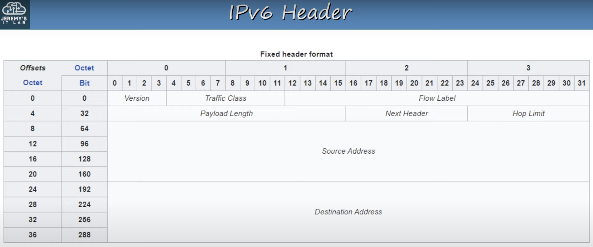
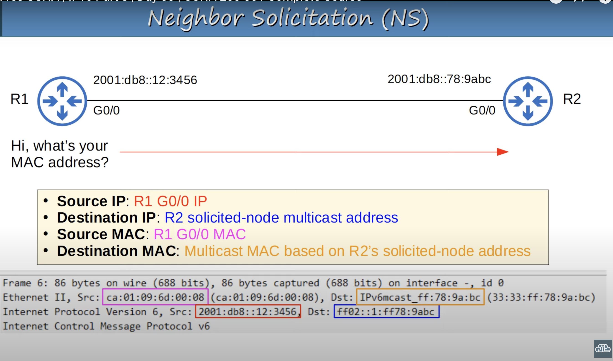
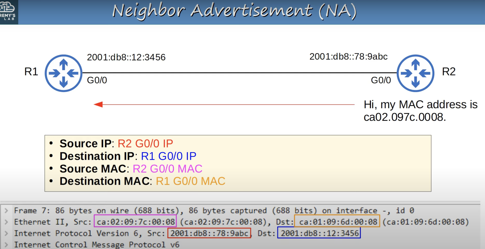
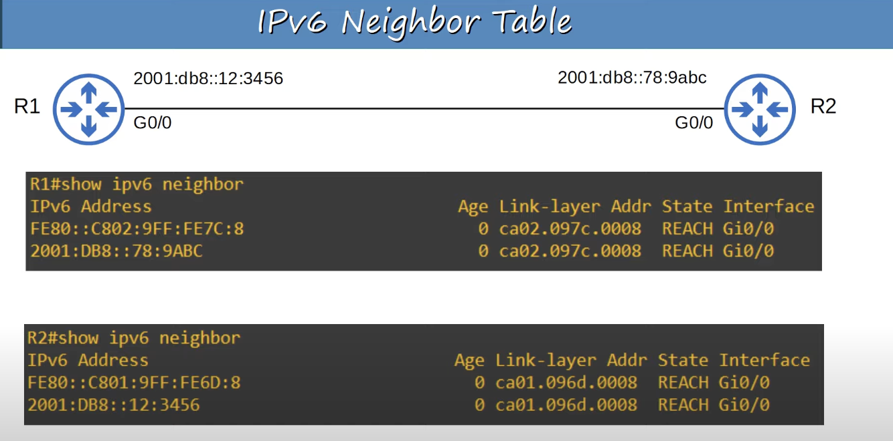
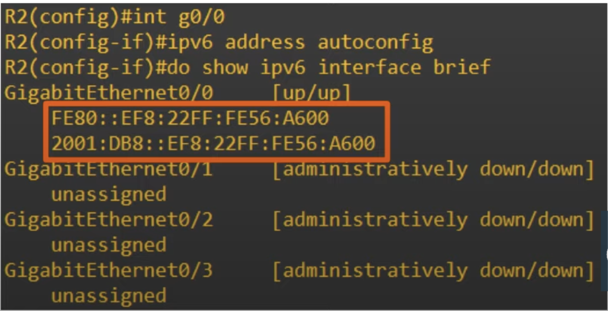
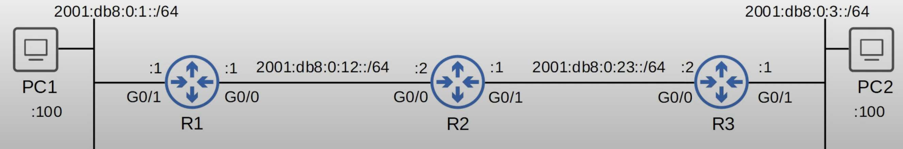

## IPv6 Header

* The IPv6 header has a fixed size of 40 bytes compared to the IPv4 header (20 - 60 bytes).
* **Version**: 
	* 4 bits in length.
	* Indicates the version of IP that is used.
	* Fixed value of 6 (0b0110) to indicate IPv6.
* **Traffic Class**:
	* 8 bits in length.
	* Used for QoS (Quality of Service) to indicate high-priority traffic.
	* For example, IP phone traffic, live video calls, etc, will have a Traffic Class value which gives them priority over other traffic.
* **Flow Label**:
	* 20 bits in length.
	* Used to identify specific traffic 'flows' (communication between a specific source and destination).
* **Payload Length**:
	* 16 bits in length.
	* Indicates the length of the payload (the encapsulated Layer 4 segment) in bytes.
	* The length of the IPv6 header itself isn't included because it's always 40 bytes.
* **Next Header**:
	* 8 bits in length.
	* Indicates the type of the 'next header' (header of the encapsulated segment). For example, TCP or UDP.
	* Same function as the IPv4 header's 'Protocol' field.
* **Hop Limit**:
	* 8 bits in length.
	* The value in this field is decremented by 1 by each router that forwards it. If it reaches 0, the packet is discarded.
	* Same function as the IPv4 header's TTL field.
* **Source/Destination Address**: 
	* 128 bits each.
	* These fields contain the IPv6 addresses of the packet's source and the packet's intended destination.
## Solicited-Node Multicast Address
* An IPv6 solicited-node multicast address is calculated from a unicast address.
* The address begins with a fixed prefix. Then, add the last 6 hex digits of the unicast address for which this solicited-node address is being generated from.
	* `ff02:0000:0000:0000:0000:0001:ff` + Last 6 hex digits of unicast address
### Solicited-Node Multicast Address Example 1
* Unicast address:
	* `2001:0db8:0000:0001:0f2a:4fff:fea3:00b1`
* Solicited-Node Multicast Address:
	* `ff02:0000:0000:0000:0000:0001:ffa3:00b1`
	* `ff02::1:ffa3:b1`
### Solicited-Node Multicast Address Example 2
* Unicast Address:
	* `2001:db8:0:1:489:4eda:073a:12b8`
* Solicited-Node Multicast Address:
	* `ff02::1:ff3a:12b8`
## Neighbor Discovery Protocol (NDP)
* Neighbor Discovery Protocol (NDP) is a protocol used with IPv6.
* It has various functions, and one of those functions is to replace ARP, which is no longer used in IPv6.
* The ARP-like function of NDP uses ICMPv6 and solicited-node multicast addresses to learn the MAC address of other hosts.
	* Two message types are used:
		* Neighbor Solicitation (NS): ICMPv6 Type 135.
			* ARP in IPv4 uses broadcast messages for ARP requests.
			* Solicited-node multicast messages are much more efficient, being addresses to a specific host, unlike a broadcast which is for all hosts.
		* Neighbor Advertisement (NA): ICMPv6 Type 136.
* Another function of NDP allows hosts to automatically discover routers on the local network.
	* Two messages are used for this process:
		* Router Solicitation (RS): ICMPv6 Type 133.
			* Sent to multicast address `ff02::2` (all routers).
			* Asks all routers on the local link (local network) to identify themselves.
			* Sent when an interface is enabled / host is connected to the network.
		* Router Advertisement (RA): ICMPv6 Type 134.
			* Sent to multicast address `ff02::1` (all nodes). All hosts on the local link (local network) receive this message.
			* The router announces its presence, as well as other information about the link (local network).
			* These messages are sent in response to RS messages.
			* They are also sent periodically, even if the router hasn't received a RS.
### Neighbor Solicitation (NS)

### Neighbor Advertisement (NA)

### IPv6 Neighbor Table
IPv6 doesn't use ARP, therefore there isn't an ARP table. Instead, the devices will keep an IPv6 neighbor table.

* IPv6 Address:
	* Lists neighbor global unicast addresses and their link-local address as well. The link-local address is learned automatically.
* Age:
	* Indicates how long ago traffic was received from these addresses (in minutes).
* Link-layer Address:
	* Shows the device's MAC address.
* Interface:
	* Shows the interface this entry was learned on.
* State:
	* Do research on it if you want (not needed for CCNA).
### Duplicate Address Detection
* Duplicate Address Detection (DAD), which is another function of NDP, allows hosts to check if other devices on the local link are using the same IPv6 address.
* Any time an IPv6-enabled interface initializes (`no shutdown` command), or an IPv6 address is configured on an interface (by any method: manual, SLAAC, etc.), it perform DAD.
* DAD uses two messages: NS and NA.
	* The host will send an NS to the solicited-node multicast address joined based on the configured IPv6 address on the interface.
	* If it doesn't get a reply, it knows the address is unique.
	* If it gets a reply (a NA message), it means another host on the network is already using the address.
## SLAAC
* Stands for **Stateless Address Auto-configuration** and it is an IPv6 address configuration mechanism.
* SLAAC is a standard function of IPv6 and end hots like PCs can do this too, not just routers. Although hosts don't use Cisco IOS commands.
* Hosts use the RS/RA messages to learn the IPv6 prefix of the local link (ie. `2001:db8::/64`), and then automatically generate an IPv6 address.
* Using the `ipv6 addres autoconfig` command, you don't need to enter the network prefix and interface identifier. The device uses NDP to learn the prefix used on the local link (local network).
* The device will use EUI-64 to generate the interface ID, or it will be randomly generated (depending on the device/maker).

In this example below, R1 is connected to R2. R1 is configured with an IPv6 address, but R2 doesn't have one yet. The command `ipv6 address autoconfig` is used on R2's G0/0 interface to automatically assign it an IPv6 address.

## IPv6 Static Routing
* IPv6 routing works the same as IPv4 routing. However, the two processes (IPv4 routing, IPv6 routing) are separate on the router, each with their own separate routing table.
* Display IPv6 routing table: `show ipv6 route`.
* IPv4 routing is enabled by default.
* IPv6 routing is disabled by default, and must be enabled with `ipv6 unicast-routing`.
* If IPv6 routing is disabled, the router will be able to send and receive IPv6 traffic, but will not route IPv6 traffic (will not forward it between networks).
### IPv6 Routing Table
* A *connected network* route is automatically added for each connected network.
* A local *host route* is automatically added for each address configured on the router.
* Routes for link-local addresses are not added to the routing table.

### Configure Static Route
**Command** :`ipv6 route destination/prefix-length {next-hop | exit-interface [next-hop]} [ad]`
* **Directly attached** static route: only the exit interface is specified.
	* In IPv6, you can't use directly attached static routes for Ethernet interfaces (it works for serial interfaces though).
	* The route will be part of the router's routing table, but it won't forward any traffic if it's an Ethernet interface.
* **Recursive** static route: Only the next hop is specified.
* **Fully Specified** static route: Both the exit interface and next hop are specified.
#### Link-Local Next-Hops
When using a Link-Local address as the next hop, a *fully specified* route is required, otherwise it won't work. The router isn't able to figure out, on its own, which interface that next-hop address is connected to.
* Link-local addresses are not added to the routing table!
### IPv6 Static Route Types
**Network route**: a route to a specific subnet.
* `R1(config)#ipv6 route 2001:db8:0:3::/64 2001:db8:0:12::2`
**Host Route**: a route to a single specific host.
* `R2(config)#ipv6 route 2001:db8:0:1::100/128 2001:db8:0:12::1`
* `R2(config)#ipv6 route 2001:db8:0:3::100/128 2001:db8:0:23::2`
* Since there are probably plenty of other PCs in the these networks, we wouldn't normally use host routes in a situation like this. It's best to just configure two network routes on R2.
**Default Route**: 
* `R3(config)#ipv6 route ::/0 2001:db8:0:23::1`
**Floating Static Route**: By raising the AD (administrative distance), we can make static backup routes, called **floating static routes**.
* Always set the AD to higher than the main route.
* If the main route to the destination was learned via OSPF, for example, you'll need to set the static route's AD to higher than 110, because OSPF's AD is 110.

