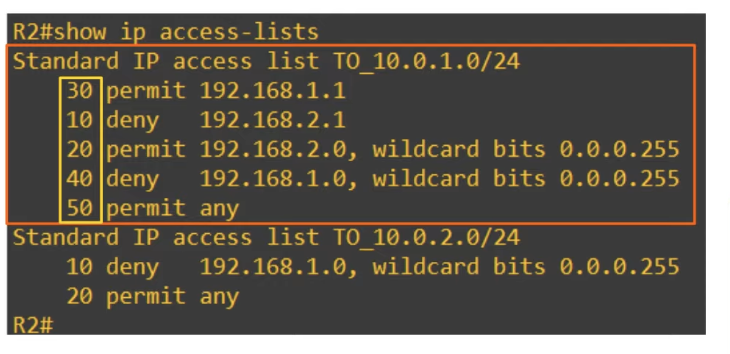

## What Are ACLs?
* ACLs (Access Control Lists) have multiple uses.
	* We are focusing on ACLs from a security perspective to control who has access to different parts of the network.
* ACLs function as a packet filter, instructing the router to permit or discard specific traffic.
	* The default behavior of router interfaces without an ACL applied to them is to forward all traffic.
* ACLs can filter traffic based on source/destination IP addresses, source/destination Layer 4 ports, etc.
* ACLs should be applied to achieve a specific security requirement.
## How ACLs Work
* ACLs are configured globally on the router (global config mode). However, applying the ACL in global configuration mode will not make the ACL take affect. The ACL must be applied to an interface.
* ACLs are made up of one or more ACEs (Access Control Entries).
* ACLs are applied either inbound or outbound.
	* A maximum of one ACL can be applied to a single interface per direction. Applying a second ACL to an interface in the same direction, will replace the existing one.
	* **Inbound**: Maximum one ACL.
	* **Outbound**: Maximum one ACL.
### Router ACLs Check Process
* When the router checks a packet against the ACL, it processes the ACEs in order, from top to bottom.
	* The order of the ACEs in an ACL matter.
* If the packet matches one of the ACEs in the ACL, the router takes the action and stops processing the ACL. All entries below the matching entry will be ignored.
### Implicit Deny
* There is an implicit deny at the end of all ACLs. The implicit deny tells the router to deny all traffic that doesn't match any of the configured entries in the ACL.
* Always be aware of the implicit deny when configuring ACLs, or you might deny traffic that you didn't want to deny.
## ACL Types
* **Standard ACLs**: Match based on source IP address only.
	* Standard Numbered ACLs.
	* Standard Named ACLs.
* **Extended ACLs**: Match based on source/destination IP, source/destination port, etc.
	* Extended Numbered ACLs.
	* Extended Named ACLs.
### Standard Numbered ACLs
* Standard ACLs match traffic based only on the source IP address of the packet.
* Numbered ACLs are identified with a number (ie. ACL 1, ACL 2, etc) that determine their order.
* Different types of ACLs have a different range of numbers that can be used.
	* Standard ACLs can use 1 - 99 and 1300 - 1999.
#### Standard Numbered ACL Configuration
```
R1(config)#access-list number {deny | permit} ip wildcard-mask
```
* `R1(config)#access-list 1 deny 1.1.1.1 0.0.0.0` 
	* Denies a single host (`1.1.1.1/32`).
* `R1(config)#access-list 1 deny 1.1.1.1` 
	* When you specify a /32 mask in an ACL, the wildcard mask is not required.
	* Can only be used to specify a single host (`/32`).
* `R1(config)#access-list 1 deny host 1.1.1.1`
	* This is an old method of creating an ACL that still works in modern routers. It is equivalent as the two methods listed above.
	* Can only be used to specify a single host (`/32`).

**Avoid implicit blocking of all traffic**
```
R1(config)#access-list 1 permit any

R1(config)#access-list 1 permit 0.0.0.0 255.255.255.255
```
* The two methods above, are equivalent.
**ACL Remark**
```
R1(config)#access-list 1 remark <remark>
```
* The ACL remark sets a description hat helps you determine the purpose of the ACL when looking at it in the configuration.

**Display ACLs**
```
// Display all kind of ACLs
R1(enable)#show access-lists

// Display only IP ACLs
R1(enable)#show ip access-lists
```

**Apply ACL to an interface**
```
R1(config-if)#ip access-group <number> {in | out}
```
#### Standard Numbered ACLs Configuration Example

**Requirements**:
* PC1 can access `192.168.2.0/24`.
* Other PCs in the `192.168.1.0/24` can't access `192.168.2.0/24`.
**ACL 1**:R1 g0/2 outbound
* If source IP = `192.168.1.1/32`, then permit.
* if source IP = `192.168.1.0/24`, then deny.
* If source IP = any, then permit.
```
// it's a /32 so the wildcard-mask is not needed
R1(config)#access-list 1 permit 192.168.1.1
R1(config)#access-list 1 deny 192.168.1.0 0.0.0.255
R1(config)#access-list 1 permit any

R1(config)#interface g0/2
R1(config-if)#ip access-group 1 out
```
* **Standard ACLs should be applied as close to the destination as possible**. If you don't do that, you might block more traffic than you intended.
	* The destination in this case is the `192.168.2.0/24` network.
### Standard Named ACLs
* Standard ACLs match traffic based only on the source IP address of the packet.
* Named ACLs are identified with a name (ie. Block_BOB).
#### Standard Named ACLs Configuration

**Enter standard named ACL config mode**
```
R1(config)#ip access-list standard acl-name

R1(config-std-nacl)#[entry-number] {deny | permit} ip wildcard-mask
```
* Standard named ACLs are configured by entering 'standard named ACL config mode', and then configuring each entry within that config mode.
* It's possible to specify an entry number for each entry to control the order of the entries, although it's not necessary.
	* Each entry's number will be 10 more than the previous one if done automatically.
```
R1(config)#ip access-list standard BLOCK_BOB
R1(config-std-nacl)#5 deny 1.1.1.1
R1(config-std-nacl)#10 permit any
R1(config-std-nacl)#remark remark-content

R1(config-std-nacl)#interface g0/0
R1(config-if)#ip access-group BLOCK_BOB in
```

**Display ACLs**
```
R1#show access-lists

R1#show running-config | section access-list

R1#show ip access-lists
```
#### Standard Named ACLs Configuration Example

**Requirements**:
* PCs in `192.168.1.0/24` can't access `10.0.2.0/24`.
* PC3 can't access `10.0.1.0/24`.
* Other PCs in `192.168.2.0/24` can access `10.0.1.0/24`.
* PC1 can access `10.0.1.0/24`.
* Other PCs in the `192.168.1.0/24` can't access `10.0.1.0/24`.
**ACL TO_10.0.2.0/24**: R2 G0/2 Outbound
* If source IP = `192.168.1.0/24`, then deny.
* If source IP = any, then permit.
**ACL TO_10.0.1.0/24** :R2 G0/1 Outbound
* if source IP = `192.168.2.1/32`, then deny.
* if source IP = `192.168.2.0/24`, then permit.
* if source IP = `192.168.1.1/32`, the permit.
* if source IP = `192.168.1.0/24`, then deny.
* If source IP = any, then permit.
```
R2(config)#ip access-list standard TO_10.0.2.0/24
R2(config-std-nacl)#deny 192.168.1.0 0.0.0.255
R2(config-std-nacl)#permit any
R2(config-std-nacl)#interface g0/2
R2(config-if)#ip access-group TO_10.0.2.0/24 out

R2(config-if)#ip access-list standard TO_10.0.1.0/24
R2(config-std-nacl)#deny 192.168.2.1
R2(config-std-nacl)#permit 192.168.2.0 0.0.0.255
R2(config-std-nacl)#permit 192.168.1.1
R2(config-std-nacl)#deny 192.168.1.0 0.0.0.255
R2(config-std-nacl)#permit any
R2(config-std-nacl)#interface g0/1
R2(config-if)#ip access-group TO_10.0.1.0/24 out
```

**Display IP  ACLs**
```
R2#show ip access-lists
```

* The router may re-order the /32 ACE (access control entries) of an ACL.
	* As shown above, the ACEs are not ordered in the order that they were created, indicated by the 'entry numbers' assigned to them (creation order: 10, 20, 30, 40, 50). 
* This improves the efficiency of processing the ACL. However, it does not change the effect of the ACL.
* This applies to both standard named and standard numbered ACLs.
* Packet Tracer does not do this (It does not reorder them).

