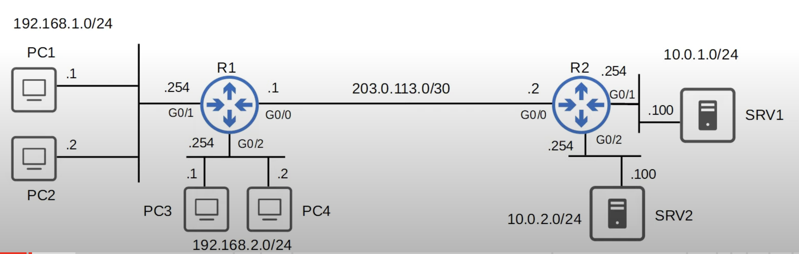

## What Are ACLs?
* ACLs (Access Control Lists) have multiple uses.
	* We are focusing on ACLs from a security perspective to control who has access to different parts of the network.
* ACLs function as a packet filter, instructing the router to permit or discard specific traffic.
	* The default behavior of router interfaces without an ACL applied to them is to forward all traffic.
* ACLs can filter traffic based on source/destination IP addresses, source/destination Layer 4 ports, etc.
* ACLs should be applied to achieve a specific security requirement.
## How ACLs Work
* ACLs are configured globally on the router (global config mode). However, applying the ACL in global configuration mode will not make the ACL take affect. The ACL must be applied to an interface.
* ACLs are made up of one or more ACEs (Access Control Entries).
* ACLs are applied either inbound or outbound.
	* A maximum of one ACL can be applied to a single interface per direction. Applying a second ACL to an interface in the same direction, will replace the existing one.
	* **Inbound**: Maximum one ACL.
	* **Outbound**: Maximum one ACL.
### ACL Requirement & Satisfaction Example

**Requirement**:
* Hosts in `192.168.1.0/24` can access the `10.0.1.0/24` network.
* Hosts in `192.168.2.0/24` cannot access the `10.0.1.0/24` network.
**Requirement satisfaction**: ACL 1
* If source IP = `192.168.1.0/24`, then permit.
* If source IP = `192.168.2.0/24`, then deny.
* If source IP = any, then permit.
### Router ACLs Check Process
* When the router checks a packet agains the ACL, it processes the ACEs in order, from top to bottom.
	* The order of the ACEs in an ACL matter.
* If the packet matches one of the ACEs in the ACL, the router takes the action and stops processing the ACL. All entries below the matching entry will be ignored.
### Implicit Deny
* There is an implicit deny at the end of all ACLs. The implicit deny tells the router to deny all traffic that doesn't match any of the configured entries in the ACL.
* Always be aware of the implicit deny when configuring ACLs, or you might deny traffic that you didn't want to deny.
## ACL Types
* **Standard ACLs**: Match based on source IP address only.
	* Standard Numbered ACLs.
	* Standard Named ACLs.
* **Extended ACLs**: Match based on source/destination IP, source/destination port, etc.
	* Extended Numbered ACLs.
	* Extended Named ACLs.
### Standard Numbered ACLs
* Standard ACLs match traffic based only on the source IP address of the packet.
* Numbered ACLs are identified with a number (ie. ACL 1, ACL 2, etc).
* Different types of ACLs have a different range of numbers that can be used.
	* Standard ACLs can use 1 - 99 and 1300 - 1999.
* The basic command to configure a standard numbered ACL is: `R1(config)#access-list number {deny | permit} ip wildcard-mask`
	* `R1(config)#access-list 1 deny 1.1.1.1 0.0.0.0` 
		* Denies a single host (`1.1.1.1/32`).
	* `R1(config)#access-list 1 deny 1.1.1.1` 
		* When you specify a /32 mask in an ACL, the wildcard mask is not required.
		* Can only be used to specify a single host (`/32`).
	* `R1(config)#access-list 1 deny host 1.1.1.1`
		* This is an old method of creating an ACL that still works in modern routers. It is equivalent as the two methods listed above.
		* Can only be used to specify a single host (`/32`).
### Standard Named ACLs
