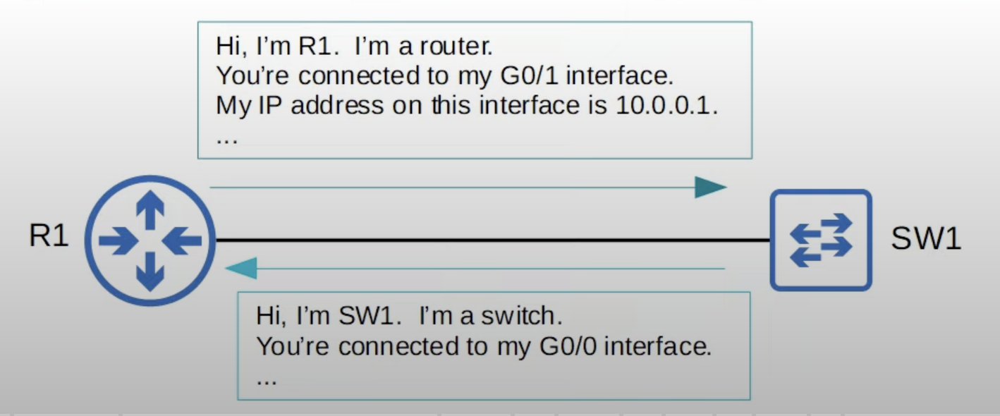

## Intro to Layer 2 Discovery Protocols

* Layer 2 discovery protocols such as **CDP** and **LLDP** share information with and discover information about neighboring (connected) devices.
* These protocols operate at Layer 2, they don't use IP addresses. However, they can be used to share layer 3 information such as IP addresses too.
* The shared information includes host name, IP address, device type, etc.
* CDP is a Cisco proprietary protocol.
* LLDP is an industry standard protocol (IEEE 802.1AB).
* Because they share information about the devices in the network, they can be considered a security risk and are often not used. It is up to the network engineer/admin to decide if they want to use them in the network or not.
## Cisco Discovery Protocol (CDP)
* CDP is a Cisco proprietary protocol.
* It is enabled on Cisco devices (routers, switches, firewalls, IP phones, etc) by default.
* CDP messages are periodically sent to multicast MAC address `0100.0CCC.CCCC`.
* By default CDP messages are sent once every 60 seconds, out of all interfaces that are in an up state.
* When a device receives a CDP message, it processes and discards the message. It does not forward it to other devices.
	* Only directly connected neighbors can become CDP neighbors.
* When a device receives these CDP messages from a neighboring device, it adds an entry for the device in its CDP neighbor table.
* The default timer is 60 seconds.
* By default, the CDP holdtime is 180 seconds. If a message isn't received from a neighbor for 180 seconds, the neighbor is removed from the CDP neighbor table.
	* The holdtime is reset to 180 if it hasn't expired when a CDP message arrives.
* CDPv2 messages are sent by default.
	* CDPv1 is very old so it's not commonly used.
### CDP Show Commands


```
R1#show cdp
Global CDP information:
	Sending CDP packets every 60 seconds
	Sending a holdtime value of 180 seconds
	Sending CDPv2 advertisements in enabled
```
* CDP must be enabled on the device to view information about it.

```
R1#show cdp traffic
```
* Tells us how many CDP packets, how many CDP advertisements, the device has sent and received.

```
R1#show cdp interface
```
* Provides basic information about each interface. Although, it is possible to specify a specific interface.
* Provides basic summary of how many interfaces are CDP-enabled, how many are in a down state, and how may are in an up state.

```
R1#show cdp neighbors
```
* Fields displayed:
	* **Device ID**: device ID of the neighbor.
	* **Local Interface**: Interface on the local device through which the CDP was received.
	* **Holdtime**: displays the current holdtime.
	* **Capability**: displays the capabilities of the neighbor device.
	* **Platform**: displays the model of the neighbor device.
	* **Port ID**: displays the interface through which the neighbor device is connected to this device.

```
R1#show cdp neighbors detail
```

* The command displays additional information for each neighbor.
* It shows the software version (IOS version) running on the neighbor device.
* If the neighbor device is a Switch, it will also display VTP (VLAN trunking protocol) information.
	* Only CDP can do this since VTP is also a Cisco proprietary protocol.
* Displays native VLAN of neighbor device if applicable.
* Displays duplex settings of neighbor device.
* With the last two fields (Native VLAN, Duplex), CDP helps identify any mismatches of native VLAN or interface duplex.
	* If a mismatch is found, DCP will display messages on the device to let you know.

```
R1# show cdp entry R2
```
* Display the detailed CDP information for a single neighbor.
* Can be useful in cases where the device has a lot of CDP neighbors.

### CDP Configuration Commands
* CDP is globally enabled by default.
* CDP is also enabled on each interface by default.
* Enable/disable CDP globally: `R1(config)#[no] cdp run`
* Enable/disable CDP on specific interfaces: 
	* `R1(config-if)#[no] cdp enable`
* Configure CDP timer: `R1(config)#cdp timer seconds`
	* Specifies how often CDP messages are sent
* Configure CDP holdtimer: `R1(config)#cdp holdtime seconds`
* Enable/disable CDPv2:`R1(config)#[no] cdp advertise-v2`
### CDP Wireshark Capture

## Link Layer Discovery Protocol (LLDP)
* LLDP is an industry standard protocol (IEEE 802.1AB), so many different vendors implement it on their devices. 
* It would usually be used in a multi-vendor network, not just Cisco.
* It is usually disabled on Cisco devices by default, so it must be manually enabled.
* A device can run CDP and LLDP at the same time.
* LLDP messages are periodically sent to multicast MAC address `0180:C200.000E`
* When a device receives an LLDP message, it processes and discards the message. It does not forward it to other devices.
	* Only directly connected devices can become LLDP neighbors.
* By default, LLDP messages are sent once every 30 seconds.
* By default, the LLDP holdtime is 120 seconds.
* LLDP has an additional timer called the 'reinitialization delay'. If LLDP is enabled (globally or on an interface), this timer will delay the actual initialization of LLDP. The timer is 2 seconds by default.
	* The device won't send LLDP messages out of its interfaces immediately when LLDP is enabled. It will wait for the initialization timer to expire.
### LLDP Configuration
* LLDP is usually globally disabled and also disabled on each interface by default. 
* To enable LLDP you need to enable it globally and then enable it on each interface.
* Enable/disable LLDP globally: `R1(config)#[no] lldp run`.
* Enable LLDP on an interface (tr): `R1(config-if)#lldp transmit`.
	* Enables the interface to send LLDP messages. However, it won't receive LLDP messages, it will simply discard them.
* Enable LLDP on an interface (rx): `R1(config-if)#lldp receive`.
	* Enables the interface to receive LLDP messages.
* Configure LLDP timer: `R1(config)#lldp timer seconds`
	* Specifies how often LLDP messages are sent.
* Configure LLDP hold timer: `R1(config)#lldp holdtime seconds`
* Configure LLDP reinit timer: `R1(config)#lldp reinit seconds`.
### LLDP Show Commands


Shows basic information about LLDP (timers, version).
```
R1#show lldp
```

Displays how many LLDP messages have been sent and received.
```
R1#show lldp traffic
```

Displays which interfaces LLDP tx/rx is enabled on.
```
R1#show lldp interface
```

Lists LLDP neighbors and some basic information about each neighbor.
```
R1#show lldp neighbors
```

Lists each LLDP neighbor with more detailed information.
```
R1#show lldp neighbors detail
```

Displays the same info as above, but for the specified neighbor only.
```
R1#show lldp entry name
```

### LLDP Wireshark Capture
