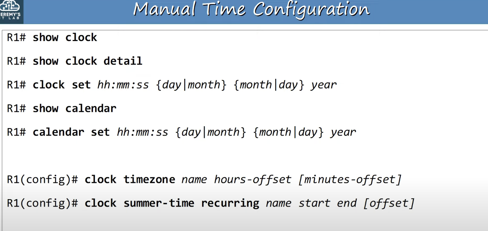
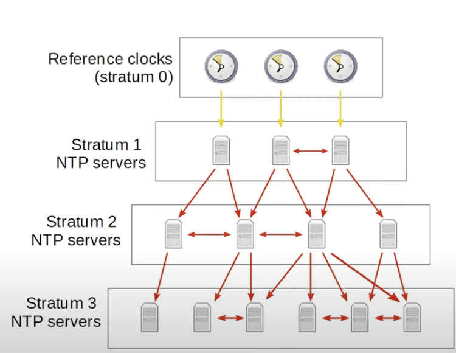
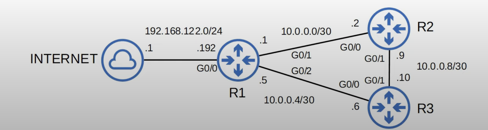
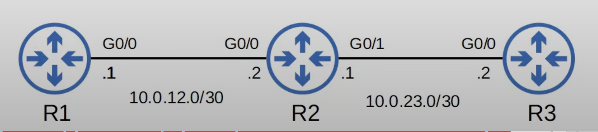

## The Importance of Time for Network Devices
* All devices have an internal clock (routers, switches, your PC, etc).
* In Cisco IOS, you can view the time with the `show clock` command.
* The default time zone is UTC (Coordinated Universal Time).
	* NTP uses only the UTC time zone.
* If you use the `show clock detail` command, you can view the time source of the device.
	* The hardware calendar is the default time source. It is the internal built-in internal clock of the device.
* The `*` before the device clock indicates that the time is not considered authoritative. The device is not confident that the time is accurate.
* The internal hardware clock of a device will drift over time, so it is not the ideal time source.
* From a CCNA perspective, the most important reason to have accurate time on a device is to have accurate logs for troubleshooting.
	* **Syslog** is the protocol used to keep device logs.
## Manual Time Configuration
### Software Clock Configuration
```
R2#clock set hh:mm:ss {day|month} {month|day} year
```
* Although the hardware calendar (built-in clock) is the default time-source, the hardware clock and software clock are separate and can be configured separately.
### Hardware Clock Configuration
```
R2#calendar set hh:mm:ss {day|month} {month|day} year

// sync calendar to the clock's time
R2#clock update-calendar

// sync clock to the calendar's time
R2#clock read-calendar
```
* Typically you will want to synchronize the 'clock'  and 'calendar'.


* For the *start* and *end* you need to include the following when specifying the daylight saving time:
	* Week
	* Weekday
	* Month
	* Time
* Always set up timezone and summer time. Not doing this can make the clock incorrect, even with an NTP server.
## NTP Basics
* Manually configuring the time on devices is not scalable.
* The manually configured clocks will drift, resulting in inaccurate time.
* NTP (Network Time Protocol) allows automatic syncing of time over a network.
* NTP clients request the time from NTP servers.
* A device can be an NTP server and an NTP client at the same time.
* Cisco devices can operate in three NTP modes: 
	* **Server mode**
	* **Client mode**
	* **Symmetric active mode**
* NTP allows accuracy of time within ~1 millisecond if the NTP server is in the same LAN, or within ~50 milliseconds if connecting to the NTP server over a WAN/the internet.
* Some NTP servers are better than others. The distance of an NTP server from the original **reference clock** is called **stratum**.
	* The further away from the reference clock, the higher the stratum.
	* If the stratum level of a server is high, it is considered less accurate.
* NTP uses UDP port 123 to communicate.
### Reference Clocks
* A reference clock is usually a very accurate time device like an atomic clock or a GPS clock.
* Reference clocks are **stratum 0** within the NTP hierarchy.
* NTP servers directly connected to reference clocks are **stratum 1**.
### NTP Hierarchy

* Reference clocks are **stratum 0**.
* **Stratum 1** NTP servers get their time from reference clocks.
* **Stratum 2** NTP servers get their time from stratum 1 NTP servers.
* **Stratum 3** NTP servers get their time from stratum 2 NTP servers.
* **Stratum 15** is the maximum. Anything above that is considered unreliable.
* Devices can also 'peer' with devices at the same stratum level to provide more accurate time. This also serves as a backup, in case they lose access to the lower-stratum NTP server.
	* This mode is called 'symmetric active' mode.
* An NTP client can sync to multiple NTP servers.
* **Primary servers**: NTP servers that get their time directly from reference clocks.
* **Secondary Servers**: NTP servers that get their time from other NTP servers. They operate in server and client mode at the same time.
## NTP Configuration
In the topology below, R1 syncs to an NTP server over the internet.

```
R1(config)#ntp server 216.239.25.0 prefer
R1(config)#ntp server 216.239.35.4
R1(config)#ntp server 216.239.35.8
R1(config)#ntp server 216.239.35.12
```
* The order in which the servers are entered does not matter. R1 will ask all of them for the time and will select whichever give the best, quickest responses.
* The NTP server selected might change if the responses start slowing down or it stops responding altogether.
* It's best to select multiple NTP servers so that the device can always have a reliable source of time.
* The NTP server `216.239.35.9` has been selected as the preferred server and the others will be backups. This is optional.

```
R1#show ntp associations
```
* Displays all the NTP servers configured on the device. They are under the 'address' field/column.
* The 'ref clock' field indicates the reference clock of each NTP server.
* * sys.peer: The NTP server the device is currently syncing to.
* + candidate: Candidate NTP servers, but the device is not currently syncing its time to them.
* ~ configured: It means that the NTP server was configured.
* NTP servers marked as an 'outlayer' or 'falseticker' will not be used by the device to sync its time to.

```
R1#show ntp status
```
* States whether the clock is synchronized.
* States the stratum of the device, in this case R1.

```
R1(config)#ntp update-calendar
```
* Configure the router to update the hardware clock (calendar) with the time learned via NTP.
* Why sync the hardware clock ? The hardware clock tracks the date and time on the device even if it restarts, power is lost, etc, When the system is restarted, the hardware clock is used to initialize the software clock.
* NTP does not update the hardware calendar automatically. 

```
R1(config)#interface loopback 0
R1(config)#ip address 10.1.1.1 255.255.255.255
R1(config)#exit
R1(config)#ntp source loopback 0
```
* Usually in a small network, you would just configure all of the devices to sync to public NTP servers like Google's. However, in this case R2 was configured to use R1 as an NTP server.
* R1 was configured to use loopback 0 as the source of its NTP messages. Any NTP messages it sends, will come from the address assigned to the loopback 0 interface.
* A loopback interface was used because they provide a consistent way where the router can be reached, which isn't dependent on the status of any particular physical interface.

**R2 Configuration**
```
R2(config)#ntp server 10.1.1.1

R2(config)#interface loopback 0
R2(config)#ip address 10.2.2.2 255.255.255.255
R2(config)#exit
R2(config)#ntp source loopback 0
```

**R3 Configuration**
```
R3(config)#ntp server 10.1.1.1
R3(config)#ntp server 10.2.2.2
```
* NTP servers with lower stratum levels are preferred. Therefore, R1 is the preferred NTP server. They are closer to the time source and are considered more accurate.

### Configuring NTP Server Mode

If a device is already syncing to an NTP server, meaning it's an NTP client, it automatically acts as an NTP server too and other devices can sync to it. But what if there is no NTP server to sync to? You probably still want the devices in the network to have the same time, even if it is slightly inaccurate compared to the actual time.

How can you manually configure a Cisco device to operate as an NTP server, even though it isn't synced to another NTP server? 
```
R1(config)#ntp master [stratum-number]
```
* The default stratum of the `ntp master` command is 8.
* The source of the time will be set to a loopback IP address on the local device (127.0.0.0/8). Basically, R1 is using itself as its reference clock.
	* Loopback interfaces and loopback addresses are totally different concepts:
		* Loopback interfaces are virtual interfaces in the router and their addresses can be advertised to other devices using OSPF etc.
		* Loopback addresses are totally internal to the local device and can't be reached by other devices.
### Configuring NTP Symmetric Active Mode
Both R2 and R3 are syncing their time directly from R1, so they both have a stratum value of 9.  They are equals in terms of NTP.
```
R2(config)#ntp peer 10.0.23.2

R2(config)#ntp peer 10.0.23.1
```
* They can become peers and help each other sync their time, and also act as backups in case they lose contact with R1.
	* Devices do not need to have the same stratum level to become peers.
## Configuring NTP Authentication
* NTP authentication can be configured, although it is optional.
* It allows NTP clients to ensure they only sync to the intended servers. The client and server must be configured the same to allow syncing.
* To configure NTP authentication:
	* Enable NTP authentication: `ntp authenitcate`
	* Create NTP key: `ntp authentication-key key-number md5 key`
		* For the `key-number` just use the value of 1.
		* `key` is the password itself.
	* Specify trusted key(s): `ntp trusted-key key-number`
	* Specify which key to use for the server: `ntp server ip-address key key-number`.
		* This command isn't needed on the server itself (R1 in this case).
```
R1(config)#ntp authenticate
R1(config)#ntp authentication-key 1 md5 ccna
R1(config)#ntp trusted-key 1

R2(config)#ntp authenticate
R2(config)#ntp authentication-key 1 md5 ccna
R2(config)#ntp trusted-key 1
R2(config)#ntp server 10.0.12.1 key 1
R2(config)#ntp peer 10.0.23.2 key 1

R3(config)#ntp authenticate
R3(config)#ntp authentication-key 1 md5 ccna
R3(config)#ntp trusted-key 1
R3(config)#ntp server 10.0.12.1 key 1
R(config)#ntp peer 10.0.23.1 key 1
```
* The `ntp authenticate` command is not needed to enable NTP authentication.