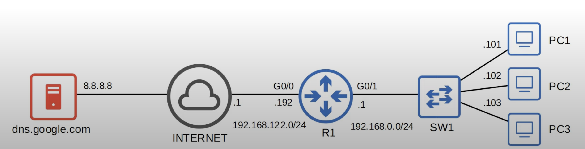

## The Purpose of DNS
* DNS is used to resolve human-readable names (google.com) to IP addresses.
* The DNS server(s) your device uses can be manually configured via DHCP.
## Basic Functions of DNS

`ipconfig /all`: 
* display various network information, including DNS in a windows computer.
`nslookup <domain-name>`:
* It tells the device to ask its DNS server for the Ip address of the specified domain name.
* You don't have to use the `nslookup` command before sending the ping. If your server doesn't know the correct IP address, it will automatically ask the DNS server.
### DNS UDP & TCP
* Standard DNS queries/responses typically use UDP. TCP is used for DNS messages greater than 512 bytes. In either case, port 53 is used.
### DNS Cache
* Devices will save the DNS server's responses to a local DNS cache. Therefore, they don't have to query the server every single time they want to access a particular destination.
	* View DNS cache on windows: `ipconfig /displaydns`
	* Clear DNS cache on windows: `ipconfig /flushdns`
### Host File
* In addition to a DNS cache, most devices have a 'hosts' file which is simply a list of hosts and IP addresses.
* This isn't DNS, it is a simple alternative to DNS. This was used before DNS was invented.
## Configuring DNS in Cisco IOS

* For hosts in a network to use DNS, you don't need to configure DNS on the routers. Routers will simply forward the DNS messages like any other packets.
* However, a Cisco router can be configured as a DNS server, although it's rare.
	* If an internal DNS server is used, usually it's a Windows or Linux server.
* A Cisco router can also be configured as a DNS client.
### Router DNS Server Configuration
```
R1(config)#ip dns server
```
* R1 is configured to act as a DNS server. If a client send a DNS query to R1, R1 will respond if it has the requested record.

```
R1(config)#ip host R1 192.168.0.1
R1(config)#ip host PC1 192.168.0.101
R1(config)#ip host PC2 192.168.0.102
R1(config)#ip host PC3 192.168.0.103
```
* A list of hostname/IP (host table) address mappings were also configured so it is able to respond to DNS queries.

```
R1(config)#ip name-server 8.8.8.8
```
* Configured a DNS server that R1 will query if the requested record isn't in its host table.

```
R1(config)#ip domain lookup
R1(config)#ip domain-lookup // old version of the command
```
* Enable R1 to perform DNS queries (enabled by default).
	* Without this command, R1 will not be able to query Google's DNS server

View the configured hosts, as well as the hosts learned and cached via DNS
```
R1#show hosts
```
* In the 'Flags' column, entries learned via DNS will have a value of temp (temporary). They are not permanent. Once they expire, they will have to be re-learned again.
	* The manually configured entries will have a value of perm (permanent).
### Router DNS Client Configuration
```
R1#ping youtube.com
Translating "youtube.com"
% Unrecognized host or address, or protocol not running.

R1(config)#ip name-server 8.8.8.8
R1(config)#ip domain lookup // enabled by default

R1#ping youtube.com
```
* This enables R1 as a DNS client and will not act as a DNS server. If PC 1 tries to use R1 as a DNS server, R1 will not reply to PC1's queries
* It is possible to configure a default domain name. The default domain will be automatically appended to any hostnames without a specific domain.
	* `R1(config)#ip domain name jeremysitlab.com`
	* ie. `ping pc1` will become `ping pc1.jeremysitlab.com`