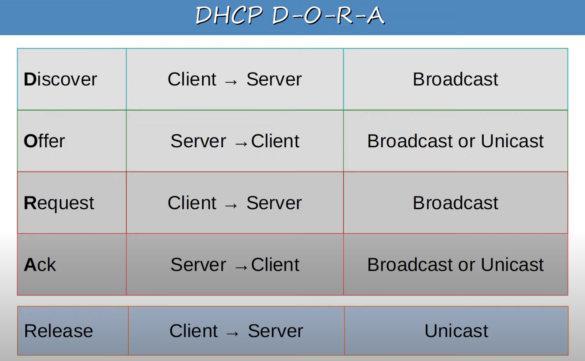
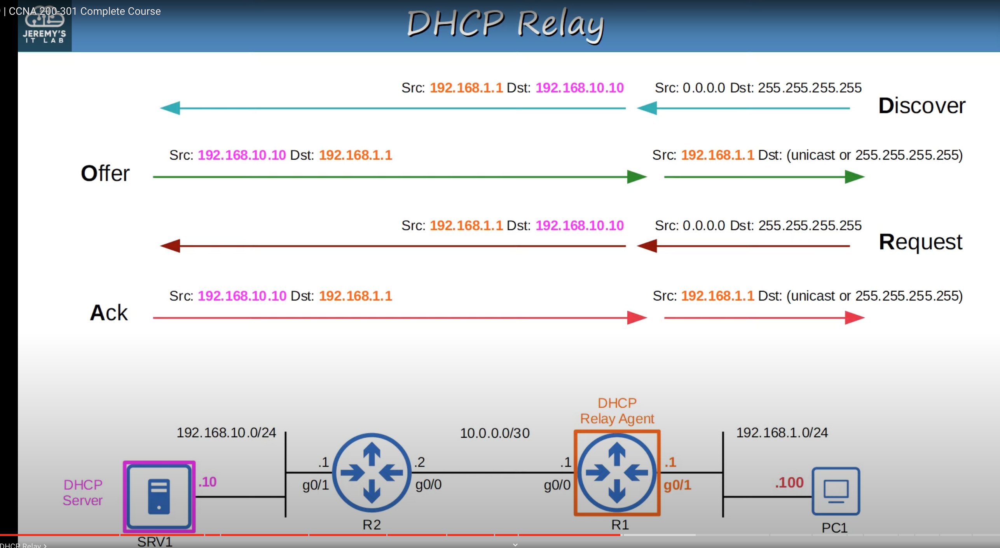
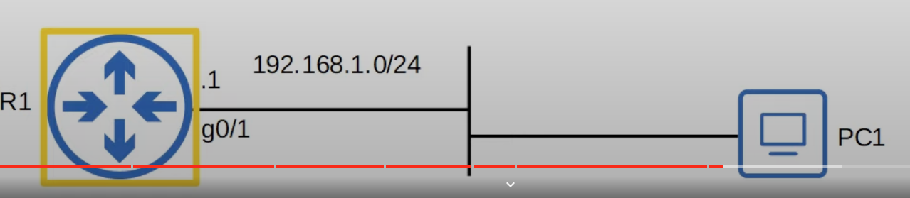
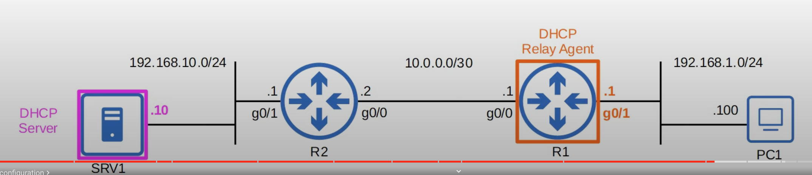

## The Purpose of DHCP
* DHCP is used to allow hosts to automatically/dynamically learn various aspects of their network configuration, such as IP addresses, subnet mask, default gateway, DNS server, etc, without manual/static configuration.
* It is an essential part of modern networks.
* Typically used for 'client devices' such as workstations (PCs), phones, etc.
* Devices such as routers, servers, etc, are usually manually configured.
* In small networks (such as home networks) the router typically acts as the DHCP server for hosts in the LAN.
* In larger networks, the DHCP server is usually a Windows/Linux server.
## Basic Function of DHCP

### Release IP
```
ipconfig /release
```
* The device releases the assigned IP address (windows).
* The device sends a DHCP release message to the DHCP server, setting it that the IP address isn't needed anymore.
	* The IP becomes available and can be assigned to another client.
### Get IP Address from DHCP Server
```
ipconfig /renew
```
* This process involves 4 messages
### DHCP Messages

#### DHCP Discover
* It is a broadcast message from the client asking if there is any DHCP servers in the local network.
#### DHCP Offer
* It is sent from the DHCP server to the client, offering an address for the client to use, as well as other information like default gateway, DNS server, etc.
#### DHCP Request
* It is sent from the DHCP client to the server, telling the server that it wants to use the IP address it was offered.
* This is important, there may be multiple DHCP servers on the local network, and all of them will reply to the client's Discover message with an offer. Therefore, the client has to specify which server it is accepting the offer from and request to use that IP address.
	* Typically, the client will accept the first offer it receives.
#### DHCP Ack
* Sent from the server to the client, confirming that the client may use the requested IP address.
* Once the message is received, the client configures the IP address on its network interface
### DHCP Relay

* Some network engineers might choose to configure each router to act as the DHCP server for its connected LANs.
* However, large enterprises often choose to use a centralized DHCP server.
* If the server is centralized, it won't receive the DHCP clients' broadcast DHCP messages (broadcast messages don't leave the local subnet).
* To fix this, you can configure a router to act as a **DHCP relay agent**.
* The router will then forward the client's broadcast DHCP messages to the remove DHCP server as unicast messages.
## Configuring DHCP in Cisco IOS

### Router DHCP Server Configuration


```
R1(config)#ip dhcp excluded-address 192.168.1.1 192.168.1.10
```
* Specify a range of addresses that won't be given to DHCP clients. The first address is the start of the range and the second address is the end of the range.
* These are addresses you want to reserve for network devices or servers in the local subnet.

```
R1(config)#ip dhcp pool LAB_POOL
```
* Create a DHCP pool, which is a subnet of addresses that can be assigned to DHCP clients, as well as other info such as DNS server and default gateway.
* You should create a separate DHCP pool for each network the router is acting as a DHCP server for.
	* In this case R1 is only acting as the DHCP server for `192.168.1.0/24`, so only one DHCP pool needed to be created.

```
R1(dhcp-config)#network 192.168.1.0 /24
```
* Specify the subnet of addresses to be assigned to clients (except the excluded addresses).

```
R1(dhcp-config)#dns-server 8.8.8.8
```
* Specify the DNS server that the DHCP clients should use.

```
R1(dhcp-config)#domain-name jeremysitlab.com
```
* You can also specify the domain name of the network.
	* ie. PC1 = pc1.jeremysitlab.com

```
R1(dhcp-config)#default-router 192.168.1.1
```
* Specify the default gateway for the DHCP clients to use.

```
R1(dhcp-config)#lease 0 5 30
```
* Specify the lease time.
	* `lease <days> <hours> <minutes>` or `lease infinite`

#### Display DHCP Server Bindings
```
R1# show ip dhcp binding
```
* Can be used on DHCP servers to display all the DHCP clients that are currently assigned IP addresses.

### Router DHCP Relay Agent Configuration


```
R1(config)#interface g0/1
R1(config-if)ip helper-address 192.168.10.10
```
* Configure the interface connected to the subnet of the client devices.
* Configure the IP address of the centralized DHCP server as the 'helper' address.
	* The DHCP relay router must have a route to the DHCP server (static, dynamically learned).

```
R1#show ip interface g0/1
```
* The helper address configured will be displayed.

### Router DHCP Client Configuration
* A router can be a DHCP client, meaning it can use DHCP to configure the IP address of its interfaces.
* This is rare since usually network devices will be configured with a fixed IP address.

```
R2(config)#interface g0/1
R2(config-if)#ip address dhcp
```
* Tell the router to use DHCP to learn the IP address of the current interface (g0/1).
* R2 will initiate the process (Discover, Offer, Request, Acknowledge) to obtain an IP address for its g0/1 interface with SRV1.
* The automatic assignment of IP addresses will only happen for the specified router interfaces. R2's g0/0 interface is still manually configured. 
#### Verify IP Assignment
```
R2#show ip interface g0/1
```
* It will state that the IP address given to the interface was determined by DHCP.