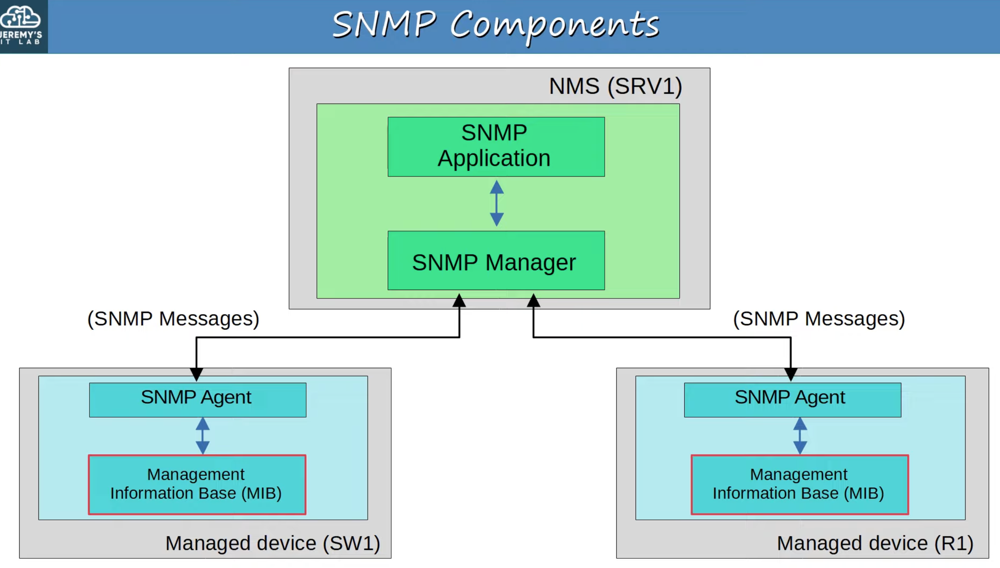
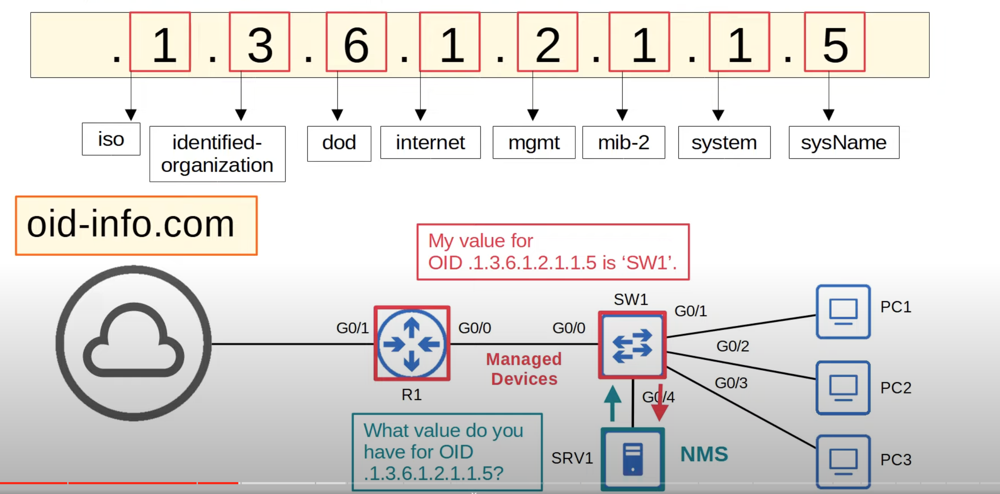
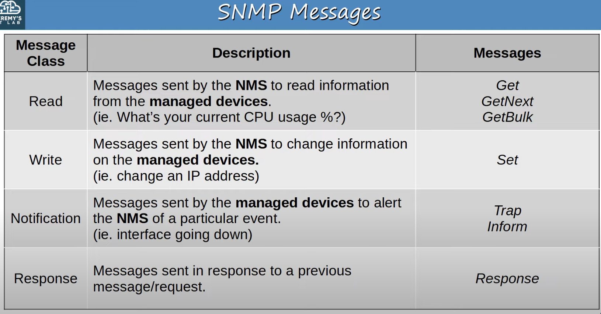
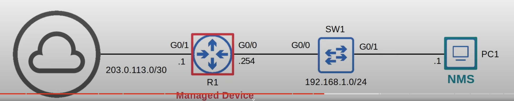

## SNMP Overview
* SNMP is an industry-standard framework and protocol that was originally released in 1988.
* SNMPv1:
	* RFC 1065 - Structure and identification of management information for TCP/IP-based internets.
	* RFC 1066 - Management information base for network management of TCP/IP-based internet.
	* RFC 1067 - A simple network management protocol.
* Don't let the 'Simple' in the name fool you! It can be quite complex.
* ==SNMP can be used to monitor the status of devices, make configuration changes, etc.==
* There are two main types of devices in SNMP:
	* **Managed Devices**:
		* These are the devices being managed using SNMP.
		* For example, network devices like routers and switches.
	* **Network Management Station (NMS)**:
		* The device/devices managing the managed devices.
		* This is the SNMP 'server'.
### SNMP Operations

* There are 3 main operations used in SNMP
	* Managed devices can notify the NMS of events.
		* Inform of an interface going down, etc.
	* The NMS can ask the managed devices for information about their current status.
		* Ask about the current CPU utilization, etc.
	* The NMS can tell the managed devices to change aspects of their configuration.
		* Instruct a managed router to change the IP of one of its interfaces, etc.
### SNMP Components

#### NMS Components
The green section represents the SNMP software on the NMS. The NMS probably isn't a machine dedicated to SNMP. It could just be the network admin's PC which is running SNMP software. 

* ==The **SNMP Manager** is the software on the NMS that interacts with the managed devices.==
	* ==It receives notifications, sends requests for information, sends configuration changes, etc.==
* ==The **SNMP Application** provides an interface for the network admin to interact with.==
	* ==Displays alerts, statistics, charts, etc.==
#### Managed Devices Components
The blue section represents the SNMP entity on the managed devices. 

* ==The **SNMP Agent** is the SNMP software running on the managed devices that interacts with the SNMP Manager on the NMS.==
	* ==It sends notifications to/receives messages from the NMS.==
* ==The **Management Information Base (MIB)** is the structure that contains the variables that are managed by SNMP.==
	* ==Each variable is identified with an Object ID (OID).==
	* ==Example variables: Interface status, traffic throughput, CPU usage, temperature, etc.==
### SNMP OIDs
* SNMP Object IDs are organized in a hierarchical structure.

The SNMP OID below is used by the NMS to retrieve the Hostname of a managed device.

## SNMP Version
* Many versions of SNMP have been proposed/developed, however only three major versions have achieved wide-spread use.
#### SNMPv1
* The original version of SNMP.
#### SNMPv2c
* Allows the NMS to retrieve large amounts of information in a single request, so it is more efficient.
* 'c' refers to the 'community strings' used as passwords in SNMPv1, removed from SNMPv2, and then added back for SNMPv2c.
#### SNMPv3
* A much more secure version of SNMP that supports string **encryption** and **authentication**. 
	* It makes sure that only the intended devices can read the SNMP messages. 
	* Messages can't be intercepted and read by an attacker.
* Whenever possible, this version should be used!
* In SNMPv1 and SNMPv2c, there is no encryption. The community strings and message contents are sent in plain-text. This is not secure, as the packets can easily be captured and read.

## SNMP Messages

### Read Message Class
#### Get
* A request sent from the manager to the agent to retrieve the value of a variable (OID), or multiple variables. The agent will send a Response message with the current value of each variable.
#### GetNext
* A request sent from the manager to the agent to discover the available variables (OIDs) in the MIB (Management Information Base).
#### GetBulk
* A more efficient version of the **GetNext** message (introduced in SNMPv2) that allows mass-retrieval of information from managed devices (agent).
### Write Message Class
#### Set
* A request sent from the manager to the agent to change the value of one or more variables. The agent will send a Response with the new value(s).
### Notification Message Class
#### Trap
* A notification sent from the agent to the manager. The manager does not send a Response message to acknowledge that it received the Trap, so these messages are considered 'unreliable'.
#### Inform
* A notification message that is acknowledged with a Response message. It is like trap message, but it is acknowledged with a Response message.
* Originally used for communications between managers, but later updates allow agents to send inform messages to managers, too.
## SNMP Port Numbers
* SNMP Agent listen for messages on UDP port 161.
* SNMP Manager listen for messages on UDP port 162.
## SNMPv2c Configuration (Basic)

NOTE: SNMP configuration isn't mentioned on the CCNA topics list, but could be useful.
* Won't set up the NMS, but will set up the SNMP agent on a Cisco router.

In this network, R1 is the managed device, and PC1 is the NMS.


```
R1(config)#snmp-server contact jeremy@jeremysitlab.com
R1(config)#snmp-server location Jeremy's House
```
* Configure optional contact information and location of the device.

```
R1(config)#snmp-server community Jeremy1 ro
R1(config)#snmp-server community Jeremy2 rw
```
* Configure the SNMP community strings (passwords).
* `ro` = read only = no Set messages.
	* A NMS using this password can only read information from R1.
* `rw` = read/write = can use Set messages.
	* A NMS using this password can read using Get messages and write using Set messages.
* There are default community strings that will be used if none are specified. However, it's best to configure the community strings and not use the defaults, as they are less secure.
	* ro = public
	* rw = private

```
R1(config)#snmp-server host 192.168.1.1 version 2c Jeremy1
```
* Specify the NMS, version ,and community string to use with this server.
* PC1 will be able to read information from R1, but it won't be able to use Set messages to make changes to R1 as determined by the community string used.

```
R1(config)#snmp-server enable traps snmp linkdown linkup
R1(config)#snmp-server enable traps config
```
* Configure the Trap types to send to the NMS
	* Will be triggered when an interface goes down or up.
	* Will be triggered when R1's configuration is changed.