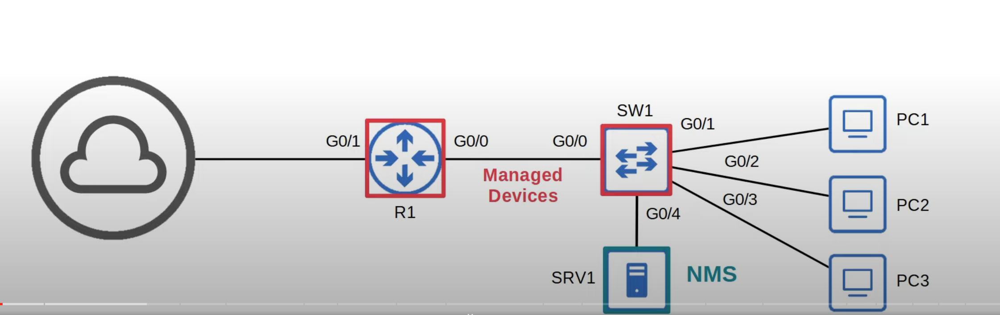

## SNMP Overview
* SNMP is an industry-standard framework and protocol that was originally released in 1988.
* SNMPv1:
	* RFC 1065 - Structure and identification of management information for TCP/IP-based internets.
	* RFC 1066 - Management information base for network management of TCP/IP-based internet.
	* RFC 1067 - A simple network management protocol.
* Don't let the 'Simple' in the name fool you! It can be quite complex.
* SNMP can be used to monitor the status of devices, make configuration changes, etc.
* There are two main types of devices in SNMP:
	* **Managed Devices**:
		* These are the devices being managed using SNMP.
		* For example, network devices like routers and switches.
	* **Network Management Station (NMS)**:
		* The device/devices managing the managed devices.
		* This is the SNMP 'server'.
### SNMP Operations

* There are 3 main operations used in SNMP
	* Managed devices can notify the NMS of events.
		* Inform of an interface going doing, etc.
	* The NMS can ask the managed devices for information about their current status.
		* Ask about the current CPU utilization, etc.
	* The NMS can tell the managed devices to change aspects of their configuration.
		* Instruct a managed router to change the IP of one of its interfaces, etc.
## SNMP Version

## SNMP Messages
## SNMP Configuration (Basic)
