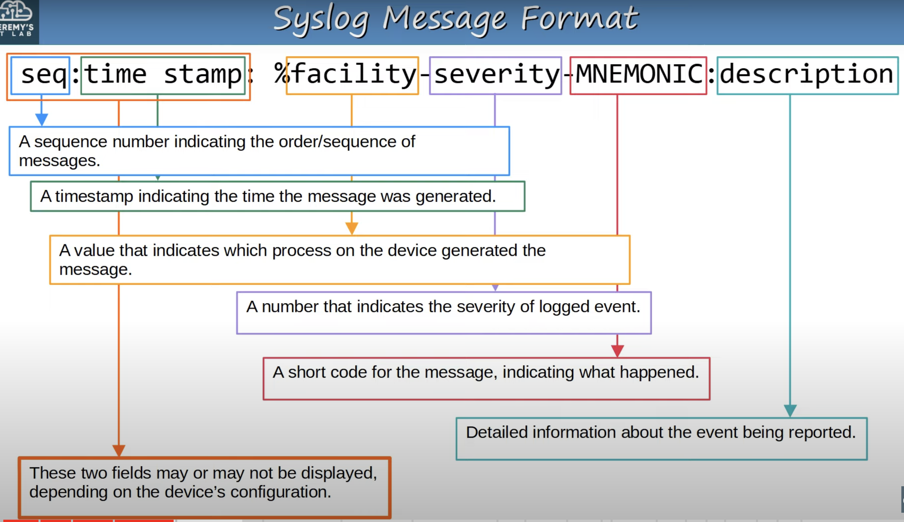
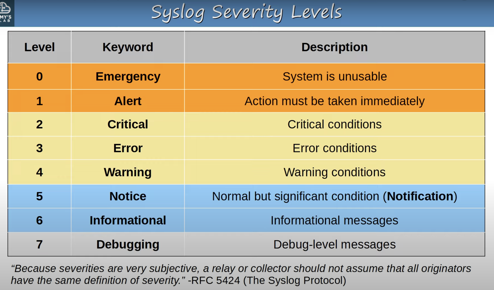
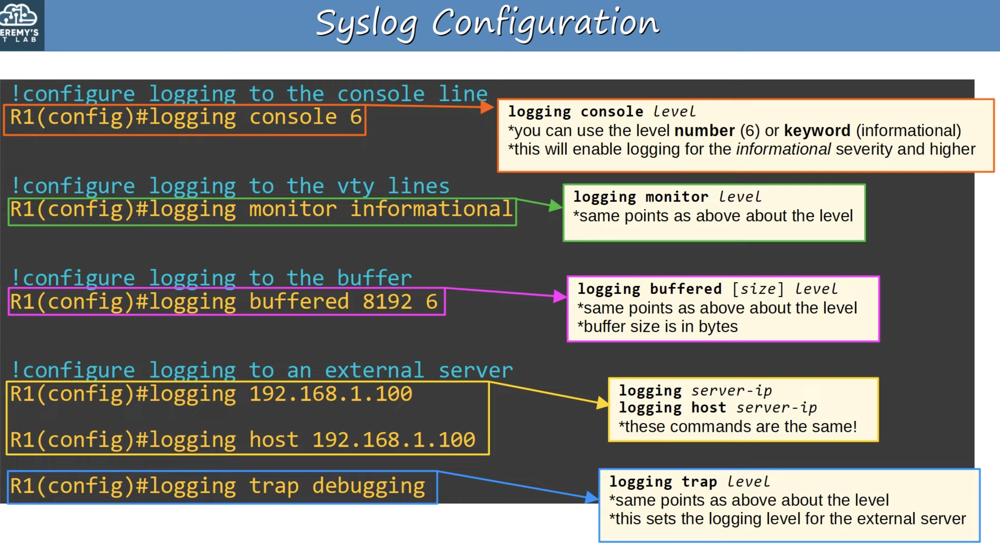
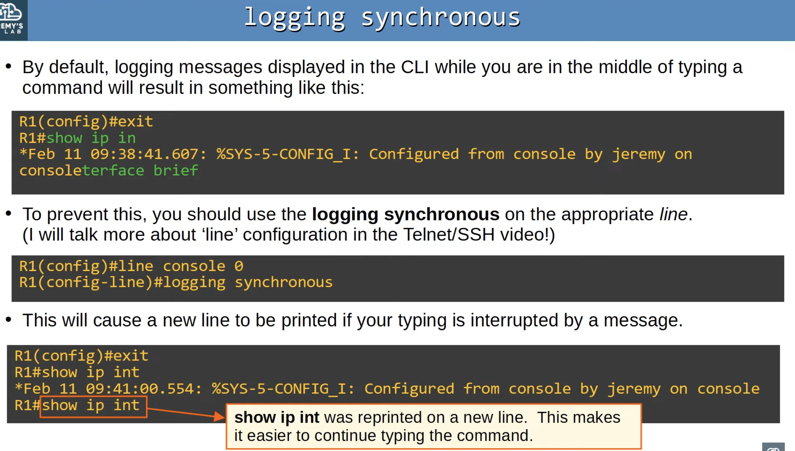

## Syslog Overview
* Syslog is an industry standard protocol for message logging.
* On network devices, Syslog can be used to log events such as changes in interface status (up <--> down), change in OSPF neighbor status (up <--> down), system restarts, etc.
* The messages can be displayed in the CLI, saved in the device's RAM, or sent to an external Syslog server.
* Logs are essential when troubleshooting issues, examining the cause of incidents, etc.
* Syslog and SNMP are both used for monitoring and troubleshooting of devices. They are complementary, but their functionalities are different.
## Syslog Message Format

* Make sure to identify each part of the Syslog message format.
### Syslog Message Examples
`*Feb 11 03:02:55.304: %LINK-3-UPDOWN: Interface GigabithEthernet0/0, changed state to up`

`*Feb 11 05:04:39.606: %OSPF-5-ADJCHG: Process 1, Nbr 192.168.1.2 on GibabitEthernet0/0 from LOADING to FULL, Loading Done`

`000043: *Feb 11 05:06:43.331: %SYS-5-CONFIG_I: Configured from console by jeremy on console`

`*Feb 11 07:27:23.346: %SYS-6-CLOCKUPDATE: System clock has been updated from 07:27:23 UTC Thu Feb 11 2021 to 16:27:23 JST Thu Feb 11 2021, configured from console by jeremy on console`
## Syslog Severity Levels

* Each vendor may interpret each level differently.
* **E**very **A**wesome **C**isco **E**ngineer **W**ill **N**eed **I**ce **D**aily.
## Syslog Logging Locations (facilities)
* **Console line**: Syslog messages will be displayed in the CLI when connected to the device via the console port. By default, all messages (level 0 - level 7) are displayed.
* **VTY lines**: Syslog messages will be displayed in the CLI when connected to the device via Telnet/SSH. Disabled by default.
	* `R1#terminal monitor` to display logs
* **Buffer**: Syslog messages will be saved to RAM. By default, all messages (level 0 - level 7) are displayed.
	* `show logging`: view messages stored in the logging buffer - in the memory of the device.
* **External server**: You can configure the device to send Syslog messages to an external server.
	* Having a central server for the Syslog messages makes network management easier and makes it easier to compare the logs of multiple devices.
	* Syslog servers will listen for messages on **UDP port 514**.
## Basic Syslog Configuration

* When you specify a level of log messages, all messages of that level and higher severity (numerically lower) will be displayed.
* By default all levels are included if no severity is specified.
### Terminal Monitor
```
R1#terminal monitor
```
* Even if **logging monitor** *level* is enabled, by default Syslog messages will not be displayed when connected via Telnet or SSH.
* This command must be used **every time you connect to the device via Telnet or SSH**.
### Logging Synchronous

### Display Syslog Message Timestamp
```
R1(config)#service timestamps log ?
	datetime
	uptime
```
* Command is used to display timestamp in Syslog messages
	* *datetime*: timestamps will display the date/time when the event occurred.
	* *uptime*: timestamp will display how long the device had been running when the vent occurred.
### Display Syslog Message Sequence Number
```
R1(config)#service sequence-numbers
```
* Display the sequence number of Syslog messages.
## Syslog vs SNMP
* Syslog and SNMP are both used for monitoring and troubleshooting of devices. They are complementary, but their functionalities are different.
* **Syslog** is used for message logging.
	* Events that occur within the system are categorized based on facility/severity and logged.
	* Used for system management, analysis, and troubleshooting.
	* Messages are sent from the device to the Syslog server. The Syslog server can't actively pull information from the devices (like SNMP **Get**) or modify variables (like SNMP **Set**).
* **SNMP** is used to retrieve and organize information about the SNMP managed devices.
	* Can retrieve IP addresses, current interface status, temperature, CPU usage, etc.
	* SNMP servers can use **Get** to query the clients and **Set** to modify variables on the clients.1234:56ff:fe78:90AB