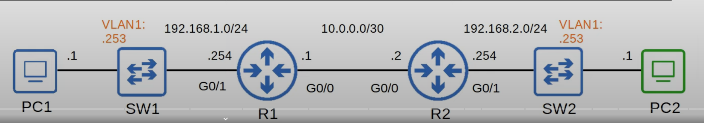
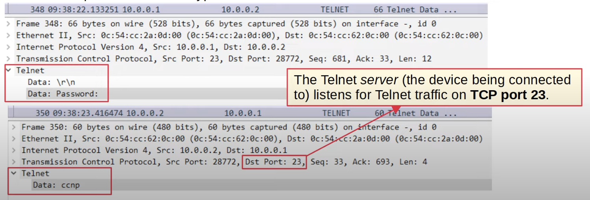
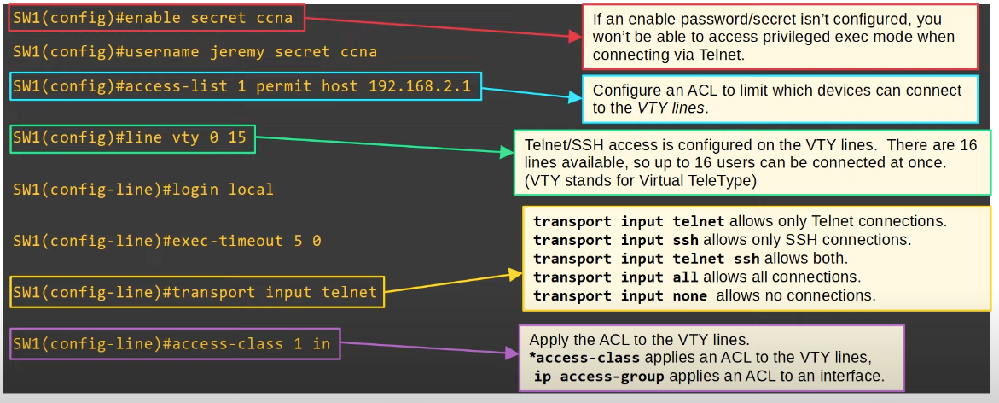
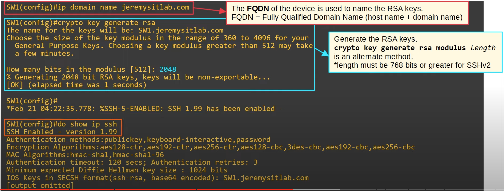
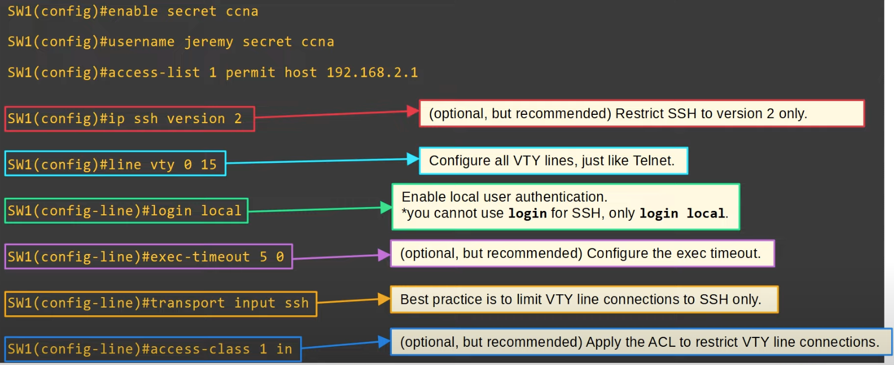

## Console Port Security
* By default, no password is needed to access the CLL of a Cisco IOS device via the console port.
* You can configure a password on the console line.
	* A user will have to enter a password to access the CLI via the console port.
* There is only a single console line, so the number is always 0.
	* This means that there can only be one console port connection at a time.
### Login
```
R1(config)#line console 0
R1(config-line)#password ccna
R1(config-line)#login

R1(config-line)#end
R1#
%SYS-5-CONFIG_I: Configured from console by console
R1#exit  

R1 con0 is now available
  
Press RETURN to get started.

User Access Verification

Password:

R1>
```
* Configured the console line's password
* `login` tells the device to require a user to enter the configured password to access the CLI via the console port.
### Login Local
* Alternatively, you can configure the console line to require users to login using one of the configured usernames on the device.
```
R1(config)#username jeremy secret ccnp
R1(config)#line console 0
R1(config-line)#login local

R1(config-line)#end
R1#
%SYS-5-CONFIG_I: Configured from console by console
R1#exit

R1 con0 is now available

Press RETURN to get started.

User Access Verification

Username: jeremy
Password:

R1>
```
* `login local` tells the device to require a user to login using one of the configured usernames on the device.
### Automatic Logout
```
R1(config-line)#exec-timeout 3 30
```
* Log the user out after 3 minutes and 30 seconds of inactivity.
## Layer 2 Switch Management IP
* Layer 2 switches don't perform packet routing and don't build a routing table. They aren't IP routing aware.
* However, you can assign an IP address to an SVI to allow remote connections to the CLI of the switch (using Telnet or SSH).


```
SW1(config)#interface vlan 1
SW1(config-if)#ip address 192.168.1.253 255.255.255.0
SW1(config-if)#no shutdown
SW1(config-if)#exit
```
* Configure the IP address on the SVI in the same way as on a multilayer switch.

```
SW1(config)#ip default-gateway 192.168.1.254
```
* Configure the switch's default gateway. 
* In this case, PC2 isn't in the same LAN as SW1. If SW1 doesn't have a default gateway, it can't communicate with PC2.
## Telnet
* Telnet (Teletype Network) is a protocol used to remotely access the CLI of a remote host.
* Telnet was developed in 1969.
* Telnet has been largely replaced by SSH, which is more secure.
* Telnet sends data in plain text. No encryption!.
### Telnet Wireshark Capture

### Telnet Configuration

* `line vty 0 15` means you are configuring all lines, from 0 - 15. This is recommended, so all of the VTY lines have the same configuration.
* `transport input ...` is how you to configure what kind of connections to the VTY lines are allowed.
* These configurations only apply to VTY line connections to SW1.
## Connecting via Telnet
```
telnet ip-address
```
## Secure Shell (SSH)
* SSH was developed in 1995 to replace less secure protocols like Telnet.
	* A shell is a computer program which exposes an operating system's services to a human user or other program.
* SSHv2, a major revision of SSHv1, was released in 2006.
* If a device supports both version 1 and version 2, it is said to run 'version 1.99'.
* Provides security features such as data encryption and authentication.
### SSH Configuration: Check SSH Support
* Before configuring SSH, make sure that the version of IOS on your device supports it.

```
R1#show version
Cisco IOS Software, C2900 Software (C2900-UNIVERSALK9-M), Version 15.1(4)M4, RELEASE SOFTWARE (fc2)
Technical Support: http://www.cisco.com/techsupport
Copyright (c) 1986-2012 by Cisco Systems, Inc.
Compiled Thurs 5-Jan-12 15:41 by pt_team
```
* IOS images that support SSH will have 'K9' in their name.
	* C2900-UNIVERSAL==K9==-M
* Cisco exports NPE (No Payload Encryption) IOS images to countries that have restrictions on encryption technologies.

```
R1#show ip ssh
SSH Disabled - version 1.99
%Please create RSA keys (of atleast 768 bits size) to enable SSH v2.
Authentication timeout: 120 secs; Authentication retries: 3
```
* This command also shows whether SSH is supported.
	* In this case it is supported, but currently disabled.
* The version number is '1.99', which means that it supports both SSH versions - v1 and v2.
### SSH Configuration: RSA Keys
* To enable and use SSH, you must generate an RSA public and private key pair.
	* To generate RSA key pair you need to configure the hostname and the domain name first. This is because they are both used to name the RSA keys.
* The keys are used for data encryption/decryption, authentication etc.

### SSH Configuration: VTY Lines

* A secret/password must be configured. Otherwise, you won't be able to access privileged exec mode when connecting via SSH.
* For SSH, only `login local` works, which means that a username must be created.
* Configured an ACL to limit which device can connect to the VTY lines.
### SSH Configuration Summary
1. Configure host name
2. Configure DNS domain name
3. Generate RSA key pair
4. Configure enable PW, username/PW
5. Enable SSHv2 (only)
6. Configure VTY lines
## Connecting via SSH
```
ssh -l username ip-address

OR

ssh username@ip-address
```
## NOTE
* SSH and Telnet use a client-server model.
	* The device being connected to is the server.
	* The device using SSH or Telnet to connect is the client.