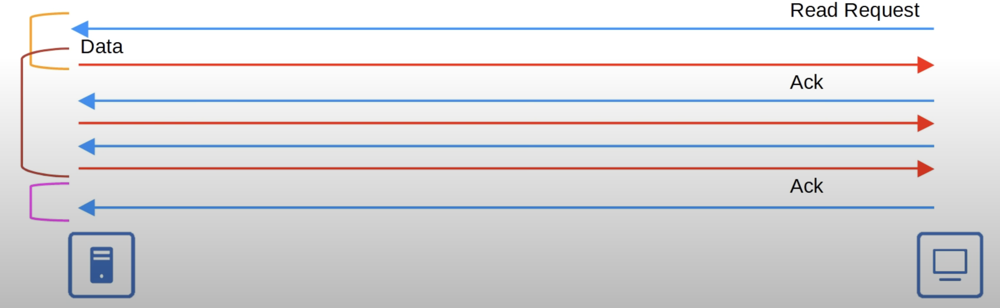
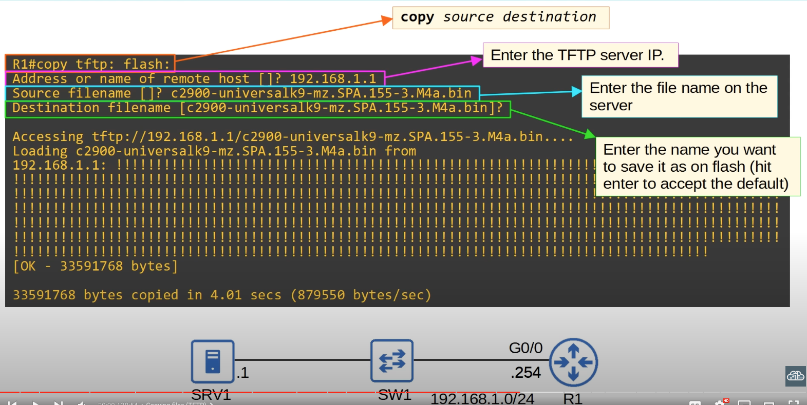

## The Purpose of FTP/TFTP
* FTP (File Transfer Protocol) and TFTP (Trivial File Transfer Protocol) are industry standard protocols used to transfer files over a network.
* They both use a client-server model.
	* Clients can use FTP or TFTP to copy files from a server.
	* Clients can use FTP or TFTP to copy files to a server.
* AS a network engineer, the most common use of FTP/TFTP is in the process of upgrading the operating system of a network device.
* You can use FTP/TFTP to download the newer version of IOS from a server, and then reboot the device with the new IOS image.
## TFTP
* TFTP was first standardized in 1981.
* Named 'Trivial' because it is simple and has only basic features compared to FTP.
	* Only allows a client to copy a file to or from a server.
* Was released after FTP, but is not a replacement of FTP. It is another tool used when lightweight simplicity is more important than functionality.
* No authentication (username/PW), so servers will respond to all TFTP requests.
* No encryption, so all data is sent in plan text.
* Best used in a controlled environment to transfer small files quickly.
* TFTP servers listen on **UDP PORT 69**.
	* UDP is connectionless and doesn't provide reliability with transmissions. However, TFTP has similar built-in features within the protocol itself.
### TFTP Reliability

* Every TFTP data message is acknowledged.
	* If the client is transferring a file to the server, the server will send Ack messages.
	* If the server is transferring a file to the client, the client will send Ack messages.
* Timers are used, and if an expected message isn't received in time, the waiting device will resend its previous message again.
	* TFTP uses 'lock-step' communication. The client and server alternately send a message and then wait for a reply (retransmissions are sent as needed).
	* This method of reliability isn't as efficient as TCP's forward acknowledgment and sliding window, but gets the job done
### TFTP Connections

* TFTP file transfers have three phases:
	* **Connection**: TFTP client sends a request to the server, and the server responds back, initializing the connection.
	* **Data Transfer**: The client and server exchange TFTP messages. One sends data and the other sends acknowledgements.
	* **Connection Termination**: After the last data message has been sent, a final acknowledgement is sent to terminate the connection.
### TFTP TID
This is beyond the scope of the CCNA


* When the client sends the first message to the server, the destination port is UDP 69 and the source is a random ephemeral port.
* This random port is called a **Transfer Identifier (TID)** and identifies the data transfer.
* The server then also selects a random TID to use as the source port when it replies, not 69.
* When the client sends the next message, the destination port will be the server's TID, not 69.
## FTP
* FTP was first standardized in 1971.
* FTP uses TCP ports 20 and 21.
	* FTP data connections use TCP port 20.
	* FTP control connections use TCP port 21.
* Username and passwords are used for authentication, however there is no encryption.
* For greater security, FTPS (FTP over SSL/TLS) can be used.
	* An upgrade to FTP.
* SSH File Transfer Protocol (SFTP) can also be used for grater security.
	* An entirely new protocol.
* FTP is more complex than FTP and allows not only file transfers, but clients can also navigate file directories, add and remove directories, list files, etc.
* The client sends FTP commands to the server to perform these functions.
### FTP Control Connections

* FTP uses two types of connections:
	* An **FTP control** connection (TCP 21) is established and used to send FTP commands and replies.
	* When files or data are to be transferred, separate **FTP data** (TCP 20) connection are established and terminated as needed.
### Active Mode FTP Data Connections

* The default method of establishing FTP data connections is **active mode**, in which the server initiates the data connection.
	* The FTP control connection is maintained throughout this whole process. Therefore, there are two active connections.
### Passive Mode FTP Data Connections

* In FTP **passive mode**, the client initiates the data connection. This is often necessary when the client is behind a firewall, which could block the incoming connection from the server.
	* Firewalls usually don't permit 'outside' devices to initiate connections. In this case, FTP **passive mode** is used and the client (behind the firewall) initiates the TCP connection.
### NOTE
* Active and passive mode only apply to the FTP data connections because the client always initiates the control connection.
## FTP vs TFTP

## IOS File Systems
* A file system is a way of controlling how data is stored and retrieved.
* The `show file systems` command can be used to view the file system of a Cisco IOS device.
* There are different types of file systems (not in CCNA topics):
	* **disk**: Storage devices such as flash memory. 
		* Usually where the Cisco IOS file itself is stored.
		* When the device boots up, it copies the IOS file from flash into RAM.
	* **opaque**: Used for internal functions.
	* **nvram**: Internal NVRAM. 
		* The startup-config file is stored here.
	* **network**: Represents external file systems.
		* For example, FTP/TFTP servers.
## Upgrading Cisco IOS
* You can view the current version of IOS with `show version`.
* You can view the contents of flash with `show flash`.
### Copying Files  (TFTP)

* The new IOS version is fetched from a TFTP  server (SRV1) to the local device (R1).
* Specifying `tftp` as the source in the copy command specifies to use TFTP to retrieve the IOS file.
* Specifying `fash` as the destination, states where to save the IOS file in the local device (R1) once it is fetched.
* The name of the file on the TFTP server must be know in advance, as TFTP is not capable of finding what files are available.
### Copying Files (FTP)

* Configure the FTP username/password that the device will use when connecting to the FTP server.
	* These credentials must be the same in the FTP server for the connection to occur.
### Perform Upgrade
It does not matter whether FTP or TFTP is used to obtain the IOS file. Once the file is in the local device, the method of performing the upgrade is the same.

```
R1(config)#boot system flash:c2900-universalk9-mz.SPA.155-3.M4a.bin
R1#write memory
R1#reload
```
* If the `boot system filepath` command is not used, the router will use the first IOS file it finds in flash.
* Make sure to save the configuration before reloading the device. Otherwise, the configuration changes won't take effect.
* Then simply restart the device for the change to take effect.

```
R1#delete filepath
```
* Finally, delete the old Cisco IOS version that is no longer needed.
## Using FTP/TFTP in IOS
