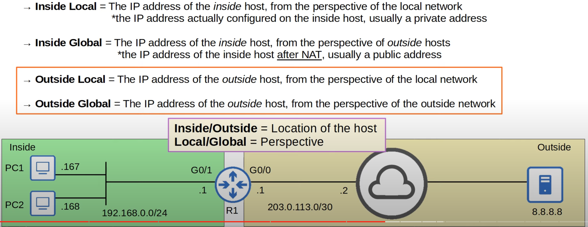
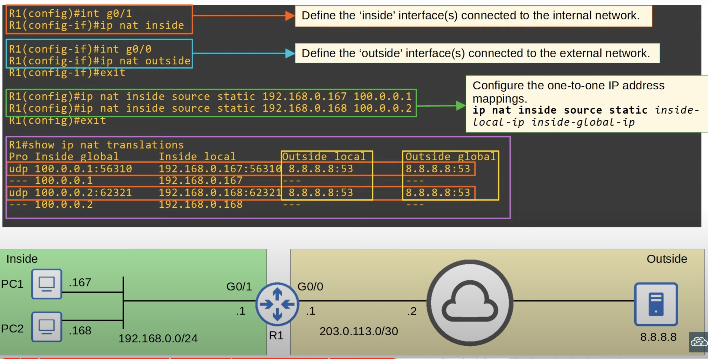
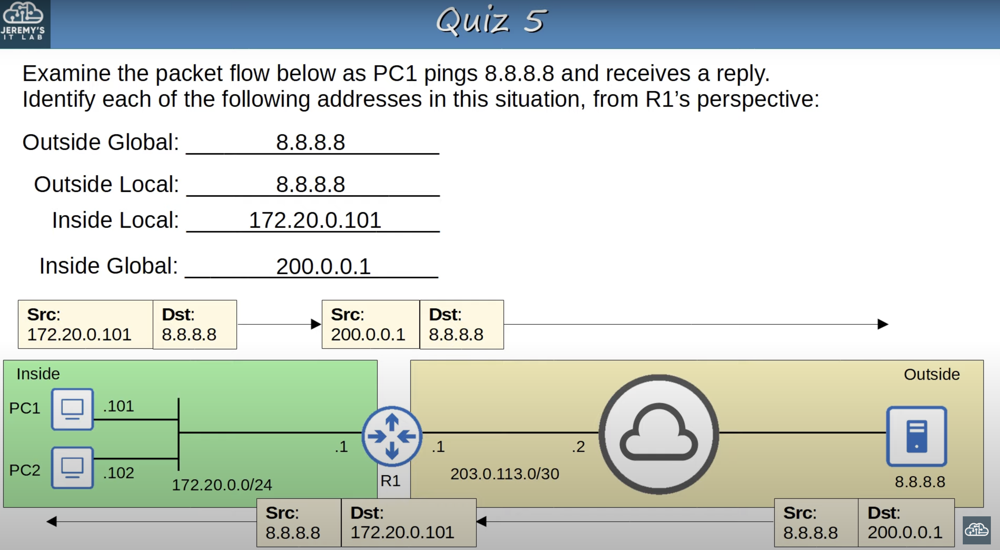

## Private IPv4 Addresses
* IPv4 doesn't provide enough addresses for al devices that need an IP address in the world.
* The long-term solution is to switch to IPv6 addresses.
* There are three main short-term solutions:
	* CIDR
	* Private IPv4 addresses
	* NAT
* RFC 1918 specifies the following IPv4 address ranges as private:
	* `10.0.0.0/8` (`10.0.0.0` to `10.255.255.255`)
	* `172.16.0.0/12` (`172.16.0.0` to `172.31.255.255`)
	* `192.168.0.0/16` (`192.168.0.0` to `192.168.255.255`)
* You are free to use these addresses in your networks. They don't have to be globally unique.
	* Your PC in your home network, is almost certainly using a private IP address.
* Private IP addresses cannot be used over the internet!
	* The IPS (Internet Service Provider) will drop traffic to or from private IP addresses.
## Intro to NAT (Network Address Translation)
* Network Address Translation (NAT) is used to modify the source and/or destination IP address of packets.
* There are various reasons to use NAT, but the most common reason is to allow hosts with private IP addresses to communicate with other hosts over the internet.
### Cisco NAT Terminology


## Source NAT
For the CCNA you have to understand **source NAT** and how to configure it on Cisco routers.


* It's called source NAT because it only translates the source IP address.
## Static  NAT
* **Static NAT** involves statically configuring one-to-one mappings of private IP addresses to public IP addresses.
	* It doesn't have to be private to public. You can NAT any address to any other address.
* This one-to-one mapping works in both directions.
	* An external host can access an internal host via its inside global address.
	* An internal host can access an external host via its outside local address.


* On R1, PC1's private IP address `192.168.0.167` was mapped to the public IP address `100.0.0.1`.
	

* If PC2 also wants to reach `8.8.8.8`, it will need its own *inside global* address configured on R1.
	* The router will not allow both, PC1 and PC2 to be mapped to the same *inside global* address using static NAT.
### NOTE
**Static NAT** allows devices with private IP addresses to communicate over the internet. However, because it requires a one-to-one IP address mapping, it doesn't help preserve IP addresses. 

If each internal device needs its own public IP address anyway, you might as well just configure a public IP address on the device itself. Although, there are reasons to use static NAT, It's not the most useful for preserving IP addresses.
## Static NAT Configuration
### Create NAT Entries

* If you try to create a NAT entry for an inside local IP that is already in use, the command will be rejected.
	* There can only be one-to-one mappings of private IP addresses to public IP addresses
### Display NAT Translation Table
```
R1#show ip nat translations
```
* The static NAT entries configured on the device will be permanently displayed on the NAT translations table.
* Whenever NAT is actually performed (when the addresses are actually translated),  dynamic entries for those translations will also be added to the translations table.
	* These dynamic NAT entries will time out and be removed when they stop being used.
### Clear IP NAT Translations
```
R1#clear ip nat translations *
```
* This will only clear the dynamic NAT entries automatically generated when NAT is performed to translate addresses for packets.
* The static NAT entries won't time out and can't be removed unless you remove the commands that created them.
	* `ip nat inside source static ...`
### Show NAT Statistics
```
R1#show ip nat statistics
```
* Displays total active translations (static, dynamic, extended).
* Peak translations, which is the highest number of translations that have been in the current device (R1).
* Displays 'inside' and 'outside' interfaces.
### Example

* **Outside Local** and **Outside Global** will always be the same unless **Destination NAT** is used, which is outside the scope of the CCNA.