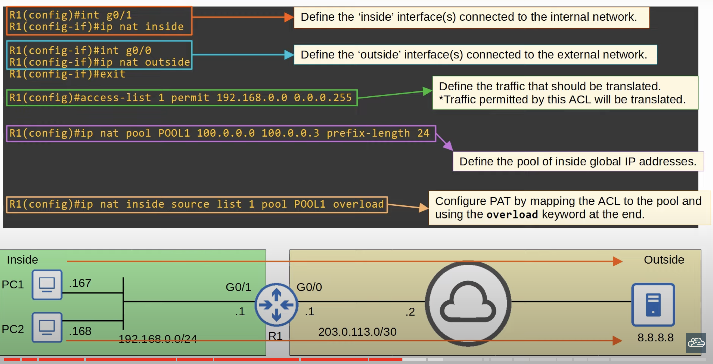

## Dynamic NAT
* In **dynamic NAT**, the router dynamically maps *inside local* addresses to *inside global* addresses as needed.
	* It clears the mappings when they are no longer needed.
* An ACL is used to identify which traffic should be translated.
	* If the source IP is **permitted** by the ACL, the source IP will be translated.
	* If the source IP is **denied** by the ACL, the source IP will not be translated.
		* The traffic will not be dropped though. The ACL is simply being used to identify which traffic should be translated.
* A NAT pool is used to define the available *inside global* addresses.
* Although they are dynamically assigned, the mappings are still one-to-one (one *inside local* IP address per *inside global* IP address).
* If there aren't enough *inside global* IP addresses available (all are currently being used), it is called 'NAT pool exhaustion'.
	* If a packet from another inside host arrives and needs NAT but there are no available addresses, the router will drop the packet.
	* The host will be unable to access outside networks until one of the *inside global* IP addresses becomes available.
		* Dynamic NAT entries will time out automatically and become available if not used, or you can clear them manually.
### Dynamic NAT Configuration

#### Display NAT Translations

* R1's translations table after sending pings as well as DNS traffic to server `8.8.8.8`
* When the router dynamically created the *inside local* to *inside global* mappings, these entries are created:
	* `100.0.0.1` to `192.168.0.167`
	* `100.0.0.2` to `192.168.0.168`
* When translations are actually made for those entries, separate entries are made (UDP and ICMP entries in this case).
	* The entries generated as a result of translations will be removed after about a minute.
	* The original dynamic mappings themselves have a default timeout value of 24 hours. Additionally, the timer resets each time a translation is made.
#### Display NAT Statistics

* All entries are dynamic.
* The extended entries are the entries generated (UDP, ICMP entries in this case) as a result of translations on the existing entries.
* You can confirm the dynamic mapping from ACL 1 to POOL1.
## Dynamic PAT
### Dynamic PAT Using Pool
* **PAT** (aka **NAT overload**) translates both the IP address and the port number (if necessary).
* By using a unique port number for each communication flow, a single public IP address can be used by many different internal hosts.
* The router will keep track of which *inside local* address is using which *inside global* address and port.
* Because many inside hosts can share a single public IP, PAT is very useful for preserving public IP addresses, and it is used in networks all over the world.


* In this example, both PCs chose the same random source port to showcase the router port translation process.
* If PC2 selected a different random source port than PC1, then R1 would have no need to translate the source port. It would simply use the source port PC2 selected and use that to keep track of sessions.
#### Configuration


```
R1#show ip nat translations

Pro Inside global   Inside local.       Outside local Outside local
udp 100.0.0.1:63925 192.168.0.167:63925 8.8.8.8:53    8.8.8.8:53   
udp 100.0.0.1:59549 192.168.0.168:59549 8.8.8.8:53    8.8.8.8:53
```
* One big difference compared to regular dynamic NAT is that the one-to-one dynamic mapping entries aren't displayed. That is because when using PAT, there are no one-to-one mappings. They are many-to-one.
	* Many *inside local* addresses to one *inside global* address, distinguished by the randomly generated *inside local* source port to keep track of the different sessions.

```
R1#show ip nat statistics
```
### Dynamic PAT Using Router Interface
One more way to configure PAT, and probably the most common way, is to configure the router to use its own public IP address when translating the source IP of packets


* A unique source port number for each traffic flow is used to allow multiple hosts to share the same IP address, while still being able to track each communication flow separately.
* If multiple hosts randomly choose the same source port number, the router will perform port number translation. Otherwise, the router will just use the chosen source port number (this is the case above).
#### Configuration


```
#R1 show ip nat translations
```

```
#R1 show ip nat statistics
```
