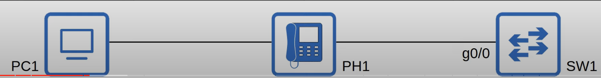
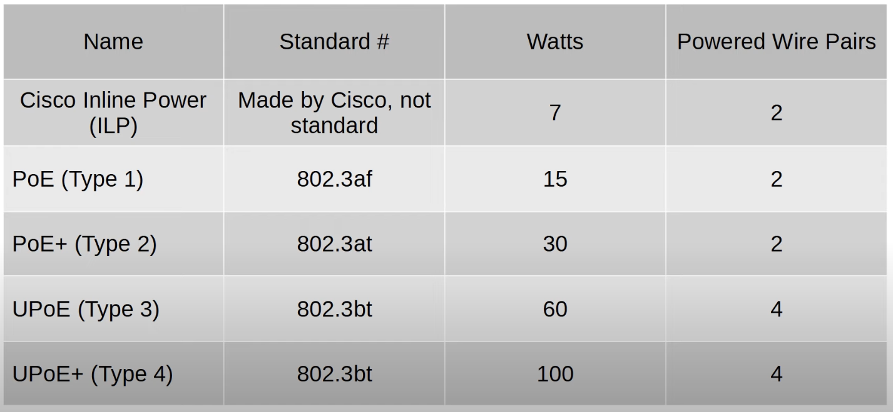
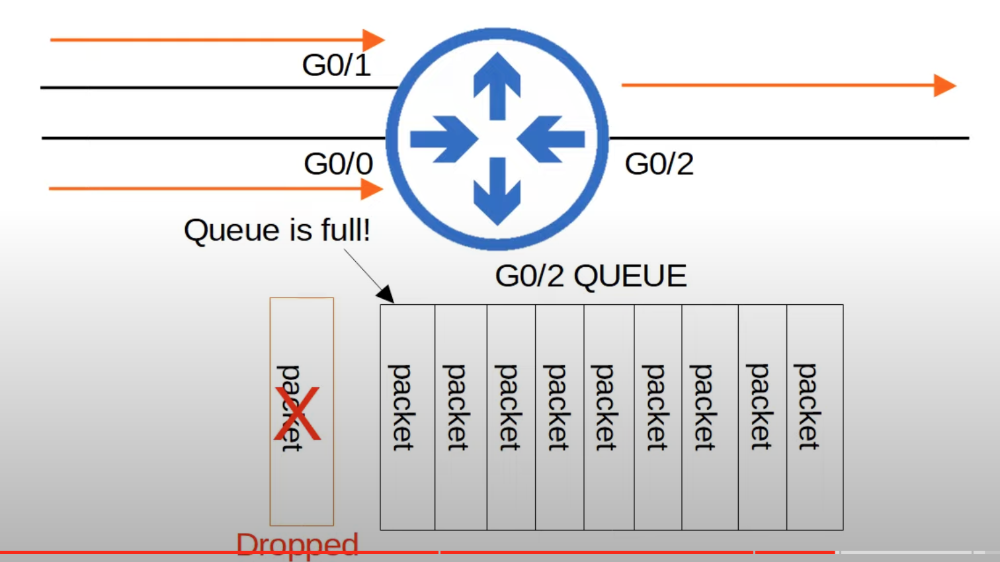
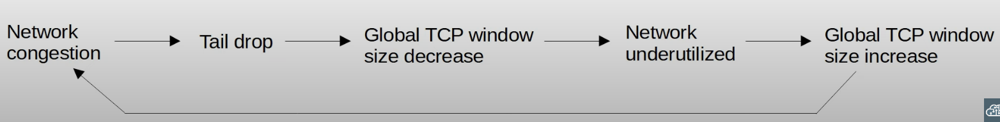

## IP Phones/Voice VLANs
* Traditional phones operate over the *public switched telephone network* (PSTN).
	* Sometimes this is called POTS (Plain Old Telephone Service).
* IP phones use VoIP (Voice over IP) technologies to enable phone calls over an IP network, such as the internet.
* IP phones are connected to a switch just like any other end host.
* IP phones have an internal 3-port switch.
	* 1 port is the 'uplink' to the external switch.
	* 1 port is the 'downlink' to the PC.
	* 1 port connects internally to the phone itself.
* This allows the PC and IP phone to share a single switch port. 
	* Traffic from the PC passes through the IP phone to the switch. 
	* Traffic from the IP phone goes directly to the switch.
* It is recommended to separate 'voice' traffic (from the IP phone) and 'data' traffic (from the PC) by placing them in separate VLANs.
	* This can be accomplished using a voice VLAN.
	* Traffic from the PC will be untagged, but traffic from the IP phone will be tagged with a VLAN ID.
### Voice VLAN Configuration

```
SW1(config)#interface g0/0
SW1(config-if)#switchport mode access
SW1(config-if)#switchport access vlan 10
SW1(config-if)#switchport voice vlan 11
```
* PC1 will send untagged traffic over VLAN 10.
* SW1 will use CDP to tell PH1 to tag PH1's traffic in VLAN 11.
* Although the interface g0/0 sends/receives traffic from two VLANs, it is not considered a trunk port. It is considered an access port.
## Power over Ethernet (PoE)


* PoE allows Power Sourcing Equipment (PSE) to provide power to Powered Device (PD) over an Ethernet cable.
* Typically the PSE is a switch and the PDs are IP phones, IP cameras, wireless access points, etc.
* The PSE receives AC power from the outlet, converts it to DC power, and supplies that DC power to the PDs.
* Too much electrical current can damage electrical devices.
* PoE has a process to determine if a connected device needs power, and how much power it needs.
	* When a device is connected to a PoE-enabled port, the PSE (switch) sends low power signals, monitors the response, and determines how much power the PD needs.
	* If the device needs power, the PSE supplies the power to allow the PD to boot.
	* The PSE continues to monitor the PD and supply the required amount of power (but not too much!).
* *Power policing* can be configured to prevent a PD from taking too much power.
	* `power inline police` configures power policing with the default settings: disable the port and send a Syslog message if a PD draws too much power.
		* Equivalent to `power inline police action err-disable`.
		* The interface will be put in an 'error-disabled' state and can be re-enabled with `shutdown` followed by `no shutdown`.
	* `power inline police action log` does not shutdown the interface if the PD draws too much power. It will restart the interface and send a Syslog message.
		* The PD device will renegotiate its power needs once the interface restarts.

```
SW1#show power inline police g0/0
```
* Will display current power settings on the interface, including power policing.
## Intro to Quality of Service (QoS)
* Voice traffic and data traffic used to use entirely separate networks.
	* Voice traffic used PSTN (Public Switched Telephone Network).
	* Data traffic used the IP network (enterprise WAN, Internet, etc)
* QoS wasn't necessary as the different kinds of traffic didn't compete for bandwidth.
* Modern networks are typically converged networks in which IP phones, video traffic, regular data traffic, etc all share the same IP network.
* This enables cost savings as well as more advanced features for voice and video traffic. For example, integrations with collaboration software (Cisco WebEx, Microsoft Teams, etc).
* However, the different kinds of traffic now have to compete for bandwidth.
* QoS is a set of tools used by network devices to apply different treatment to different packets.
* QoS is used to manage the following characteristics of network traffic:
	* **Bandwidth**:
		* The overall capacity of the link, measured in bits per second (Kbps, Mbps, Gbps, etc).
		* QoS tools allow you to reserve a certain amount of a link's bandwidth for specific kinds of traffic. For example, 20% voice traffic, 30% for specific kinds of data traffic, leaving 50% for all other traffic.
	* **Delay**:
		* **One-way delay**: The amount of time it takes traffic to go from source to destination.
		* **Two-way delay**: The amount of time it takes traffic to go from source to destination and return.
	* **Jitter**:
		* The variation in one-way delay between packets sent by the same application. For example, if some packets arrive in 10 ms, but others arrive in 100 ms, that's a lot of jitter.
		* Jitter will negatively affect the audio quality of phone calls, so IP phones have a 'jitter buffer' to provide a fixed delay to audio packets. However, if the Jitter is too high, it will overrun the buffer and the audio quality will suffer.
	* **Loss**:
		* The % of packets sent that do not reach their destination.
		* Can be caused by faulty cables or if the network is congested and the device's packet queue get full, it will start discarding packets that can't fit into the queue.
* The following standards are recommended for acceptable interactive audio (ie. phone call, zoom call audio) quality. If these standards are not met, there could be a noticeable reduction in the quality of the phone call.
	* **One-way delay**: 150 ms or less.
	* **Jitter**: 30ms or less.
	* **Loss**: 1% or less.
### QoS Queuing

* When a network device receives traffic at a faster rate than it can forward traffic out of the appropriate interface, packets are placed in that interface's queue as they wait to be forwarded.
* By default, queued messages will be forwarded in a First in First Out (FIFO) manner.
	* Messages will be sent in the order they are received.
* If the queue is full, new packets will be dropped. This is called *tail drop*.

#### TCP Global Synchronization Problem
* **Tail drop** is harmful because it can lead to **TCP global synchronization**.
* Review of the **TCP sliding window**:
	* Hosts using TCP use the 'sliding window' to increase/decrease the rate at which they send traffic as needed.
	* When a packet is dropped, it will be re-transmitted.
	* When a drop occurs, the sender will reduce the rate at which it send traffic.
	* It will then gradually increase the rate again.
* When the queue fills up and **tail drop** occurs, all TCP hosts sending traffic will slow down the rate at which they send traffic.
* They will then increase the rate at which they send traffic, which rapidly leads to more congestion, dropped packets, and the process repeats again.


* Global TCP window size decrease means that all hosts sending packets will decrease their window size simultaneously.
* Global TCP window size increase means that all hosts sending packets will increase their window size simultaneously.
* The simultaneous increase and decrease of the window size from all hosts sending packets leads to a cycle of over-utilization, under-utilization, over-utilization, under-utilization, etc.
#### Random Early Detection (RED)
* When the amount of traffic in the queue reaches a certain threshold, the device will start randomly dropping packets from select TCP flows.
* Those TCP flows that dropped packets will reduce the rate at which traffic is sent, but you will avoid global TCP synchronization, in which all TCP flows reduce and then increase the rate of transmission at the same time in waves.
* In standard RED, all kinds of traffic are treated the same.
* An improved version, **Weighted Random Early Detection (WRED)**, allows you to control which packets are dropped depending on the traffic class.