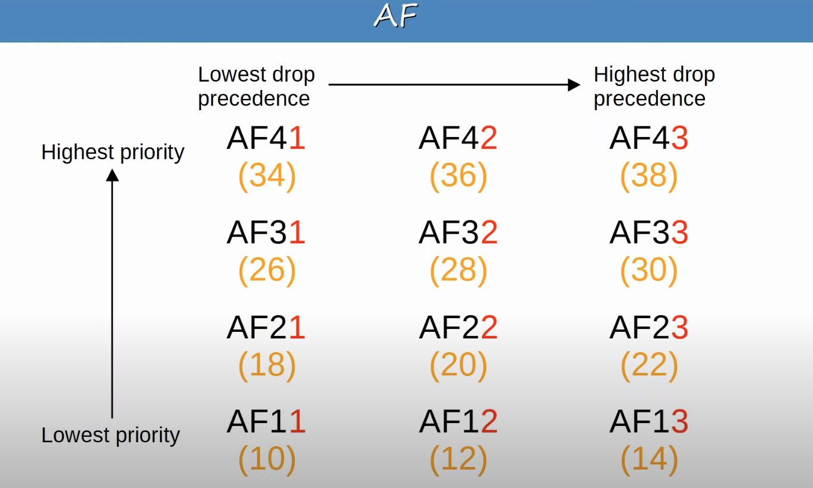

## Classification/Marking
* The purpose of QoS is to give certain kinds of network traffic priority over others during congestion.
* **Classification** organizes network traffic (packets) into traffic classes (categories).
* Classification is fundamental to QoS. To give priority to certain types of traffic, you have to identify which type of traffic to give priority to.
* There are many methods of classifying traffic.
	* An ACL. Traffic which is permitted by the ACL will be given certain treatment, other traffic will not.
	* **NBAR (Network Based Application Recognition)** performs a deep packet inspection, looking beyond the Layer 3 and Layer 4 information up Layer 7 to identify the specific kind of traffic.
	* In the Layer 2 and Layer 3 headers, there are specific fields used for this purpose.
* The **PCP (Priority Code Point)** field of the 802.1Q tag (in the Ethernet header) can be used to identify high/low priority traffic.
	* Can only be used when there is a dot1q tag! 
		* Available in trunk links since traffic is tagged, unless it is in the native VLAN.
		* Available in access links with a voice VLAN since voice traffic is tagged.
* The **DSCP (Differentiated Service Code Point)** field of the IP header can also be used to identify high/low priority traffic.
### QoS Classification at Layer 2 (PCP/CoS)

* To **mark** (QoS term) traffic is to set the value in the PCP or DSCP fields. Then, network devices look at those markings and use them to classify the traffic as high/low priority. 
### QoS Classification at Layer 3
#### The IP ToS Byte

* In the IPv4 header, there is a byte that is referred to as the ToS (Type of Service) byte.
* The old ToS byte only allows 8 values for marking and classifying traffic in the network.
	* The IPP field is used for marking and classifying traffic, which is 3 bits in length.
* The current ToS byte allows a total of 64 values, which gives a lot of flexibility regarding how we can mark and classify traffic in the network.
	* The DSCP field is used for marking and classifying traffic, which is 6 bits in length.
#### DSCP
* RFC 2474 (1998) defines the DSCP field, and other 'DiffServ' RFCs elaborate on its use.
* With IPP updated to DSCP, new standard markings had to be decided upon.
	* By having generally agreed upon standard markings for different kinds of traffic, QoS design & implementation is simplified, QoS works better between ISPs and enterprises, among other benefits.
* You should be aware of the following standard markings:
	* Default Forwarding (DF) - best effort traffic.
	* Expedited Forwarding (EF) - low loss/latency/jitter traffic (usually voice).
	* Assured Forwarding (AF) - set of 12 standard values.
	* Class Selector (CS) - set of 8 standard values, provides backward compatibility with IPP.
##### DF & EF Markings

##### AF Marking

* X is the decimal number of the class and Y is the decimal number of the Drop Precedence.
* The last bit is always set to 0.
###### AF Values

* There is 4 classes with 3 drop precedence values each, making it a total of 12 standard values.
* Within AF, 43 is the highest value. There is no class 5, 6, or 7.
* The formula to convert from AF value to decimal DSCP value: 8X + 2Y.
###### AF Marking Example 1

| (32) | (16) | (8) | (4) | (2) | (1) |     |     |
| ---- | ---- | --- | --- | --- | --- | --- | --- |
| 4    | 2    | 1   | 2   | 1   |     |     |     |
| 0    | 0    | 1   | 0   | 1   | 0   |     |     |
* Class = 1
* Drop Precedence = 1
* AF11 = DSCP 10
###### AF Marking Example 2

| (32) | (16) | (8) | (4) | (2) | (1) |     |     |
| ---- | ---- | --- | --- | --- | --- | --- | --- |
| 4    | 2    | 1   | 2   | 1   |     |     |     |
| 0    | 0    | 1   | 1   | 0   | 0   |     |     |
* Class = 1
* Drop Precedence = 2
* AF12 = DSCP 12
###### AF Marking Example 3

| (32) | (16) | (8) | (4) | (2) | (1) |     |     |
| ---- | ---- | --- | --- | --- | --- | --- | --- |
| 4    | 2    | 1   | 2   | 1   |     |     |     |
| 0    | 1    | 0   | 1   | 1   | 0   |     |     |
* Class = 2
* Drop Precedence = 3
* AF23 = DSCP 22
###### AF Marking Example 4

| (32) | (16) | (8) | (4) | (2) | (1) |     |     |
| ---- | ---- | --- | --- | --- | --- | --- | --- |
| 4    | 2    | 1   | 2   | 1   |     |     |     |
| 0    | 1    | 1   | 1   | 0   | 0   |     |     |
* Class = 3
* Drop Precedence = 2
* AF32 = DSCP 28
###### AF Marking Example 5

| (32) | (16) | (8) | (4) | (2) | (1) |     |     |
| ---- | ---- | --- | --- | --- | --- | --- | --- |
| 4    | 2    | 1   | 2   | 1   |     |     |     |
| 1    | 0    | 0   | 1   | 1   | 0   |     |     |
* Class = 4
* Drop Precedence = 3
* AF43 = DSCP 38
##### CS Marking

* The formula to get the DSCP number from the CS number is 8 * CS
##### RFC 4954
* RFC 4954 was developed with the help of Cisco to bring all of these values together and standardize their use.
* The RFC offers many specific recommendations, but here are a few key ones (for AF, x could be 1, 2, or 3 to represent the drop precedence):
	* Voice traffic: EF
	* Interactive video: AF4x
	* Streaming video: AF3x
	* High priority data: AF2x
	* Best effort: DF
* However, in the end it's up to the engineer designing the QoS policy of the network to decide which traffic will get which markings.
## Trust Boundaries
* The trust boundary of a network defines where devices trust/don't trust the QoS marking of received messages.
* If the markings are trusted, the device will forward the message without changing the markings.
* If the markings aren't trusted, the device will change the markings according to the configured policy.

* It is assumed that the trust boundary is located at SW1.
* PH1 sends a message marked as EF (Layer 3 classification) and CoS5 (Layer 2 classification) to SW1.
	* Note that CoS5 is referring to the PCP field in the dot1q header. It is also often referred to as PCP5.
* SW1 doesn't trust the markings from PH1 because it's from outside of the trust boundary. So perhaps it changes the DSCP marking to DF and the CoS marking to 0, before forwarding it to R1, which forwards it to R2, with just the DF marking because there is no dot1q header.
* This configuration isn't ideal. Usually it's best to trust the markings from an IP phone because we want its traffic to be high priority.

* If an IP phone is connected to the switch port, it is recommended to move the trust boundary to the IP phone.
* This is done via configuration on the switch port connected to the IP phone, not directly on the phone itself.
* Traffic sent from the phone itself will be trusted by the switch. However,  if a user marks their PC's traffic with a high priority to get faster service, the marking will be changed (not trusted).
## Queuing/Congestion Management

* When a network device receives traffic at a faster rate than it can forward traffic out of the appropriate interface, packets are placed in that interface's queue as they wait to be forwarded.
* When the queue becomes full, packets that don't fit in the queue are dropped (tail drop).
* RED and WRED drop packets early to avoid tail drop.

* An essential part of QoS is the use of multiple queues.
	* This is where classification plays a role. The device can match traffic based on various factors (for example the DSCP marking in the IP header) and then place it in the appropriate queue.
* However, the device is only able to forward one frame out of an interface at a time, so a *scheduler* is used to decide from which queue traffic is forwarded next.
	* Prioritization allows the scheduler to give certain queues more priority than others.

* A common scheduling method is weighted round-robin.
	* **Round-robin**: packets are taken from each queue in order, cyclically.
	* **Weighted round-robin**: more data is taken from high priority queues each time the scheduler

## Shaping/Policing
