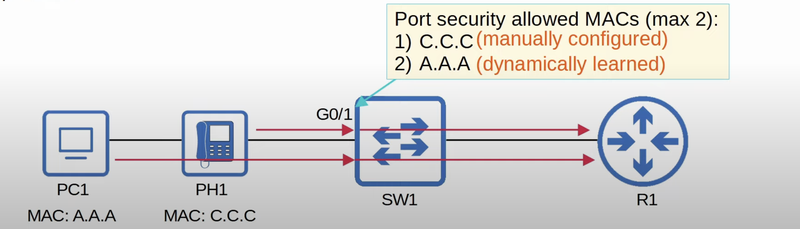

## Intro to Port Security
* Port security is a security feature of Cisco switches.
* It allows you to control which source MAC address(es) are allowed to enter the switchport.
* If an unauthorized source MAC address enters the port, an action will be taken.
	* The default action is to place the interface in an 'err-disabled' state.
* When you enable port security on an interface with the default settings, only one MAC address is allowed.
	* You can configure the allowed MAC address manually.
	* If you don't configure it manually, the switch will allow the first source MAC address that enters the interface.


* You can change the maximum number of MAC addresses allowed and how they are learned (manually configured, dynamically learned, or a mix of both)
	* A switchport that is connected to an IP phone will most likely require two MAC addresses to be allowed - one for the IP phone and another for the PC connected to the switch through it.
## Why Use Port Security?
* Port security allows network admins to control which devices are allowed to access the network.
* However, MAC address spoofing is a simple task.
	* It's easy to configure a device to send frames with a different source MAC address.
* **Rather than manually specifying the MAC addresses allowed on each port, port security's ability to limit the number of MAC addresses allowed on an interface is more useful.**
* Think back to the DHCP starvation attack carried out in the security fundamental notes.
	* The attacker spoofed thousands of fake MAC addresses.
	* The DHCP server assigned IP addresses to these fake MAC addresses, exhausting the DHCP pool.
	* The switch's MAC address table can also become full due to such an attack.
* Limiting the number of MAC addresses on an interface can protect against those attacks.
## Violation Modes
There are three different violation modes that determine what the switch will do if an unauthorized frame enters an interface configured with port security.
* **Shutdown** (default mode)
	* Effectively shuts down the port by placing it in an err-disabled state.
	* Generates a Syslog and/or SNMP message when the interface is disabled.
	* The violation counter is set to 1 when the interface is disabled. Although, it will be reset to 0 when the interface is re-enabled.
* **Restrict**
	* The switch discards traffic from unauthorized MAC addresses.
	* The interface is not disabled.
	* Generates a Syslog and/or SNMP message each time an unauthorized MAC is detected.
	* The violation counter is incremented by 1 for each unauthorized frame.
* **Protect**
	* The switch discards traffic from unauthorized MAC addresses.
	* The interface is not disabled.
	* It does not generate Syslog/SNMP messages for unauthorized traffic.
	* It does not increment the violation counter.

```
SW1(config-if)#switchport port-security
SW1(config-if)#switchport port-security violation restrict
```
* Enable 'restrict' violation mode.

```
SW1(config-if)#switchport port-security
SW1(config-if)#switchport port-security violation protect
```
* Enable 'protect' violation mode.
## MAC Address Table
* Secure MAC addresses will be added to the MAC address table like any other MAC address.
	* Sticky and Static secure MAC addresses will have a type of STATIC.
	* Dynamically-learned secure MAC addresses will have a type of DYNAMIC.

```
SW#show mac address-table secure
```
* View all secure MAC addresses.
## Secure MAC address aging
* ==By default, secure MAC addresses will not 'age out' (Aging time : 0 mins).== They are permanent. Unless you manually delete the learned MAC address or the port is disabled and then re-enabled.
* There is two aging types:
	* **Absolute** (default type): After the secure MAC address is learned, the aging timer starts and the MAC is removed after the timer expires, even if the switch continues receiving frames from that source MAC address.
	* **Inactivity**:After the secure MAC address is learned, the aging timer starts, but is reset every time a frame from that source MAC address is received on the interface.

```
SW1(config-if)#switchport port-security aging time <minutes>
```
* Configure the secure MAC address aging timer.
* The default aging type will be absolute.
* By default, only dynamically learned secure MAC addresses will age out when the aging timer is configured to other than the default 0 value.
	* Static secure MAC addresses will not age out. The command will remain in the running-config and the MAC will remain in the MAC address table.

```
SW1(config-if)#switchport port-security aging type {absolute | inactivity}
```
* Configure secure MAC address aging type.

```
SW1(config-if)#switchport port-security aging static
```
* Make secure static MAC addresses age out.
	* If the static secure MAC address ages out, the command will be removed from the running-config and the MAC will also be removed from the MAC address table.
## Sticky Secure MAC Addresses
* Sticky MAC addresses are basically a way of configuring static secure MAC addresses, without actually having to manually configure them.
* When enabled, dynamically-learned secure MAC addresses will be added to the running-config like this:
	* `switchport port-security mac-address sticky <mac-address>`
* These 'sticky' secure mac addresses will never age out, even if you enable static secure MAC address aging.
	* You need to save the running-config to the startup-config to make them truly permanent and not get lost if the switch restarts.

```
SW(config-if)#switchport port-security mac-address sticky
```
* When you enable 'sticky' secure MAC addresses, all current dynamically-learned secure MAC addresses will be converted to sticky secure MAC addresses.

```
SW(config-if)#no switchport port-security mac-address sticky
```
* When you disable 'sticky' secure MAC addresses, all current sticky secure MAC addresses will be converted to regular dynamically-learned secure MAC addresses.
## Port Security Configuration
### Enabling Port Security
* Port security can be enabled on access or trunk ports, but they must be statically configured as access or trunk.
* The default violation mode is shutdown when port security is enabled on an interface.

```
SW1(config)#interface g0/1
SW1(config-if)#switchport port-security
```
* Enable port security on the interface.
* The allowed secure MAC address will be dynamically learned when the interface receives a frame since it was not specified in the command.

```
SW1(config)#interface g0/1
SW1(config-if)#switchport port-security mac-address 000a.000a.000a
```
* Enable port security with a static (manually configured) secure MAC address.
### Show Port Security
```
SW1#show port-security
```
* Displays which interfaces have port security enabled, the max and current number of secure addresses on those interfaces, their security violation count, and their security action.
* A good command if you have port security enabled on multiple interfaces, to get an overview of your port security enabled interface.
### Show Port-security Interface
```
SW1#show port-security interface g0/1
```
* Displays port status.
* Displays the configured violation mode on the interface.
* Displays the trusted MAC addresses aging time.

### Change Number of Secure MAC addresses
```
SW(config-if)#switchport port-security maximum <number>
```
* Change the number of allowed secure MAC addresses on the interface.
### Re-enable an Interface (manually)
```
SW1(config)#interface g0/1
SW1(config-if)#shutdown
SW1(config-if)#no shutdown
```
* Before trying to reenable the interface, you should first disconnect the unauthorized device.
### Re-enabling an Interface (ErrDisable Recovery)
* ErrDisable Recovery is useless if you don't remove the device that caused the interface to enter the err-disabled state!
* The first step is always to disconnect the unauthorized device, and then either manually re-enable the interface, or let ErrDisable recovery do it for you automatically.
	* What happens if you don't disconnect the unauthorized device? 
		* If you manually configured the secure MAC address, the interface will simply become disabled again when it receives another frame from the unauthorized device.
		* If you let the switch dynamically learn the previous secure MAC address, it is cleared when the interface is disabled. When the interface is re-enabled, the unauthorized device's MAC address might become the new secure MAC address on the interface, which is obviously not a good situation.

```
SW1#show errdisable recovery
```
* Lists the various reasons why an interface can enter an err-disabled state.
* By default err-disable recovery is disabled for all reasons, so err-disabled interfaces will not be automatically recovered.
* By default every 5 minutes, all err-disabled interfaces will be re-enabled if err-disabled recovery has been enabled for the cause of the interface's disablement.
	
```
SW1(config)#errdisable recovery cause psecure-violation
```
* This will make err-disabled interfaces that were disabled dues to psecure-violation, to be eligible for re-enabling after the 'errdisable recovery interval' expires.
* 'psecure-violation' is the cause of interfaces going into an err-disabled (in shutdown violation mode) state when an unauthorized MAC address enters the port.

```
SW1(config)#errdisable recovery interval <timer>
```
* Can be used to change the timer that will cause err-disabled interfaces to be re-enabled once the timer expires.