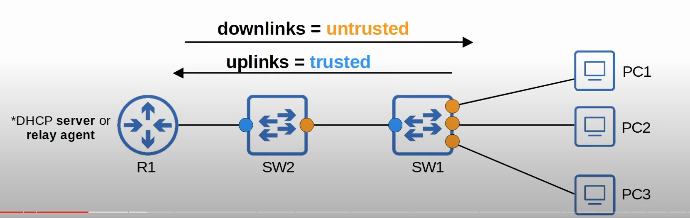
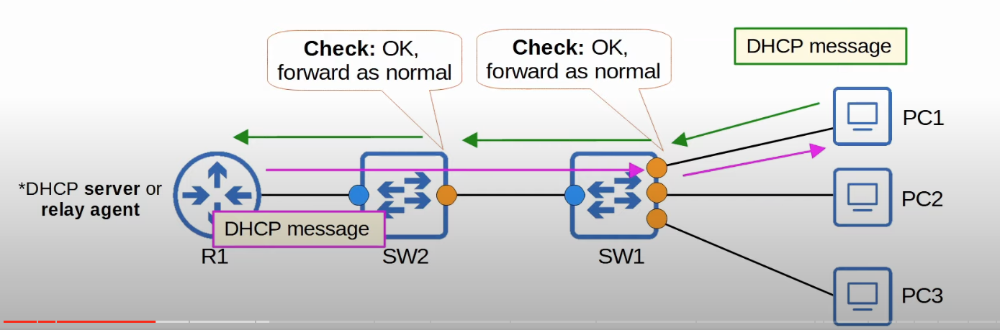
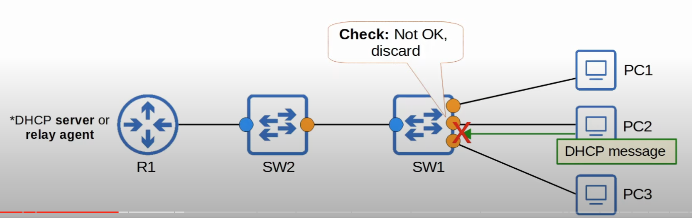
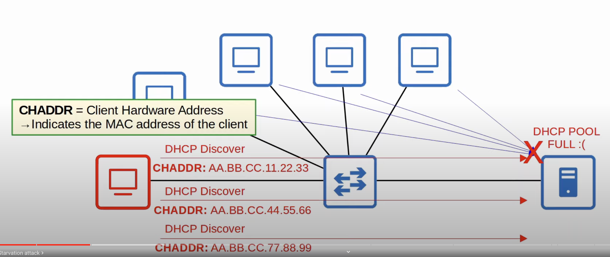
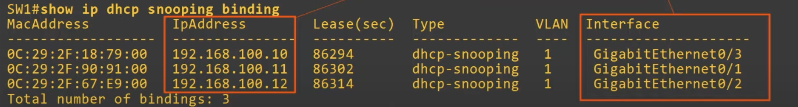
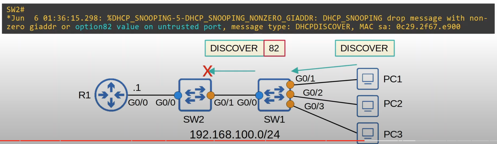
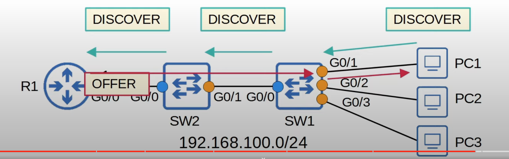
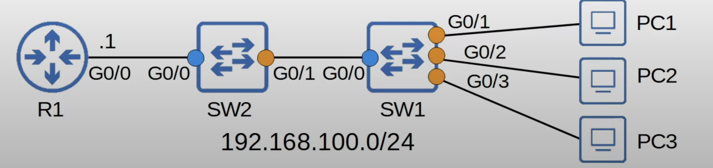

## What is DHCP Snooping?
* DHCP snooping is a security feature of switches that is used to filter DHCP messages received on untrusted ports.
* DHCP snooping only filters DHCP messages. Non-DHCP messages aren't affected.
* DHCP snooping won't inspect any DHCP messages on trusted ports, the switch will simply forward them as normal.
* DHCP snooping can limit the rate at which DHCP messages are allowed to enter an interface. 
* All ports are untrusted by default.
	* Usually, **uplink** ports are configured as trusted ports, and **downlink** ports remain untrusted.


* The downlink ports on the switches (interfaces pointing towards the end hosts), should be untrusted.
	* The network admin does not have direct control over the end user devices. A malicious user could initiate a DHCP-based attack from one of their device. Therefore, its best to leave these ports in the default untrusted state.
* The uplink ports point toward the network infrastructure, the devices the network admin has control over.


* The DHCP message is valid and is checked by both SW1 and SW2 since it is entering their untrusted interfaces.
* On the way back to PC1, it is not checked since it is going through the switches trusted interfaces.


* The DHCP message was blocked by SW1 because maybe it was trying to use a DHCP exploit.
## What Attacks Does It Prevent ?
### DHCP Starvation
* An example of a DHCP-based attack is a **DHCP starvation** attack.
* An attacker uses spoofed MAC addresses to flood DHCP Discover messages.
* The target server's DHCP pool becomes full, resulting in a denial-of-service to other devices.


* DHCP uses a field in the DHCP message, written as **CHADDR**, which stands for **Client Hardware Address**. It is used to indicate the MAC address of the client that originated the DHCP message.
	* The field is needed because in the event that a DHCP relay agent is being used to send the DHCP message over the internet, the source MAC address will not be the one from the original client once it reaches the DHCP server. Therefore, the DHCP server cannot use it as a way of referencing the client that sent the message. The CHADDR field maintains the client's source MAC address regardless of the number of hops.
### DHCP Poisoning (Man-in-the-Middle)
* Similar to ARP poisoning, DHCP Poisoning can be used to perform a Man-in-the-Middle attack.
* A *spurious* (illegitimate) DHCP server replied to clients DHCP Discovery messages and assigns them IP addresses, but makes the clients use the spurious server's IP as the default gateway.
	* Multiple DHCP servers can respond to DHCP Discover messages, but clients usually accept the first offer message they receive. If the spurious DHCP server beats the legitimate DHCP server in reaching the requesting client, it could be picket.
* This will cause the client to send traffic to the attacker instead of the legitimate default gateway.
* The attacker can then examine/modify the traffic before forwarding it to the legitimate default gateway, which will send the traffic to the external destination.
* The client probably won't even notice that its traffic is being intercepted since it is reaching its destination.
## DHCP Messages
* When DHCP snooping filters messages, it differentiates between **DHCP Server** messages and **DHCP Client** messages.
	* DHCP server messages received on an untrusted port will always be discarded with no further checks.
	* DHCP client messages received on an untrusted port will be inspected, and then the switch will decide to forward or discard the frame.
* Messages sent by **DHCP Servers**:
	* OFFER
	* ACK
	* NAK = opposite of ACK, used to decline a client's REQUEST.
* Messages send by **DHCP Clients**:
	* DISCOVER
	* REQUEST
	* RELEASE = Used to tell the server that the client no longer needs its IP address.
	* DECLINE = Used to decline the IP address offered by a DHCP server.
## DHCP Snooping Operations
* If a DHCP message is received on a **trusted port**, forward it as normal without inspection.
* If a DHCP message is received on an **untrusted port**, insect it and act as follows:
	* If it is a **DHCP Server** message, discard it.
	* If it is a **DHCP Client** message, perform the following:
		* DISCOVER/REQUEST messages: Check if the frame's source MAC address and the DHCP message's CHADDR fields match. Match = forward, mismatch = discard.
		* RELEASE/DECLINE messages: Check if the packet's source IP address and the receiving interface match the entry in the DHCP Snooping Binding Table. Match = forward, mismatch = discard.
* When a client successfully leases an IP address from a server, create a new entry in the DHCP Snooping Binding Table.

```
SW1#show ip dhcp snooping binding
```

* RELEASE/DECLINE messages will be checked to make sure their IP address/interface ID match the entry in their DHCP snooping table.
	* This prevents attackers form sending these messages on behalf of other devices in the network, causing the DHCP server to believe that they don't need their IP addresses anymore.
* Note that when DHCP snooping is enabled, the DHCP snooping binding table is automatically built as hosts lease IP addresses from DHCP servers.
## DHCP Snooping Rate-Limiting
* DHCP snooping can limit the rate at which DHCP messages are allowed to enter an interface. 
* Rate-limiting can be very useful to protect agains DHCP exhaustion attacks.
	* Attackers can spoof both the frame's source MAC address and the DHCP message's CHADDR (Client Hardware Address) field to bypass the DHCP snooping filtering of DISCOVER and REQUEST messages.
	* With rate limiting, we can prevent them from exhausting the DHCP server with tons of illegitimate DHCP DISCOVER messages.
* If the rate of DHCP messages crosses the configured limit, the interface is err-disabled.
* Like with Port Security, the interface can be manually re-enabled, or automatically re-enabled with errdisable recover.

```
SW1(config-if-range)ip dhcp snooping limit rate <packers-per-second>
```
* The interface(s) will be disabled if more DHCP messages than the configured rate are received.

```
SW1(config)#errdisable recovery cause dhcp-rate-limit
```
* Enable errdisable recovery for DHCP rate limiting.
## DHCP Option 82 (Information Option)
* Option 82, also know as the 'DHCP relay agent information option' is one of many DHCP options.
* It provides additional information about which DHCP relay agent received the client's message, on which interface, in which VLAN, etc.
* DHCP relay agents can add Option 82 to messages they forward to the remove DHCP server.
* With DHCP snooping enabled, by default Cisco switches will add Option 82 to DHCP messages they receive from clients, even if the switch isn't acting as a DHCP relay agent.
	* The problem with this is that by default, Cisco switches will drop DHCP messages with Option 82 that are received on an untrusted port.


* PC1 sends a DISCOVER message, and SW1 forwards it to SW2, adding Option 82. However, since SW2 receives it on an untrusted port, it drops the message.
* The default settings work well if the switch is a layer 3 switch acting as a DHCP relay agent, but in a network like this one it won't work.


```
SW1(config)#no ip dhcp snooping information option

SW2(config)#no ip dhcp snooping information option
```
* The command also has to be specified in SW2 because otherwise it will add option 82 itself, which will cause R1 to drop it.
* R1 will drop the message because it contains option 82, but it wasn't sent by a relay agent.
	* `inconsistent relay information` error will be shown in the logs.

## DHCP Snooping Config

```
SW2(config)#ip dhcp snooping
SW2(config)#ip dhcp snooping vlan 1
SW2(config)#no ip dhcp snooping information option
SW2(config)#interface g0/0
SW2(config-if)#ip dhcp snooping trust

SW1(config)#ip dhcp snooping
SW1(config)#ip dhcp snooping vlan 1
SW1(config)#no ip dhcp snooping information option
SW1(config)#interface g0/0
SW1(config-if)#ip dhcp snooping trust
```
* DHCP snooping must be enabled globally and in every VLAN that is needed.
* Manually specify which ports to trust, since they all are disabled by default.
