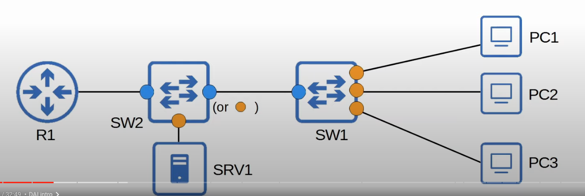

## Gratuitous ARP
* A **Gratuitous ARP** message is an ARP reply that is sent without receiving an ARP request.
* It is sent to the broadcast MAC address.
* It allows other devices to learn the MAC address of the sending device without having to send ARP requests.
* Some devices automatically send GARP messages when an interface is enabled, IP address is changed, MAC address is changed, etc.
## Dynamic ARP Inspection
* DAI is a security feature of switches that is used to filter ARP messages received on *untrusted* ports.
* DAI only filters ARP messages. Non-ARP messages aren't affected.
* All port are *untrusted* by default.
* Typically, all ports connected to end network devices (switches, routers) should be configured as **trusted**, while interfaces connected to end hosts should remain **untrusted**

* SW2's interface connected to SW1 could also be left as untrusted because it is a *downlink* leading toward the end hosts.
* In Cisco's documentation they recommend that all interfaces connected to switches, routers, etc are configured as trusted.
## What Attacks Does It Prevent?
### ARP Poisoning (Man-in-the-Middle)
* Similar to DHCP poisoning, ARP poisoning involves an attacker manipulating targets' ARP tables so traffic is sent to the attacker.
* To do this, the attacker can send gratuitous ARP messages using another device's IP address.
* Other devices in the network will receive the GARP and update their ARP tables, causing them to send traffic to the attacker instead of the legitimate destination.
## Dynamic ARP Inspection Operations
* DAI inspects the sender MAC and sender IP fields of ARP messages received on **untrusted** ports and checks that there is a matching entry in the DHCP snooping binding table.
	* If there is a matching entry, the ARP message is forwarded normally.
	* If there isn't a matching entry, the ARP message is discarded.
* DAI can be configured to perform more in-depth checks also, but these are optional.
* DAI doesn't inspect messages received on **trusted** ports. They are forwarded as normal.
* **ARP ACLs** can be manually configured to map IP addresses/MAC addresses for DAI to check.
	* Useful for hosts that don't use DHCP. If they don't use DHCP, they won't have an entry in the DHCP snooping table, so DAI will just drop all ARP messages they try to send.
* Like DHCP snooping, DAI also supports rate-limiting to prevent attackers from overwhelming the switch with ARP messages.
	* DHCP snooping and DAI both require work from the switch's CPU.
	* Even if the attacker's messages are blocked, they can overload the switch CPU with ARP messages. If they try to do that, rate limiting will just disable the interface.
## DAI Rate Limiting
* DAI rate limiting is enabled on untrusted ports by default with a rate of 15 frames per second. However, it is disabled on trusted ports by default.
	* The DAI **burst interval** allows you to configure rate limiting like this: *x frames per y seconds*.
* DHCP snooping rate limiting is disabled on all interfaces by default.
	* DHCP snooping rate limiting is configured like this: *x frames per second*.
* If ARP messages are received faster than the specified rate, the interface will be err-disabled.
	* Rate limiting limits the rate that ARP messages are received on an interface, not sent by an interface.
* Err-disabled interfaces can be re-enabled in two ways:
	* `shutdown` and `no shutdown`
	* `errdisable recovery cause arp-inspection`

```
SW1(config)#interface range g0/1 - 2
SW1(config-if-range)#ip arp inspection limit rate 25 burst interval 2
```
* Applied a rate limit rate of 25 frames per 2 seconds.
* The burst interval is optional. I you don't specify it, the default is 1 second.

## DAI Optional  Checks
* By default, DAI only checks the sender MAC and IP address, to see if there is a matching entry in the DHCP snooping binding table or not.
* DAI available check options are:
	* **dst-mac**: Enables validation of the destination MAC address in the Ethernet header against the target MAC address in the ARP body for ARP responses. The device classifies packets with different MAC addresses as invalid and drops them.
	* **ip**: Enables validation of the ARP body for invalid and unexpected IP addresses. Addresses include `0.0.0.0`, `255.255.255.255`, and all IP multicast addresses. The device checks the sender IP addresses in all ARP requests and responses and checks the target IP addresses only in ARP responses.
	* **src-mac**: Enables validation of the source MAC address in the Ethernet header against he sender MAC address in the ARP body for ARP requests and responses. The devices classifies packets with different MAC addresses as invalid and drops them.
* These optional in depth DAI checks are done in addition to the standard DAI check (sender MAC/IP). If configured, an ARP message must pass all of the checks to be considered valid.

Sample ARP reply message used to showcase the fields used in the optional DAI checks.


```
SW1(config)#ip arp inspection validate ?
	dst-mac Validatedestination MAC address
	ip      Validate IP addresses
	src-mac Validate source MAC address
	
SW1(config)#ip arp inspection validate ip
SW1(config)#ip arp inspection validate src-mac

// old commands are overriden
SW1(config)#do show running-config | include validate
ip arp inspection validate src-mac


SW1(config)#ip arp inspection validate ip src-mac dest-mac
SW1(config)#do show running-config | include validate
ip arp inspection validate src-mac dst-mac ip
```
* You must enter all validation checks you want in a single command. You can specify one, two, or all three and the order isn't significant.
* If you specify the validation checks in different commands, the new command will override the previous command.

## ARP ACLs
* **ARP ACLs** can be manually configured to map IP addresses/MAC addresses for DAI to check.
* Useful for hosts that don't use DHCP. If they don't use DHCP, they won't have an entry in the DHCP snooping table, so DAI will just drop all ARP messages they try to send.

### ARP ACLs Configuration

* SRV1 is using a static IP so it is not using DHCP to obtain its IP. Therefore, its  ARP request was originally blocked because there is not an entry for SRV1 in SW2's DHCP snooping binding table.
* After an ACL was applied to SW2, SRV1's ARP request was allowed through SW2's G0/2 untrusted port.


## DAI Configuration

```
SW2(config)#ip arp inspection vlan 1
SW2(config)#interface range g0/0 - 1
SW2(config-if-range)#ip arp inspection trust

SW1(config)#ip arp inspection vlan 1
SW1(config)#interface range g0/0 - 1
SW1(config-if-range)#ip arp inspection trust
```
* DAI has to be enabled in all VLANs where dynamic ARP inspection is needed.

### Show ARP Inspection Interfaces
```
SW1#show ip arp inspection interfaces
Interface  Trust State Rate (pps)  Burst Interval
Gi0/0      Trusted     None        N/A
Gi0/1      Untrusted   15          1
Gi0/2      Untrusted   15          1
Gi0/3      Untrusted   15          1
```

```
SW2#show ip arp inspection
```

* Displays what optional DAI check are enabled. In this case all 3 are enabled.