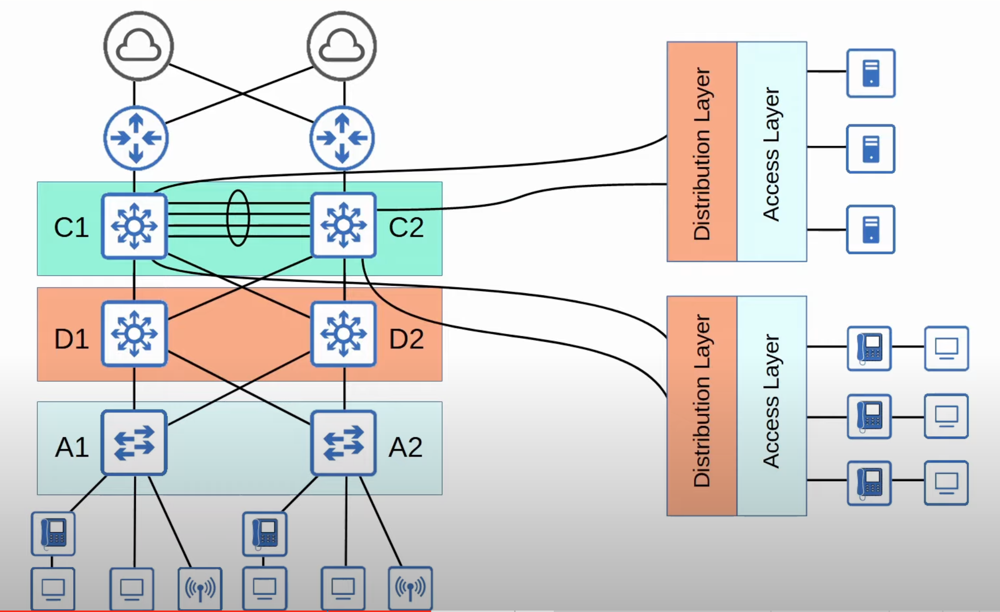

* There are standard 'best practices' for network design.
	* However there are a few universal 'correct answers'.
	* The answer to most general questions about network design is 'it depends'.
* However, to understand the networks you will be configuring and troubleshooting, it's important to know some basics of network design.
## Common Terminologies
### Star Topology

* When several devices all connect to one central device, we can draw them in a 'star' like shape. Therefore, this is often called a 'star topology'.
* Note that in network diagrams the devices might not be drawn in the shape of a star. But if many devices are connected to one central device, we can call it a star topology, regardless of how the diagram is drawn.
### Full Mesh

* A **Full Mesh** topology is formed when each device is connected to each other device.
### Partial Mesh

* A **Partial Mesh** topology is formed when some devices are connected to each other, but not all.
## 2-Tier LAN Architecture
* The two-tier LAN design consists of two hierarchical layers:
	* **Access Layer**
	* **Distribution Layer**
* Also called a 'Collapsed Core' design because it omits a layer that is found in the Three-Tier design: the **Core Layer**
### Access Layer
* The layer that end hosts connect to (PCs, printers, cameras, etc.).
* Typically Access Layer Switches have lots of ports for end hosts to connect to.
* QoS marking is typically done here because it's a good practice to mark traffic as early as possible in the network.
* Security services like port security, DAI (Dynamic ARP Inspection), etc are typically performed here.
* Switchports might be PoE-enabled for wireless Access Points, IP phones, etc.
### Distribution Layer (Aggregation Layer)
* Aggregates connections from the Access Layer Switches.
	* Connections from Access Layer switches are usually aggregated to a redundant pair of Distribution Layer switches.
* Typically is the border between Layer 2 and Layer 3 in the network. 
* Runs Layer 2 and Layer 3 protocols since it is concerned with both Layers.
* Connects to services such as Internet, WAN, other parts of the LAN, etc.
* This is not always the case, but usually the connections from the Access Layer switches to the Distribution Layer switches are Layer 2 connections, and the end hosts use the SVIs on the Distribution Layer switches as their default gateways.
### 2-Tier Campus Lan Design

* The connections between distribution switches and access layer switches are Layer 2 and loops can occur. Therefore, STP disables a few link to prevent loops.
* D1 and D2 are multilayer switches, and end hosts use the SVIs on them as their default gateways. They will probably use a FHRP such as HSRP or VRRP to provide a redundant virtual IP address for hosts to use as their default gateway.
* The Distribution Layer is used to connect to services such as the internet or the WAN, as well as other parts of the LAN.
* Notice that each Distribution Layer switch is connected to each other Distribution Layer switch.
	* Distribution layer switches form a full mesh.

* In large LAN networks with many Distribution Layer switches (for example, in separate buildings), the number of connections required between Distribution Layer switches grows rapidly
* This makes it much more difficult and complicated to scale the network, to make it bigger.

* To help scale large LAN networks, you can add a Core Layer.
* Cisco recommends adding a Core Layer if there are more than 3 Distribution Layers in a single location.
* Each Distribution Layer connects to the Core Layer so there is no need for a full mesh of direct connections between the Distribution Layer switches.
* When we add a Core Layer, we obtain a three-tier LAN architecture.
## 3-Tier LAN Architecture
* The three-tier LAN design consists of three hierarchical layers:
	* **Access Layer**
	* **Distribution Layer**
	* **Core Layer**
### Core Layer
* Connects Distribution Layers together in large LAN networks.
* The focus is speed ('fast transport'). Powerful switches focused on speed.
* CPU-intensive operations such as security, QoS marking/classifications, etc. should be avoided at this Layer.
* Connections are all Layer 3. No spanning-tree!
* Should maintain connectivity throughout the LAN even if devices fail.
	* Because it's the backbone of the LAN, redundancy of devices and connections is very important.
### 3-Tier Campus Lan Design

* The Core switches connect to the internet routers.
## Spine-Leaf Architecture (Data Center)
* Data centers are dedicated spaces/buildings used to store computer systems such as servers and network devices.
* Traditional data center designs used a three-tier architecture (Access-Distribution-Core).
* This worked well when most traffic in the data center was North-South.
* With the precedence of virtual servers, applications are often deployed in a distributed manner (across multiple physical servers), which increases the amount of East-West traffic in the data center.
* The traditional three-tier architecture led to bottlenecks in bandwidth as well as variability in the server-to-server latency depending on the path the traffic takes.
* To solve this, Spine-Leaf architecture (also called Clos architecture) has become prominent in data centers.

* North-south represents traffic that goes to other parts of the LAN or out to the internet.
* East-west represents traffic between devices in the same part of the network. The traffic doesn't go out to other parts of the LAN or out to the internet.

* It's a two-tier architecture, but different than the traditional two-tier design we looked at before.
* There are spine switches and leaf switches.
* There are some rules about Spine-Leaf architecture:
	* Every Leaf switch is connected to every Spine switch.
	* Every Spine switch is connected to every Leaf switch.
	* Leaf switches do not connect to other Leaf switches.
	* Spine switches do not connect to other Spine switches.
	* End hosts (servers, etc.) only connect to Leaf switches.
* The path taken by traffic is randomly chosen to balance the traffic load among the Spine switches.
* Each server is separated by the same number of 'hops' (except those connected to the same Leaf), providing consistent latency for East-West traffic.
* It's very simple to scale because if you need to add more servers you can just add another Leaf switch and connect it to the existing Spine switches.
## SOHO (Small Office/Home Office)
* Small Office/Home Office (SOHO) refers to the office of a small company, or a small home office with few devices.
	* It doesn't have to be an actual home office. If your home has a network connected to the internet, it is considered a SOHO network.
* SOHO networks don't have complex needs, so all networking functions are typically provided by a single device, often called a 'home router' or 'wireless router'.
* This one device can serve as a:
	* Router
	* Switch
	* Firewall
	* Wireless Access Point
	* Modem

* Very small companies or home offices don't have the need or probably the resources to hire a dedicated network engineer.
* They often just rent a wireless router from the ISP and that serves their purposes.