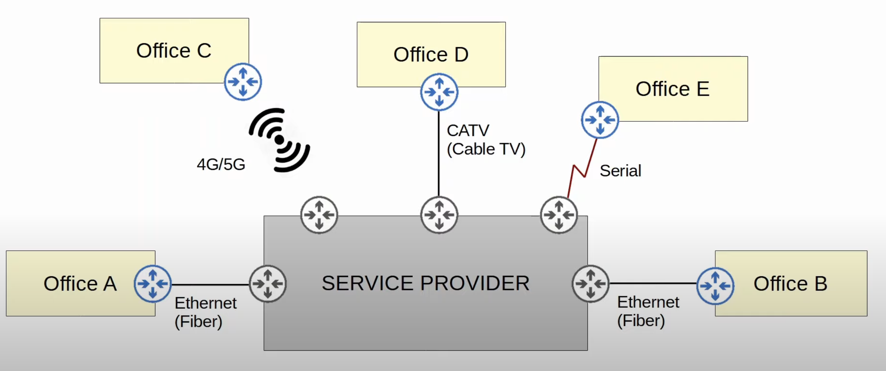

## Intro to WANs
* WAN stands for Wide Area Network.
* A WAN is a network that extends over a large geographical area.
* WANs are used to connect geographically separate LANs.
* Although the internet itself can be considered a WAN, the term WAN is typically used to refer to an enterprise's private connections that connect their offices, data centers, and other sites together.
* Over public/shared networks like the Internet, VPNs (Virtual Private Networks) can be used to create private WAN connections.
* There have been many different WAN technologies over the years. Depending on the location, some will be available and some will not be.
* Technologies which are considered 'legacy' (old) in one country might still be used in other countries.
### WAN Over Dedicated Connections (Leased Lines)

* This kind of topology in which multiple devices connect to one central device is usually called a 'star' topology. However, when talking about WANs, a more common term is Hub-and-Spoke topology.
* One major advantage of a Hub-and-Spoke topology, as opposed to a full mesh topology, is that its easier to centrally control what traffic is allowed and what isn't.
	* For example, all traffic between offices can be sent to a firewall in the data center.
* This diagram is actually not exactly an accurate representation of leased lines.

* Rather than a single physical cable directly connecting each site, each site connect to a service provider, which connects the sites together.
* These connection use serial cables.
* However, these days WAN connections via Ethernet are more and more common.

### WAN Connection Via Ethernet (Fiber)

* Optical fiber connections allow much longer cables than the traditional copper UTP Ethernet cables, so these days WANs using Ethernet fiber optic cables are quite common.
### WAN over Shared Infrastructure (Internet VPN)

* The internet can also be used for an enterprise's WAN connections between sites. 
* VPNs are used to protect the communication between sites, which takes place over the internet (shared public network).
## Leased Lines
* A **leased line** is a dedicated physical link, typically connecting two sites.
* Leased lines use serial connections (PPP or HDLC encapsulation).
* There are various standards that provide different speeds, and different standards are available in different countries.
* Due to the higher cost, higher installation lead time, and slower speeds of leased lines, Ethernet WAN technologies are becoming more popular.

## MPLS (Multi Protocol Label Switching)
* MPSL allows enterprises to form WANs over a service provider's MPLS infrastructure.
	* MPLS is a technology that runs in the service provider's network.
* Similar to the internet, service providers' MPLS networks are shared infrastructure because many customer enterprises connect to and share the same infrastructure to make their WAN connections.
* Although the traffic of many different customers will be passing over this infrastructure, the label switching aspect of MPLS allows secure VPNs to be formed over the shared infrastructure.
	* MPLS allows VPNs to be created over the MPLS infrastructure through the use of **labels**.
* Some important terms:
	* CE router = Customer Edge router.
	* PE router = Provider Edge router.
	* P router = Provider core router.

* MPLS uses labels to forward traffic, not IP addresses.
*  When the PE routers receive frames from the CE routers, they add a label to the frame. 
	* The label is placed in between the Layer 2 Ethernet header and the Layer 3 IP header. Therefore, MPLS is sometimes called a Layer 2.5 protocol.
* The label is used to make forwarding decisions within the service provider network, not the destination IP.
	* In regular IP routing, the router checks the destination IP and compares it to its routing table to decide where to forward the packet. This is not the case in MPLS. MPLS routers use the MPLS label to decide where to forward the packet within the service provider network.
* The CE routers do not use MPLS, it is only used by the PE/P routers.
	* The CE routers do not have to run MPLS or even be able to run MPLS.
* There are a few kinds of VPNs that can be provided by MPLS.
### Layer 3 MPLS VPN

* When using a Layer 3 MPLS VPN, the CE and PE routers peer using a dynamic routing protocol (OSPF etc.), for example, to share routing information.
	* The customer could also just write static routes, using the PE routers as the next hop.
* For example, in the diagram above Office A's CE will peer with one PE, and Office B's CE will peer with the other PE.
* Office A's CE will learn about Office B's routes via this OSPF peering, and Office B's CE will learn about Office A's routes too.
### Layer 2 MPLS VPN

* When using a Layer 2 MPLS VPN, the CE and PE routers do not form peerings.
* The service provider network is entirely transparent to the CE routers.
* In effect, it's like the two CE routers are directly connected.
	* Their WAN interfaces will be in the same subnet.
* If a routing protocol is used, the two CE routers will peer directly with each other.
	* In this case, the service provider network is still running MPLS just like before, but it's doing so in a way that it's like the entire service provider network is just a big switch connecting the two CE routers together.

* Many different technologies can be used to connect to a service provider's MPLS network for WAN service.
* The sites shown above, are connecting to the service provider with a variety of connection types. They will all be able to communicate with each other over the service provider's MPLS infrastructure.
## Internet Connectivity
* There are countless ways for an enterprise to connect to the internet.
* For example, private WAN technologies such as leaded lines and MPLS VPNs can be used to connect to a service provider's internet infrastructure.
	* Although the leased line or MPLS VPN itself is a private network, it can be used as a means to access the public network that is the internet.
* In addition, technologies such as CATV (cable internet) and DSL (digital subscriber line) commonly used by customers (home internet access) can also be used by an enterprise.
* These days, for both enterprise and customer internet access, fiber optic Ethernet connections are growing in popularity due to the high speeds they provide over long distances.
### Digital Subscriber Line (DSL)

* DSL provides internet connectivity to customers over phone lines, and can share the same phone line that is already installed in most homes.
	* Very convenient for both, the service provider and the customer.
* A DSL modem (modular-demodulator) is required to convert data into a format suitable to be sent over the phone lines.
	* The modem might be a separate device, or it might be incorporated into the 'home router'.
	* This connects the network to the service provider over the phone line.
### Cable Internet (CATV)

* Cable internet provides Internet access via the same CATV (Cable Television) lines used for TV service.
* Like DSL, a cable modem is required to convert data into a format suitable to be sent over the CATV cables.
	* Like a DSL modem, this can be a separate device or built into the 'home router'.

### Redundant Internet Connections
* For a home user, having one connection to the internet isn't a problem. It's a bit annoying if you lose internet access, but it's not a disaster.
* However, for many companies Internet access is essential to their operations. Therefore, it's be to have redundant Internet connections.

* **Single Homed**: Its like a standard home Internet connection. Not ideal for an enterprise because there is no redundancy.
* **Dual Homed**: Provides some redundancy, but still not ideal. Internet connection is lost if something happens with the single ISP being used.
* **Multihomed**: Improves the redundancy because if something happens to 1 ISP, you still have internet via the other one.
* **Dual Multihomed**: This provides the most redundancy.
	* Depending on the company, this might not be necessary or worth the cost.
## Internet VPNs
* Private WAN services such as leased lines and MPLS provide security because each customer's traffic is separated by using dedicated physical connections (leased line) or by MPLS tags.
* When using the internet as a WAN to connect sites together, there is no built-in security by default.
* To provide secure communications over the Internet, VPNs (Virtual Private Networks) are used.
* We will cover two kinds of Internet VPNs:
	* Site-to-Site VPNs using IPsec
	* Remote-access VPNs using TLS
### Site-to-Site VPNs (IPsec)
* A 'site-to-site' VPN is a VPN between two devices and is used to connect two sites together over the Internet.
* A VPN 'tunnel' is created between the two devices by encapsulating the original IP packet with a VPN header and  adding a new IP header.
	* When using IPsec, the original packet is encrypted before being encapsulated with the new header.
* In a site-to-site VPN, a tunnel is formed only between two tunnel endpoints (for example, the two routers connected to the Internet).
* All other devices in each site don't need to create a VPN for themselves. They can send unencrypted data to their site's router, which will encrypt it and forward it in the tunnel.

1. The sending device combines the original packet and session key (encryption key) and runs them through an encryption formula.
2. The sending device encapsulates the encrypted packet with a VPN header and a new IP header.
3. The sending device sends the new packet to the device on the other side of the tunnel.
4. The receiving device decrypts the data to get the original packet, and then forwards the original packet to its destination.
#### Site-to-Site VPNs (IPsec) Limitations
* IPsec doesn't support broadcast and multicast messages , only unicast. This means that routing protocols such as OSPF can't be used over the tunnels, because they rely on multicast traffic.
	* This can be solved with **GRE over IPsec**
* Configuring a full mesh of tunnels between many sites is a labor-intensive task.
	* This can be solved with Cisco's **DMVPN**.
#### GRE over IPsec
* **GRE** (Generic Routing Encapsulation) creates tunnels like IPsec, however it does not encrypt the original packet, so it is not secure.
* However, it has the advantage of being able to encapsulate a wide variety of Layer 3 protocols as well as broadcast and multicast messages.

* To get the flexibility of GRE with the security of IPsec, 'GRE over IPsec' can be used.
* The original packet will be encapsulated by a GRE header and a new IP header, and then the GRE packet will be encrypted and encapsulated within an IPsec VPM header and new IP header.
#### DMVPN
* DMVPN (Dynamic Multipoint VPN) is a Cisco-developed solution that allows routers to dynamically create a full mesh of IPsec tunnels without having to manually configure every single tunnel.
* DMVPN provides the configuration simplicity of hub-and-spoke (each spoke router only needs one tunnel configured) and the efficiency of direct spoke-to-spoke communication (spoke routers can communicate directly without traffic passing through the hub).
	* Some companies might want all traffic to flow through the hub site so that a central firewall can control the traffic, but other companies might want the efficient direct spoke-to-spoke communication that a full mesh provides.

### Remote-Access VPNs
* Whereas site-to-site VPNs are used to make point-to-point connections between two sites over the internet, remove-access VPNs are used to allows end devices (PCs, mobile phones) to access the company's internal resources securely over the Internet.
* Remote-access VPNs typically use TLS (Transport Layer Security) as opposed to Site-to-Site VPNs which typically use IPsec.
	* TLS is also what provides security for HTTPS (HTTP secure).
	* TLS was formerly know as SSL (Secure Socket Layer) and developed by Netscape, but it was renamed to TLS when it was standardized by IETF.
* VPN client software (for example, Cisco AnyConnect) is installed on end devices (for example, company-provided laptops that employees use to work from home).
* These end devices then form secure tunnels to one of the company's routers/firewalls acting as a TLS server.
* This allows the end users to securely access resources on the company's internal network without being directly connected to the company network.

* All hosts have Cisco's AnyConned installed, and it is also configured on the firewall at the data center.
* Each device forms a TLS VPN tunnel to the firewall, and then they are able to securely communicate with the company's internal servers through the tunnel.
* Just like IPsec, TLS involves encrypting packets and adding additional headers.
### Site-to-Site vs Remote-Access VPN
