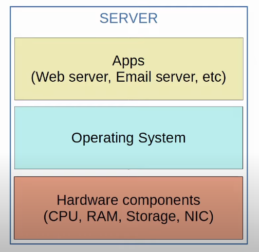
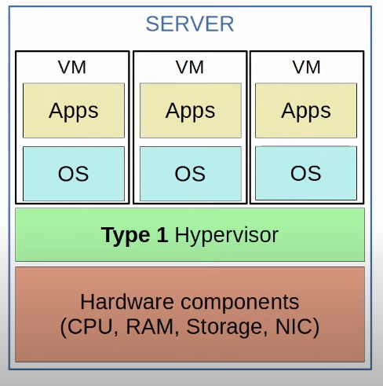
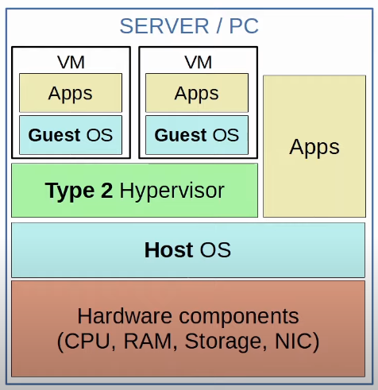
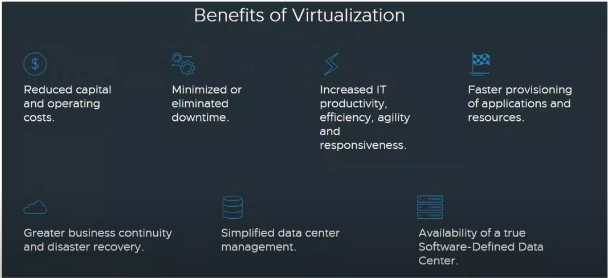
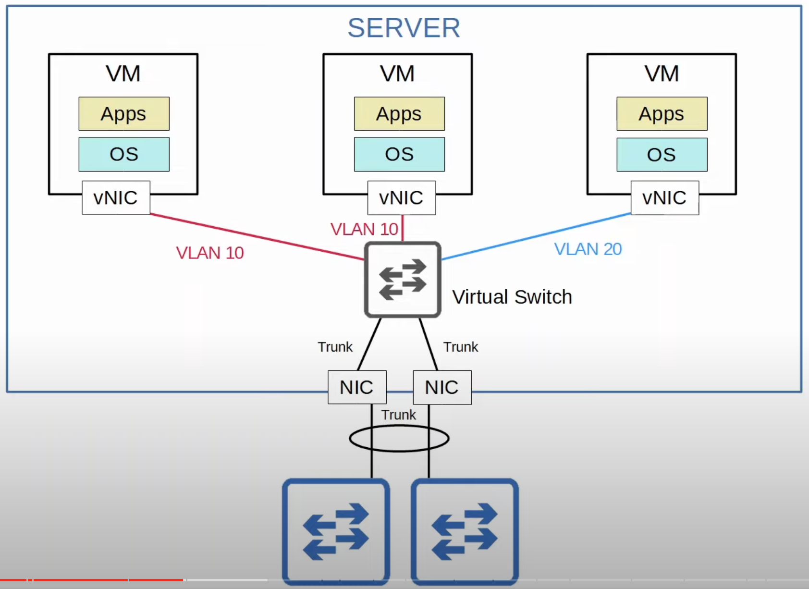
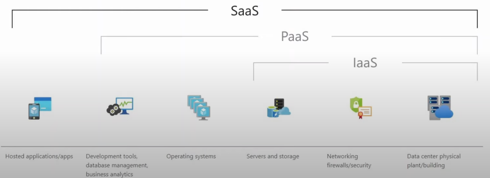
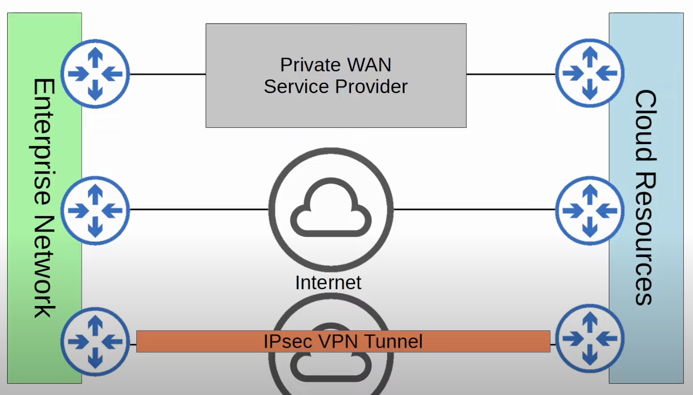

## Server Hardware
* Although Cisco is more known for their networking devices (routers, switches, firewalls), they also offer hardware servers such as UCS (Unified Computing System).
* The largest vendors of hardware servers include Dell EMC, HPE, and IBM.
### Servers Before Virtualization

* Before virtualization, there was a one-to-one relationship between a physical server and an operating system.
* In that operating system, apps providing services such as a web server, email server, etc. would run.
* One physical server would be used for the web server, one for the email server, one for the database server, etc.
	* It is possible to run all apps in a single operating system on a single physical server, but this is not a good idea because if the apps aren't isolated from each other, a problem in a single app could affect all of the other apps.
* Using one physical server per app is inefficient for multiple reasons:
	* Each physical server is expensive and takes up space, power, etc.
	* The resources on each physical server (CPU, RAM, Storage, NIC) are typically under-used.
## Intro to Virtualization
### Virtualization (Type 1 Hypervisor)

* Virtualization allows us to break the one-to-one relationship of hardware to OS, allowing multiple OS's to run on a single physical server.
* Each instance is called a VM (Virtual Machine).
* A **hypervisor** is used to manage and allocate the hardware resources (CPU, RAM, etc) to each VM.
* Another name for a hypervisor is VMM (Virtual Machine Monitor).
* The type of hypervisor which runs directly on top of the hardware is called a **Type 1** hypervisor.
	* Examples include VMware ESXi, Microsoft Hyper-V, etc.
* Type 1 hypervisors are also called bare-metal hypervisors because they run directly on on the hardware (metal).
	* Another term is *native hypervisor*.
* This is the type of hypervisor used in data center environments.
* Type 1 hypervisors are efficient because the hypervisor runs directly on the hardware and requires few resources itself, leaving more for the VMs running on the hypervisor.
### Virtualization (Type 2 Hypervisor)

* **Type 2** hypervisors run as a program on the operating system like a regular computer program.
	* Examples include VMware Workstation, Oracle VirtualBox, etc.
	* The OS running directly on the hardware is called the **Host OS**, and the OS running in a VM is called a **Guest OS**.
	* Although Type 2 hypervisors are rarely used in data center environments, they are common on personal-use devices (for example, if a Mac/Linux user needs to run an app that is only supported on Windows, or vice versa).
### Why Virtualization ?

* **Partitioning**:
	* Run multiple operating systems on one physical machine.
	* Divide system resources between virtual machines.
* **Isolation**:
	* Provide fault and security isolation at the hardware level.
	* Preserve performance with advanced resource controls.
* **Encapsulation**:
	* Save the entire state of a virtual machine to files.
	* Move and copy virtual machines as easily as moving and copying files.
* **Hardware Independence**:
	* Provision or migrate any virtual machine to any physical server. As long as the hypervisor you are using can run on the physical server.
### Connecting VMs to The Network

* VMs are connected to each other and the external network via a virtual switch running on the hypervisor.
	* Alternatively, you can run a Cisco virtual switch on the hypervisor.
* Just like a regular physical switch, the vSwitch's interfaces can operate as access or trunk ports and use VLANs to separate the VMs at Layer 2.
* Interfaces on the vSwitch connect to the physical NIC (or NICs) of the server to communicate with the external network.
* A VPC (Virtual Port Channel) can be used to connect the NICs of the server and the physical switches. This creates a port channel to two separate physical switches for redundancy. 
## Intro to Cloud Computing
* Traditional IT infrastructure deployments were some combinations of the following:
	* **On-Premises**:
		* All servers, network devices, and other infrastructure are located on company property.
		* All equipment is purchased and owned by the company using it.
		* The company is responsible for the necessary space, power, and cooling.
	* **Colocation**:
		* Data centers that rent out space for customers to put their infrastructure (servers, network devices).
		* The data center provides the space, electricity, and cooling.
		* The servers, network devices, etc are still the responsibility of the end customer, although they are not located on the customer's premises.
* Cloud services provide an alternative that is hugely popular, and is continuing to grow.
* Most people associate 'cloud' with public cloud providers such as AWS. Although, this is the most common use of cloud services, it's not the only one.
* The American NIST (National Institute of Standards and Technology) defined cloud computing in SP (Special publication) 800-145.
* Cloud computing is a model for enabling ubiquitous, convenient, on-demand network access to a shared pool of configurable computing resources (e.g., networks, servers, storage, applications, and services) that can be rapidly provisioned and released with minimal management effort or service provider interaction. This cloud model is composed of five essential characteristics, three service models, and four deployment models.
* To understand the cloud, it's essential to understand its components:
	* Five essential characteristics.
	* Three service models.
	* Four deployment models.
### The Five Essential Characteristics of Cloud
* **On-demand self-service**: A customer can unilaterally provision computing capabilities, such as server time and network storage, as needed automatically without requiring human interaction with each service provider.
	* The customer is able to user the service (or stop using the service) freely (via a web portal) without direct communication to the service provider.

* **Broad network access:** Capabilities are available over the network and accesses through standard mechanisms that promote use by heterogenous thin or thick client platforms (e.g., mobile phones, tablets, laptops, and workstations).
	* The service is available through standard network connections (ie. the Internet or private WAN connections), and can be accessed through many kinds of devices.

* **Resource Pooling:** The provider's computing resources are pooled to serve multiple consumers using a multi-tenant model, with different physical and virtual resources dynamically assigned and reassigned according to consumer demand. There is a sense of location independence in that the customer generally has no control or knowledge over the exact location of the provided resources, but may be able to specify location at a higher level of abstraction (e.g., country, state, or datacenter). Examples of resources include storage, processing, memory, and network bandwidth.
	* A pool of resources is provided by the service provider, and when a customer requests a service (for example creates a new VM), the resources to fulfill that request are allocated from the shared pool.

* **Rapid elasticity**: Capabilities can be elastically provisioned and released, in some cases automatically, to scale rapidly outward and inward commensurate with demand. To the consumer, the capabilities available for provision often appear to be unlimited and can be appropriated in any quantity at any time.
	* Customers can quickly expand the services they use in the cloud (for example, add new VMs, expand storage, etc) from a pool of resources that appears to be infinite. Likewise, they can quickly reduce their services when not needed.

* **Measured service**: Cloud systems automatically control and optimize resource use by leveraging a metering capability at some level of abstraction appropriate to the type of service (e.g., storage, processing, bandwidth, and active user accounts). Resource usage can be monitored, controlled, and reported, providing transparency for both the provider and consumer of the utilized service.
	* The cloud service provider measures the customer's usage of cloud resources, and the customer can measure their own use as well. Customers are charged based on usage (for example, X dollars per gigabyte of storage per day).
### The Three service models of Cloud
* In cloud computing, everything is provided on a 'service' model.
* For example, rather than the end user buying a physical server, mounting it on a rack, installing the hypervisor, creating the VMs, etc, the service provider offers all of this as a service.

* **Software as a Service** (SaaS): The capability provided to the consumer is to use the provider's applications running on a cloud infrastructure. The applications are accessible from various client devices through either a thin client interface, such as a web browser (e.g., web-based emails), or a program interface. The consumer does not manage or control the underlying cloud infrastructure including network, servers, operating systems, storage, or even individual application capabilities, with the possible exception of limited user-specific application configuration settings.
	* Microsoft Office 365 is a popular example of SaaS.

* **Platform as a Service** (PaaS): The capability provided to the consumer is to deploy onto the cloud infrastructure consumer-created or acquired applications created using programming languages, libraries, services, and tools supported by the provider. The consumer does not manage or control the underlying cloud infrastructure including network, servers, operating systems, or storage, but has control over the deployed applications and possibly configuration settings for the application-hosting environment.
	* Examples include AWS Lambda and Google App Engine.

* **Infrastructure as a Service** (IaaS): The capability provided to the consumer is to provision processing, storage, networks, and other fundamental computing resources where the consumer is able to deploy and run arbitrary software, which can include operating systems and applications. The consumer does not manage or control the underlying cloud infrastructure but has control over operating systems, storage, and deployed applications; and possibly limited control of select networking components (e.g., host firewalls).
	* Examples include Amazon EC2 and Google Compute Engine.
	* This model offers the most control to the customer.
### The Four Deployment models of Cloud
* Most people assume that 'cloud' means public cloud providers such as AWS, Azure, and GCP.
* Although 'Public cloud' is the most common deployment model, it's not the only one.

* **Private Cloud**: The cloud infrastructure is provisioned for exclusive use by a single organization comprising multiple consumers (e.g., business units). It may be owned, managed, and operated by the organization, a third party, or some combination of them, and it may exist on or off premises.
	* Private clouds are generally only used by large enterprises.
	* Although the cloud is private (exclusively used by a single organization), it may be owned by a third party.
	* For example, AWS provides private cloud services for the American DoD.
	* private clouds may be on or off premises.
	* The services offered are the same as in public cloud (SaaS, PaaS, IaaS), but the infrastructure is reserved for a single organization.

* **Community cloud**: The cloud infrastructure is provisioned for exclusive use by a specific community of consumers from organizations that have shared concerns (e.g., mission, security requirements, policy, compliance considerations). It may be owned, managed, and operated by one or more of the organizations in the community, a third party, or some combination of them, and it may exist on or off premises.
	* This is the least common cloud deployment.
	* Similar to private cloud, but the infrastructure is reserved for use by only a specific group of organizations.

* **Public cloud**: The cloud infrastructure is provisioned for open use by the general public. It may be owned, managed, and operated by a business, academic, or government organization, or some combination of them. It exists on the premises of the cloud provider.
	* This is the most common cloud deployment.
	* Popular public cloud providers include: 
		* AWS (Amazon Web Services), 
		* Microsoft Azure, 
		* GCP (Google Cloud Compute), 
		* OCI (Oracle Cloud Infrastructure)
		* IBM Cloud
		* Alibaba Cloud

* **Hybrid cloud**: The cloud infrastructure is a composition of two or more distinct cloud infrastructures (private, community, or public) that remain unique entities, but are bound together by standardized or proprietary technology that enables data and application portability (e.g., cloud bursting for load balancing between cloud).
	* This is basically any combination of the previous three deployment types.
	  For example, a private cloud which can offload to a public cloud when necessary due to resource restriction.
## Benefits of Cloud Computing
The cloud is not always the best option. Most companies these days use a combination of on-premises equipment, colocation, and public cloud. A company shouldn't use the cloud just because it's popular these days. They should weight the benefits and drawbacks and make an informed decision.

* **Cost**:
	* CapEX (Capital Expenses) of buying hardware and software, setting up data centers etc, are reduced or eliminated.
	* Instead the expenses are OpEx (Operating expenses), which are regular small costs instead of one-time large costs.
* **Global Scale**:
	* Cloud services can scale globally at a rapid pace. Services can be set up and offered to customers from a geographic location close to them.
* **Speed/Agility**: 
	* Services are provisioned on demand, and vast amounts of resources can be provisioned within minutes.
* **Productivity**:
	* Cloud services remove the need for many time-consuming tasks such as procuring physical servers, racking them, cabling, installing and updating operating systems, etc.
* **Reliability**:
	* Backups in the cloud are very easy to perform. Data can be mirrored at multiple sites in different geographic locations to support disaster recovery.
## Connecting to Cloud Resources

* The image above showcases the multiple ways a company can connect to its resources hosted on a public cloud.
	* A private WAN connection through a leased line, Ethernet Fiber, MPLS.
	* Simply connect via the internet. This is very cheap, flexible, and easy, but of course connecting through the internet is not as secure as a private WAN connection.
	* A VPN can be used to provide a secure connection over the internet to the resources on the cloud.
* Since the cloud resources are not on the enterprise premises, it's not enough to just set up the apps and servers. You also have to think about how to securely connect to them.
* Like regular WAN connections, redundant connections are always preferable. Having a single point of failure which can take down a network is never a good thing.
