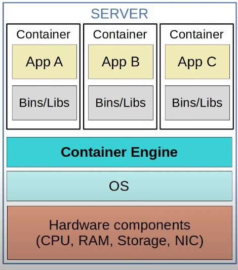

## Containers

* **Containers** are software packages that contain an APP and all dependencies (Bins/Libs in the diagram) for the contained App to run. 
	* Multiple Apps can be run in a single container, but this is not how containers are usually used.
* Containers run on a **Container Engine** (ie. Docker engine).
	* The container engine is run on a host OS (usually Linux).
* Containers are lightweight (small in size) and include only the dependencies required to run the specific App.
	* There is no need to run a separate OS in each container, unlike in VMs. All containers run on top of a shared OS.
* A **Container Orchestrator** is a software platform for automating the deployment, management, scaling etc. of containers.
	* **Kubernetes** (originally designed by Google) is the most popular container orchestrator.
	* **Docker Swarm** is Docker's container orchestration tool.
* In small numbers manual operation is possible, but large-scale systems (ie. with Microservices) can require thousands of containers.
## Virtual Machines vs Containers
The major differences between VMs and containers arise from the fact VMs run their own OS and kernel, whereas containers make use of the host OS and kernel.

There is a major movement toward the use of containers, especially with the rise of microservices, automation, and DevOps (the combination of Software Development and IT Operations), but VMs are still widely used today.

* **VMs** can take minutes to boot up as each VM runs its own OS.
* **Containers** can boot up in milliseconds.

* **VMs** take up more disk space (gigabytes).
* **Containers** take up very little disk space (megabytes).

* **VMs** use more CPU/RAM resources (each VM must run its own OS).
* **Containers** use much fewer CPU/RAM resources (shared OS).

* **VMs** are portable and can move between physical systems running the same hypervisor.
* **Containers** are more portable; they are smaller, faster to boot up, and Docker containers can be run on nearly any container service.

* **VMs** are more isolated because each VM runs its own OS. This isolation also provides security benefits for VMs.
* **Containers** are less isolated because they all run on the same OS; if the OS crashes, all containers running on it are affected.