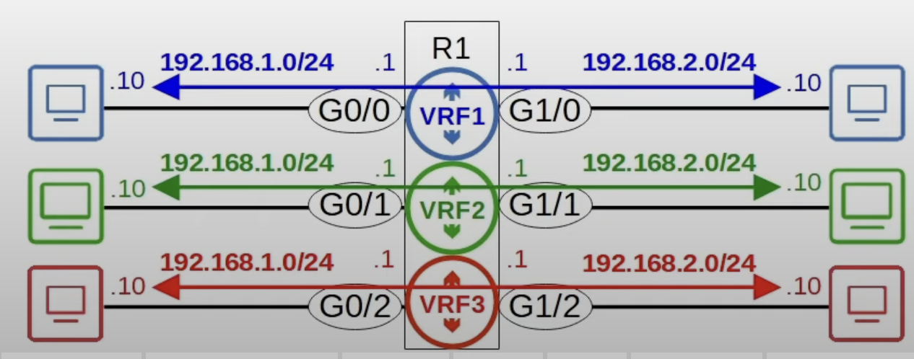
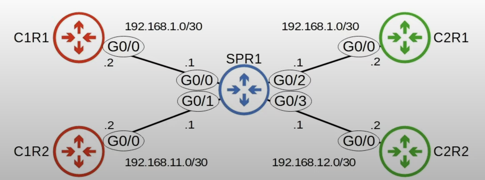
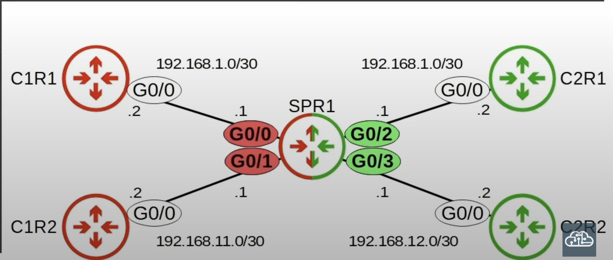
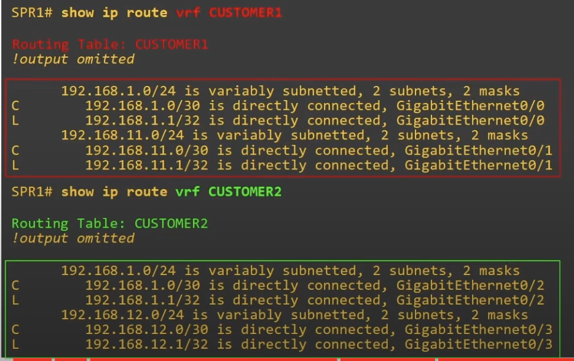

## Intro to VRF


* **Virtual Routing & Forwarding** is used to divide a single router into virtual routers.
	* Similar to how VLANs are used to divide a single switch (LAN) into multiple virtual switches (VLANs).
* It is possible to have a mix of interfaces using an not using VRFs.
* Traffic in one VRF interface cannot be forwarded out of an interface in another VRF.
	* For example, G0/0 is in VRF1 and G1/2 is in VRF3, so traffic cannot be forwarded between them.
	* As an exception, VRF *Leaking* can be configured to allow traffic to pass between VRF's.
* VRF accomplishes this by allowing a router to build separate routing tables.
	* Interfaces (Layer 3 only) & routes are configured to be in a specific **VRF** (aka VRF interface).
	* VRF does not apply to Layer 2 interfaces on a switch. Only router interfaces, SVIs and routed ports on multilayer switches can be configured with VRF.
* VRF is commonly used to facilitate MPLS.
	* **However, the kind of VRF we are talking about here is VRF-lite (VRF without MPLS).**
* VRF is commonly used by service providers to allow one device to carry traffic from multiple customers.
	* Each customer's traffic is isolated from the other.
	* Customer IP addresses can overlap without issues because each VRF creates a separate routing table.

## VRF Configuration

* SPR1 is a service provider router providing WAN services to two customers, customer 1, and customer 2.
	* C1R1 and C1R2 belong to customer 1 and C2R1 and C2R2 belong to customer 2.
* Note that both, customer 1 and customer 2 use subnet `192.168.1.0/30`.
## Overlapping IP Addresses
```
SPR1(config)#interface g0/0
SPR1(config-if)#ip address 192.168.1.1 255.255.255.252
SPR1(config-if)#no shutdown

SPR1(config)#interface g0/1
SPR1(config-if)#ip address 192.168.11.1 255.255.255.252
SPR1(config-if)#no shutdown

SPR1(config)#interface g0/2
SPR1(config-if)#ip address 192.168.1.1 255.255.255.252
% 192.168.1.0 overlaps with GigabitEthernet0/0
```
* G0/2 cannot use IP address `192.168.1.1` because it is in the same subnet as G0/0 (in this case it's the exact same IP address).
	* Even if the IP address is different, G0/2 cannot be configured in the same subnet as G0/0.
* Without the use of VRF, two interfaces on the same router cannot be in the same subnet.

### Divide Router Into VRFs


```
// create VRFs

SPR1(cofnig)#ip vrf CUSTOMER1
SPR1(config-vrf)#ip vrf CUSTOMER2

// Assign interfaces to each VRF

SPR1(config-vrf)#interface g0/0
SPR1(config-ip)#ip vrf forwarding CUSTOMER1
% Interface GigabitEthernet0/0 IPv4 disabled and address(es) removed due to enabling VRF CUSTOMER1
SPR1(config-if)#ip address 192.168.1.1 255.255.255.252

SPR1(config-if)#interface g0/1
SPR1(config-if)#ip vrf forwarding CUSTOMER1
% Interface GigabitEthernet0/1 IPv4 disabled and address(es) removed due to enabling VRF CUSTOMER1
SPR1(config-if)#ip address 192.168.11.1 255.255.255.252

SPR1(config-if)#interface g0/2
SPR1(config-if)#ip vrf forwarding CUSTOMER2
SPR1(config-if)#ip address 192.168.1.1 255.255.255.252
SPR1(config-if)#no shutdown

SPR1(config-if)#interface g0/3
SPR1(config-if)#ip vrf forwarding CUSTOMER2
SPR1(config-if)#ip address 192.168.12.1 255.255.255.252
SPR1(config-if)#no shutdown
```
* If an interface has an IP address configured, the IP address will be removed when you assign the interface to a VRF.

```
SPR1(config-if)#do show ip vrf

Name               Default RD      Interfaces
CUSTOMER 1         <not set>       Gi0/0
                                   Gi0/1
CUSTOMER 2         <not set>       Gi0/2
                                   Gi0/3
```

### VRF Routing Tables
```
SPR1#show ip route
```
* `show ip route` displays the *global routing table*. All of the SPR1's interfaces are configured in VRFs, so nothing displays here.
	* If an interface is not in a VRF, its routes will appear in the global routing table and it will be isolated from the interfaces in VRFs, just like interfaces in different VRFs are isolated from each other.

```
SPR1#show ip route vrf CUSTOMER1

SPR1#show ip route vrf CUSTOMER
```


### Test Reachability

```
SPR1#ping 192.168.1.2
Type escape sequence to abort
Sending 5 100-type ICP Echos to 192.168.1.1, timeout is 2 seconds:
...
Success rate is 0 percent (0/5)
```
* Regular pings without specifying the the VRF won't work for interfaces that are in VRFs.
	* A ping without specifying a VRF will use the global routing table, which is empty because none of SPR1's interfaces are using the global routing instance. All of SPR1's interfaces are assigned to a VRF.

```
// Pings C1R1
SPR1#ping vrf CUSTOMER1 192.168.1.2
...
Success rate is 100 percent (5/5)

SPR1#ping vrf CUSTOMER1 192.168.11.2
...
Success rate is 100 percent (5/5)
```

```
SPR1#ping vrf CUSTOMER1 192.168.12.2
...
Success rate is 0 percent (0/0)
```
* Doesn't work because in customer 1 VRF's routing table, there is no route to the destination `192.168.12.2`.

```
// Pings C2R1
SPR1#ping vrf CUSTOMER2 192.168.12.2
...
Success rate is 100 percent (5/5)
```
* The ping now works because the right VRF was chosen, where the route to `192.168.12.2`  is located.