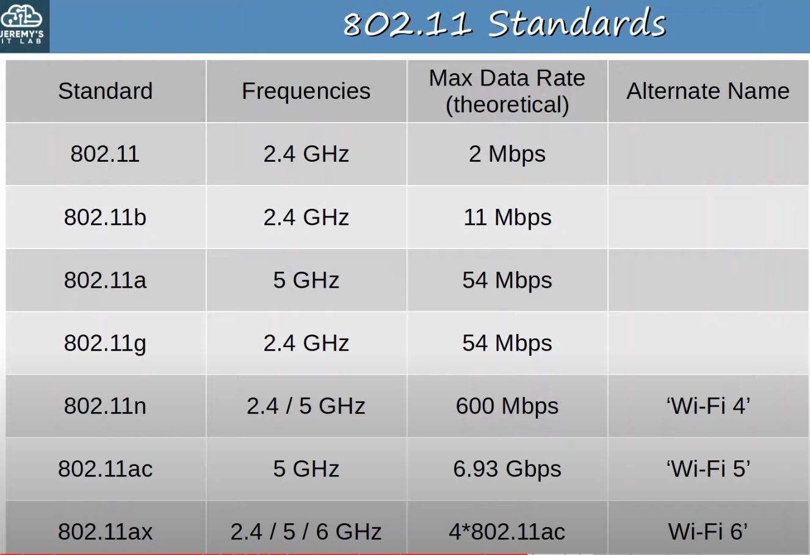

## Wireless Networks
* Although we will briefly look at other types of wireless networks, in this section of the course we will be focusing on wireless LANs using Wi-Fi.
* The standards we use for wireless LANs are defined in IEEE 802.11.
* The term **Wi-Fi** is a trademark of the **Wi-Fi Alliance**, not directly connected to the IEEE.
* The Wi-Fi Alliance tests and certifies equipment for 802.11 standards compliance interoperability with other devices.
* However, Wi-Fi has become the common term that people use to refer to 802.11 wireless LANs.
### Factors to Consider When Building Wireless Networks
#### Security & Collisions
* When a wireless device transmits a frame, all wireless-enabled devices within range will be able to pick up that frame. This can lead to data privacy concerns, as well as collisions when devices communicate on the same channel at the same time.
* Privacy of data within the LAN is a greater concern. In wired networks we don't usually encrypt data within the LAN, only when sending data over a shared network such as the internet. However, for wireless networks it is very important to encrypt data even within the LAN, or else anyone with a device in range of the transmitter can access that data.
* **CSMA/CA** (Carrier Sense Multiple Access with Collision Avoidance) is used to avoid collisions and facilitate half-duplex communications.
	* **CSMA/CD** is used in wired networks to detect and recovery from collisions.
	* **CSMA/CA** is used in wireless networks to avoid collisions.

* When using **CSMA/CA**, a device will wait for other devices to stop transmitting before it transmits data itself.
	* The transmitting device assembles the frame and prepares it to be sent.
	* Then, it listens to check if the channel is free.
	* If the channel is not free, it will wait for a random period of time.
	* Then, it will listen again.
	* If the channel is free this time, it will transmit the frame.
* Note that this is a simplification of the process. There is an optional feature in which the transmitting device sends a 'request to send' (RTS) packet and waits for a 'clear to send' (CTS) packet from the receiver device, before actually sending the data packet.
#### Regulations
* Wireless communications are regulated by various international and national bodies.
* You aren't allowed to transmit data on any channel you want, and which channels you are allowed to use can vary depending on the country.
* The 802.11 standard outlines which frequencies can be used for wireless LANs, and devices are designed to use those frequencies.
#### Coverage Area (Signal Quality)
* In wired connections we have to consider the cable length and in some cases electromagnetic interference, but with wireless connections, there are other factors that must be considered.
* The wireless signal coverage area must be considered along with the various factors that can affect how far the signal can travel intact.
	* Absorption
	* Reflection
	* Refraction
	* Diffraction
	* Scattering
* When planning the positioning of wireless access points for a network, you have to take all of these factors under account.
##### Signal Absorption

**Absorption** happens when a wireless signal passes through a material and is converted into heat, weakening the original signal.
##### Signal Reflection

**Reflection** happens when a signal bounces off a metal, for example metal. This is why Wi-Fi reception is usually poor in elevators. The signal bounces off the metal and very little penetrates into the elevator.
##### Signal Refraction

**Refraction** happens when a wave is bent when entering a medium where the signal travels at a different speed. For example, glass and ware can refract waves.
##### Signal Diffraction

**Diffraction** happens when a wave encounters an obstacle and travels around it to some degree. This can result in blind spots behind the obstacle where the devices don't receive sufficient signal from the access point.
##### Signal Scattering

**Scattering** happens when a material causes a signal to scatter in all directions. Usually, dust, smog, uneven surfaces, etc. can cause scattering.
#### Interference
* Other devices using the same channels can cause interference.  For example, a wireless LAN in your neighbor's house/apartment.
## Radio Frequencies (RF)
* To send wireless signals, the sender applies an alternating current to an antenna. This creates electromagnetic fields which propagate out as waves.
* Electromagnetic waves can be measured in multiple ways, such as **amplitude** and **frequency**.

* **Amplitude** is the maximum strength of the electric and magnetic fields.

* **Frequency** measures the number of up/down cycles per a given unit of time.
* The most common measurement of frequency is **hertz**.
	* Hz (Hertz): Cycles per second.
	* KHZ (Kilohertz): 1, 000 cycles per second.
	* MHz (Megahertz): 1, 000, 000 cycles per second.
	* GHz (Gigahertz): 1, 000, 000, 000 cycles per second.
	* THz (Terahertz): 1, 000, 000, 000, 000 cycles per second.

* The frequency in a time interval of one second is 4 HZ.
* There is 4 cycles in an interval of 1 second, therefore the **period** is 0.25 seconds.
### Radio Frequency Range
* The visible frequency range is about 400 THz to 790 THz.
* The radio frequency range is from 30 Hz to 300 GHz and is used for many purposes.
* Wi-Fi uses two main bands (frequency ranges).
	* **2.4 GHz** band which ranges from 2.400 GHz to 2.4835 GHz
	* **5 GHz** band which ranges from 5.150 GHz to 5,825 GHz. The range is divided into four smaller bands.
* The 2.4 GHz band typically provides further reach in open space and better penetration of obstacles such as walls.
	* However, more devices tend to use the 2.4 GHz band so interference can be a bigger problem compared to the 5GHz band.
* **Wi-Fi 6** (802.11ax) has expanded the spectrum range to include a band in the **6 GHz** range.
### Radio Frequency Channels
* Each band is divided up into multiple channels.
* Devices are configured to transmit and receive traffic on one (or more) of these channels.
	* Channel bonding can be used to combine channels together to be able to receive traffic on more than one channel.

#### 2.4 GHz Frequency Band Channels

* The 2.4 GHz band is divided into several channels, each with a 22 MHz range.
	* Note that it differs by country.
* An important aspect of 2.4 GHz frequency channels is that they overlap.
	* To avoid interference between adjacent wireless access points, we have to carefully chose which channels we configure our access points to use.
* In a small wireless LAN with only a single AP, you can use any channel because there are no other channels that can cause interference.
* In larger WLANs with multiple APs, it's important that adjacent APs don't use overlapping channels to avoid interference.
	* Using overlapping channels between adjacent APs will result in reduced performance and worse user experience.

* In the 2.4GHz band, it is recommended to use channels 1, 6, and 11 because they don't overlap.
* Outside of North America you could use other combinations, but for the CCNA exam remember 1, 6, and 11.

* Using the 1, 6, and 11 pattern you can place APs in a 'honeycomb' pattern to provide complete coverage of an area without interference between channels.
* The coverage area of each AP overlaps to provide complete coverage of the area, but the frequencies don't overlap, which helps avoid interference between the APs.
* When you have to provide wireless coverage over a large space, you should arrange your APs like this.
#### 5 GHz Frequency Band Channels
* The 5 GHz band consists of non-overlapping channels, so it is much easier to avoid interference between adjacent APs.
## Wi-Fi Standards

* 802.11 enabled devices might support one of these standards, some of them, or all of them.
## Service Sets
* 802.11 defines different kinds of **service sets** which are groups of wireless network devices.
* There are three main types:
	* Independent
	* Infrastructure
	* Mesh
* All devices in a service set share the same **SSID** (Service Set Identifier).
	* The SSID is a human-readable name which identifies the service set.
	* The SSID does not have to be unique, although it's best to configure unique SSIDs since that's what you'll be looking at when you select which network to connect to.
## Wireless LAN Fundamentals