## 802.11 Messages/Frame Format
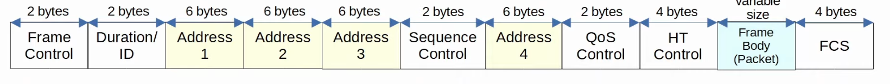
* 802.11 frames have a different format than 802.3 Ethernet Frames.
	* They are more complicate than Ethernet frames.
	* For the CCNA you don't have to learn it in as much detail as the Ethernet and IP headers.
* Depending on the 802.11 version and the message type, some of the fields might not be present in the frame.
	* For example, there are 4 different Address fields, but not all messages use all 4 Address fields.
* **Frame Control**: Provides information such as the message type and subtype.
* **Duration/ID**: Depending on the message type, this field can indicate:
	* The time (in microseconds) the channel will be dedicated for transmission of the frame.
	* An identifier for the association of the connection between the wireless client and AP.
* **Addresses**: Up to four addresses can be present in an 802.11 frame. Which addresses are present, and their order, depends on the message type.
	* Destination Address (DA): Final recipient of the frame.
	* Source Address (SA): Original sender of the frame.
	* Receiver Address (RA): Immediate recipient of the frame, but not necessarily the final destination.
	* Transmitter Address (TA): Immediate sender of the frame, but not necessarily the original sender, the original source of the frame.
* **Sequence Control**: Used to reassemble fragments and eliminate duplicate frames.
* **QoS Control**: Used in QoS to prioritize certain traffic.
* **HT (High Throughput) Control**: Added in 802.11n to enable High Throughput operations.
	* 802.11n is also known as High Throughput (HT) Wi-Fi.
	* 802.11ac is also known as Very High Throughput (VHT) Wi-Fi.
* **FCS (Frame Check Sequence)**: Same as in an Ethernet frame, used to check for errors.
## 802.11 Association Process
* Access Points bridge traffic between wireless stations/clients and other devices.
* For a station/client to send traffic through the AP, it must be associated with the AP.
* There are three 802.11 connection states:
	* Not authenticated, not associated.
	* Authenticated, not associated.
	* Authenticated and associated.
* The station must be authenticated and associated with the AP to send traffic through it.

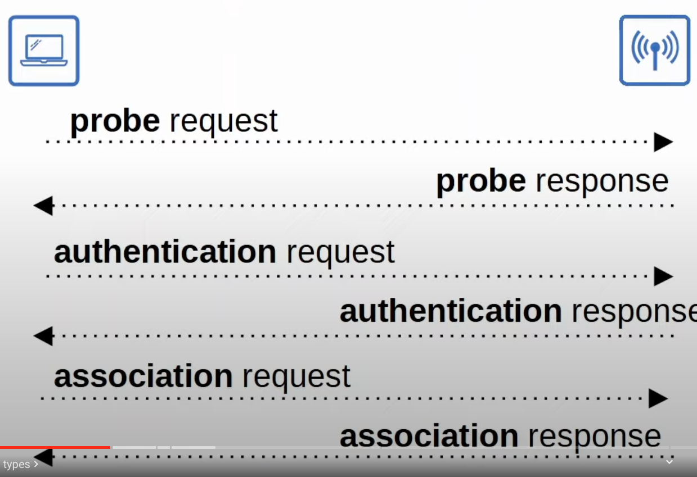
*  The station sends a probe request message to learn about what APs and BSSs are available.
	*  There are two ways a station can scan for a BSS:
		*  **Active scanning**: The station sends probe requests and listens for a probe response from an AP (method being used here).
		*  **Passive scanning**: The station listens for **beacon** messages from an AP. Beacon Messages are sent periodically by APs to advertise the BSS.
*  The AP sends a probe response to say that it is available (not authenticated, not associated).
*  There is an authentication exchange. For example, the station sends a password to the AP and the AP authenticates it ( if successful, the authenticated, not associated state is reached).
*  There is an association request and response.(if successful, the authenticated and associated state is reached).
*  Finally the station can send traffic through the AP.
## 802.11 Message Types
* There are three 802.11 message types:
	* **Management**: used to manage the BSS.
		* Beacon messages
		* Probe request, probe response
		* Authentication request, authentication response
		* Association request, association response
	* **Control**: Used to control access to the medium (radio frequency). Assists with delivery of management and data frames.
		* RTS (Request to Send).
		* CTS (Clear to Send).
		* ACK
	* **Data**: Used to send actual data packets.
## Wireless AP Deployment Methods (Architecture)
### Autonomous APs
* **Autonomous AP**s are self-contained systems that don't rely on a WLC (Wireless Lan Controller).
* They are configured individually, which is fine for small networks. However, configuring APs individually in a large network quickly becomes unrealistic. 
	* Can be configured by console cable (CLI), telnet/SSH (CLI), or HTTP/HTTPS web connection (GUI).
	* An IP address for remote (telnet, SSH, HTTP) management should be configured.
	* The RF (radio frequency) parameters must be manually configured (transmit power, channel, etc) per AP.
	* Security policies are handled individually by each AP.
	* QoS rules etc. are configured individually on each AP.
* There is no central monitoring or management of APs.

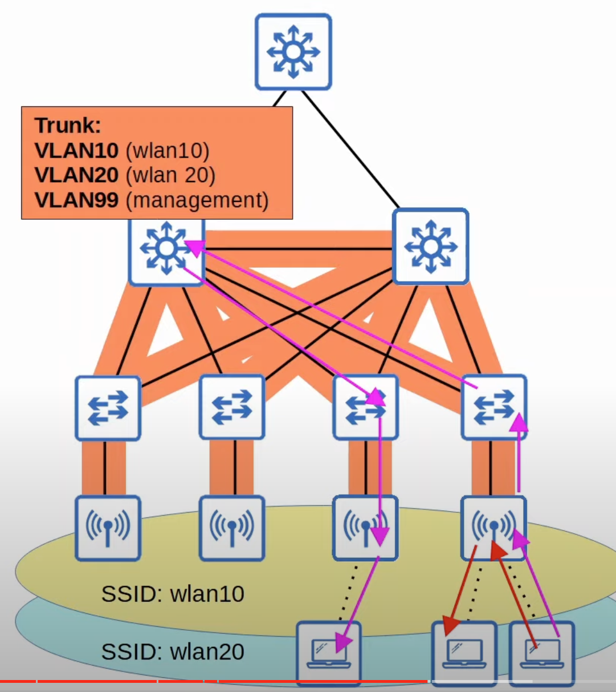
* Autonomous APs connect directly to the wired network (switches) with a trunk link, even if the AP provides only one SSID.
	* A trunk link must be used because the management traffic used to remotely connect to the wireless APs, as well as other devices (switches) should be in a separate VLAN.
	* It's best practice to keep management traffic separate from regular data traffic by putting it in a separate subnet and VLAN.
* Data traffic from wireless clients have a very direct path to the wired network or to other wireless clients associated with the same AP.
* Each VLAN has to stretch across the entire LAN. This is considered bad practice.
	* Large broadcast domains are created.
	* Spanning tree will disable links. A big focus of modern network design is avoiding STP as mush as possible because disabling links means a reduction in total bandwidth.
	* Adding/deleting VLANs is very labor-intensive.
* Autonomous APs can be used in small networks, but they are not viable in medium to large networks.
	* Large networks can have thousands of APs.
#### Autonomous AP operational Modes
* Repeater
* Outdoor Bridge
* Workgroup Bridge
### Lightweight APs
* The function of an AP can be split between the AP and a **Wireless LAN Controller (WLC)**
* **Lightweight AP**s handle 'real-time' operations like transmitting/receiving RF (radio frequency) traffic, encryption/decryption of traffic, sending out beacons/probes, etc.
* Other functions are carried out by the WLC. For example, RF management, security/QoS management, client management, client authentication, client association/roaming management, etc.
* This is called **split-MAC architecture** because the functions are split between the lightweight APs and the WLC.
* The WLC is also used to centrally configure the lightweight APs. No more need to log into the CLI of each AP to manually configure them.
* The WLC can be located in the same subnet/VLAN as the lightweight APs it manages, or in a different subnet/VLAN.
* The WLC and the lightweight APs authenticate each other using digital certificates installed on each device.
	* This ensures that only authorized APs can join the network.
	* X.509 standard certificates are used, which are the same ones that websites use to prove their authenticity over the internet.

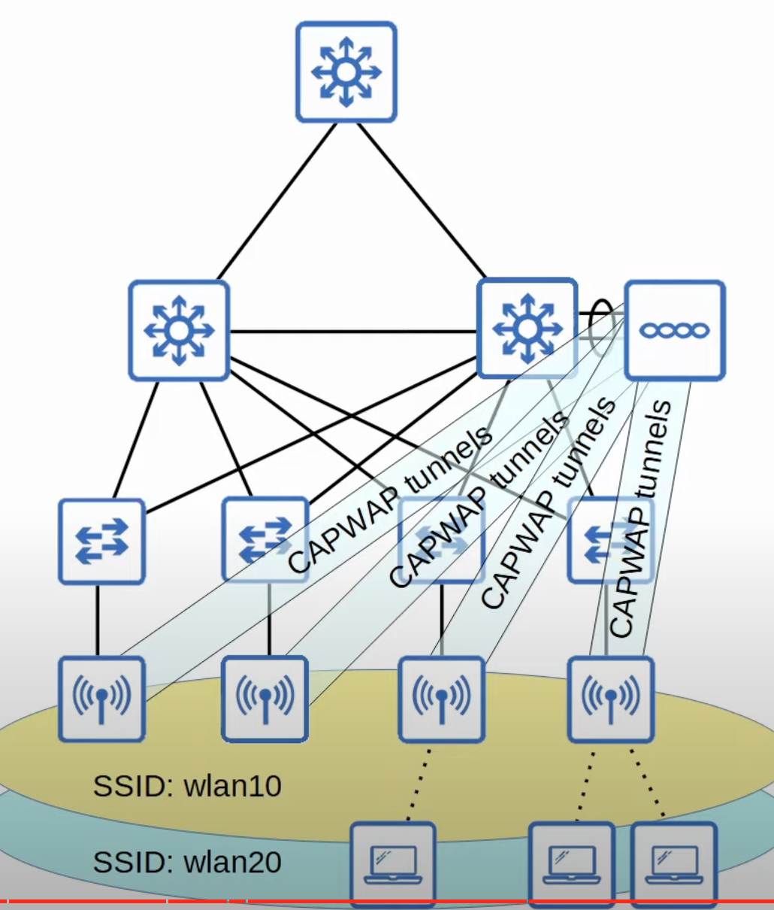
* The WLC and lightweight APs use a protocol called **CAPWAP (Control and Provisioning of Wireless Access Points)** to communicate over tunnels.
	* Based on an older protocol called LWAPP (Lightweight Access Point Protocol).
* Two tunnels are created between each AP and the WLC:
	* **Control tunnel (UDP port 5246)**: This tunnel is used to configure the APs and control/manage the operations. All traffic in this tunnel is encrypted by default.
	* **Data tunnel (UDP port 5247)**: All traffic from wireless clients is sent through this tunnel to the WLC. Traffic does not go directly to the wired network or even directly to another client associated with the same AP.
		* In reality the traffic does pass through the wired network to go to the WLC. However, it is encapsulated with new headers to form the tunnel.
		* Traffic in this tunnel is not encrypted by default, but you can configure it to be encrypted with **DTLS (Datagram Transport Layer Security)**.
* Because all traffic from wireless clients is tunneled to the WLC with CAPWAP, APs connect to switch access ports, not trunk ports.
	* You could make a trunk link if you want, but there is no need for multiple VLANs to cross that link.
* A trunk link is needed to connect the WLC to the wired network.
#### Split-MAC Architecture Benefits
* **Scalability**: With a WLC (or multiple in very large networks) it's much simpler to build and support a network with thousands of APs.
* **Dynamic channel assignment**: The WLC can automatically select which channel each AP should use.
* **Transmit power optimization**: The WLC can automatically set the appropriate transmit power for each AP.
* **Self-healing wireless coverage**: When an AP stops functioning, the WLC can  increase the transmit power of nearby APs to avoid coverage holes.
* **Seamless roaming**: Clients can roam between APs with no noticeable delay.
* **Client load balancing**: If a client is in range of two APs, the WLC can associate the client with the least-used AP, to balance the load among APs.
* **Security/QoS management**: Central management of security and QoS policies ensures consistency across the network.
#### Lightweight APs vs Autonomous APs Traffic Path
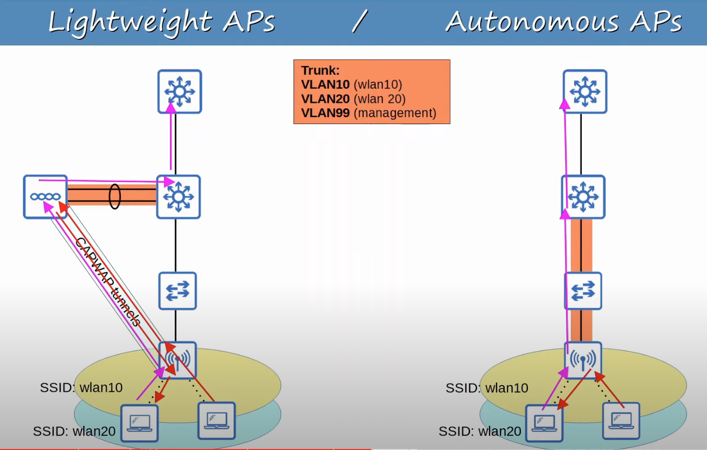
#### Lightweight AP Operational Modes
* **Local**: this is the default mode where the AP offers a BSS (or multiple BSSs) for clients to associate with.
* **FlexConnect**: Like a lightweight AP in Local mode, it offers one or more BSSs for clients to associate with. However, FlexConnect allows the AP to locally switch traffic between the wired and wireless networks if the tunnels to the WLC go down.
* **Sniffer**: The AP does not offer a BSS for clients. It is dedicated to capturing 802.11 frames and sending them to a device running software such as WireShark.
* **Monitor**: The AP doe snot offer a BSS for clients. It is dedicated to receiving 802.11 frames to detect rogue devices. If a client is found to be a rogue device, an AP can send de-authentication messages to disassociate the rogue device from the AP.
* **Rogue Detector**: The AP does not even use its radio. It listens to traffic on the wired network only, but it receives a list of suspected rogue clients and AP MAC addresses from the WLC. By listening to ARP messages on the wired network and correlating it with the information it receives from the WLC, it can detect rogue devices.
* **SE-Connect (Spectrum Expert Connect**: The AP does not offer a BSS for clients. It is dedicated to RF spectrum analysis on all channels. It can send information to software such as Cisco Spectrum Expert on a PC to collect and analyze the data.
* **Bridge/Mesh**: Like the autonomous AP's Outdoor Bridge mode, the lightweight AP can be a dedicated bridge between sites, even over long distances. A mesh can be made between the access points.
* **Flex plus Bridge**: Adds FlexConnect functionality to the Bridge/Mesh mode. Allows wireless access points to locally forward traffic even if connectivity to the WLC is lost.
### Cloud-Based APs
* **Cloud-Based AP** architecture is in between autonomous AP and split-MAC architecture.
	* Autonomous APs that are centrally managed in the cloud.
* Cisco Meraki is a popular cloud-based Wi-Fi solution.
* The Meraki dashboard can be used to configure APs, monitor the network, generate performance reports, etc.
	* Meraki also tells each AP which channel to use, what transmit power, etc.
* However, data traffic is not sent to the cloud. It is sent directly to the wired network like when using autonomous APs.
	* Only management/control traffic is sent to the cloud.

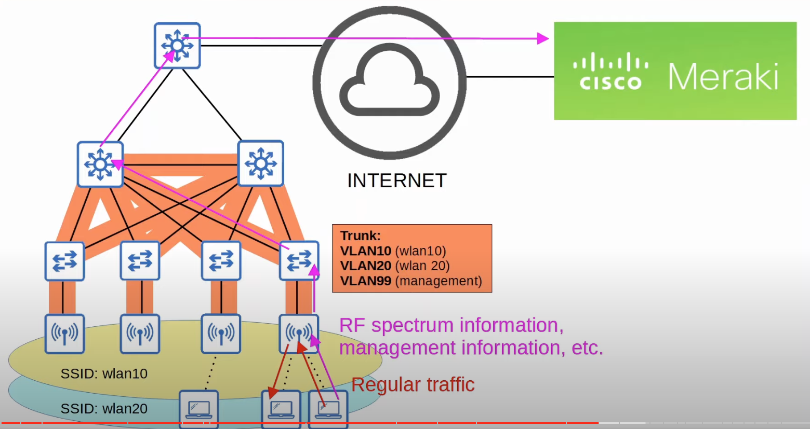

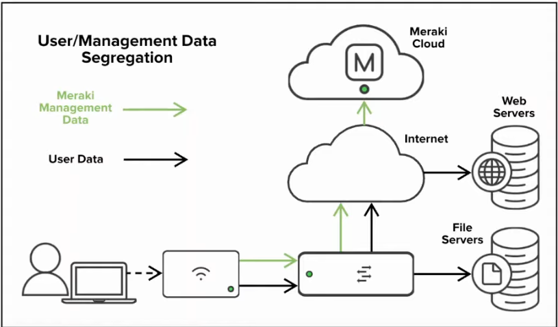
## Wireless LAN Controller (WLC) Deployments
* This applies to split-MAC architectures only, not autonomous AP or cloud-based AP architectures.
* In a split-MAC architecture, there are four main WLC deployment models
### Unified WLC Deployment
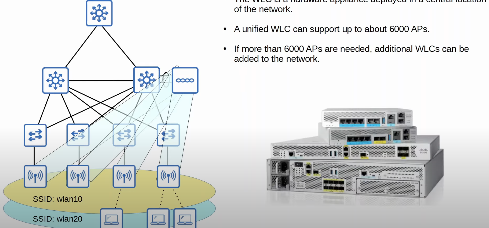
* The WLC is a hardware appliance in a central location of the network.
* A unified WLC can support up to 6000 APs.
* If more than 6000 APs are needed, additional WLCs can be added to the network.
### Cloud-based WLC Deployment
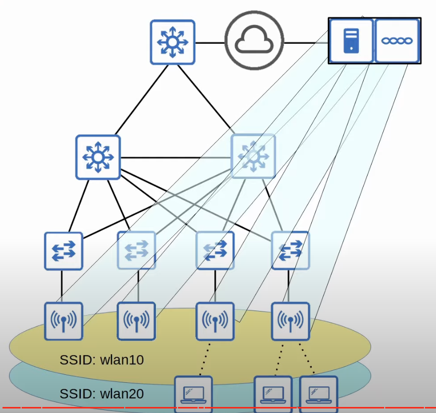
* The WLC is a VM running on a server, usually in a private cloud in a data center. 
	* This is not the same as the cloud-based AP architecture discussed previously.
	* The 'Cloud-based' name here, simply refers to where the WLC is located.
* Cloud-based WLCs can typically support up to about 3000 APs.
* If more than 3000 APs are needed, more WLC VMs can be deployed.
### Embedded WLC Deployment
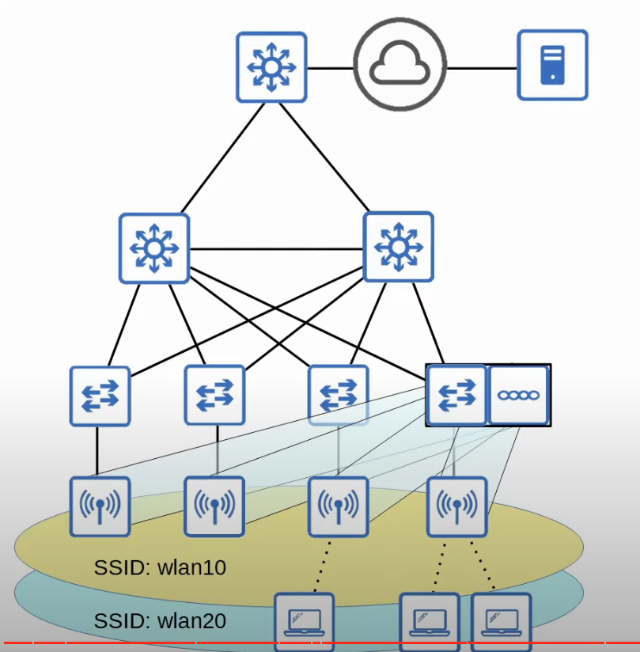
* The WLC is integrated within a switch in the network.
* An embedded WLC can support up to about 200 APs.
* If more than 200 APs are needed, more switches with embedded WLCs can be added.
* Suitable for smaller campuses.
### Cisco Mobility Express WLC Deployment:
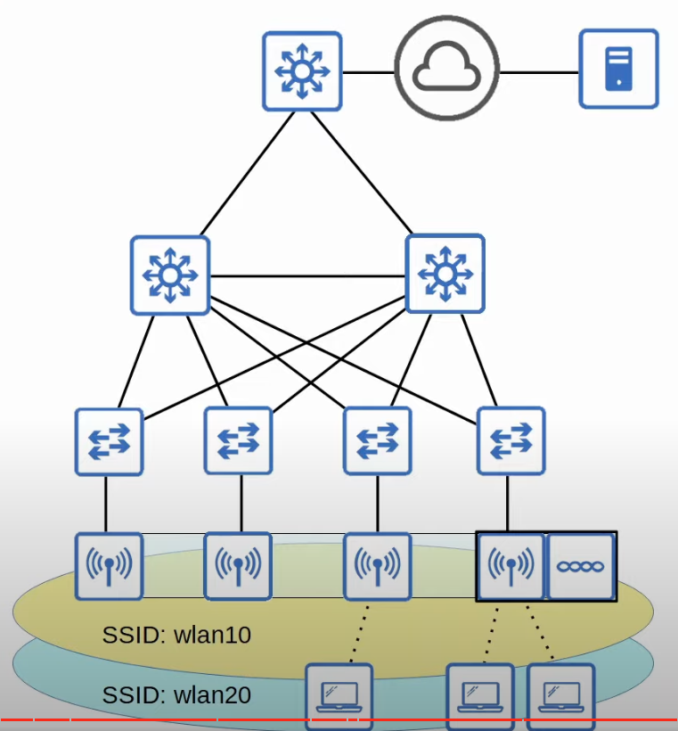
* The WLC is integrated within an APs in the network.
	* The AP containing the WLC builds an internal CAPWAP tunnels to it and the other APs do too.
* A Mobility Express WLC can support up to 100 APs.
* If more than 100 APs are needed, more APs with integrated Mobility Express WLCs can be added.
* Suitable for a small branch office.