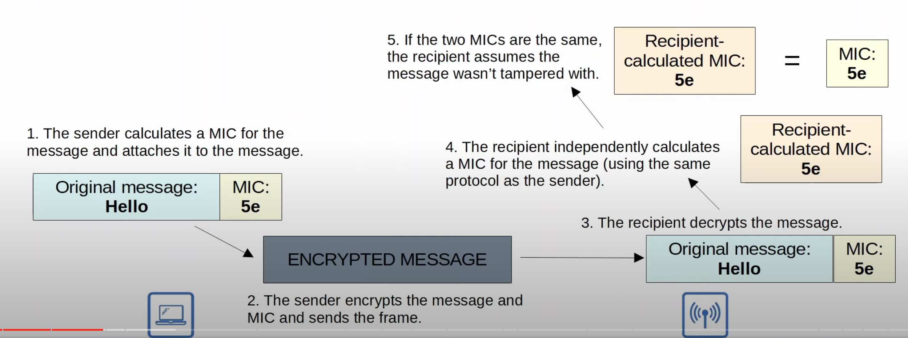
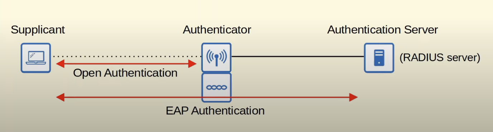
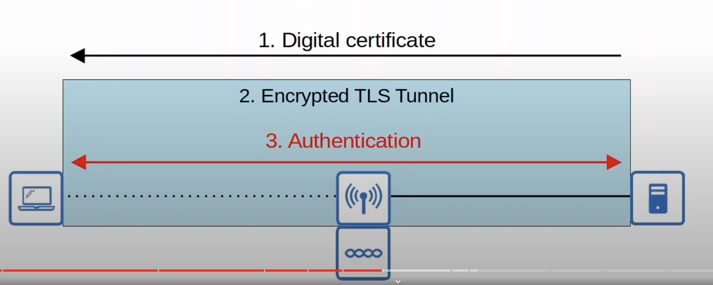

## Wireless Network Security
* Although security is important in all networks, it is even more essential in wireless networks.
* Because wireless signals are not contained within a wire, any device within range of the signal can receive the traffic.
* In wired networks, traffic is only encrypted when sent over an untrusted network such as the Internet.
* In wireless networks, it is very important to encrypt traffic sent between the wireless clients and the AP.
## Authentication
* All clients must be authenticated  before they can associate with an AP.
* In a corporate setting, only trusted users/devices should be given access to the network.
	* In corporate settings, a separate SSID which doesn't have access to the corporate network can be provided for guest users.
* Ideally, clients should also authenticate the AP to avoid associating with a malicious AP.
* There are multiple ways to authenticate:
	* Password
	* Username/Password
	* Digital certificates installed on the device.
## Encryption
* Traffic sent between clients and APs should be encrypted so that it can't be read by anyone except the AP and the client.
* There are many possible protocols that can be used to encrypt traffic.
* All devices on the WLAN will use the same protocol, however each client will use a unique encryption/decryption key so that other devices can't read its traffic.
* A group key is used by the AP to encrypt traffic that it wants to send to all of its clients.
	* All of the clients associated with the AP keep that key so they can decrypt the traffic.
## Integrity
* Integrity helps verify that a message has not been modified by a third party.
* The message that is sent by the source host should be the same as the message that is received by the destination host.
* A **MIC (Message Integrity Check)** is added to messages to help protect their integrity.
	* There is multiple protocols that can be used to calculate this MIC. 
	* The sender and receiver must use the same protocol to calculate the MIC.

* If the two MICs aren't the same, that means that the message was tampered with and will be discarded.
## Wireless Authentication Methods
The original 802.11 standard included two options for authentication:
* **Open Authentication**:
	* The client sends an authentication request, and the AP accepts it. No questions asked!
	* This is clearly not a secure authentication method. However, it is still used today in combination with other authentication methods.
	* After the client is authenticated and associated with the AP, it's possible to require the user to authenticate via other methods before access to the network is granted (ie. Starbuck's WiFi).
* **WEP (Wired Equivalent Privacy)**:
	* WEP provides authentication and/or encryption of wireless traffic.
		* If WEP authentication is not used, Open Authentication will be used and WEP will only be used for encryption.
	* For encryption, WEP uses the RC4 algorithm.
	* WEP is a shared-key protocol, requiring the sender and receiver to have the same key.
	* WEP keys can be 40 bits or 104 bits in length.
	* The above keys are combined with a 24-bit IV (Initialization Vector) to bring the total length to 64 bits or 128 bits.
	* WEP is not secure either as an encryption method or an authentication method.
	* WEP can be used for authentication like this:
		* The AP sends an unencrypted challenge phrase (a random string) to the client device attempting to connect.
		* The client device encrypts the received challenge phrase using the shared WEP key. This WEP key is a pre-shared key that both the client and the AP must have in order to communicate securely.
		* The client sends the encrypted challenge phrase back to the AP.
		* The AP receives the encrypted challenge phrase from the client and encrypts its own copy of the original challenge phrase using the same shared WEP key.
		* The AP then compares the client's encrypted challenge phrase with its own encrypted version.
	* Note that functions carried out by the AP in the authentication process would be performed by the WLC if a split-MAC architecture was being used.
### EAP (Extensible Authentication Protocol)
* EAP is an authentication framework.
* It defines a standard set of authentication functions that are used by the various EAP methods.
* We will look at four EAP methods: LEAP, EAP-FAST, PEAP, and EAP-TLS.
* EAP is integrated with 802.1X, which provides port-based network access control.
#### 802.1X 
* 802.1X is used to limit network access for clients connected to a LAN or WLAN until they authenticate.
* 802.1X is used in all kinds of networks, both wired and wireless.
* There are three main entities in 802.1X:
	* **Supplicant**: The device that want to connect to the network.
	* **Authenticator**: The device that provides access to the network.
	* **Authentication Server (AS)**: The device that receives client credentials and permits/denies access.

802.11 wireless LAN topology that showcases 802.1X integrated with EAP

* The authenticator is the device that provides access to the network, the access point. 
	* In a split-MAC architecture, the WLC manages the authentication, not the AP itself.
* The authentication server is usually a RADIUS server.
* 802.1X process:
	* The 802.11 wireless authentication required to associate with the AP/WLC is simply open authentication.
	* The client becomes associated after this step, but it still does not have access to the network. 
	* Only traffic required for EAP authentication is allowed from the client.
	* The authentication server will check the client's credentials and decide to permit access or deny access to the network.
#### LEAP (Lightweight EAP)
* LEAP was developed by Cisco as an improvement over WEP.
* Clients must provide a username and password to authenticate.
* In addition, mutual authentication is provided by both the client and server sending a challenge phrase to each other. In WEP only the server sends a challenge phrase.
	* Challenge phrases are exchanged.
	* Then, each device encrypts the other's challenge phrase and sends it back. 
	* The client and server use the received encrypted challenge phrase to authenticate each other like in WEP.
* To further improve the security, dynamic WEP keys are used so the WEP keys are changed frequently.
* Like WEP, LEAP is considered vulnerable and should not be used anymore.
#### EAP-FAST (EAP Flexible Authentication via Secure Tunneling)
* EAP-FAST was also developed by Cisco.
* Consists of three phases:
	* A PAC (Protection Access Credential) is generated and passed from the server to the client. The PAC is like a shared key and is used in the next phase to establish a secure TLS tunnel between the client and authentication server.
	* A secure TSL tunnel is established between the client and authentication server.
	* Inside of the secure (encrypted) TSL tunnel, the client and server communicate further to authenticate/authorize the client.

#### PEAP (Protected EAP)
* Like EAP-FAST  PEAP involves establishing a secure TLS tunnel between the client and server.
* Instead of a PAC, the server has a digital certificate, which it will show to the client.
* The client uses this digital certificate to authenticate the server.
* The certificate is also used to establish a TLS tunnel.
* Because only the server provides a certificate for authentication, the client must still be authenticated within the secure tunnel. For example, by using MS-CHAP (Microsoft Challenge-Handshake Authentication Protocol).

#### EAP-TLS (EAP Transport Layer Security)
* Whereas PEAP only requires the AS to have a certificate, EAP-TLS requires a certificate on the AS and on every single client.
* EAP-TLS is the most secure wireless authentication method, but it is more difficult to implement than PEAP because every client device needs a certificate.
* Because the client and server authenticate each other with digital certificates, there is no need to authenticate the client within the TLS tunnel.
* The TLS tunnel is still used to exchange encryption key information.
## Wireless Encryption Methods

### WEP
* Already covered above.
* WEP is used for both, authentication and also encryption.
### TKIP (Temporal Key Integrity Protocol)
* WEP was found to be vulnerable, but wireless hardware at the time was built to use WEP.
* A temporary solution (TKIP) was needed until a new standard was created and new hardware was built.
* TKIP is based on WEP but adds various security features:
	* A **MIC** is added to protect the integrity of messages.
	* A Key mixing algorithm is used to crate a unique WEP key for every frame, instead of each frame using the same key.
	* The initialization vector is doubled in length from 24 bits to 48 bits, making brute-force attacks much more difficult.
	* The MIC includes the sender MAC address to identify the frame's sender.
	* A timestamp is added to the MIC to prevent replay attacks. 
		* Replay attacks involve re-resending a frame that has already been transmitted.
	* A **TKIP** sequence number is used to keep track of frames sent from each source MAC address. This also protects agains replay attacks because the frame will be dropped if the sequence counter is incorrect.

It's probably not necessary to memorize all of the above factors. Just know that TKIP was developed as a more secure temporary solution after WEP was found to be vulnerable. Also know that TKIP is used in WPA (WiFi Protected Access) version 1.
### CCMP (Counter/CBC-MAC protocol)
* CCMP was developed after TKIP and is more secure.
* It is sued in WPA2.
* To use CCMP, it must be supported by the device's hardware. Old hardware built only to use WEP/TKIP cannot use CCMP.
* CCMP consists of two different algorithms to provide encryption and MIC (Message Integrity Check).
	* **AES (Advanced Encryption Standard) counter mode** encryption.
		* AES is the most secure encryption protocol currently available. It is widely used all over the world.
		* There are multiple modes of operation for AES. CCMP uses 'counter mode'.
	* **CBC-MAC (Cipher Block Chaining Message Authentication Code)** is used as a MIC to ensure the integrity of the message.
### GCMP (Galois/Counter Mode Protocol)
* GCMP is more secure and efficient than CCMP.
* Its increased efficiency allows higher data throughput than CCMP.
* If your hardware supports it, it is recommended to use GCMP whenever possible.
* It is used in WPA3.
* GCMP consists of two algorithms to provide encryption and MIC:
	* **AES counter mode** encryption.
	* **GMAC (Galois Message Authentication Code)** is used as a MIC to ensure the integrity of messages.
## Wi-Fi Protected Acces (WPA)
* The Wi-Fi alliance has developed three WPA certifications for wireless devices:
	* WPA
	* WPA2
	* WPA3
* To be WPA-certified, equipment must be tested in authorized testing labs.
* All of the above support two authentication modes:
	* **Personal mode**: A pre-shared key (PSK) is used for authentication. 
		* When you connect to a home Wi-Fi network, enter the password and are authenticated, that is personal mode. 
		* This mode is common in small networks. 
		* For security reasons, the PSK itself is not sent over the Air. A four-way handshake is used for authentication, and the PSK is used to generate encryption keys. 
		* If the devices use the same PSK to generate the encryption keys, they will be able to decrypt each other's traffic, meaning that they will know that the other device is using the same PSK.
	* **Enterprise mode**: 802.1X is used with an authentication server (RADIUS server).
		* No specific EAP method is specified, so all EAP methods are supported (PEAP, EAP-TLS, etc).
### WPA
* The **WPA** certification was developed after WEP was proven to be vulnerable and includes the following protocols:
	* TKIP (based on WEP) provides encryption /MIC.
	* 802.1X authentication (Enterprise mode) or PSK (Personal mode).
* WPA didn't last long. After more secure protocols and hardware were developed, WPA2 was released.
### WPA 2
* **WPA 2** was released in 2004 and includes the following protocols:
	* CCMP provides encryption/MIC.
	* 802.1X authentication (Enterprise mode) or PSK (Personal mode).
### WPA 3
* **WPA 3** was released in 2018 and includes the following protocols:
	* GCMP provides encryption /MIC.
	* 802.1X authentication (Enterprise mode) or PSK (personal mode).
* WPA 3 also provides several additional security features:
	* **PMF (Protected Management Frames)** is used to protect 802.11 management frames from eavesdropping/forging.
		* Optional feature in WPA 2, but mandatory in WPA 3.
	* **SAE (Simultaneous Authentication of Equals)** protects the four-way handshake when using personal mode authentication.
	* **Forward secrecy** prevents data from being decrypted after it has been transmitted over the air. So, an attacker can't capture wireless frames and then try to decrypt them later.