## Topology Introduction
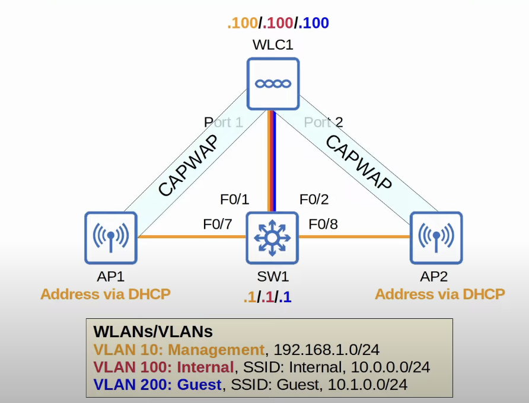
* LAG (Link Aggregation Group) is just another name for EtherChannel. But in the context of WLCs (Wireless LAN Controllers), the term LAG is used.
	* It's not necessary to connect the WLC to the switch using a LAG, but it's a good idea to provide additional throughput and redundancy.
* VLAN 100 and VLAN 200 will be mapped to a wireless LAN and advertised by the APs.
	* In a real deployment, you could limit the Guest SSID to Internet access only, whereas clients associated with the Internal SSID could access all internal company resources.
* VLAN 10 will be used  to connect to the network devices (WLC, switch, APs, etc) to manage them (via SSH, etc).
* SW1 has an SVI in each VLAN.
* WLC1 has an IP in each VLAN.
* The APs will need an IP address in the management VLAN so they can communicate with the WLC. The IP addresses will be assigned via DHCP.
	* The WLC could be configured as the DHCP server, but the switch will server as both, the the DHCP server and NTP server for this network.
* A split-MAC architecture is being used, therefore the interfaces connected to the APs are access ports. Only the WLC needs to connect via a trunk port with all of the necessary VLANs.
* The APs will form a CAPWAP tunnel to the WLC.
### Split-MAC Deployment Traffic Path Review
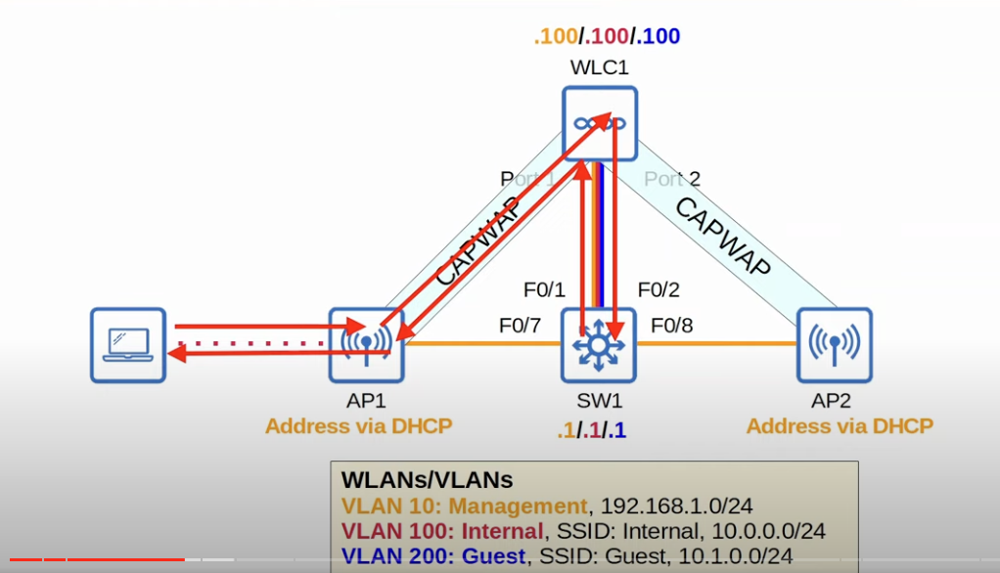
* A client associated with the Internal WLAN wants to communicate with its default gateway, which is SW1's VLAN 100 SVI.
* The traffic passes though the CAPWAP tunnel  to the WLC.
* On the WLC, the Internal WLAN is mapped to VLAN 100, so it will forward the traffic in VLAN 100 to SW1.
* SW1 then sends traffic back to the client via the same path.

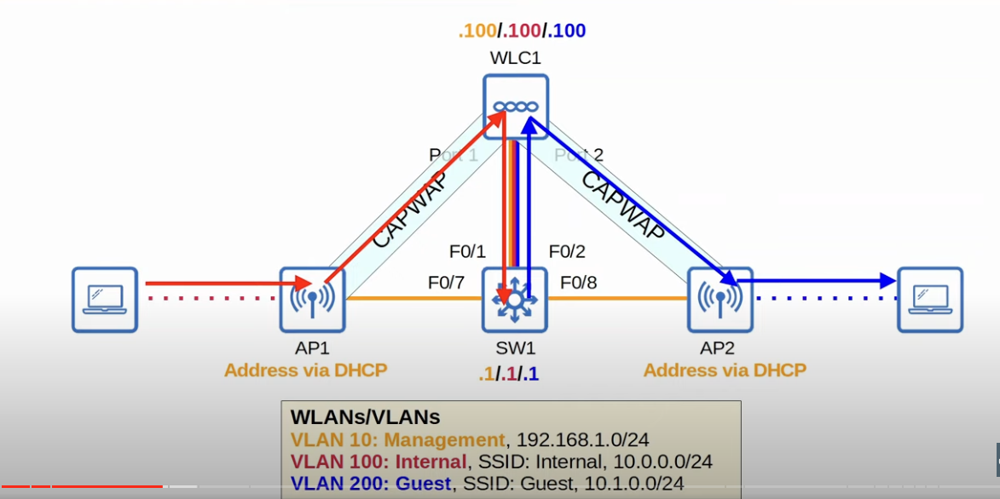
* A client associated with the Internal WLAN wants to communicate with a client associated with the Guest WLAN.
* Traffic will be sent to its default gateway following the same path as  before.
* SW1 then routes traffic to VLAN 200 and sends it to the WLC, which will then send it to the destination client via the CAPWAP tunnel and the AP.
## Switch Configuration
### VLAN Creation and Assignment
```
SW1(config)#vlan 10
SW1(config-vlan)#name management
SW1(config-vlan)#vlan 100
SW1(config-vlan)#name Internal
SW1(config-vlan)#vlan 200
SW1(config-vlan)#name Guest

SW1(config)#int range f0/6 - 8
SW1(config-if-range)#switchport mode access
SW1(config-if-range)#switchport access vlan 10
SW1(config-if-range)#spanning-tree portfast

SW1(config)#int range f0/1 - 2
SW1(config-if-range)#channel-group 1 mode on

SW1(config-if-range)#interface port-channel 1
SW1(config-if)#switchport mode trunk
SW1(config-if)#switchport trunk allowed vlan 10,100,200
```
* Interfaces F0/6 was also included to be able to connect to it with a PC to gain access to WLC1's GUI. 
	* A device's CLI can be accessed via the console port or connected to over the network using Telnet or SSH.
	* The GUI cannot be accessed via the console port. You must connect over the network, using HTTP or HTTPS.
* WLCs only support static LAG, no PAgP or LACP.
### SVIs Creation
```
SW1(config)#interface vlan 10
SW1(config-if)#ip address 192.168.1.1 255.255.255.0
SW1(config-if)#interface vlan 100
SW1(config-if)#ip address 10.0.0.1 255.255.255.0
SW1(config-if)#interface vlan 200
SW1(config-if)#ip address 10.1.0.1 255.255.255.0
```
### DHCP Pool Configuration
```
SW1(config)#ip dhcp pool VLAN10
SW1(dhcp-if)#network 192.168.1.0 255.255.255.0
SW1(dhcp-if)#default-router 192.168.1.1
SW1(dhcp-if)#option 43 ip 192.168.1.100

SW1(config)#ip dhcp pool VLAN100
SW1(dhcp-if)#network 10.0.0.0 255.255.255.0
SW1(dhcp-if)#default-router 10.0.0.1

SW1(config)#ip dhcp pool VLAN200
SW1(dhcp-if)#network 10.1.0.0 255.255.255.0
SW1(dhcp-if)#default-router 10.1.0.1

SW1(config)#ntp master
```
* The `default-router` command specifies SW1's SVI IP addresses as the default gateway for each subnet.
* VLAN10 DHCP pool will be used by the APs to get their IP addresses, which they need to communicate with the WLC.
* DHCP option 43 can be used to tell the APs the IP address of their WLC.
	* When the APs get an IP address from SW1, it will tell them the IP of their WLC. The APs will then try to communicate with the WLC and form their CAPWAP tunnels.
	* This is not necessary in this case though because the APs and WLC are in the same subnet, the same local VLAN. The WLC will hear the APs broadcast CAPWAP discovery messages.
	* Option 43 is needed if the WLC is located somewhere that it won't be able to hear the broadcast discovery messages from the APs.
* SW1 is configured as an NTP server. Later, the WLC will be configured to use SW1 as its NTP server.
## WLC Initial Setup (CLI)
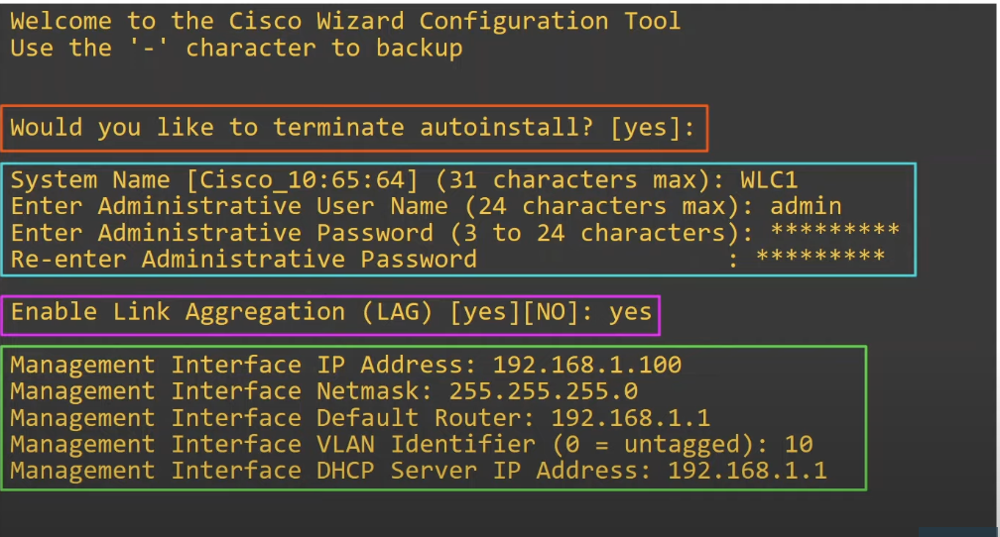
* When the WLC first boots up, you will be greeted with a configuration wizard.
	* You don't need to know any CLI commands for the WLC to do this basic setup, the wizard will walk you through it.
* Autoinstall can be used to automatically download the WLC's configuration from a TFTP server.
* A system name (hostname), username, and password  are configured to be able to log into the device.
* LAG will be used to connect to SW1, so it is enabled.
* The management interface is also configured, which is a virtual interface (not a physical port) in the WLC.
	* In most context, we can use the terms port and interface interchangeably.
	* However, in the context of WLCs, ports means physical ports and interfaces means logical interfaces within the device.

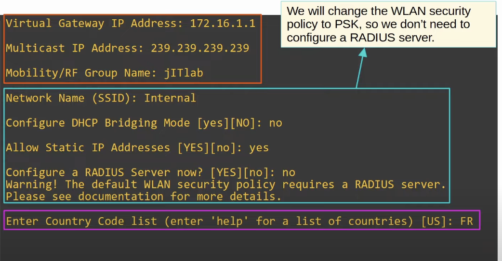
* The *Virtual Gateway IP Address* is an IP address used when the WLC is communicating directly with wireless clients, such as when relaying DHCP requests.
* The *Multicast IP Address* is used when forwarding traffic to its APs.
	* Note that an IP address in the class D range was used, which is reserved for multicast IP addresses.
* The *Mobility/RF Group Name* is used when you have multiple WLCs and you want them to work together.
* Wireless LAN configuration:
	* For wireless clients' DHCP requests to reach the DHCP server (SW1), they must pass through WLC1 first. If *DHCP Bridging Mode* is enabled, the WLC becomes totally transparent to the clients. It will appear as if the APs are communicating directly to the DHCP server. However, that is not needed here, so it is disabled.
	* Static IP addresses are allows, which means that clients are allowed to use static IP addresses if they prefer. They don't have to use DHCP.
	* The WLAN security policy will be changed to PSK. Therefore, a RADIUS server does not need to be configured
* *Country Code List* is used to enter countries that fall in the regulatory domain of the AP. 
	* In this case FR (France) was entered because it falls in the regulatory domain of the AP, which is E (Europe).
	* The AP's model name specifies its regulatory domain. The model name of the AP being used is *AIR-CAP3502l-==E==-K9*.
	* If the regulatory domain of the country specified in the WLC configuration doesn't match the regulatory domain of the AP, the AP won't be able to join the WLC.

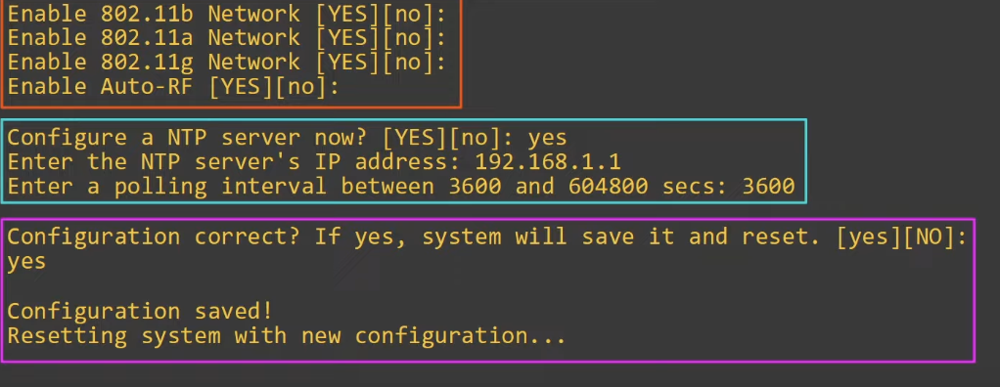
* Enabled 802.11b, 802.11a, and 802.11g protocols.
* *Auto-RF* is enabled, which allows the WLC to automatically select which channels to use and how much transmit power to use.
	* This is much better than doing everything manually.
* Configured NTP settings so that the WLC has the correct time.

### Accessing the WLC GUI
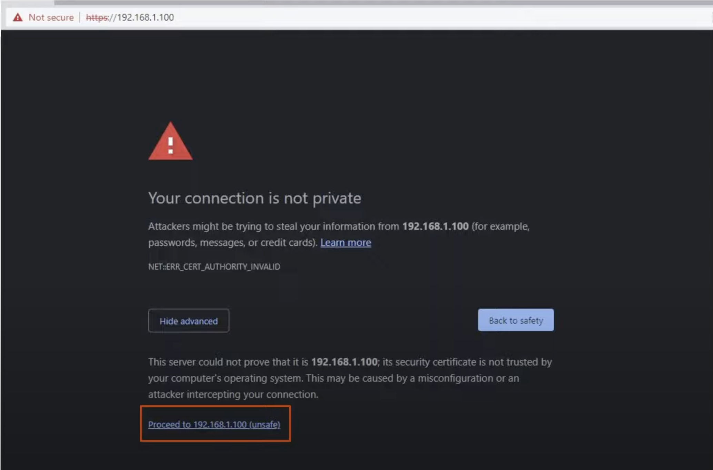
* Now that the WLC's initial setup is complete, it has an IP address in the management VLAN (VLAN 10).
* Instead of connecting a PC to the WLC's console port or accessing it remotely (Telnet, SSH), the PC is connected to the switch (f0/6 interface, which was previously configured).
	* Once connected to the switch, HTTP or HTTPS can be used to access the WLC's GUI in a web browser.
### WLC Ports
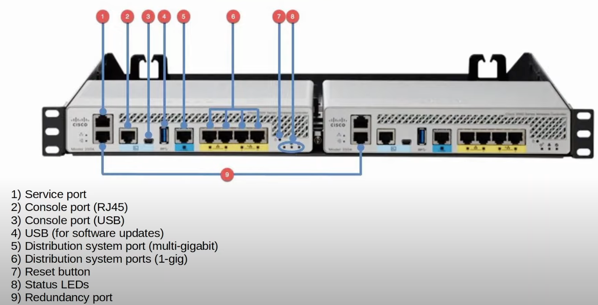
* WLC ports are the physical ports that cables connect to.
* WLC has a few different kinds of ports:
	* **Service ports**: A dedicated management port. Used for out-of-band management. Must connect to a switch access port because it only supports one VLAN. This port can be used to connect to the device while it is booting, perform system recovery, etc.
		* A dedicated management port means keeping management traffic totally separate from regular data traffic, not using the same physical interface.
	* **Distribution system port**: These are the standard network ports that connect to the 'distribution system' (wired network) and are used for data traffic.These ports usually connect to switch trunk ports, and if multiple distribution ports are used they can form a LAG.
		* Distribution system is the 802.11 term for the wired network.
	* **Console port**: This is a standard console port, either RJ45, USB, or both.
	* **Redundancy port**: This port is used to connect to another WLC to form a high availability (HA) pair.
		* If one WLC fails, the other one can continue to support the network.
### WLC Interfaces
* WLC interfaces are the logical interfaces within the WLC (ie. SVIs on a switch).
* WLCs have a few different kinds of interfaces:
	* **Management interface**: Used for management traffic such as Telnet, SSH, HTTP, HTTPS, RADIUS authentication, NTP, Syslog, etc. CAPWAP tunnels are also formed to/from the WLC's management interfaces.
	* **Redundancy management interface**: When two WLCs are connected by their redundancy ports, one WLC is 'active' and the other is 'standby'. This interface can be used to connect to and manage the 'standby' WLC.
	* **Virtual Interface**: This interface is used when communicating with wireless clients to relay DHCP requests, perform client web authentication etc.
	* **Service port interface**: If the service port is used, this interface is bound to it and used for out-of-band management instead of the regular management interface.
	* **Dynamic interface**: These interfaces are used to map a WLAN to a VLAN. For example, traffic from the 'internal' WLAN will be sent to the wired network from the WLC's 'internal' dynamic interface.
## WLAN Configuration
### Interface Configuration
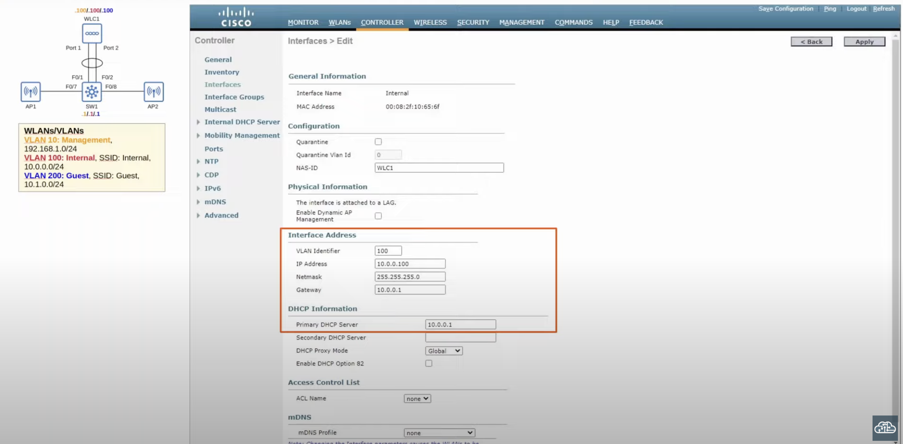
* Navigate to the controller tab to view and create new interfaces.
* Create a dynamic Interface per VLAN. These interfaces will latter be mapped to their respective WLAN.
	* An interface named 'Internal', which is mapped to VLAN 100.
	* An interface named 'Guest', which is mapped to VLAN 200.
* The information configured per interface is the IP address, netmask, gateway, and DHCP server address.
### WLAN Configuration
* Navigate to the WLAN tab to view the configured WLANs on the WLC and to create new ones.

#### Internal WLAN 
* One WLAN named 'Internal' will already exist because it was configured during the WLC initial setup. However, some changes need to be made to it.
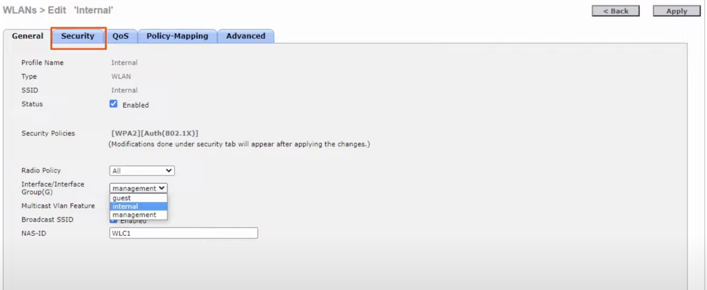
* By default, the Internal WLAN is mapped to the management interface. However, it has to be changed so that it is mapped to the Internal dynamic interface configured earlier.

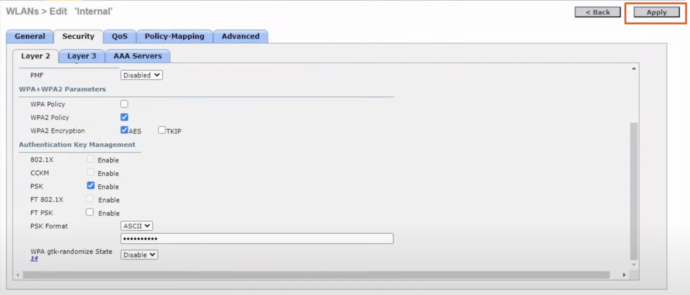
* The security policy is configured to use 802.1X authentication (enterprise mode), but for the CCNA we have to configure PSK authentication (personal mode).
* In the Security tab > Layer 2 we can select things like WEP, 802.1X, different versions of WPA, etc.
	* For the CCNA, we are supposed to use WPA2.
	* The 'Authentication Key Management' needs to be set to PSK to use personal mode instead of enterprise. The format of the PSK can be set to ASCII to be able to enter the password using regular letters, numbers, etc.
		* The PSI needs to be in the range  of 8 to 63 chars to make sure it is secure and not easy to crack.

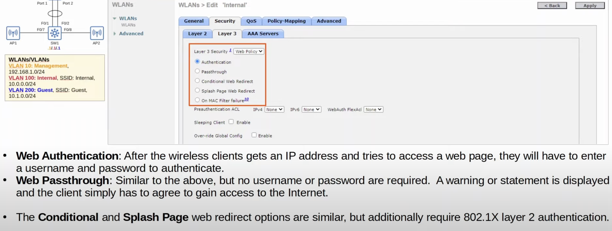
* Layer 3 security does not need to be configured. Just showcasing its purpose.
* For the **Web Authentication** and **Web Passthrough** modes, the Layer 3 authentication can just be open. This is mode is common for public WiFi.

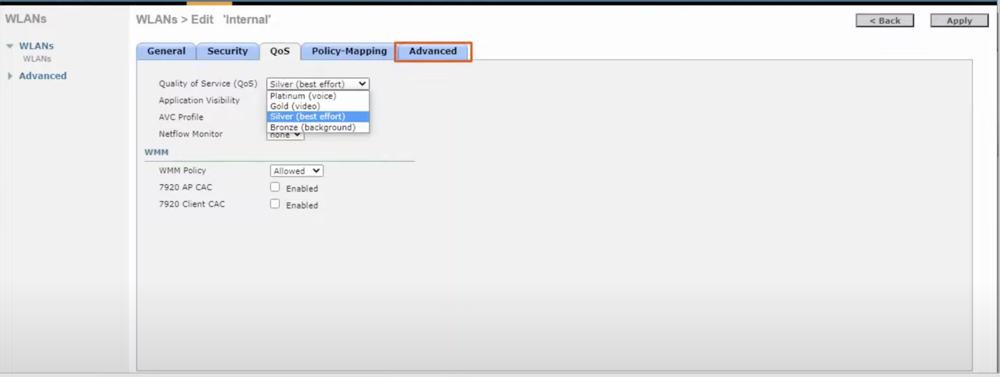
* There is also a AAA server tab, but since we are using PSK authentication only, there is no need to set up anything like a RADIUS server.
* In the QoS tab, the thing to be aware of is the QoS setting, which allows you to control what quality of service is provided to the wireless clients.
	* **Platinum** is for voice traffic (WiFi IP phones etc.).
	* **Gold** is for video traffic.
	* **Silver** is for best effort (default mode).
	* **Bronze** is given the lowest priority, for what's called background traffic.
#### Guest WLAN 
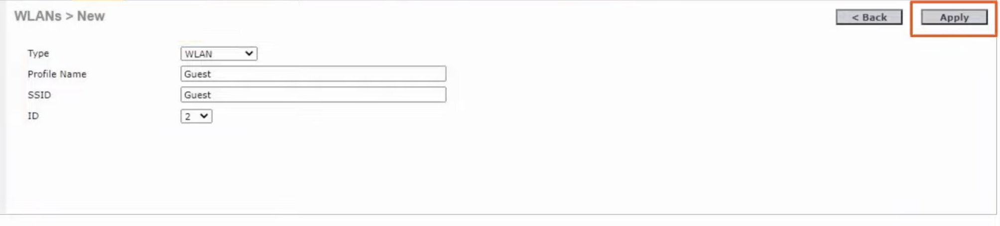
* The guest WLAN is going to be created from scratch.
* Since we are creating a new WLAN, we have to specify the profile name, SSID, and ID first.
	* The profile name is used to identify the WLAN in the WLC. Usually, you will just make it the same as the SSID.
		* The SSID and Profile Name do not have to match.
	* The ID is a unique number that identifies the WLAN. The internal WLAn was 1, so this one will be set to 2.
* The rest of the configuration will be the same as in the Internal WLAN.
	* Just need to change the status of the WLAN to enabled.
	* Mare sure the WLAN is associated with the Guest interface previously configured.
	* Make sure the authentication mode is set to PSK (personal mode).
### Connecting Clients
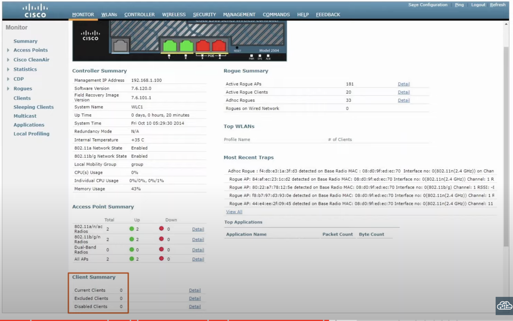
* At this point, the SSIDs of the WLANs configured should appear when scanning for WiFi networks.
* The 'Clients' tab on the left menu will provide a list of the clients that have connected to the configured WLANs.
### APs Connected to the WLC
* The WIRELESS tab will display the list of APs that have joined the WLC.
	* Their IP addresses, model numbers, MAC addresses, etc can be seen.
### Management Tab
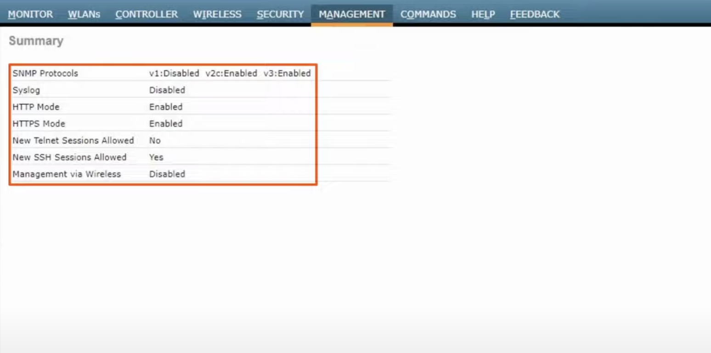
* Displays a summary of the management setting
* Telnet is disabled and should remain that way since it is not a secure protocol.
* Management via Wireless is disabled, which means that a wireless client won't be able to connect to the WLC and manage it. Only a device connected to the wired network can manage the WLC.
	* This setting can be changed in the 'Mgmt Via Wireless' tab on the left menu.

### Security Tab
* In the SECURITY tab, you can click on the 'Access Control List' tab on the left menu to limit the management traffic allowed to access WLC.

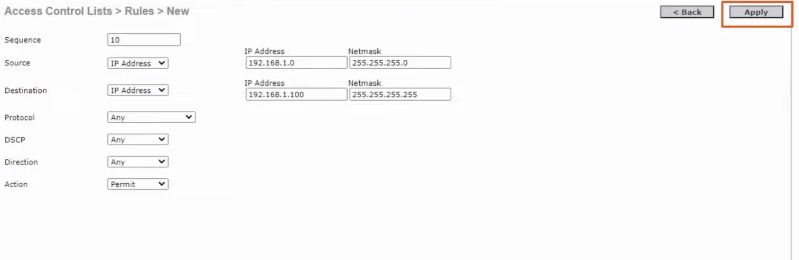
* You will first need to assign the ACL a name and specify its type (IPv4 or IPv6) and create it.
* After the ACL is created, rules need to be added to it to actually specify what traffic can access the WLC.

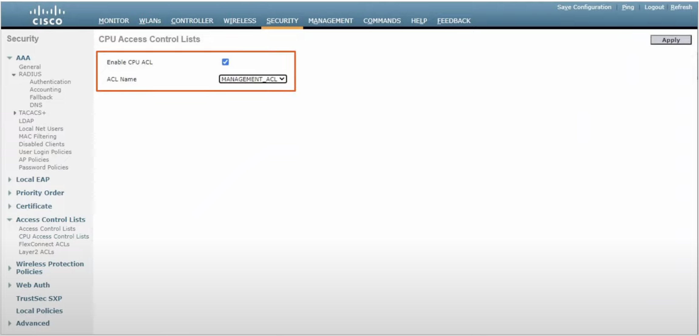
* Go to 'CPU Access Control Lists' tab on the left menu to apply the ACL created.
* The option 'Enable CPU ACL' must be checked.
	* CPU ALCs are used to limit access to the CPU of the WLC. This limits which devices will be able to connect to the WLC via Telnet/SSH, HTTP/HTTPS, retrieve SNMP information from the WLC, etc.
	* This doesn't affect traffic passing through the WLC, only traffic destined directly for the WLC.
* Then select the the ACL you want to use from the list and click apply.
