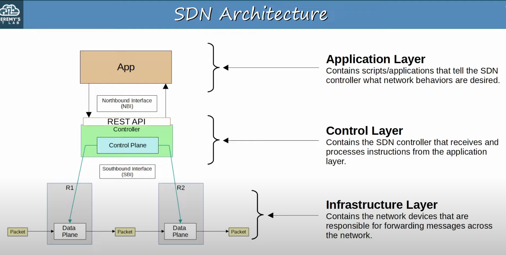
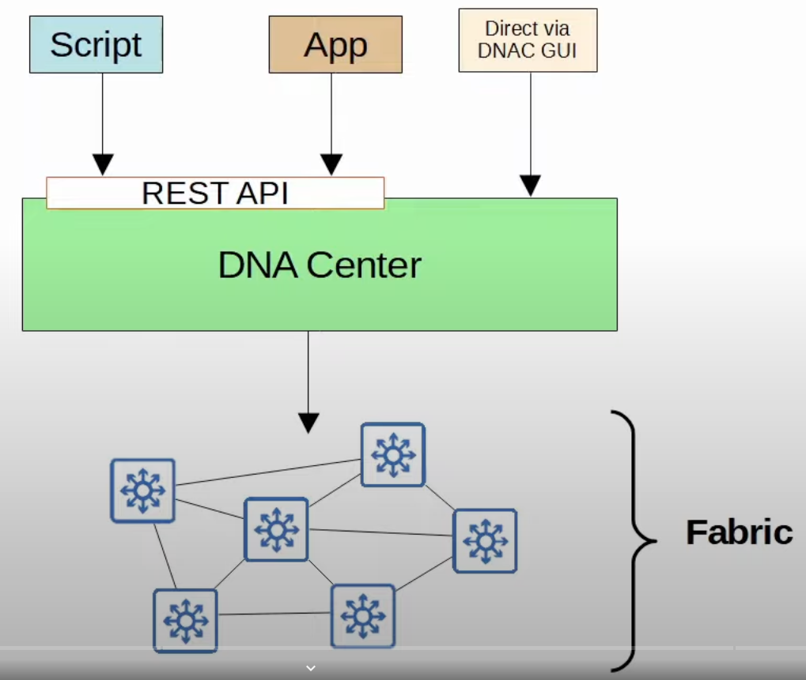
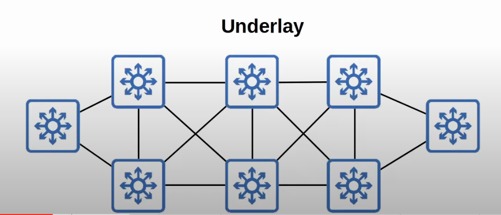
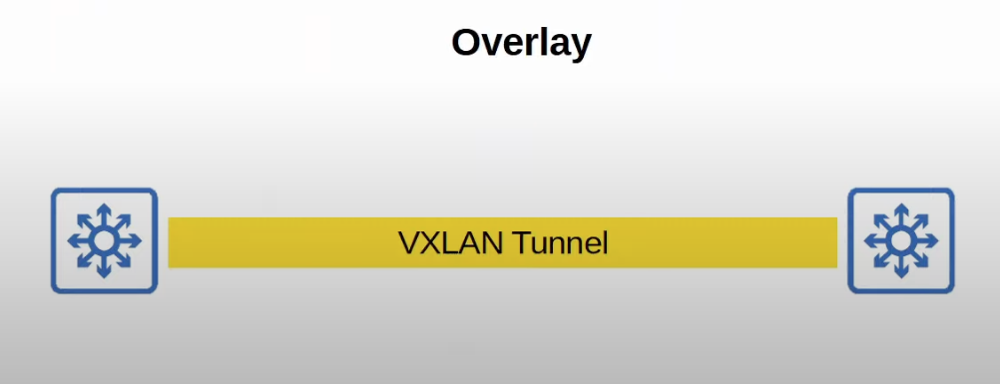
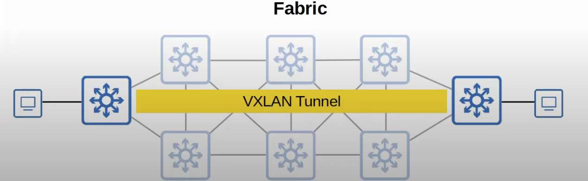
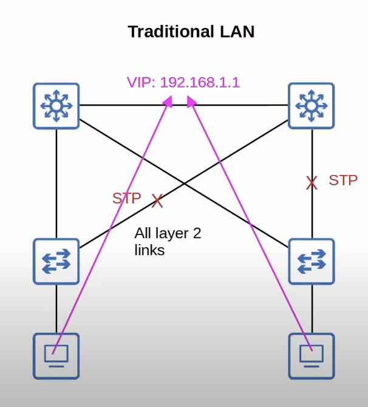
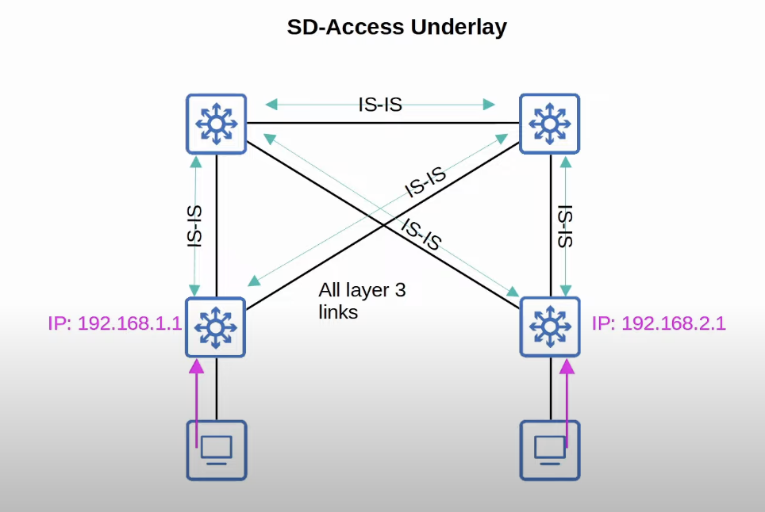

## SDN Architecture

## SD-ACCESS

* Cisco **SD-Access** is Cisco's SDN solution for automating campus LANs.
	* Cisco **DNA (Digital Network Architecture) Center** is the controller at the center of SD-Access.
* **ACI** (Application Centric Infrastructure) is their SDN solution for automating data center networks.
* **SD-WAN** is their SDN solution for automating WANs.

* The **underlay** is the underlying physical network of devices and connections (including wired and wireless) which provides IP connectivity (ie. using IS-IS).
	* Multilayer switches and their connections.

* The **overlay** is the virtual network built on top of the physical underlay network.
	* SD-Access uses VXLAN (Virtual Extensible LAN) to build tunnels.
* When hosts in the network communicate with each other, their traffic is sent over the VXLAN tunnels.

* the **fabric** is the combination of the overlay and underlay; the physical and virtual network as a whole.

## SD-Access Underlay
* The underlay's purpose is to support the VXLAN tunnels of the overlay.
* There are three different roles of switches in the SD-Access:
	* **Edge nodes**: Connect to end hosts.
	* **Border nodes**: Connect to devices outside of the SD-Access domain, ie. WAN routers.
	* **Control nodes**: Uses **LISP** (Locator ID Separation Protocol) to perform various control plane functions.
* You can add SD-Access on top of an existing network (brownfield deployment) if your network hardware and software supports it.
	* Google 'Cisco SD-Access compatibility matrix' if you'r curious.
	* In this case DNA Center won't configure the underlay because this could be a major risk to the current working production network.
		* Ideally you will be using a greenfield deployment, which is a totally new network built for the purpose of SD-Access.
* A new deployment  (greenfield deployment) will be configured by DNA Center to use the optimal SD-Access underlay:
	* All switches are Layer 3 and use IS-IS as their routing protocol.
	* All links between switches are routed ports. This means STP is not needed.
	* Edge nodes (access switches) act as the default gateway of end hosts (routed access layer).

* STP is used to avoid Layer 2 loops and an FHRP is used by the distribution layer switches to provide a redundant default gateway for the end hosts.

* In an SD-access underlay, all connections between switches are Layer 3 and IS-IS is used to exchange routing information.
* The access Layer switches are the default gateways of the end hosts.
	* A routed access layer is created.
	* STP and a FHRP are no longer needed.
## SD-Access Overlay
* LISP provides the control plane of SD-Access.
	* A list of mappings of EIDs (endpoint identifiers) to RLOCs (routing locators) is kept.
	* EIDs identify end hosts connected to edge switches, and RLOCs identify the edge switch which can be used to reach the end hosts.
	* There is a LOT more detail to cover about LISP, but I think you can see how it differs from the traditional control plane.
		* Instead of a routing table to locate destination hosts, a DNS-like system of mappings is used.
* Cisco TrustSec (CTS) provides policy control (QoS, security policy, etc).
* VXLAN provides the data plane of SD-Access.
## Cisco DNA Center
* Cisco DNA Center has two main roles:
	* The SDN controller in SD-Access.
	* A network manager in a traditional network (non-SD-Access)
		* Although it doesn't provide SD-Access functions, it still acts as a central point to monitor, analyze, and configure the network.
* DNA Center is an application installed on Cisco UCS server hardware.
* It has a REST API which can be used to interact with DNA center.
* The SBI supports protocols such as NETCONF and RESTCONF (as well as traditional protocols like Telnet, SSH, SNMP).
* DNA Center enables Intent-Based Networking (IBN).
	* The goal is to allow the engineer to communicate their intent for network behavior to DNA Center, and then DNA Center will take care of the details of the actual configurations and policies on devices.
* Traditional security policies using ACLs can become very cumbersome.
	* ACLs can have thousands of entries.
	* The intent of entries is forgotten with time and as engineers leave and new engineers take over.
	* Configuring and applying the ACLs correctly across a network is cumbersome and leaves room for error.
* DNA Center allows the engineer to specify the intent of the policy (this group of users can't communicate with this group, this group can access this server but not that server, etc.) and DNA Center will take care of the exact details of implementing the policy.
## DNA Center VS Traditional Management
* Traditional network management:
	* Devices are configured one-by-one via SSH or console connection.
	* Devices are manually configured via console connections before being deployed.
	* Configurations and policies are managed per-device (distributed).
	* New network deployments can take a long time due to the manual labor required.
	* Errors and failures are more likely due to increased manual effort.
* DNA Center-based management:
	* Devices are centrally managed and monitored from the DNA Center GUI or other applications using its REST API.
	* The administrator communicates their intended network behavior to DNA Center, which changes those intentions into configurations on the managed network devices.
	* Configurations and policies are centrally managed.
	* Software versions are also centrally managed. DNA Center can monitor cloud servers for new versions and then update the managed devices.
	* New network deployments are much quicker. New devices can automatically receive their configurations from DNA Center without manual configuration.